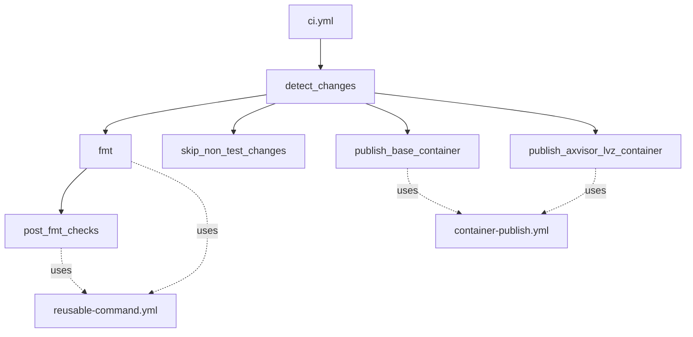
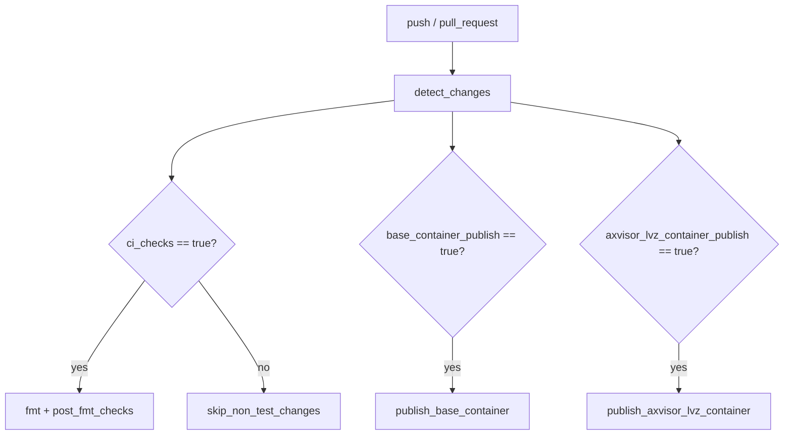
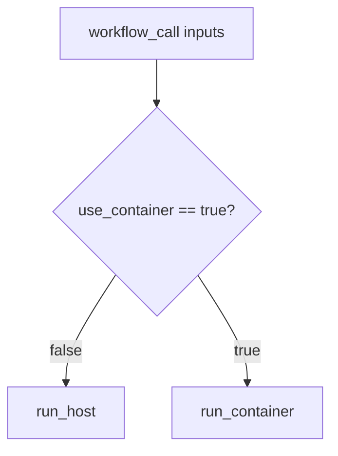
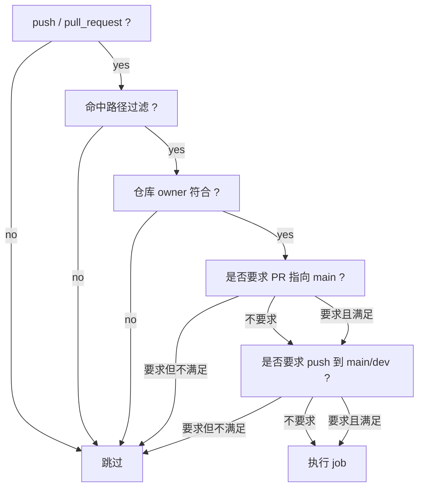
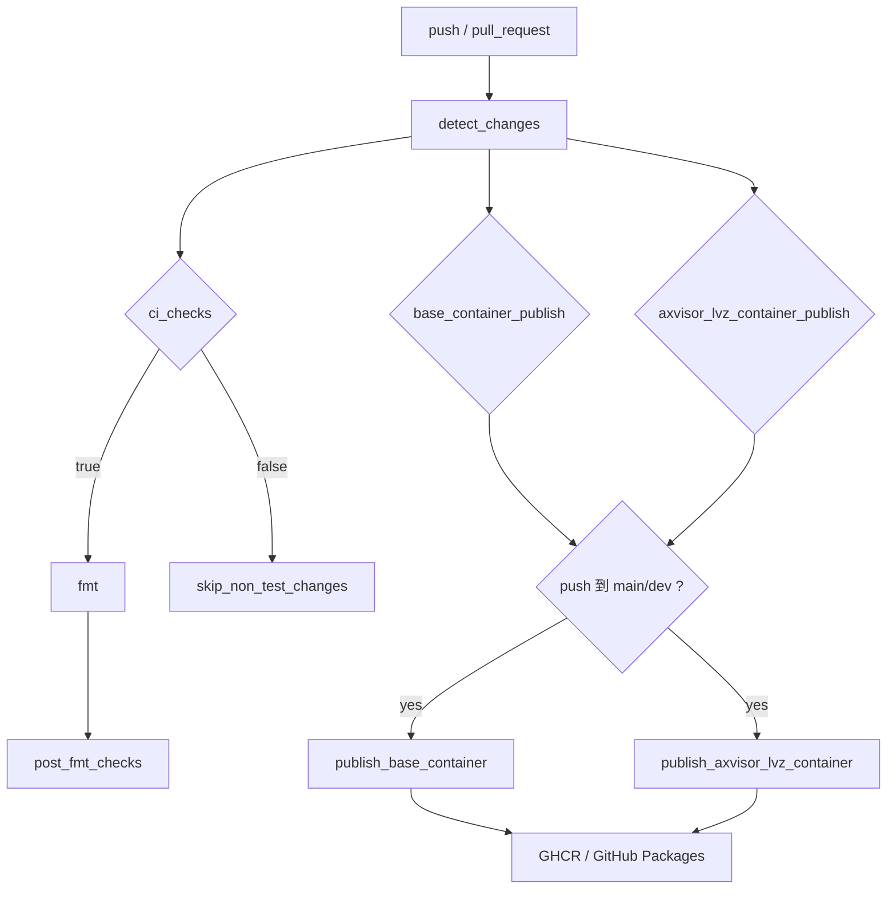

# CI 自动测试实现

本文说明 `.github/workflows/ci.yml` 的具体实现，以及仓库如何将格式检查、主机端测试、QEMU 测试、self-hosted 板测和容器镜像发布组织成一条统一的 GitHub Actions 流水线。

## 1. 入口与依赖

当前 CI 主入口文件为：

- `.github/workflows/ci.yml`

它依赖的两个复用工作流为：

- `.github/workflows/reusable-command.yml`
- `.github/workflows/container-publish.yml`

整体关系如下：



## 2. 触发与并发

`ci.yml` 在以下事件触发：

- `push`
- `pull_request`

但同时配置了 `paths-ignore`，因此当改动只涉及以下内容时，整个 CI 不会触发：

- `*.md`
- `*.rst`
- `*.adoc`
- `docs/**`
- `**/docs/**`
- `**/doc/**`

由此可见：

- 纯文档改动默认不会触发这条主 CI
- 当前 `docs/docs/design/test` 的改动本身，不会直接触发 `ci.yml`

同时，CI 配置了并发控制：

```yaml
concurrency:
  group: ci-${{ github.workflow }}-${{ github.ref }}
  cancel-in-progress: true
```

其效果是：同一分支上如果连续推送，会取消旧的同类运行，只保留最新一轮。

## 3. 变更检测

`detect_changes` 是整条 CI 的分流入口。它通过 `dorny/paths-filter@v4` 输出三个布尔结果：

- `ci_checks`
- `base_container_publish`
- `axvisor_lvz_container_publish`

### 3.1 `ci_checks`

当以下路径发生变化时，认为需要运行主要测试检查：

- `.cargo/**`
- `.github/workflows/ci.yml`
- `.github/workflows/reusable-command.yml`
- `Cargo.toml`
- `Cargo.lock`
- `rust-toolchain.toml`
- `components/**`
- `examples/**`
- `os/**`
- `platform/**`
- `scripts/**`
- `test-suit/**`
- `xtask/**`

### 3.2 发布相关变更

`base_container_publish` 关注：

- `.github/workflows/ci.yml`
- `.github/workflows/container-publish.yml`
- `container/Dockerfile`
- `rust-toolchain.toml`

`axvisor_lvz_container_publish` 关注：

- `.github/workflows/ci.yml`
- `.github/workflows/container-publish.yml`
- `container/Dockerfile.axvisor-lvz`
- `rust-toolchain.toml`

### 3.3 检测分流



## 4. `fmt` 阶段

`fmt` 是后续主测试的前置门：

- job 名称：`Check formatting`
- 触发条件：`needs.detect_changes.outputs.ci_checks == 'true'`
- 调用工作流：`reusable-command.yml`
- 实际命令：`cargo fmt --all -- --check`

这一步如果失败，`post_fmt_checks` 不会继续执行。

## 5. `post_fmt_checks`

`post_fmt_checks` 是当前仓库的主测试矩阵。它依赖：

- `detect_changes`
- `fmt`

并采用：

```yaml
strategy:
  fail-fast: true
```

也就是说，矩阵中有一个关键 job 失败后，GitHub Actions 会尽早停止后续未启动项。

### 5.1 矩阵分类

当前矩阵项大致可分为四类：

| 类别 | 典型命令 | 运行位置 |
|------|----------|----------|
| 静态检查 | `cargo xtask clippy` | container |
| 主机端 std 测试 | `cargo xtask test` | container |
| 各 OS 的 QEMU 测试 | `cargo xtask <os> test qemu --target <arch>` | container 或 self-hosted |
| 板级测试 | `cargo xtask <os> test board ...` | self-hosted |

### 5.2 Container 测试

通过基础容器镜像 `ghcr.io/${{ github.repository }}-container:latest` 执行的主要测试包括：

- `cargo xtask clippy`
- `cargo xtask test`
- `cargo xtask axvisor test qemu --target aarch64`
- `cargo xtask starry test qemu --target riscv64`
- `cargo xtask starry test qemu --target aarch64`
- `cargo xtask starry test qemu --target loongarch64`
- `cargo xtask starry test qemu --target x86_64`
- `cargo xtask arceos test qemu --target x86_64`
- `cargo xtask arceos test qemu --target riscv64`
- `cargo xtask arceos test qemu --target aarch64`
- `cargo xtask arceos test qemu --target loongarch64`

### 5.3 Self-hosted 测试

以下测试仍运行在 self-hosted runner 上：

- `AXVISOR_IMAGE_LOCAL_STORAGE=/home/runner/.axvisor-images cargo xtask axvisor test qemu --target x86_64`
- `AXVISOR_IMAGE_LOCAL_STORAGE=/home/runner/.axvisor-images cargo xtask axvisor test board -t orangepi-5-plus-linux`
- `AXVISOR_IMAGE_LOCAL_STORAGE=/home/runner/.axvisor-images cargo xtask axvisor test board -t roc-rk3568-pc-linux`
- `cargo xtask starry test board -t smoke-orangepi-5-plus`

原因通常是：

- 依赖物理板
- 依赖特定自托管 runner 标签
- 依赖 runner 本地已有资产或连接环境

### 5.4 Starry Stress 状态

CI 中已经预留了以下矩阵项：

- `Stress starry aarch64`
- `Stress starry riscv64`
- `Stress starry loongarch64`
- `Stress starry x86_64`

但当前命令仍是：

```text
echo "TODO!"
```

所以它们在语义上是“预留位置”，不是正式接入的压力测试。

## 6. `reusable-command.yml`

`post_fmt_checks` 和 `fmt` 都不是直接写步骤，而是统一调用 `reusable-command.yml`。

这个复用工作流有两个 job：

- `run_host`
- `run_container`

### 6.1 Host / Container 分流



### 6.2 `run_host`

当 `use_container: false` 时：

1. 在指定 runner 上执行
2. `actions/checkout`
3. 按 `cache_key` 恢复 Rust cache
4. 输出 `rustc --version`
5. 注入 `STARRY_APK_REGION`
6. 执行 `inputs.command`

### 6.3 `run_container`

当 `use_container: true` 时：

1. 使用 `container.image` 指定的 GHCR 镜像
2. 通过 `github.actor` + `GITHUB_TOKEN` 拉取镜像
3. `actions/checkout`
4. 按 `cache_key` 恢复 Rust cache
5. 输出 `rustc --version`
6. 注入 `STARRY_APK_REGION`
7. 执行 `inputs.command`

### 6.4 执行条件

`reusable-command.yml` 还支持两个重要限制条件：

- `required_repository_owner`
- `main_pr_only`

其中：

- `required_repository_owner` 用于确保某些 self-hosted 任务只在 `rcore-os` 组织下运行
- `main_pr_only` 用于把部分任务限制为“只在目标分支是 `main` 的 PR 中执行”

## 7. `apk_region` 选择

`ci.yml` 在调用 `reusable-command.yml` 时，并不是固定传递 `apk_region`，而是根据矩阵命令动态计算：

- 如果是 container 中的 Starry / Axvisor / ArceOS QEMU 测试，或名字以 `Stress starry` 开头，则传 `us`
- 否则传 `china`

这说明 CI 已经把“测试命令使用哪类 apk mirror”也纳入了统一调度逻辑，而不是由每个 job 单独决定。

## 8. 跳过路径

当 `ci_checks != true` 时，主测试不会运行，而是进入 `skip_non_test_changes`：

- job 名称：`Skip CI checks for non-test changes`
- 会向 `GITHUB_STEP_SUMMARY` 输出一段说明

这一步的意义不是“做测试”，而是给 PR / 提交一个明确的自动化结论：本次改动不在测试关注路径内，因此跳过。

## 9. 分支条件

当前 `ci.yml` 中的 job 并不是“所有命中的测试都无条件执行”，而是叠加了事件类型、目标分支、仓库归属和路径过滤四类条件。

### 9.1 主测试条件

以下 job 的共同前提是：

- 事件是 `push` 或 `pull_request`
- 改动命中 `detect_changes.outputs.ci_checks == 'true'`

在此前提下：

- `fmt` 会执行
- `post_fmt_checks` 会在 `fmt` 成功后执行

大多数普通测试并**不要求特定分支**，只要命中测试相关路径，在 `push` 和 `pull_request` 下都会执行。

### 9.2 任务条件

| 任务类型 | 典型 job | 事件条件 | 分支条件 | 其他条件 |
|----------|----------|----------|----------|----------|
| 格式检查 | `fmt` | `push` / `pull_request` | 无专属分支限制 | 需 `ci_checks == true` |
| 普通 container 测试 | `cargo xtask clippy`、`cargo xtask test`、各 OS QEMU 测试 | `push` / `pull_request` | 无专属分支限制 | 需 `ci_checks == true` |
| Starry stress 占位任务 | `Stress starry *` | 仅 `pull_request` | 仅目标分支为 `main` | `main_pr_only: true` |
| self-hosted 测试 | Axvisor/Starry 板测、自托管 Axvisor QEMU | `push` / `pull_request` | 无专属分支限制 | `required_repository_owner == rcore-os` |
| 基础镜像发布 | `publish_base_container` | 仅 `push` | 仅 `main` / `dev` | 需命中 `base_container_publish == true` |
| LVZ 镜像发布 | `publish_axvisor_lvz_container` | 仅 `push` | 仅 `main` / `dev` | 需命中 `axvisor_lvz_container_publish == true` |

### 9.3 `main_pr_only`

`reusable-command.yml` 中对 `main_pr_only` 的判断是：

```text
github.event_name == 'pull_request' && github.base_ref == 'main'
```

因此：

- 只对 PR 生效
- 只看 PR 的目标分支是否为 `main`
- 普通 push 不会运行这些任务
- 目标分支不是 `main` 的 PR 也不会运行这些任务

当前仓库里使用这一条件的主要是 Starry `stress` 相关矩阵项。

### 9.4 `required_repository_owner`

`reusable-command.yml` 中还会检查：

```text
github.repository_owner == inputs.required_repository_owner
```

self-hosted 测试即使在 PR / push 下命中路径，也只有在仓库 owner 符合要求时才会执行。按照当前配置，相关 job 只会在 `rcore-os` 组织下真正运行。

### 9.5 判断顺序

如果从使用角度快速判断某项 CI 会不会跑，可以按下面顺序看：

1. 当前事件是不是 `push` 或 `pull_request`
2. 改动路径是否命中 `ci_checks` 或容器发布过滤器
3. 该 job 是否要求 `main_pr_only`
4. 该 job 是否要求 `required_repository_owner`
5. 如果是发布 job，当前分支是不是 `main` 或 `dev`



### 9.6 规则澄清

因此，“右侧 CI 测试是不是只在指定分支下才执行”的答案是：

- **不是全部如此**
- 大多数普通测试在命中 `ci_checks` 后，`push` 和 `pull_request` 都会执行
- 只有部分任务有额外分支约束：
  - Starry stress：仅 PR 指向 `main`
  - 镜像发布：仅 `push` 到 `main` / `dev`

这也是阅读 `ci.yml` 时最容易误解的一点，文档中需要单独说明。

## 10. 容器发布

除了测试，`ci.yml` 还承担容器镜像发布职责，包括：

- `publish_base_container`
- `publish_axvisor_lvz_container`

两者都调用 `container-publish.yml`。

### 10.1 基础镜像发布

```yaml
image_name: ghcr.io/${{ github.repository }}-container
dockerfile: container/Dockerfile
cache_scope: container
```

### 10.2 LVZ 镜像发布

```yaml
image_name: ghcr.io/${{ github.repository }}-container-axvisor-lvz
dockerfile: container/Dockerfile.axvisor-lvz
cache_scope: container-axvisor-lvz
build_args:
  BASE_IMAGE=ghcr.io/${{ github.repository }}-container:latest
```

### 10.3 发布条件

容器发布除了需要路径过滤命中，还要求：

- `github.event_name == 'push'`
- `github.ref_name == 'main' || github.ref_name == 'dev'`

所以：

- PR 不发布正式镜像
- 只有主开发分支上的 push 会推动 GHCR 镜像更新

## 11. `container-publish.yml`

`container-publish.yml` 自身是一个单 job 的复用工作流，核心步骤为：

1. `actions/checkout`
2. 准备 `image_name`
3. `docker/setup-buildx-action`
4. `docker/login-action` 登录 `ghcr.io`
5. `docker/metadata-action` 生成 tag / label
6. `docker/build-push-action` 构建并推送

它默认生成两类 tag：

- Git tag 对应的 tag
- `latest`

并使用 GitHub Actions cache：

- `cache-from: type=gha,scope=<scope>`
- `cache-to: type=gha,mode=max,scope=<scope>`

## 12. 完整链路



## 13. 能力边界

- 文档改动默认不会触发 `ci.yml`，因为 `paths-ignore` 明确排除了 `docs/**`。
- Starry stress 在矩阵中仍为占位实现，不是正式自动测试。
- Axvisor / Starry 的部分板测仍必须依赖 self-hosted runner。
- 容器测试环境与容器发布逻辑虽然同属 `ci.yml` 体系，但在代码上分别通过 `reusable-command.yml` 和 `container-publish.yml` 解耦实现。
