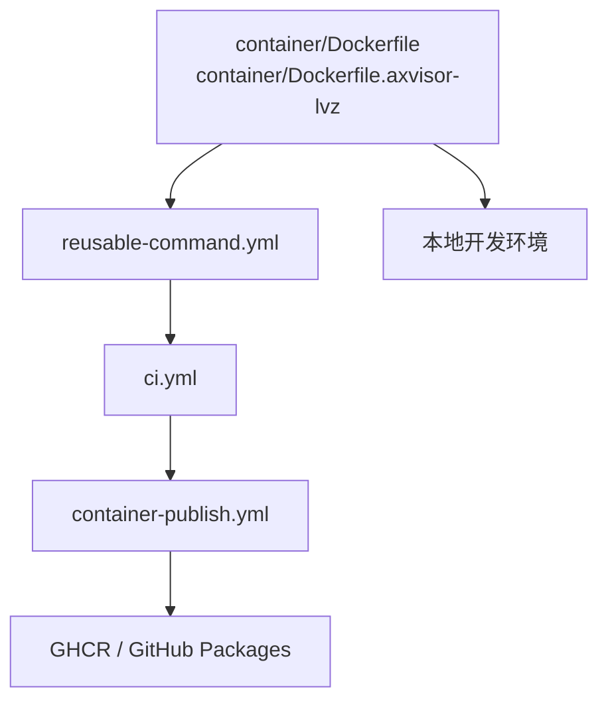

# 测试基础设施与环境

TGOSKits 的测试环境设计重点，不是把依赖分散安装到每台 runner 或每个开发机上，而是把大部分可复用的构建与运行依赖收敛进统一的 container 镜像里，再由 GitHub Actions 和本地开发流程共同消费。

这套设计的目标有三个：

- 让 `cargo xtask test`、`cargo xtask clippy`、ArceOS/StarryOS/Axvisor 的 QEMU 测试在一致环境中运行
- 把 QEMU、交叉编译器、Rust 工具链等重依赖固化到镜像，减少 CI 漂移
- 通过 GitHub Container Registry 统一发布镜像，让工作流和开发者都能直接复用

## 1. 架构

当前仓库里的测试环境可以理解为三层：

| 层级 | 作用 | 主要入口 |
|------|------|----------|
| Container 镜像 | 固化工具链、QEMU、交叉编译器、Rust 构建工具 | `container/Dockerfile`、`container/Dockerfile.axvisor-lvz` |
| 可复用执行工作流 | 统一在 host 或 container 中执行命令 | `.github/workflows/reusable-command.yml` |
| CI 编排与发布 | 选择测试矩阵、决定何时发布镜像 | `.github/workflows/ci.yml`、`.github/workflows/container-publish.yml` |

其中最核心的是 container 层。CI 里的多数测试 job 并不在裸 `ubuntu-latest` 上临时安装环境，而是直接运行在预构建的 GHCR 镜像中。



## 2. 设计动机

如果把所有依赖都放到 workflow 运行时临时安装，会遇到几个问题：

- QEMU 版本、交叉工具链版本和系统包集合容易漂移
- StarryOS、ArceOS、Axvisor 所需依赖组合并不完全相同，临时拼装成本高
- QEMU 源码构建和工具链下载开销大，重复安装会拉长 CI 时间
- 本地复现 CI 时，开发者很难完全还原 runner 环境

因此仓库把“测试环境”设计成镜像优先：

- 先用 `container/Dockerfile` 构建基础测试镜像
- 再由 CI job 通过 `container:` 直接消费 `ghcr.io/...` 镜像
- 对 Axvisor LoongArch LVZ 特殊场景，再基于基础镜像扩展 `container/Dockerfile.axvisor-lvz`

## 3. 基础镜像

基础镜像定义在 `container/Dockerfile`，以 `ubuntu:24.04` 为底，核心职责是一次性准备 TGOSKits 主要 QEMU 测试路径所需的公共依赖。

### 3.1 内容组成

| 类别 | 内容 |
|------|------|
| 系统基础 | `build-essential`、`clang`、`cmake`、`make`、`meson`、`ninja-build`、`pkg-config`、`python3` 等 |
| 文件系统/镜像工具 | `dosfstools`、`e2fsprogs`、`xz-utils` |
| QEMU 依赖 | `libglib2.0-dev`、`libpixman-1-dev`、`libslirp-dev`、`qemu-user-static` 等 |
| Rust 环境 | 依据仓库根目录 `rust-toolchain.toml` 安装 Rust toolchain，并额外安装 `cargo-binutils`、`axconfig-gen`、`cargo-axplat` |
| 交叉编译工具链 | `aarch64`、`riscv64`、`x86_64`、`loongarch64` 的 musl 交叉编译器 |

### 3.2 QEMU 构建

镜像内的 QEMU 不是完全依赖发行版包，而是源码构建并安装到 `/opt/qemu-<version>`。当前 Dockerfile 固定：

- `QEMU_VERSION=10.2.1`
- system 和 linux-user target 同时启用
- 覆盖 `aarch64`、`riscv64`、`x86_64`、`loongarch64`

这样做的意义是：

- 为多架构 `cargo xtask <os> test qemu --target <arch>` 提供统一的 QEMU 版本
- 给 StarryOS / ArceOS 的 QEMU 测试和部分用户态辅助执行路径提供一致基础
- 避免不同 runner 上系统仓库 QEMU 版本差异造成结果抖动

### 3.3 工作目录

镜像把工作目录设置为 `/workspace`，与 GitHub Actions 中 `actions/checkout` 的代码目录约定配合使用，便于在容器内直接执行：

```bash
cargo xtask test
cargo xtask clippy
cargo xtask starry test qemu --target riscv64
cargo xtask arceos test qemu --target x86_64
```

## 4. LVZ 扩展镜像

`container/Dockerfile.axvisor-lvz` 不是完全独立的镜像，而是基于基础镜像继续扩展：

- 默认 `BASE_IMAGE=ghcr.io/rcore-os/tgoskits-container:latest`
- 在此基础上额外构建并安装 `QEMU-LVZ`
- 暴露 `AXBUILD_QEMU_SYSTEM_LOONGARCH64=/opt/qemu-lvz/bin/qemu-system-loongarch64`

这层的作用很明确：把 Axvisor 的 LoongArch LVZ 特殊运行时需求，从基础测试镜像中分离出来，避免所有普通测试都背上额外维护成本。

## 5. CI 集成

`.github/workflows/reusable-command.yml` 提供了统一执行入口。它把命令执行分成两条路径：

| Job | 触发条件 | 执行位置 |
|-----|----------|----------|
| `run_host` | `use_container: false` | 直接在 runner 上执行 |
| `run_container` | `use_container: true` | 通过 `container.image` 在指定镜像中执行 |

当 `use_container: true` 时，工作流会：

1. 以 `container_image` 指定的镜像启动 job
2. 用 `github.actor` + `GITHUB_TOKEN` 登录拉取 GHCR 私有/受限镜像
3. `actions/checkout` 拉取仓库代码
4. 恢复 Rust cache
5. 在容器内执行传入的命令

CI 中的测试环境由已发布镜像与仓库代码共同组成，而不是在 workflow 脚本中临时安装完整依赖。

## 6. 测试覆盖

`.github/workflows/ci.yml` 里，`post_fmt_checks` 的大部分矩阵项都显式设置了：

- `use_container: true`
- `container_image: ghcr.io/${{ github.repository }}-container:latest`

当前主要包括：

- `cargo xtask clippy`
- `cargo xtask test`
- `cargo xtask axvisor test qemu --target aarch64`
- `cargo xtask starry test qemu --target riscv64/aarch64/loongarch64/x86_64`
- `cargo xtask arceos test qemu --target x86_64/riscv64/aarch64/loongarch64`

这些命令正是仓库的主要自动化验证路径，所以基础 container 实际上就是“标准测试环境”的实现载体。
> **压力测试当前状态**：StarryOS 的 `--stress` 压力测试（`stress-ng-0` 等用例）在 CI 中目前为占位实现（`echo TODO!`），配置了 `main_pr_only: true` 条件，尚未接入正式执行流程。
与之相对，以下场景仍保留 host / self-hosted 路径：

- Axvisor 的部分 self-hosted QEMU 测试
- Axvisor 板级测试
- StarryOS 板级测试

原因也很直接：这些测试依赖物理板、特定 runner 标签，或者需要 runner 上已有的板级连接环境，无法只靠普通容器完成。

## 7. 镜像发布

镜像发布逻辑集中在 `.github/workflows/container-publish.yml`。这是一个可复用 workflow，由上层 CI 调用，并通过参数传入：

- `image_name`
- `dockerfile`
- `cache_scope`
- `build_args`

### 7.1 发布步骤

发布 workflow 的主流程是：

1. `actions/checkout` 拉取代码
2. `docker/setup-buildx-action` 启用 Buildx
3. `docker/login-action` 登录 `ghcr.io`
4. `docker/metadata-action` 生成镜像 tag 和 label
5. `docker/build-push-action` 构建并推送镜像

### 7.2 标签策略

当前 `docker/metadata-action` 配置了两类 tag：

```text
type=ref,event=tag
type=raw,value=latest
```

因此：

- 仓库打 Git tag 时，会生成对应 tag 镜像
- 每次发布都会额外推送 `latest`

### 7.3 构建缓存

镜像构建使用 GitHub Actions cache：

- `cache-from: type=gha,scope=<scope>`
- `cache-to: type=gha,mode=max,scope=<scope>`

不同镜像通过不同 `cache_scope` 隔离缓存，减少互相污染。

## 8. 发布触发

`.github/workflows/ci.yml` 里的 `detect_changes` 先通过 `dorny/paths-filter` 判断是否需要发布镜像。

### 8.1 基础镜像

以下文件变更会命中 `base_container_publish`：

- `.github/workflows/ci.yml`
- `.github/workflows/container-publish.yml`
- `container/Dockerfile`
- `rust-toolchain.toml`

### 8.2 LVZ 扩展镜像

以下文件变更会命中 `axvisor_lvz_container_publish`：

- `.github/workflows/ci.yml`
- `.github/workflows/container-publish.yml`
- `container/Dockerfile.axvisor-lvz`
- `rust-toolchain.toml`

### 8.3 分支策略

即使命中上述路径过滤，真正发布还要求：

- 事件类型是 `push`
- 分支是 `main` 或 `dev`

所以普通 PR 不会推送正式测试镜像；镜像发布是主分支/开发分支上的持续维护动作。

## 9. 镜像位置

CI 发布的镜像会进入 GitHub Container Registry，镜像名来自 `.github/workflows/ci.yml` 的调用参数：

| 镜像 | 发布名 |
|------|--------|
| 基础测试镜像 | `ghcr.io/rcore-os/tgoskits-container` |
| Axvisor LVZ 扩展镜像 | `ghcr.io/rcore-os/tgoskits-container-axvisor-lvz` |

这些镜像会显示在仓库所属组织的 GitHub Packages 页面，例如：

- `https://github.com/orgs/rcore-os/packages?repo_name=tgoskits`

从仓库实现上看，CI 和文档里的 `ghcr.io/${{ github.repository }}-container`、`ghcr.io/${{ github.repository }}-container-axvisor-lvz` 最终都会落到该组织下的 package 列表中。

## 10. 本地复用

如果希望本地尽量接近 CI，可以直接基于 `container/Dockerfile` 构建并运行容器：

```bash
docker build -t tgoskits-test-env -f container/Dockerfile .
docker run -it --rm -v "$(pwd)":/workspace -w /workspace tgoskits-test-env
```

进入容器后，可以直接执行 CI 常见命令，例如：

```bash
cargo xtask test
cargo xtask clippy
cargo xtask starry test qemu --target riscv64
cargo xtask arceos test qemu --target x86_64
```

这样做的价值在于：

- 尽量复用 CI 同款工具链和 QEMU 版本
- 降低“本地能过、CI 不过”的环境差异
- 不必在宿主机长期安装一整套交叉编译与模拟器依赖

## 11. 验证路径

原来的“验证策略”和“运行与回归”可以收敛到同一条主线里理解：

| 验证层级 | 典型命令 | 是否主要依赖 container 环境 |
|----------|----------|-----------------------------|
| Host std 测试 | `cargo xtask test` | 是 |
| 静态检查 | `cargo xtask clippy` | 是 |
| 单系统 QEMU 验证 | `cargo xtask <os> test qemu --target <arch>` | 是 |
| 板级测试 | `cargo xtask <os> test board ...` | 否，更多依赖 self-hosted runner/物理板 |

如果只看当前自动化主路径，可以把推荐顺序理解为：

```text
container 中的 host 测试 / clippy
-> container 中的系统 QEMU 测试
-> self-hosted runner 上的板级测试
```

也就是说，container 不是测试环境的一小部分，而是整个自动化测试环境的默认底座。
