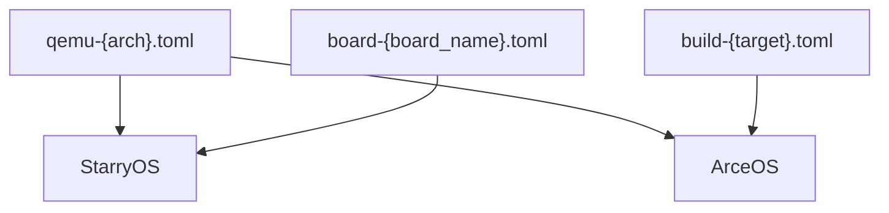
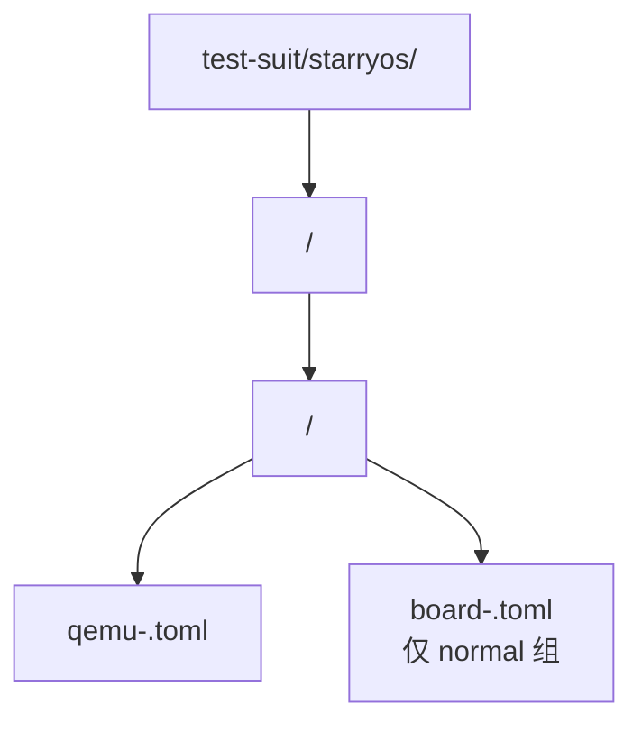
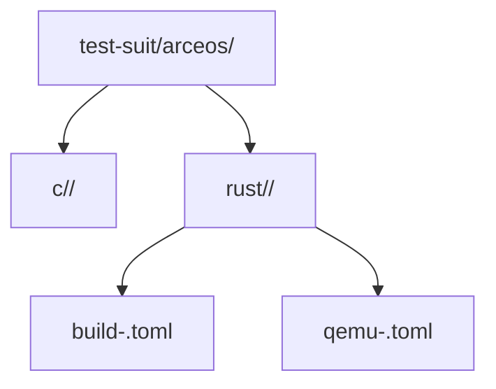

# 命名规则与共享配置

## 1. 共享配置文件类型

虽然各 OS 的测试发现和执行方式不同，但当前测试体系里反复出现的配置文件主要有三类：

| 配置类型 | 文件名格式 | 主要使用方 | 作用 |
|----------|------------|------------|------|
| QEMU 运行配置 | `qemu-{arch}.toml` | StarryOS、ArceOS | 描述 QEMU 参数、shell 交互方式、成功/失败判据 |
| 板级测试配置 | `board-{board_name}.toml` | StarryOS | 描述串口交互规则、板型标识和判定规则 |
| 构建配置 | `build-{target}.toml` | ArceOS Rust 测试 | 描述 features、日志级别、CPU 数量和环境变量 |

这些文件的共同点是：它们都作为 xtask 的输入，决定“怎样构建”和“怎样判定通过”。但具体字段并不完全跨系统复用，因此字段级说明更适合放在对应系统文档中，而不是再维护一份独立的重复清单。

### 1.1 类型对应

### 1.2 QEMU 配置

`qemu-{arch}.toml` 是最通用的一类测试配置，通常包含以下信息：

- `args`：QEMU 启动参数
- `uefi`、`to_bin`：镜像启动和格式处理选项
- `shell_prefix`、`shell_init_cmd`：shell 交互测试入口
- `success_regex`、`fail_regex`：成功/失败判定规则
- `timeout`：超时秒数

适用场景：

- StarryOS 的普通/压力测试
- ArceOS Rust 测试
- 部分需要 shell 交互或正则判定的 OS 级 QEMU 回归

### 1.3 Board 配置

`board-{board_name}.toml` 主要用于 StarryOS 的物理板测试。它和 QEMU 配置的思路一致，都是“等待输出、发送命令、按正则判定”，但不直接描述 QEMU 参数，而是额外通过 `board_type` 关联到板级构建配置。

### 1.4 Build 配置

`build-{target}.toml` 目前主要用于 ArceOS Rust 测试，负责把“如何构建”从运行配置中拆出来。它通常不关心串口输出和测试判据，而是关注：

- 启用哪些 Cargo features
- 日志级别
- CPU 数量
- 构建时环境变量

## 2. 命名规则

统一目录和配置文件命名是 test-suit 体系能被 xtask 稳定发现的前提。

### 2.1 目录命名

- 使用小写字母、数字、连字符和下划线
- 用例目录名应简短且具有可读性，例如 `smoke`、`stress-ng-0`、`helloworld`
- 同一层级下目录名即用例名，因此应避免过于宽泛或与已有用例冲突

### 2.2 文件命名

| 文件类型 | 格式 | 示例 |
|----------|------|------|
| QEMU 配置 | `qemu-{arch}.toml` | `qemu-aarch64.toml`、`qemu-x86_64.toml` |
| 板级配置 | `board-{board_name}.toml` | `board-orangepi-5-plus.toml` |
| 构建配置 | `build-{target}.toml` | `build-x86_64-unknown-none.toml`、`build-aarch64-unknown-none-softfloat.toml` |

### 2.3 架构命名

| 架构缩写 | 常见完整 Target | 说明 |
|----------|-----------------|------|
| `x86_64` | `x86_64-unknown-none` | x86_64 Q35 平台 |
| `aarch64` | `aarch64-unknown-none-softfloat` | ARM Cortex-A53 等 AArch64 平台 |
| `riscv64` | `riscv64gc-unknown-none-elf` | RISC-V 64 位 |
| `loongarch64` | `loongarch64-unknown-none-softfloat` | LoongArch 64 位 |

### 2.4 发现路径

对 StarryOS 而言，xtask 主要按目录和文件名自动发现：

对 ArceOS 而言，C/Rust 测试虽然还包含硬编码注册列表，但目录结构和配置文件命名仍然决定了用例组织方式：

也就是说，命名规则不仅影响可读性，还直接影响 xtask 的发现、筛选和执行路径。
