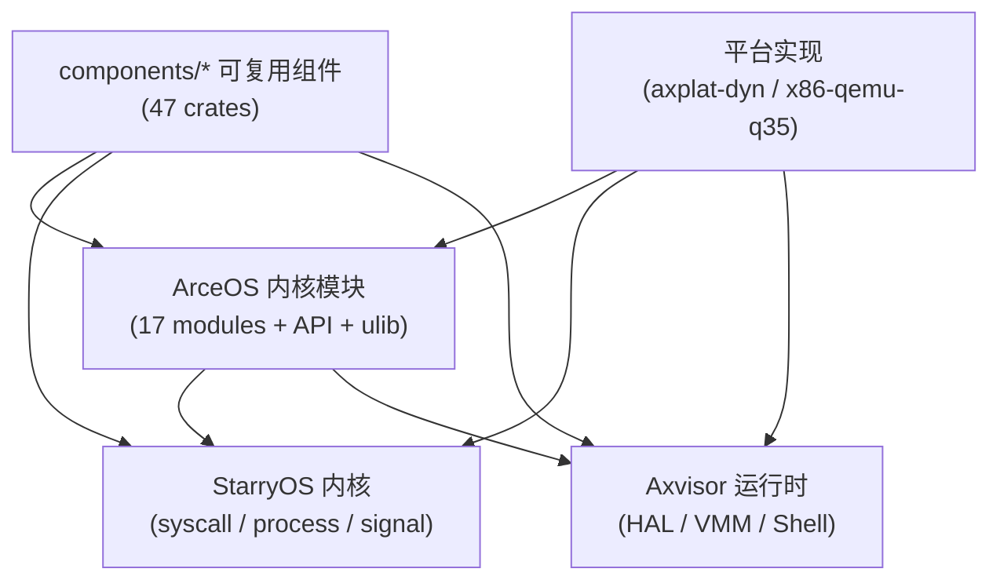

# 项目概览

TGOSKits 是一个面向操作系统与虚拟化开发的统一集成工作区。它通过 Git Subtree 将 **ArceOS** 模块化内核、**StarryOS** Linux 兼容系统、**Axvisor** Type-I 虚拟化监视器以及 **47 个独立组件 crate** 汇聚到同一个 Cargo workspace 中，使用统一的 `cargo xtask` 入口完成构建、运行、测试和集成验证。

## 定位与元数据

| 属性 | 值 |
|------|-----|
| 组织 | `rcore-os/tgoskits` |
| 版本 | v0.5.11 |
| 协议 | Apache-2.0 |
| Rust Edition | 2024（Resolver v3） |
| 工具链 | `nightly-2026-04-01`（minimal profile） |
| 构建 | Release 默认启用 LTO |

**核心特征：**

| 维度 | 说明 |
|------|------|
| 统一工作区 | 三套 OS + 组件层在同一 Cargo workspace 协同开发，共享依赖解析 |
| 组件化架构 | 调度、内存、驱动、文件系统、网络、虚拟化等基础能力以独立 crate 存在，可被多系统复用 |
| 统一构建入口 | `cargo xtask` 为唯一推荐入口，底层实现为 `scripts/axbuild`（tg-axbuild） |
| 多架构支持 | RISC-V 64 / AArch64 / x86_64 / LoongArch64 |

## 目录结构

```text
tgoskits/
├── components/                # 47 个独立可复用组件 crate（通过 Git Subtree 管理）
│   ├── axsched/               # 调度算法（CFS、RR、多级反馈队列等）
│   ├── axallocator/           # 内存分配器（bitmap、buddy 等策略统一接口）
│   ├── axvm / axvcpu / axdevice/  # 虚拟化抽象层（VM/vCPU/虚拟设备）
│   ├── starry-process/        # StarryOS 进程管理
│   ├── starry-signal/          # StarryOS 信号机制
│   ├── arm_vcpu / riscv_vcpu / x86_vcpu/  # 架构相关 vCPU 实现
│   ├── arm_vgic / x86_vlapic / riscv_vplic/  # 架构相关中断控制器虚拟化
│   ├── axfs-ng-vfs / rsext4/  # 文件系统层
│   ├── starry-smoltcp/         # 网络协议栈（smoltcp fork）
│   └── ...                     # 同步原语、错误码、CPU 抽象等基础设施
├── os/
│   ├── arceos/                 # ArceOS 模块化 unikernel 内核
│   │   ├── modules/            # 17 个内核模块（axhal, axtask, axmm, axdriver...）
│   │   ├── api/                # API 聚合层（arceos_api, posix_api, axfeat）
│   │   ├── ulib/               # 用户态库（axstd 标准库, axlibc C 库兼容）
│   │   └── examples/           # 内置示例（helloworld, shell, httpclient/server）
│   ├── StarryOS/               # StarryOS Linux 兼容系统
│   │   ├── starryos/           # 主实现（含 .axconfig.toml, src/, Cargo.toml）
│   │   ├── kernel/             # 内核实现（syscall, 进程, 信号, 文件系统）
│   │   └── configs/            # 板级与 QEMU 平台配置
│   └── axvisor/                # Axvisor Type-I Hypervisor
│       ├── src/                # 核心：HAL, VMM, Shell, 任务管理
│       ├── configs/            # 板级配置 / VM 配置 / 板级测试配置
│       └── xtask/              # Axvisor 专用构建任务
├── platform/                   # 平台适配层
│   ├── axplat-dyn/             # 动态平台支持
│   └── x86-qemu-q35/           # x86 Q35 平台实现
├── drivers/                    # SoC 专用驱动（RK3588 时钟/NPU/电源管理）
├── test-suit/                  # 系统级测试套件
│   ├── arceos/                 # ArceOS 测试（7 个 C 测试 + 16 个 Rust 测试）
│   └── starryos/               # StarryOS 测试（15 个 normal + 1 个 stress）
├── container/                  # CI/本地容器镜像定义（Dockerfile, LVZ 扩展）
├── scripts/
│   ├── axbuild/                # 统一构建系统（tg-axbuild，xtask 的底层实现）
│   ├── test/                   # 测试白名单（std_crates.csv, clippy_crates.csv）
│   └── repo/                   # Subtree 管理工具
├── xtask/                      # xtask 入口 crate（tg-xtask）
├── examples/                   # 独立示例项目
└── docs/                       # 当前文档站点（Docusaurus）
```

## 核心系统

### ArceOS

仓库中最基础的 unikernel 内核，采用模块化架构，17 个内核模块 + 3 层 API/用户库：

| 层次 | 内容 | 作用 |
|------|------|------|
| 内核模块 (`modules/`) | `axhal`, `axtask`, `axmm`, `axdriver`, `axfs`, `axnet`, `axsync`, `axlog`, `axruntime` 等 | 硬件抽象、调度、内存、驱动、文件系统、网络 |
| API 聚合层 (`api/`) | `arceos_api`, `arceos_posix_api`, `axfeat` | 向上提供统一 API 和 feature 开关 |
| 用户态库 (`ulib/`) | `axstd`, `axlibc` | 用户态标准库与 C 库兼容层 |

ArceOS 是 StarryOS 和 Axvisor 的共同依赖基础。详细开发指南：[ArceOS 开发指南](/docs/design/systems/arceos-guide)

### StarryOS

建立在 ArceOS 基础设施之上，重点补齐 Linux 兼容语义：

| 能力域 | 实现要点 |
|--------|---------|
| Syscall 兼容 | 大量 Linux syscall 的语义等价实现（`kernel/src/syscall/`） |
| 进程模型 | 多进程地址空间、进程树、`/proc` 伪文件系统（`starry-process` 组件） |
| 线程与信号 | POSIX 线程、信号传递与处理（`starry-signal` 组件） |
| 用户态验证 | 基于 rootfs 的完整用户态程序执行链路 |

StarryOS 拥有独立的测试套件（15 个 normal 测试 + 1 个 stress 测试），覆盖冒烟、回归和压力场景。详细开发指南：[StarryOS 开发指南](/docs/design/systems/starryos-guide)

### Axvisor

运行在 ArceOS 基础设施之上的 Hypervisor，提供完整的虚拟化管理能力：

| 能力域 | 实现要点 |
|--------|---------|
| 虚拟化抽象 | `axvm`（VM 管理）、`axvcpu`（vCPU 抽象）、`axdevice`（虚拟设备）组件化设计 |
| 架构支持 | ARM vCPU/VGIC、RISC-V vCPU/vPLIC、x86 vCPU/vLAPIC（各架构独立 crate） |
| Guest 支持 | Linux（AArch64 / RISC-V）、ArceOS、RT-Thread、Nimbos |
| 配置体系 | 板级配置（`configs/board/*.toml`）+ VM 配置（`configs/vms/*.toml）双层结构 |
| 板级支持 | OrangePi-5-Plus (RK3588)、飞腾 E2000 (phytiumpi)、RK3568-PC、RDK-S100 |

详细开发指南：[Axvisor 开发指南](/docs/design/systems/axvisor-guide) | 内部机制：[AxVisor 内部机制](/docs/design/architecture/axvisor-internals)

## 依赖关系

47 个组件 crate 按能力域组织，通过 Cargo workspace 的依赖解析被三套系统按需引用：



> 组件层与系统层的完整分层说明：[架构与组件层次](../design/architecture/arch) | 依赖图全量分析：[tgoskits-dependency](/docs/design/reference/tgoskits-dependency)

## 影响评估

理解依赖层次后，可按以下规则快速判断改动的影响面和验证优先级：

| 改动位置 | 影响范围 | 验证优先级 |
|----------|---------|-----------|
| `components/*` 基础 crate | 三套系统都可能受影响 | 先跑 `cargo xtask test`（主机端），再跑各系统最小 QEMU 路径 |
| `os/arceos/modules/*` | ArceOS → StarryOS / Axvisor | 先测 ArceOS，再测上层系统 |
| `os/StarryOS/kernel/*` | 主要影响 StarryOS | 重点关注 rootfs 和 syscall 行为 |
| `os/axvisor/*` | Axvisor 自身 | 代码 + 配置 + Guest 镜像一起验证 |

## 构建入口

所有构建、运行和测试操作均通过 `cargo xtask` 调度，底层由 `scripts/axbuild/`（tg-axbuild）实现：

| 命令 | 功能 | 典型用法 |
|------|------|---------|
| `cargo xtask test` | 主机端标准库单元测试（基于 `std_crates.csv` 白名单） | `cargo xtask test` |
| `cargo xtask clippy` | Clippy 静态检查（基于 `clippy_crates.csv` 白名单） | `cargo xtask clippy --all` |
| `cargo xtask arceos <sub>` | ArceOS 构建/运行/QEMU 测试 | `cargo xtask arceos qemu --arch riscv64` |
| `cargo xtask starry <sub>` | StarryOS 构建/运行/QEMU 测试/板级测试 | `cargo xtask starry qemu --target aarch64` |
| `cargo xtask axvisor <sub>` | Axvisor 构建/运行/QEMU/U-Boot/板级测试 | `cargo xtask axvisor test qemu --target aarch64` |
| `cargo xtask board <sub>` | 远程开发板管理 | `cargo xtask board list` |

命令体系详解：[构建流程](../design/build/flow) | [命令总览](../design/build/cmd)

## 阅读指引

| 目标 | 路径 |
|------|------|
| 第一次进入仓库 | [环境准备](/docs/quickstart/overview) → **本文** → [环境与平台](./hardware) |
| 理解三套系统的关系与边界 | **本文**（§核心系统 + §依赖关系） |
| 理解命令体系 | [构建流程](../design/build/flow) → [命令总览](../design/build/cmd) |
| 改某个系统 | **本文**（§影响评估） → 对应系统指南 (`design/systems/`) |
| 评估组件影响面 | [架构设计](../design/architecture/arch) → [组件开发指南](/docs/design/reference/components) |
| 做 Axvisor 开发 | [Axvisor 指南](/docs/design/systems/axvisor-guide) → [配置体系](../design/guest-config/config-overview) |
| 了解测试基础设施 | [测试基础设施与环境](../design/test/env) → [测试套件体系总览](../design/test/test-suit-design) |
