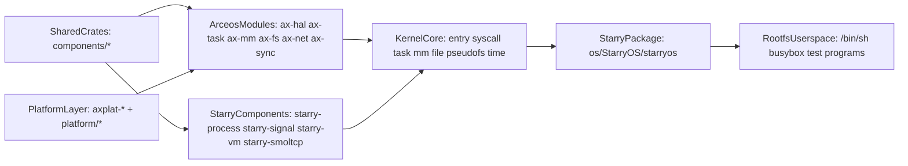
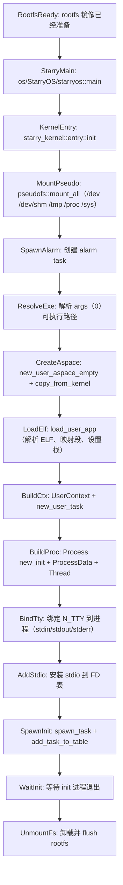
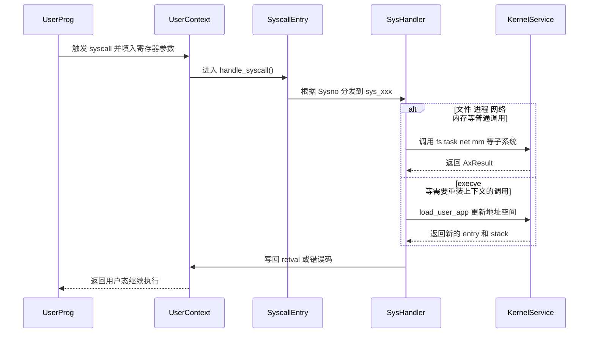
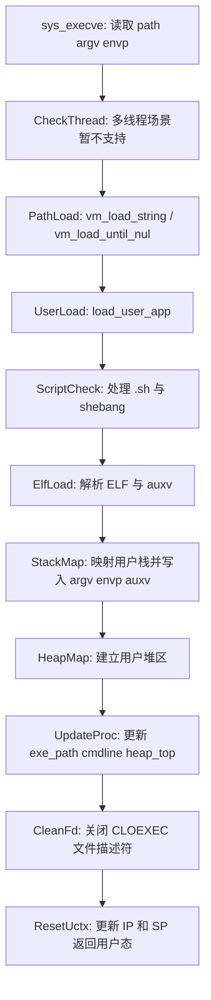
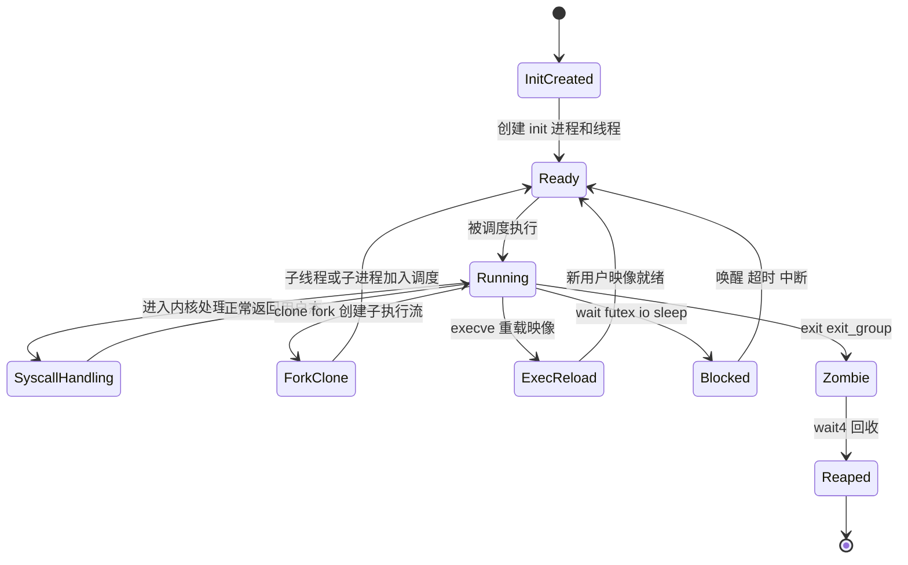

# StarryOS 内部机制

本文档面向准备修改 StarryOS 内核、补充 Linux 兼容语义、分析 syscall 路径或调整 rootfs 验证流程的开发者，重点阐述 StarryOS 的内部结构与执行机制。

若尚未运行过 StarryOS，建议先阅读 [quick-start.md](quick-start.md)。

## 1. 系统定位与设计目标

StarryOS 是建立在 ArceOS 基础能力之上的组件化宏内核系统，继承了 ArceOS 的模块化、跨平台和 Rust 安全性，同时引入了更接近 Linux 的进程、线程、syscall、文件系统和 rootfs 语义。

核心设计目标：

| 目标 | 含义 | 典型落点 |
| --- | --- | --- |
| Linux 兼容语义 | 提供更接近 Linux 的用户态程序运行环境 | `kernel/src/syscall/*`、`kernel/src/task/*`、`kernel/src/file/*` |
| 复用 ArceOS 基础能力 | 不重复实现 HAL、调度、部分文件与网络基础设施 | `os/arceos/modules/*` |
| 组件化宏内核 | 在一个内核映像中组织多种子系统，但继续按组件边界拆分职责 | `components/starry-*`、`kernel/*` |
| 用户态验证闭环 | 通过 rootfs 和 init shell 验证系统行为，而不仅仅是跑单个内核函数 | `os/StarryOS/starryos`、rootfs 镜像、`test-suit/starryos` |

StarryOS 介于"ArceOS 单内核应用运行时"与"完整 Linux 宏内核"之间：它并非简单地为 ArceOS 增加一个 shell，而是将进程、地址空间、syscall 分发、伪文件系统、信号、资源限制等内核机制系统化地组合起来。

## 2. 架构概览

StarryOS 的核心特征在于多个层次共同组成最终可运行的系统，而非仅有一个 `kernel/` 目录。



理解此图需注意以下三点：

- `rootfsUsers` 是 StarryOS 验证 Linux 兼容行为的核心载体。
- `kernelCore` 并非从零实现全部底层能力，而是将 ArceOS 模块和 Starry 专用组件拼接成宏内核语义。
- 修改 `arceosModules` 时，不仅 ArceOS 受影响，StarryOS 也会被波及。

### 2.1 主要分层职责

| 层次 | 目录 | 职责 |
| --- | --- | --- |
| 用户态层 | rootfs 中的 shell、busybox、测试程序 | 触发 syscall、文件系统、进程管理等行为 |
| 启动包层 | `os/StarryOS/starryos` | 构造命令行与环境变量，进入内核入口 |
| 内核核心层 | `os/StarryOS/kernel` | `entry`、`syscall`、`task`、`mm`、`file`、`pseudofs`、`time` |
| Starry 专用组件层 | `components/starry-*` | 进程、信号、虚拟内存、网络兼容等抽象 |
| ArceOS 基础模块层 | `os/arceos/modules/*` | HAL、任务调度、同步、基础 I/O、文件与网络能力 |
| 平台层 | `platform/*`、`axplat-*` | 架构与板级支持 |

### 2.2 支持架构

当前 StarryOS 的架构支持状态：

- `riscv64`：可用
- `loongarch64`：可用
- `aarch64`：可用
- `x86_64`：仍在进行中

稳定验证内核语义时，建议优先使用 `riscv64`。

## 3. 核心设计机制

### 3.1 基于 ArceOS 的组件化宏内核

StarryOS 与传统"从零写起"的宏内核不同，将大量底层职责交由 ArceOS 处理：

- 任务与调度的基本运行时建立在 `ax-task` 之上。
- 地址空间与页表能力复用 `ax-mm` 系列基础设施。
- 文件系统、网络、HAL、日志等依赖 `ax-fs`、`ax-net`、`ax-hal`、`ax-log` 等模块。

StarryOS 自身重点补齐"多进程、多线程、Linux syscall 语义、rootfs 用户态验证"这几部分。

### 3.2 进程与线程分离

StarryOS 在 `task` 子系统中把“进程共享状态”和“线程私有状态”明确分离：

| 对象 | 主要内容 | 语义 |
| --- | --- | --- |
| `ProcessData` | `proc`、`exe_path`、`cmdline`、`aspace`、`scope`、`rlim`、`signal`、`futex_table`、`umask` | 进程级共享状态 |
| `Thread` | `proc_data`、线程级 signal、time、`clear_child_tid`、`robust_list_head`、退出标志 | 线程级运行状态 |

这种分离使得：

- `clone()` 可根据 flags 决定共享进程级资源或复制新的进程上下文。支持 `CLONE_VM`（共享地址空间）、`CLONE_THREAD`（同线程组）、`CLONE_VFORK`（挂起父进程直到 execve/exit）等标志位组合。
- `execve()` 可在保持进程身份的前提下重装用户地址空间与程序映像，同时关闭 `CLOEXEC` 标志的文件描述符并重置信号处理器。
- `fork()` 等价于带默认 flags 的 `clone()`，使用 COW（写时复制）后端复制地址空间。
- 线程切换时只需切换线程级上下文，资源、地址空间、信号行为仍按进程或线程粒度维护。

### 3.3 syscall 分发机制

`kernel/src/syscall/mod.rs` 中的 `handle_syscall()` 是 StarryOS 的核心控制中枢。其处理流程：

- 从 `UserContext` 读取 syscall 编号与参数。
- 将编号转换为 `Sysno`。
- 按功能域分发到 `fs`、`mm`、`task`、`signal`、`ipc`、`net` 等实现。
- 将返回值转换为 Linux 风格错误码写回 `UserContext`。

StarryOS 的 Linux 兼容行为**明确定义在 syscall 分发与各子模块实现中**。当前支持的 syscall 覆盖以下主要类别：

| 类别 | 典型 syscall | 实现位置 |
| --- | --- | --- |
| 进程管理 | `clone`、`clone3`、`fork`、`execve`、`exit`、`wait4` | `syscall/task/` |
| 文件操作 | `open`、`read`、`write`、`close`、`lseek`、`stat` | `syscall/fs/` |
| 目录操作 | `mkdir`、`getdents64`、`chdir`、`getcwd`、`symlink` | `syscall/fs/` |
| I/O 多路复用 | `poll`、`select`、`epoll_create1`、`epoll_ctl`、`epoll_pwait` | `syscall/io_mpx/` |
| 内存管理 | `brk`、`mmap`、`munmap`、`mprotect`、`mremap` | `syscall/mm/` |
| 信号处理 | `rt_sigaction`、`rt_sigprocmask`、`kill`、`futex`、`sigaltstack` | `syscall/signal.rs`、`task/signal.rs` |
| 网络 | `socket`、`bind`、`listen`、`accept`、`connect`、`send`、`recv` | `syscall/net/` |
| IPC | `msgget`、`msgsnd`、`msgrcv`、`shmget`、`shmat`、`shmdt` | `syscall/ipc/` |
| 时间 | `clock_gettime`、`nanosleep`、`gettimeofday` | `syscall/time.rs` |
| 管道与事件 | `pipe2`、`eventfd2`、`signalfd4`、`pidfd_open` | `file/pipe.rs`、`file/event.rs` |

### 3.4 用户程序加载机制

用户程序加载围绕 `mm::load_user_app()` 展开，执行以下操作：

- 解析路径或首个参数。
- 处理 shell 脚本与 shebang 解释器路径。
- 调用 ELF loader 解析二进制。
- 映射用户栈、写入 `argv/envp/auxv`。
- 建立用户堆区。
- 返回入口地址与用户栈顶。

`execve()` 不只是"替换当前进程路径字符串"，而是会重建当前线程恢复用户态时看到的整个地址空间布局。

## 4. 功能组件与模块

本节介绍 StarryOS 的内核子系统总览、Starry 专用组件层及启动包与内核入口的关系。

### 4.1 内核子系统总览

以下表格汇总了 StarryOS 内核各子系统的目录位置、职责及典型关联模块：

| 子系统 | 目录 | 职责 | 典型关联 |
| --- | --- | --- | --- |
| 启动入口 | `kernel/src/entry.rs` | 挂载伪文件系统、创建 init 进程与线程、绑定 TTY、安装 stdio、等待系统退出 | `mm`、`task`、`pseudofs`、`file` |
| syscall | `kernel/src/syscall/*` | 按Linux syscall 语义分发系统调用（24 个类别，覆盖进程、文件、内存、信号、网络、IPC 等） | `task`、`mm`、`file`、`ipc`、`net` |
| task | `kernel/src/task/*` | 进程/线程创建与回收（clone、fork、execve、exit、wait4）、futex、资源限制、信号、定时器、调度关联 | `starry-process`、`starry-signal`、`ax-task` |
| mm | `kernel/src/mm/*` | 地址空间管理、ELF 装载、brk/mmap/mprotect、用户内存安全访问、COW 后端 | `starry-vm`、`ax-mm` |
| file | `kernel/src/file/*` | FD 表、文件/目录/管道/epoll/eventfd/signalfd/pidfd 操作 | `ax-fs`、`pseudofs` |
| pseudofs | `kernel/src/pseudofs/*` | `/dev`、`/proc`、`/tmp`、`/dev/shm`、`/sys` 等伪文件系统 | `file` |
| time | `kernel/src/time.rs` | 时间格式转换与时钟相关 syscall 支持 | `ax-task`、`ax-hal` |

### 4.2 Starry 专用组件

当前仓库中的 Starry 专用组件包括：

- `components/starry-process` — 进程抽象（`Process` 结构体），管理 PID 分配、进程组、会话、退出事件等。
- `components/starry-signal` — 信号处理框架，提供 `ProcessSignalManager` 和 `ThreadSignalManager`。
- `components/starry-vm` — 虚拟地址空间抽象（`AddrSpace`），基于 `ax-page-table-multiarch` 提供跨架构页表管理。
- `components/starry-smoltcp` — 异步感知的网络协议栈，为 `ax-net-ng` 提供底层实现。

这些组件可理解为"介于 ArceOS 基础模块和 StarryOS 内核实现之间"的中间层：

- 承载 Linux 兼容语义更强的抽象。
- 避免将所有逻辑集中到 `kernel/` 目录。
- 便于后续替换、扩展或复用。

### 4.3 启动包与内核入口的关系

`os/StarryOS/starryos/src/main.rs` 的职责很轻：

```rust
pub const CMDLINE: &[&str] = &["/bin/sh", "-c", include_str!("init.sh")];

#[unsafe(no_mangle)]
fn main() {
    let args = CMDLINE.iter().copied().map(str::to_owned).collect::<Vec<_>>();
    let envs = [];
    starry_kernel::entry::init(&args, &envs);
}
```

它把命令行与环境准备好后，就把控制权交给 `starry_kernel::entry::init()`。真正的“宏内核初始化”发生在 `kernel/src/entry.rs` 中，而不是启动包本身。

## 5. 关键执行流程

本节通过流程图和时序图描述 StarryOS 从启动包到 init 进程、syscall 分发、`execve()` 装载以及进程/线程生命周期的完整执行路径。

### 5.1 从启动包到 init 进程的完整链路

以下流程图说明了 StarryOS 启动时的完整过程：



此图揭示了以下事实：

- `pseudofs::mount_all()` 在初始化早期执行，`/dev`、`/proc` 等伪文件系统是系统初始化的一部分。
- `copy_from_kernel()` 表示用户地址空间创建时会继承某些必要的内核映射。
- init 进程通过 `new_user_task()` 和 `spawn_task()` 变成真正可调度任务。

### 5.2 syscall 分发路径

以下时序图描述了一次典型 syscall 从用户态进入内核再回到用户态的过程：



此图对排查 syscall 问题有帮助：

- 若用户态得到 `ENOSYS`，优先检查 `Sysno` 是否未覆盖。
- 若 syscall 逻辑已进入 `sys_xxx` 但行为异常，去对应子系统排查。
- 若问题仅在 `execve()`、`clone()` 等复杂调用中出现，通常还需查看 `task` 和 `mm`。

### 5.3 `execve()` 与 ELF 装载流程

`execve()` 是 StarryOS 最能体现宏内核语义的场景之一，需同时重写地址空间、用户栈、命令行和线程上下文。



此流程需注意以下几点：

- `execve()` 在多线程场景下会返回 `WouldBlock`，该语义尚未完全补齐。
- StarryOS 会处理脚本和 shebang，而非仅接受 ELF。
- `CLOEXEC` 文件描述符会在 `execve()` 后被清理，与 Linux 语义一致。

### 5.4 进程与线程生命周期

以下状态图将 `clone()`、`execve()`、`wait4()` 和 `exit()` 置于同一视角：



此图有助于分析"程序为何没有继续运行"：

- 是否卡在 `Blocked`。
- 是否已进入 `Zombie` 但父进程未回收。
- `execve()` 失败后是否未完成 `Ready` 状态恢复。

## 6. 开发环境与构建

本节介绍 StarryOS 的环境依赖、构建入口及 rootfs 镜像的位置说明。

### 6.1 环境配置

StarryOS 需要 Rust 裸机目标、rootfs 以及 Musl 交叉工具链：

- Rust toolchain 与裸机 target。
- QEMU。
- 必要时安装 Musl 交叉工具链，用于构建 rootfs 中的静态用户态程序。

StarryOS 提供两种环境配置方式：

- Docker：适合快速拉起统一环境。
- 手工配置：适合长期本地开发。

Makefile 中常用的构建变量包括：

| 变量 | 默认值 | 说明 |
| --- | --- | --- |
| `ARCH` | `riscv64` | 目标架构（`riscv64`、`aarch64`、`loongarch64`、`x86_64`） |
| `LOG` | `warn` | 日志级别 |
| `MODE` | `release` | 构建模式（`release` 或 `debug`） |
| `BLK` | `y` | 启用 `y` 时附加 virtio-blk（rootfs 所需） |
| `NET` | `y` | 启用 `y` 时附加 virtio-net |
| `MEM` | `1G` | 内存大小 |
| `BUS` | `mmio` | 设备总线类型（`mmio` 或 `pci`） |

### 6.2 运行入口

StarryOS 提供两种运行入口，分别适合集成开发和本地调试场景：

| 入口 | 适合场景 | 命令 |
| --- | --- | --- |
| 根目录 xtask | 集成开发、和仓库统一测试保持一致 | `cargo xtask starry rootfs --arch riscv64`、`cargo xtask starry run --arch riscv64 --package starryos` |
| 本地 Makefile | 调 StarryOS 自己的构建逻辑与 GDB 路径 | `cd os/StarryOS && make rootfs ARCH=riscv64 && make ARCH=riscv64 run` |

常用最小路径如下：

```bash
cargo xtask starry rootfs --arch riscv64
cargo xtask starry run --arch riscv64 --package starryos
```

### 6.3 rootfs 镜像位置

StarryOS 的 rootfs 有两个常见位置，根 xtask 路径和本地 Makefile 路径不共享默认镜像位置：

- 根目录 xtask：通常位于 `target/<triple>/rootfs-<arch>.img`
- 本地 Makefile：`os/StarryOS/make/disk.img`

"已准备 rootfs"不代表另一套入口也能直接复用。

## 7. API 与内部接口

StarryOS 面向开发者最重要的不是用户态 API，而是几个内核内部接口。

### 7.1 启动入口

| 接口 | 位置 | 说明 |
| --- | --- | --- |
| `starry_kernel::entry::init(args, envs)` | `kernel/src/entry.rs` | 负责从启动参数创建 init 进程并启动用户态世界 |
| `load_user_app()` | `kernel/src/mm/loader.rs` | 装载 ELF、建立用户栈和堆、返回入口与栈顶 |
| `handle_syscall()` | `kernel/src/syscall/mod.rs` | syscall 分发总入口 |

### 7.2 进程/线程内部接口

StarryOS 的进程与线程管理基于 `ProcessData`（进程共享状态）与 `Thread`（线程私有状态）的分离设计。以下表格列出了开发者最常接触的内部接口：
| --- | --- |
| `ProcessData::new()` | 组装进程共享状态 |
| `Thread::new()` | 创建线程私有状态 |
| `sys_clone()` | 根据 clone flags 创建子线程或子进程 |
| `sys_execve()` | 在当前进程中替换用户映像 |

### 7.3 典型使用模式

`sys_execve()` 的核心逻辑可概括为：

```rust
let path = vm_load_string(path)?;
let args = vm_load_until_nul(argv)?
    .into_iter()
    .map(vm_load_string)
    .collect::<Result<Vec<_>, _>>()?;

let mut aspace = proc_data.aspace.lock();
let (entry_point, user_stack_base) =
    load_user_app(&mut aspace, Some(path.as_str()), &args, &envs)?;

uctx.set_ip(entry_point.as_usize());
uctx.set_sp(user_stack_base.as_usize());
```

该代码体现了三个关键点：

- 用户参数访问必须先通过 `vm_load_*` 系列接口做安全装载。
- 地址空间更新是 `execve()` 的核心工作。
- 必须将新的 `IP/SP` 写回 `UserContext`，用户态才能真正跳转到新程序入口。

### 7.4 IPC 机制

StarryOS 支持多种 IPC 机制，覆盖 System V 和 POSIX 风格：

| 机制 | syscall 接口 | 说明 |
| --- | --- | --- |
| 管道 | `pipe2`、`pipe` | 匿名管道，支持 `O_CLOEXEC`、`O_NONBLOCK` 标志 |
| eventfd | `eventfd2` | 事件计数文件描述符，用于事件通知 |
| signalfd | `signalfd4` | 将信号转换为文件描述符可读事件 |
| pidfd | `pidfd_open`、`pidfd_send_signal`、`pidfd_getfd` | 通过文件描述符管理进程 |
| 消息队列 | `msgget`、`msgsnd`、`msgrcv`、`msgctl` | System V 消息队列 |
| 共享内存 | `shmget`、`shmat`、`shmdt`、`shmctl` | System V 共享内存（挂载于 `/dev/shm`） |
| epoll | `epoll_create1`、`epoll_ctl`、`epoll_pwait` | 高效 I/O 多路复用 |

## 8. 调试与排障

本节提供 StarryOS 的日志与 GDB 调试入口、常见问题汇总及性能优化切入点。

### 8.1 日志与 GDB

最直接的本地调试入口为 Makefile：

```bash
cd os/StarryOS
make ARCH=riscv64 LOG=debug run
make ARCH=riscv64 debug
```

这比自己手拼 QEMU 参数更稳定，也更接近 StarryOS 自身的调试路径。

### 8.2 常见问题

以下表格汇总了 StarryOS 开发中最常遇到的问题及排查方向：

| 现象 | 常见原因 | 建议排查点 |
| --- | --- | --- |
| 启动时报找不到 rootfs | 镜像没准备好，或用错了入口路径 | 先分清 xtask 路径还是 Makefile 路径 |
| 用户程序起不来 | `load_user_app()` 失败、ELF 不合法、shebang 解释错误 | 看 `mm/loader.rs` |
| syscall 返回 `ENOSYS` | 分发表未覆盖，或目标架构条件编译没命中 | 看 `kernel/src/syscall/mod.rs` |
| `execve()` 异常 | 多线程语义未覆盖、CLOEXEC/地址空间更新有误 | 看 `sys_execve()` 与 `load_user_app()` |
| 线程/进程行为异常 | `clone()` flags 处理或 `ProcessData` 共享状态不符合预期 | 看 `task/ops.rs`、`task/mod.rs` |

### 8.3 性能优化切入点

优化 StarryOS 的常见方向：

- syscall 分发开销：关注热路径 syscall 是否有不必要的复制、锁或抽象层。`handle_syscall()` 使用 `enum_dispatch` 进行分发，本身开销较低。
- 进程创建与装载：关注 `clone()`、`execve()`、ELF loader 与地址空间映射。fork 的 COW 后端和 mmap 的延迟分配是关键路径。
- futex 与调度：关注 `task/futex.rs` 中的等待队列实现与 `ax-task` 的调度协作。
- 文件与 rootfs：关注 FD 表查找效率、伪文件系统与底层文件系统交互。ext4 的缓存策略（ax-fs-ng LRU 缓存）影响 I/O 性能。
- IPC 路径：关注消息队列、共享内存和管道的内核缓冲区管理。

## 9. 深入阅读

建议按以下顺序继续深入：

1. 从 `os/StarryOS/starryos/src/main.rs` 和 `kernel/src/entry.rs` 阅读系统启动主线。
2. 阅读 `kernel/src/syscall/mod.rs`，理解 syscall 分流到不同子系统的机制。
3. 进入 `kernel/src/task/*`、`kernel/src/mm/*` 深入理解进程、线程和地址空间。
4. 若问题落在底层共享能力，参考 [arceos-internals.md](arceos-internals.md) 中 ArceOS 模块层的说明。

关联文档：

- [starryos-guide.md](starryos-guide.md)：更偏“目录、命令与运行方式”。
- [arceos-internals.md](arceos-internals.md)：更偏“StarryOS 所复用的底层模块”。
- [build-system.md](build-system.md)：更偏“xtask、Makefile、rootfs 与测试入口的关系”。
