# tgoskits 组件层次依赖分析

本文档覆盖 **137** 个 crate（与 `docs/crates/README.md` / `gen_crate_docs` 一致），按仓库内**直接**路径依赖自底向上分层。

由 `scripts/analyze_tgoskits_deps.py` 生成。

## 1. 统计概览

| 指标 | 数值 |
|------|------|
| 仓库内 crate | **137** |
| 内部有向边 | **505** |
| 最大层级 | **16** |
| SCC 数 | **137** |
| Lock 总包块 | **848** |
| Lock 内工作区包（与扫描交集） | **111** |
| Lock 外部依赖条目 | **737** |

### 1.1 分类

| 分类 | 数 |
|------|-----|
| ArceOS 层 | 30 |
| Axvisor 层 | 1 |
| StarryOS 层 | 2 |
| 工具层 | 2 |
| 平台层 | 2 |
| 测试层 | 9 |
| 组件层 | 91 |

## 2. 依赖图（按分类子图）

`A --> B` 表示 A 依赖 B。

```mermaid
flowchart TB
    subgraph sg_ArceOS__["<b>ArceOS 层</b>"]
        direction TB
        arceos_helloworld["arceos-helloworld\nv0.1.0"]
        arceos_helloworld_myplat["arceos-helloworld-myplat\nv0.1.0"]
        arceos_httpclient["arceos-httpclient\nv0.1.0"]
        arceos_httpserver["arceos-httpserver\nv0.1.0"]
        arceos_shell["arceos-shell\nv0.1.0"]
        arceos_api["arceos_api\nv0.3.0-preview.3"]
        arceos_posix_api["arceos_posix_api\nv0.3.0-preview.3"]
        axalloc["axalloc\nv0.3.0-preview.3"]
        axconfig["axconfig\nv0.3.0-preview.3"]
        axdisplay["axdisplay\nv0.3.0-preview.3"]
        axdma["axdma\nv0.3.0-preview.3"]
        axdriver["axdriver\nv0.3.0-preview.3"]
        axfeat["axfeat\nv0.3.0-preview.3"]
        axfs["axfs\nv0.3.0-preview.3"]
        axfs_ng["axfs-ng\nv0.3.0-preview.3"]
        axhal["axhal\nv0.3.0-preview.3"]
        axinput["axinput\nv0.3.0-preview.3"]
        axipi["axipi\nv0.3.0-preview.3"]
        axlibc["axlibc\nv0.3.0-preview.3"]
        axlog["axlog\nv0.3.0-preview.3"]
        axmm["axmm\nv0.3.0-preview.3"]
        axnet["axnet\nv0.3.0-preview.3"]
        axnet_ng["axnet-ng\nv0.3.0-preview.3"]
        axruntime["axruntime\nv0.3.0-preview.3"]
        axstd["axstd\nv0.3.0-preview.3"]
        axsync["axsync\nv0.3.0-preview.3"]
        axtask["axtask\nv0.3.0-preview.3"]
        bwbench_client["bwbench-client\nv0.1.0"]
        deptool["deptool\nv0.1.0"]
        mingo["mingo\nv0.6.0"]
    end
    subgraph sg_Axvisor__["<b>Axvisor 层</b>"]
        direction TB
        axvisor["axvisor\nv0.3.0-preview.2"]
    end
    subgraph sg_StarryOS__["<b>StarryOS 层</b>"]
        direction TB
        starry_kernel["starry-kernel\nv0.2.0-preview.2"]
        starryos["starryos\nv0.2.0-preview.2"]
    end
    subgraph sg____["<b>工具层</b>"]
        direction TB
        axbuild["axbuild\nv0.3.0-preview.3"]
        tg_xtask["tg-xtask\nv0.3.0-preview.3"]
    end
    subgraph sg____["<b>平台层</b>"]
        direction TB
        axplat_dyn["axplat-dyn\nv0.3.0-preview.3"]
        axplat_x86_qemu_q35["axplat-x86-qemu-q35\nv0.2.0"]
    end
    subgraph sg____["<b>测试层</b>"]
        direction TB
        arceos_affinity["arceos-affinity\nv0.1.0"]
        arceos_irq["arceos-irq\nv0.1.0"]
        arceos_memtest["arceos-memtest\nv0.1.0"]
        arceos_parallel["arceos-parallel\nv0.1.0"]
        arceos_priority["arceos-priority\nv0.1.0"]
        arceos_sleep["arceos-sleep\nv0.1.0"]
        arceos_wait_queue["arceos-wait-queue\nv0.1.0"]
        arceos_yield["arceos-yield\nv0.1.0"]
        starryos_test["starryos-test\nv0.3.0-preview.3"]
    end
    subgraph sg____["<b>组件层</b>"]
        direction TB
        aarch64_sysreg["aarch64_sysreg\nv0.1.1"]
        arm_pl011["arm_pl011\nv0.1.0"]
        arm_pl031["arm_pl031\nv0.2.1"]
        arm_vcpu["arm_vcpu\nv0.2.2"]
        arm_vgic["arm_vgic\nv0.2.1"]
        axaddrspace["axaddrspace\nv0.3.0"]
        axallocator["axallocator\nv0.2.0"]
        axbacktrace["axbacktrace\nv0.1.2"]
        axconfig_gen["axconfig-gen\nv0.2.1"]
        axconfig_macros["axconfig-macros\nv0.2.1"]
        axcpu["axcpu\nv0.3.0-preview.8"]
        axdevice["axdevice\nv0.2.1"]
        axdevice_base["axdevice_base\nv0.2.1"]
        axdriver_base["axdriver_base\nv0.1.4-preview.3"]
        axdriver_block["axdriver_block\nv0.1.4-preview.3"]
        axdriver_display["axdriver_display\nv0.1.4-preview.3"]
        axdriver_input["axdriver_input\nv0.1.4-preview.3"]
        axdriver_net["axdriver_net\nv0.1.4-preview.3"]
        axdriver_pci["axdriver_pci\nv0.1.4-preview.3"]
        axdriver_virtio["axdriver_virtio\nv0.1.4-preview.3"]
        axdriver_vsock["axdriver_vsock\nv0.1.4-preview.3"]
        axerrno["axerrno\nv0.2.2"]
        axfs_ng_vfs["axfs-ng-vfs\nv0.1.1"]
        axfs_devfs["axfs_devfs\nv0.1.2"]
        axfs_ramfs["axfs_ramfs\nv0.1.2"]
        axfs_vfs["axfs_vfs\nv0.1.2"]
        axhvc["axhvc\nv0.2.0"]
        axio["axio\nv0.3.0-pre.1"]
        axklib["axklib\nv0.3.0"]
        axplat["axplat\nv0.3.1-pre.6"]
        axplat_aarch64_bsta1000b["axplat-aarch64-bsta1000b\nv0.3.1-pre.6"]
        axplat_aarch64_peripherals["axplat-aarch64-peripherals\nv0.3.1-pre.6"]
        axplat_aarch64_phytium_pi["axplat-aarch64-phytium-pi\nv0.3.1-pre.6"]
        axplat_aarch64_qemu_virt["axplat-aarch64-qemu-virt\nv0.3.1-pre.6"]
        axplat_aarch64_raspi["axplat-aarch64-raspi\nv0.3.1-pre.6"]
        axplat_loongarch64_qemu_virt["axplat-loongarch64-qemu-virt\nv0.3.1-pre.6"]
        axplat_macros["axplat-macros\nv0.1.0"]
        axplat_riscv64_qemu_virt["axplat-riscv64-qemu-virt\nv0.3.1-pre.6"]
        axplat_x86_pc["axplat-x86-pc\nv0.3.1-pre.6"]
        axpoll["axpoll\nv0.1.2"]
        axsched["axsched\nv0.3.1"]
        axvcpu["axvcpu\nv0.2.2"]
        axvisor_api["axvisor_api\nv0.1.0"]
        axvisor_api_proc["axvisor_api_proc\nv0.1.0"]
        axvm["axvm\nv0.2.3"]
        axvmconfig["axvmconfig\nv0.2.2"]
        bitmap_allocator["bitmap-allocator\nv0.2.1"]
        cap_access["cap_access\nv0.1.0"]
        cargo_axplat["cargo-axplat\nv0.2.5"]
        cpumask["cpumask\nv0.1.0"]
        crate_interface["crate_interface\nv0.3.0"]
        crate_interface_lite["crate_interface_lite\nv0.1.0"]
        ctor_bare["ctor_bare\nv0.2.1"]
        ctor_bare_macros["ctor_bare_macros\nv0.2.1"]
        define_simple_traits["define-simple-traits\nv0.1.0"]
        define_weak_traits["define-weak-traits\nv0.1.0"]
        handler_table["handler_table\nv0.1.2"]
        hello_kernel["hello-kernel\nv0.1.0"]
        impl_simple_traits["impl-simple-traits\nv0.1.0"]
        impl_weak_partial["impl-weak-partial\nv0.1.0"]
        impl_weak_traits["impl-weak-traits\nv0.1.0"]
        int_ratio["int_ratio\nv0.1.2"]
        irq_kernel["irq-kernel\nv0.1.0"]
        kernel_guard["kernel_guard\nv0.1.3"]
        kspin["kspin\nv0.1.1"]
        lazyinit["lazyinit\nv0.2.2"]
        linked_list_r4l["linked_list_r4l\nv0.3.0"]
        memory_addr["memory_addr\nv0.4.1"]
        memory_set["memory_set\nv0.4.1"]
        page_table_entry["page_table_entry\nv0.6.1"]
        page_table_multiarch["page_table_multiarch\nv0.6.1"]
        percpu["percpu\nv0.2.3-preview.1"]
        percpu_macros["percpu_macros\nv0.2.3-preview.1"]
        range_alloc_arceos["range-alloc-arceos\nv0.1.4"]
        riscv_h["riscv-h\nv0.2.0"]
        riscv_plic["riscv_plic\nv0.2.0"]
        riscv_vcpu["riscv_vcpu\nv0.2.2"]
        riscv_vplic["riscv_vplic\nv0.2.1"]
        rsext4["rsext4\nv0.1.0"]
        scope_local["scope-local\nv0.1.2"]
        smoltcp["smoltcp\nv0.12.0"]
        smoltcp_fuzz["smoltcp-fuzz\nv0.0.1"]
        smp_kernel["smp-kernel\nv0.1.0"]
        starry_process["starry-process\nv0.2.0"]
        starry_signal["starry-signal\nv0.3.0"]
        starry_vm["starry-vm\nv0.3.0"]
        test_simple["test-simple\nv0.1.0"]
        test_weak["test-weak\nv0.1.0"]
        test_weak_partial["test-weak-partial\nv0.1.0"]
        timer_list["timer_list\nv0.1.0"]
        x86_vcpu["x86_vcpu\nv0.2.2"]
    end
    arceos_affinity --> axstd
    arceos_helloworld --> axstd
    arceos_helloworld_myplat --> axplat_aarch64_bsta1000b
    arceos_helloworld_myplat --> axplat_aarch64_phytium_pi
    arceos_helloworld_myplat --> axplat_aarch64_qemu_virt
    arceos_helloworld_myplat --> axplat_aarch64_raspi
    arceos_helloworld_myplat --> axplat_loongarch64_qemu_virt
    arceos_helloworld_myplat --> axplat_riscv64_qemu_virt
    arceos_helloworld_myplat --> axplat_x86_pc
    arceos_helloworld_myplat --> axstd
    arceos_httpclient --> axstd
    arceos_httpserver --> axstd
    arceos_irq --> axstd
    arceos_memtest --> axstd
    arceos_parallel --> axstd
    arceos_priority --> axstd
    arceos_shell --> axstd
    arceos_sleep --> axstd
    arceos_wait_queue --> axstd
    arceos_yield --> axstd
    arceos_api --> axalloc
    arceos_api --> axconfig
    arceos_api --> axdisplay
    arceos_api --> axdma
    arceos_api --> axdriver
    arceos_api --> axerrno
    arceos_api --> axfeat
    arceos_api --> axfs
    arceos_api --> axhal
    arceos_api --> axio
    arceos_api --> axipi
    arceos_api --> axlog
    arceos_api --> axmm
    arceos_api --> axnet
    arceos_api --> axruntime
    arceos_api --> axsync
    arceos_api --> axtask
    arceos_posix_api --> axalloc
    arceos_posix_api --> axconfig
    arceos_posix_api --> axerrno
    arceos_posix_api --> axfeat
    arceos_posix_api --> axfs
    arceos_posix_api --> axhal
    arceos_posix_api --> axio
    arceos_posix_api --> axlog
    arceos_posix_api --> axnet
    arceos_posix_api --> axruntime
    arceos_posix_api --> axsync
    arceos_posix_api --> axtask
    arceos_posix_api --> scope_local
    arm_vcpu --> axaddrspace
    arm_vcpu --> axdevice_base
    arm_vcpu --> axerrno
    arm_vcpu --> axvcpu
    arm_vcpu --> axvisor_api
    arm_vcpu --> percpu
    arm_vgic --> aarch64_sysreg
    arm_vgic --> axaddrspace
    arm_vgic --> axdevice_base
    arm_vgic --> axerrno
    arm_vgic --> axvisor_api
    arm_vgic --> memory_addr
    axaddrspace --> axerrno
    axaddrspace --> lazyinit
    axaddrspace --> memory_addr
    axaddrspace --> memory_set
    axaddrspace --> page_table_entry
    axaddrspace --> page_table_multiarch
    axalloc --> axallocator
    axalloc --> axbacktrace
    axalloc --> axerrno
    axalloc --> kspin
    axalloc --> memory_addr
    axalloc --> percpu
    axallocator --> axerrno
    axallocator --> bitmap_allocator
    axbuild --> axvmconfig
    axconfig --> axconfig_macros
    axconfig_macros --> axconfig_gen
    axcpu --> axbacktrace
    axcpu --> lazyinit
    axcpu --> memory_addr
    axcpu --> page_table_entry
    axcpu --> page_table_multiarch
    axcpu --> percpu
    axdevice --> arm_vgic
    axdevice --> axaddrspace
    axdevice --> axdevice_base
    axdevice --> axerrno
    axdevice --> axvmconfig
    axdevice --> memory_addr
    axdevice --> range_alloc_arceos
    axdevice --> riscv_vplic
    axdevice_base --> axaddrspace
    axdevice_base --> axerrno
    axdevice_base --> axvmconfig
    axdevice_base --> memory_addr
    axdisplay --> axdriver
    axdisplay --> axsync
    axdisplay --> lazyinit
    axdma --> axalloc
    axdma --> axallocator
    axdma --> axconfig
    axdma --> axhal
    axdma --> axmm
    axdma --> kspin
    axdma --> memory_addr
    axdriver --> axalloc
    axdriver --> axconfig
    axdriver --> axdma
    axdriver --> axdriver_base
    axdriver --> axdriver_block
    axdriver --> axdriver_display
    axdriver --> axdriver_input
    axdriver --> axdriver_net
    axdriver --> axdriver_pci
    axdriver --> axdriver_virtio
    axdriver --> axdriver_vsock
    axdriver --> axerrno
    axdriver --> axhal
    axdriver --> axplat_dyn
    axdriver --> crate_interface
    axdriver_block --> axdriver_base
    axdriver_display --> axdriver_base
    axdriver_input --> axdriver_base
    axdriver_net --> axdriver_base
    axdriver_virtio --> axdriver_base
    axdriver_virtio --> axdriver_block
    axdriver_virtio --> axdriver_display
    axdriver_virtio --> axdriver_input
    axdriver_virtio --> axdriver_net
    axdriver_virtio --> axdriver_vsock
    axdriver_vsock --> axdriver_base
    axfeat --> axalloc
    axfeat --> axbacktrace
    axfeat --> axconfig
    axfeat --> axdisplay
    axfeat --> axdriver
    axfeat --> axfs
    axfeat --> axfs_ng
    axfeat --> axhal
    axfeat --> axinput
    axfeat --> axipi
    axfeat --> axlog
    axfeat --> axnet
    axfeat --> axruntime
    axfeat --> axsync
    axfeat --> axtask
    axfeat --> kspin
    axfs --> axdriver
    axfs --> axerrno
    axfs --> axfs_devfs
    axfs --> axfs_ramfs
    axfs --> axfs_vfs
    axfs --> axio
    axfs --> cap_access
    axfs --> lazyinit
    axfs --> rsext4
    axfs_ng --> axalloc
    axfs_ng --> axdriver
    axfs_ng --> axerrno
    axfs_ng --> axfs_ng_vfs
    axfs_ng --> axhal
    axfs_ng --> axio
    axfs_ng --> axpoll
    axfs_ng --> axsync
    axfs_ng --> kspin
    axfs_ng --> scope_local
    axfs_ng_vfs --> axerrno
    axfs_ng_vfs --> axpoll
    axfs_devfs --> axfs_vfs
    axfs_ramfs --> axfs_vfs
    axfs_vfs --> axerrno
    axhal --> axalloc
    axhal --> axconfig
    axhal --> axcpu
    axhal --> axplat
    axhal --> axplat_aarch64_qemu_virt
    axhal --> axplat_dyn
    axhal --> axplat_loongarch64_qemu_virt
    axhal --> axplat_riscv64_qemu_virt
    axhal --> axplat_x86_pc
    axhal --> kernel_guard
    axhal --> memory_addr
    axhal --> page_table_multiarch
    axhal --> percpu
    axhvc --> axerrno
    axinput --> axdriver
    axinput --> axsync
    axinput --> lazyinit
    axio --> axerrno
    axipi --> axconfig
    axipi --> axhal
    axipi --> kspin
    axipi --> lazyinit
    axipi --> percpu
    axklib --> axerrno
    axklib --> memory_addr
    axlibc --> arceos_posix_api
    axlibc --> axerrno
    axlibc --> axfeat
    axlibc --> axio
    axlog --> crate_interface
    axlog --> kspin
    axmm --> axalloc
    axmm --> axerrno
    axmm --> axhal
    axmm --> kspin
    axmm --> lazyinit
    axmm --> memory_addr
    axmm --> memory_set
    axmm --> page_table_multiarch
    axnet --> axdriver
    axnet --> axerrno
    axnet --> axhal
    axnet --> axio
    axnet --> axsync
    axnet --> axtask
    axnet --> lazyinit
    axnet --> smoltcp
    axnet_ng --> axconfig
    axnet_ng --> axdriver
    axnet_ng --> axerrno
    axnet_ng --> axfs_ng
    axnet_ng --> axfs_ng_vfs
    axnet_ng --> axhal
    axnet_ng --> axio
    axnet_ng --> axpoll
    axnet_ng --> axsync
    axnet_ng --> axtask
    axnet_ng --> smoltcp
    axplat --> axplat_macros
    axplat --> crate_interface
    axplat --> handler_table
    axplat --> kspin
    axplat --> memory_addr
    axplat --> percpu
    axplat_aarch64_bsta1000b --> axconfig_macros
    axplat_aarch64_bsta1000b --> axcpu
    axplat_aarch64_bsta1000b --> axplat
    axplat_aarch64_bsta1000b --> axplat_aarch64_peripherals
    axplat_aarch64_bsta1000b --> kspin
    axplat_aarch64_bsta1000b --> page_table_entry
    axplat_aarch64_peripherals --> arm_pl011
    axplat_aarch64_peripherals --> arm_pl031
    axplat_aarch64_peripherals --> axcpu
    axplat_aarch64_peripherals --> axplat
    axplat_aarch64_peripherals --> int_ratio
    axplat_aarch64_peripherals --> kspin
    axplat_aarch64_peripherals --> lazyinit
    axplat_aarch64_phytium_pi --> axconfig_macros
    axplat_aarch64_phytium_pi --> axcpu
    axplat_aarch64_phytium_pi --> axplat
    axplat_aarch64_phytium_pi --> axplat_aarch64_peripherals
    axplat_aarch64_phytium_pi --> page_table_entry
    axplat_aarch64_qemu_virt --> axconfig_macros
    axplat_aarch64_qemu_virt --> axcpu
    axplat_aarch64_qemu_virt --> axplat
    axplat_aarch64_qemu_virt --> axplat_aarch64_peripherals
    axplat_aarch64_qemu_virt --> page_table_entry
    axplat_aarch64_raspi --> axconfig_macros
    axplat_aarch64_raspi --> axcpu
    axplat_aarch64_raspi --> axplat
    axplat_aarch64_raspi --> axplat_aarch64_peripherals
    axplat_aarch64_raspi --> page_table_entry
    axplat_dyn --> axalloc
    axplat_dyn --> axconfig_macros
    axplat_dyn --> axcpu
    axplat_dyn --> axdriver_base
    axplat_dyn --> axdriver_block
    axplat_dyn --> axdriver_virtio
    axplat_dyn --> axerrno
    axplat_dyn --> axklib
    axplat_dyn --> axplat
    axplat_dyn --> memory_addr
    axplat_dyn --> percpu
    axplat_loongarch64_qemu_virt --> axconfig_macros
    axplat_loongarch64_qemu_virt --> axcpu
    axplat_loongarch64_qemu_virt --> axplat
    axplat_loongarch64_qemu_virt --> kspin
    axplat_loongarch64_qemu_virt --> lazyinit
    axplat_loongarch64_qemu_virt --> page_table_entry
    axplat_macros --> crate_interface
    axplat_riscv64_qemu_virt --> axconfig_macros
    axplat_riscv64_qemu_virt --> axcpu
    axplat_riscv64_qemu_virt --> axplat
    axplat_riscv64_qemu_virt --> kspin
    axplat_riscv64_qemu_virt --> lazyinit
    axplat_riscv64_qemu_virt --> riscv_plic
    axplat_x86_pc --> axconfig_macros
    axplat_x86_pc --> axcpu
    axplat_x86_pc --> axplat
    axplat_x86_pc --> int_ratio
    axplat_x86_pc --> kspin
    axplat_x86_pc --> lazyinit
    axplat_x86_pc --> percpu
    axplat_x86_qemu_q35 --> axconfig_macros
    axplat_x86_qemu_q35 --> axcpu
    axplat_x86_qemu_q35 --> axplat
    axplat_x86_qemu_q35 --> int_ratio
    axplat_x86_qemu_q35 --> kspin
    axplat_x86_qemu_q35 --> lazyinit
    axplat_x86_qemu_q35 --> percpu
    axruntime --> axalloc
    axruntime --> axbacktrace
    axruntime --> axconfig
    axruntime --> axdisplay
    axruntime --> axdriver
    axruntime --> axfs
    axruntime --> axfs_ng
    axruntime --> axhal
    axruntime --> axinput
    axruntime --> axipi
    axruntime --> axklib
    axruntime --> axlog
    axruntime --> axmm
    axruntime --> axnet
    axruntime --> axnet_ng
    axruntime --> axplat
    axruntime --> axtask
    axruntime --> crate_interface
    axruntime --> ctor_bare
    axruntime --> percpu
    axsched --> linked_list_r4l
    axstd --> arceos_api
    axstd --> axerrno
    axstd --> axfeat
    axstd --> axio
    axstd --> kspin
    axstd --> lazyinit
    axsync --> axtask
    axsync --> kspin
    axtask --> axconfig
    axtask --> axerrno
    axtask --> axhal
    axtask --> axpoll
    axtask --> axsched
    axtask --> cpumask
    axtask --> crate_interface
    axtask --> kernel_guard
    axtask --> kspin
    axtask --> lazyinit
    axtask --> memory_addr
    axtask --> percpu
    axvcpu --> axaddrspace
    axvcpu --> axerrno
    axvcpu --> axvisor_api
    axvcpu --> memory_addr
    axvcpu --> percpu
    axvisor --> axaddrspace
    axvisor --> axbuild
    axvisor --> axconfig
    axvisor --> axdevice
    axvisor --> axdevice_base
    axvisor --> axerrno
    axvisor --> axhvc
    axvisor --> axklib
    axvisor --> axplat_x86_qemu_q35
    axvisor --> axstd
    axvisor --> axvcpu
    axvisor --> axvisor_api
    axvisor --> axvm
    axvisor --> axvmconfig
    axvisor --> cpumask
    axvisor --> crate_interface
    axvisor --> kernel_guard
    axvisor --> kspin
    axvisor --> lazyinit
    axvisor --> memory_addr
    axvisor --> page_table_entry
    axvisor --> page_table_multiarch
    axvisor --> percpu
    axvisor --> timer_list
    axvisor_api --> axaddrspace
    axvisor_api --> axvisor_api_proc
    axvisor_api --> crate_interface
    axvisor_api --> memory_addr
    axvm --> arm_vcpu
    axvm --> arm_vgic
    axvm --> axaddrspace
    axvm --> axdevice
    axvm --> axdevice_base
    axvm --> axerrno
    axvm --> axvcpu
    axvm --> axvmconfig
    axvm --> cpumask
    axvm --> memory_addr
    axvm --> page_table_entry
    axvm --> page_table_multiarch
    axvm --> percpu
    axvm --> riscv_vcpu
    axvm --> x86_vcpu
    axvmconfig --> axerrno
    ctor_bare --> ctor_bare_macros
    define_simple_traits --> crate_interface
    define_weak_traits --> crate_interface
    hello_kernel --> axplat
    hello_kernel --> axplat_aarch64_qemu_virt
    hello_kernel --> axplat_loongarch64_qemu_virt
    hello_kernel --> axplat_riscv64_qemu_virt
    hello_kernel --> axplat_x86_pc
    impl_simple_traits --> crate_interface
    impl_simple_traits --> define_simple_traits
    impl_weak_partial --> crate_interface
    impl_weak_partial --> define_weak_traits
    impl_weak_traits --> crate_interface
    impl_weak_traits --> define_weak_traits
    irq_kernel --> axconfig_macros
    irq_kernel --> axcpu
    irq_kernel --> axplat
    irq_kernel --> axplat_aarch64_qemu_virt
    irq_kernel --> axplat_loongarch64_qemu_virt
    irq_kernel --> axplat_riscv64_qemu_virt
    irq_kernel --> axplat_x86_pc
    kernel_guard --> crate_interface
    kspin --> kernel_guard
    memory_set --> axerrno
    memory_set --> memory_addr
    page_table_entry --> memory_addr
    page_table_multiarch --> axerrno
    page_table_multiarch --> memory_addr
    page_table_multiarch --> page_table_entry
    percpu --> kernel_guard
    percpu --> percpu_macros
    riscv_vcpu --> axaddrspace
    riscv_vcpu --> axerrno
    riscv_vcpu --> axvcpu
    riscv_vcpu --> axvisor_api
    riscv_vcpu --> crate_interface
    riscv_vcpu --> memory_addr
    riscv_vcpu --> page_table_entry
    riscv_vcpu --> riscv_h
    riscv_vplic --> axaddrspace
    riscv_vplic --> axdevice_base
    riscv_vplic --> axerrno
    riscv_vplic --> axvisor_api
    riscv_vplic --> riscv_h
    scope_local --> percpu
    smoltcp_fuzz --> smoltcp
    smp_kernel --> axconfig_macros
    smp_kernel --> axcpu
    smp_kernel --> axplat
    smp_kernel --> axplat_aarch64_qemu_virt
    smp_kernel --> axplat_loongarch64_qemu_virt
    smp_kernel --> axplat_riscv64_qemu_virt
    smp_kernel --> axplat_x86_pc
    smp_kernel --> memory_addr
    smp_kernel --> percpu
    starry_kernel --> axalloc
    starry_kernel --> axbacktrace
    starry_kernel --> axconfig
    starry_kernel --> axdisplay
    starry_kernel --> axdriver
    starry_kernel --> axerrno
    starry_kernel --> axfeat
    starry_kernel --> axfs_ng
    starry_kernel --> axfs_ng_vfs
    starry_kernel --> axhal
    starry_kernel --> axinput
    starry_kernel --> axio
    starry_kernel --> axlog
    starry_kernel --> axmm
    starry_kernel --> axnet_ng
    starry_kernel --> axpoll
    starry_kernel --> axruntime
    starry_kernel --> axsync
    starry_kernel --> axtask
    starry_kernel --> kernel_guard
    starry_kernel --> kspin
    starry_kernel --> memory_addr
    starry_kernel --> memory_set
    starry_kernel --> page_table_multiarch
    starry_kernel --> percpu
    starry_kernel --> scope_local
    starry_kernel --> starry_process
    starry_kernel --> starry_signal
    starry_kernel --> starry_vm
    starry_process --> kspin
    starry_process --> lazyinit
    starry_signal --> axcpu
    starry_signal --> kspin
    starry_signal --> starry_vm
    starry_vm --> axerrno
    starryos --> axfeat
    starryos --> starry_kernel
    starryos_test --> axfeat
    starryos_test --> starry_kernel
    test_simple --> crate_interface
    test_simple --> define_simple_traits
    test_simple --> impl_simple_traits
    test_weak --> crate_interface
    test_weak --> define_weak_traits
    test_weak --> impl_weak_traits
    test_weak_partial --> crate_interface
    test_weak_partial --> define_weak_traits
    test_weak_partial --> impl_weak_partial
    tg_xtask --> axbuild
    x86_vcpu --> axaddrspace
    x86_vcpu --> axdevice_base
    x86_vcpu --> axerrno
    x86_vcpu --> axvcpu
    x86_vcpu --> axvisor_api
    x86_vcpu --> crate_interface
    x86_vcpu --> memory_addr
    x86_vcpu --> page_table_entry

    classDef cat_comp fill:#e3f2fd,stroke:#1565c0,stroke-width:2px
    classDef cat_arceos fill:#e8f5e9,stroke:#2e7d32,stroke-width:2px
    classDef cat_starry fill:#fce4ec,stroke:#c2185b,stroke-width:2px
    classDef cat_axvisor fill:#e1f5fe,stroke:#01579b,stroke-width:2px
    classDef cat_plat fill:#f3e5f5,stroke:#6a1b9a,stroke-width:2px
    classDef cat_tool fill:#fff8e1,stroke:#f57f17,stroke-width:2px
    classDef cat_test fill:#efebe9,stroke:#5d4037,stroke-width:2px
    classDef cat_misc fill:#eceff1,stroke:#455a64,stroke-width:2px

    class aarch64_sysreg cat_comp
    class arceos_affinity cat_test
    class arceos_helloworld cat_arceos
    class arceos_helloworld_myplat cat_arceos
    class arceos_httpclient cat_arceos
    class arceos_httpserver cat_arceos
    class arceos_irq cat_test
    class arceos_memtest cat_test
    class arceos_parallel cat_test
    class arceos_priority cat_test
    class arceos_shell cat_arceos
    class arceos_sleep cat_test
    class arceos_wait_queue cat_test
    class arceos_yield cat_test
    class arceos_api cat_arceos
    class arceos_posix_api cat_arceos
    class arm_pl011 cat_comp
    class arm_pl031 cat_comp
    class arm_vcpu cat_comp
    class arm_vgic cat_comp
    class axaddrspace cat_comp
    class axalloc cat_arceos
    class axallocator cat_comp
    class axbacktrace cat_comp
    class axbuild cat_tool
    class axconfig cat_arceos
    class axconfig_gen cat_comp
    class axconfig_macros cat_comp
    class axcpu cat_comp
    class axdevice cat_comp
    class axdevice_base cat_comp
    class axdisplay cat_arceos
    class axdma cat_arceos
    class axdriver cat_arceos
    class axdriver_base cat_comp
    class axdriver_block cat_comp
    class axdriver_display cat_comp
    class axdriver_input cat_comp
    class axdriver_net cat_comp
    class axdriver_pci cat_comp
    class axdriver_virtio cat_comp
    class axdriver_vsock cat_comp
    class axerrno cat_comp
    class axfeat cat_arceos
    class axfs cat_arceos
    class axfs_ng cat_arceos
    class axfs_ng_vfs cat_comp
    class axfs_devfs cat_comp
    class axfs_ramfs cat_comp
    class axfs_vfs cat_comp
    class axhal cat_arceos
    class axhvc cat_comp
    class axinput cat_arceos
    class axio cat_comp
    class axipi cat_arceos
    class axklib cat_comp
    class axlibc cat_arceos
    class axlog cat_arceos
    class axmm cat_arceos
    class axnet cat_arceos
    class axnet_ng cat_arceos
    class axplat cat_comp
    class axplat_aarch64_bsta1000b cat_comp
    class axplat_aarch64_peripherals cat_comp
    class axplat_aarch64_phytium_pi cat_comp
    class axplat_aarch64_qemu_virt cat_comp
    class axplat_aarch64_raspi cat_comp
    class axplat_dyn cat_plat
    class axplat_loongarch64_qemu_virt cat_comp
    class axplat_macros cat_comp
    class axplat_riscv64_qemu_virt cat_comp
    class axplat_x86_pc cat_comp
    class axplat_x86_qemu_q35 cat_plat
    class axpoll cat_comp
    class axruntime cat_arceos
    class axsched cat_comp
    class axstd cat_arceos
    class axsync cat_arceos
    class axtask cat_arceos
    class axvcpu cat_comp
    class axvisor cat_axvisor
    class axvisor_api cat_comp
    class axvisor_api_proc cat_comp
    class axvm cat_comp
    class axvmconfig cat_comp
    class bitmap_allocator cat_comp
    class bwbench_client cat_arceos
    class cap_access cat_comp
    class cargo_axplat cat_comp
    class cpumask cat_comp
    class crate_interface cat_comp
    class crate_interface_lite cat_comp
    class ctor_bare cat_comp
    class ctor_bare_macros cat_comp
    class define_simple_traits cat_comp
    class define_weak_traits cat_comp
    class deptool cat_arceos
    class handler_table cat_comp
    class hello_kernel cat_comp
    class impl_simple_traits cat_comp
    class impl_weak_partial cat_comp
    class impl_weak_traits cat_comp
    class int_ratio cat_comp
    class irq_kernel cat_comp
    class kernel_guard cat_comp
    class kspin cat_comp
    class lazyinit cat_comp
    class linked_list_r4l cat_comp
    class memory_addr cat_comp
    class memory_set cat_comp
    class mingo cat_arceos
    class page_table_entry cat_comp
    class page_table_multiarch cat_comp
    class percpu cat_comp
    class percpu_macros cat_comp
    class range_alloc_arceos cat_comp
    class riscv_h cat_comp
    class riscv_plic cat_comp
    class riscv_vcpu cat_comp
    class riscv_vplic cat_comp
    class rsext4 cat_comp
    class scope_local cat_comp
    class smoltcp cat_comp
    class smoltcp_fuzz cat_comp
    class smp_kernel cat_comp
    class starry_kernel cat_starry
    class starry_process cat_comp
    class starry_signal cat_comp
    class starry_vm cat_comp
    class starryos cat_starry
    class starryos_test cat_test
    class test_simple cat_comp
    class test_weak cat_comp
    class test_weak_partial cat_comp
    class tg_xtask cat_tool
    class timer_list cat_comp
    class x86_vcpu cat_comp
```

## 3. 层级总览

```mermaid
flowchart TB
    direction TB
    L16["<b>层级 16</b><br/>堆叠层（依赖更底层 crate）<br/>`arceos-affinity`、`arceos-helloworld`、`arceos-helloworld-myplat`、`arceos-httpclient`、`arceos-httpserver`、`arceos-irq`、`arceos-memtest`、`arceos-parallel`、`arceos-priority`、`arceos-shell`、`arceos-sleep`、`arceos-wait-queue`、`arceos-yield`、`axvisor`"]
    classDef ls16 fill:#eceff1,stroke:#455a64,stroke-width:2px,color:#000
    class L16 ls16
    L15["<b>层级 15</b><br/>堆叠层（依赖更底层 crate）<br/>`axlibc`、`axstd`、`starryos`、`starryos-test`"]
    classDef ls15 fill:#f8bbd0,stroke:#c2185b,stroke-width:2px,color:#000
    class L15 ls15
    L14["<b>层级 14</b><br/>堆叠层（依赖更底层 crate）<br/>`arceos_api`、`arceos_posix_api`、`starry-kernel`"]
    classDef ls14 fill:#b2ebf2,stroke:#00838f,stroke-width:2px,color:#000
    class L14 ls14
    L13["<b>层级 13</b><br/>堆叠层（依赖更底层 crate）<br/>`axfeat`"]
    classDef ls13 fill:#ffcdd2,stroke:#c62828,stroke-width:2px,color:#000
    class L13 ls13
    L12["<b>层级 12</b><br/>堆叠层（依赖更底层 crate）<br/>`axruntime`"]
    classDef ls12 fill:#e1bee7,stroke:#6a1b9a,stroke-width:2px,color:#000
    class L12 ls12
    L11["<b>层级 11</b><br/>堆叠层（依赖更底层 crate）<br/>`axnet-ng`"]
    classDef ls11 fill:#ffe0b2,stroke:#ef6c00,stroke-width:2px,color:#000
    class L11 ls11
    L10["<b>层级 10</b><br/>堆叠层（依赖更底层 crate）<br/>`axdisplay`、`axfs`、`axfs-ng`、`axinput`、`axnet`"]
    classDef ls10 fill:#fff9c4,stroke:#f9a825,stroke-width:2px,color:#000
    class L10 ls10
    L9["<b>层级 9</b><br/>堆叠层（依赖更底层 crate）<br/>`axdriver`"]
    classDef ls9 fill:#e8f5e9,stroke:#2e7d32,stroke-width:2px,color:#000
    class L9 ls9
    L8["<b>层级 8</b><br/>堆叠层（依赖更底层 crate）<br/>`axdma`、`axsync`"]
    classDef ls8 fill:#eceff1,stroke:#455a64,stroke-width:2px,color:#000
    class L8 ls8
    L7["<b>层级 7</b><br/>堆叠层（依赖更底层 crate）<br/>`axipi`、`axmm`、`axtask`、`axvm`"]
    classDef ls7 fill:#f8bbd0,stroke:#c2185b,stroke-width:2px,color:#000
    class L7 ls7
    L6["<b>层级 6</b><br/>堆叠层（依赖更底层 crate）<br/>`arm_vcpu`、`axdevice`、`axhal`、`hello-kernel`、`irq-kernel`、`riscv_vcpu`、`smp-kernel`、`x86_vcpu`"]
    classDef ls6 fill:#b2ebf2,stroke:#00838f,stroke-width:2px,color:#000
    class L6 ls6
    L5["<b>层级 5</b><br/>堆叠层（依赖更底层 crate）<br/>`arm_vgic`、`axplat-aarch64-bsta1000b`、`axplat-aarch64-phytium-pi`、`axplat-aarch64-qemu-virt`、`axplat-aarch64-raspi`、`axvcpu`、`riscv_vplic`"]
    classDef ls5 fill:#ffcdd2,stroke:#c62828,stroke-width:2px,color:#000
    class L5 ls5
    L4["<b>层级 4</b><br/>堆叠层（依赖更底层 crate）<br/>`axdevice_base`、`axplat-aarch64-peripherals`、`axplat-dyn`、`axplat-loongarch64-qemu-virt`、`axplat-riscv64-qemu-virt`、`axplat-x86-pc`、`axplat-x86-qemu-q35`、`axvisor_api`、`starry-signal`"]
    classDef ls4 fill:#e1bee7,stroke:#6a1b9a,stroke-width:2px,color:#000
    class L4 ls4
    L3["<b>层级 3</b><br/>堆叠层（依赖更底层 crate）<br/>`axaddrspace`、`axalloc`、`axcpu`、`axlog`、`axplat`、`scope-local`、`starry-process`、`test-simple`、`test-weak`、`test-weak-partial`、`tg-xtask`"]
    classDef ls3 fill:#ffe0b2,stroke:#ef6c00,stroke-width:2px,color:#000
    class L3 ls3
    L2["<b>层级 2</b><br/>堆叠层（依赖更底层 crate）<br/>`axbuild`、`axconfig`、`axdriver_virtio`、`axfs_devfs`、`axfs_ramfs`、`impl-simple-traits`、`impl-weak-partial`、`impl-weak-traits`、`kspin`、`page_table_multiarch`、`percpu`"]
    classDef ls2 fill:#fff9c4,stroke:#f9a825,stroke-width:2px,color:#000
    class L2 ls2
    L1["<b>层级 1</b><br/>堆叠层（依赖更底层 crate）<br/>`axallocator`、`axconfig-macros`、`axdriver_block`、`axdriver_display`、`axdriver_input`、`axdriver_net`、`axdriver_vsock`、`axfs-ng-vfs`、`axfs_vfs`、`axhvc`、`axio`、`axklib`、`axplat-macros`、`axsched`、`axvmconfig`、`ctor_bare`、`define-simple-traits`、`define-weak-traits`、`kernel_guard`、`memory_set` …共23个"]
    classDef ls1 fill:#e8f5e9,stroke:#2e7d32,stroke-width:2px,color:#000
    class L1 ls1
    L0["<b>层级 0</b><br/>基础层（无仓库内直接依赖）<br/>`aarch64_sysreg`、`arm_pl011`、`arm_pl031`、`axbacktrace`、`axconfig-gen`、`axdriver_base`、`axdriver_pci`、`axerrno`、`axpoll`、`axvisor_api_proc`、`bitmap-allocator`、`bwbench-client`、`cap_access`、`cargo-axplat`、`cpumask`、`crate_interface`、`crate_interface_lite`、`ctor_bare_macros`、`deptool`、`handler_table` …共32个"]
    classDef ls0 fill:#eceff1,stroke:#455a64,stroke-width:2px,color:#000
    class L0 ls0
    L16 --> L15
    L15 --> L14
    L14 --> L13
    L13 --> L12
    L12 --> L11
    L11 --> L10
    L10 --> L9
    L9 --> L8
    L8 --> L7
    L7 --> L6
    L6 --> L5
    L5 --> L4
    L4 --> L3
    L3 --> L2
    L2 --> L1
    L1 --> L0
```




## 4. 层级表

| 层级 | 层名 | 分类 | crate | 版本 | 路径 |
|------|------|------|-------|------|------|
| 0 | 基础层（无仓库内直接依赖） | ArceOS 层 | `bwbench-client` | `0.1.0` | `os/arceos/tools/bwbench_client` |
| 0 | 基础层（无仓库内直接依赖） | ArceOS 层 | `deptool` | `0.1.0` | `os/arceos/tools/deptool` |
| 0 | 基础层（无仓库内直接依赖） | ArceOS 层 | `mingo` | `0.6.0` | `os/arceos/tools/raspi4/chainloader` |
| 0 | 基础层（无仓库内直接依赖） | 组件层 | `aarch64_sysreg` | `0.1.1` | `components/aarch64_sysreg` |
| 0 | 基础层（无仓库内直接依赖） | 组件层 | `arm_pl011` | `0.1.0` | `components/arm_pl011` |
| 0 | 基础层（无仓库内直接依赖） | 组件层 | `arm_pl031` | `0.2.1` | `components/arm_pl031` |
| 0 | 基础层（无仓库内直接依赖） | 组件层 | `axbacktrace` | `0.1.2` | `components/axbacktrace` |
| 0 | 基础层（无仓库内直接依赖） | 组件层 | `axconfig-gen` | `0.2.1` | `components/axconfig-gen/axconfig-gen` |
| 0 | 基础层（无仓库内直接依赖） | 组件层 | `axdriver_base` | `0.1.4-preview.3` | `components/axdriver_crates/axdriver_base` |
| 0 | 基础层（无仓库内直接依赖） | 组件层 | `axdriver_pci` | `0.1.4-preview.3` | `components/axdriver_crates/axdriver_pci` |
| 0 | 基础层（无仓库内直接依赖） | 组件层 | `axerrno` | `0.2.2` | `components/axerrno` |
| 0 | 基础层（无仓库内直接依赖） | 组件层 | `axpoll` | `0.1.2` | `components/axpoll` |
| 0 | 基础层（无仓库内直接依赖） | 组件层 | `axvisor_api_proc` | `0.1.0` | `components/axvisor_api/axvisor_api_proc` |
| 0 | 基础层（无仓库内直接依赖） | 组件层 | `bitmap-allocator` | `0.2.1` | `components/bitmap-allocator` |
| 0 | 基础层（无仓库内直接依赖） | 组件层 | `cap_access` | `0.1.0` | `components/cap_access` |
| 0 | 基础层（无仓库内直接依赖） | 组件层 | `cargo-axplat` | `0.2.5` | `components/axplat_crates/cargo-axplat` |
| 0 | 基础层（无仓库内直接依赖） | 组件层 | `cpumask` | `0.1.0` | `components/cpumask` |
| 0 | 基础层（无仓库内直接依赖） | 组件层 | `crate_interface` | `0.3.0` | `components/crate_interface` |
| 0 | 基础层（无仓库内直接依赖） | 组件层 | `crate_interface_lite` | `0.1.0` | `components/crate_interface/crate_interface_lite` |
| 0 | 基础层（无仓库内直接依赖） | 组件层 | `ctor_bare_macros` | `0.2.1` | `components/ctor_bare/ctor_bare_macros` |
| 0 | 基础层（无仓库内直接依赖） | 组件层 | `handler_table` | `0.1.2` | `components/handler_table` |
| 0 | 基础层（无仓库内直接依赖） | 组件层 | `int_ratio` | `0.1.2` | `components/int_ratio` |
| 0 | 基础层（无仓库内直接依赖） | 组件层 | `lazyinit` | `0.2.2` | `components/lazyinit` |
| 0 | 基础层（无仓库内直接依赖） | 组件层 | `linked_list_r4l` | `0.3.0` | `components/linked_list_r4l` |
| 0 | 基础层（无仓库内直接依赖） | 组件层 | `memory_addr` | `0.4.1` | `components/axmm_crates/memory_addr` |
| 0 | 基础层（无仓库内直接依赖） | 组件层 | `percpu_macros` | `0.2.3-preview.1` | `components/percpu/percpu_macros` |
| 0 | 基础层（无仓库内直接依赖） | 组件层 | `range-alloc-arceos` | `0.1.4` | `components/range-alloc-arceos` |
| 0 | 基础层（无仓库内直接依赖） | 组件层 | `riscv-h` | `0.2.0` | `components/riscv-h` |
| 0 | 基础层（无仓库内直接依赖） | 组件层 | `riscv_plic` | `0.2.0` | `components/riscv_plic` |
| 0 | 基础层（无仓库内直接依赖） | 组件层 | `rsext4` | `0.1.0` | `components/rsext4` |
| 0 | 基础层（无仓库内直接依赖） | 组件层 | `smoltcp` | `0.12.0` | `components/starry-smoltcp` |
| 0 | 基础层（无仓库内直接依赖） | 组件层 | `timer_list` | `0.1.0` | `components/timer_list` |
| 1 | 堆叠层 | 组件层 | `axallocator` | `0.2.0` | `components/axallocator` |
| 1 | 堆叠层 | 组件层 | `axconfig-macros` | `0.2.1` | `components/axconfig-gen/axconfig-macros` |
| 1 | 堆叠层 | 组件层 | `axdriver_block` | `0.1.4-preview.3` | `components/axdriver_crates/axdriver_block` |
| 1 | 堆叠层 | 组件层 | `axdriver_display` | `0.1.4-preview.3` | `components/axdriver_crates/axdriver_display` |
| 1 | 堆叠层 | 组件层 | `axdriver_input` | `0.1.4-preview.3` | `components/axdriver_crates/axdriver_input` |
| 1 | 堆叠层 | 组件层 | `axdriver_net` | `0.1.4-preview.3` | `components/axdriver_crates/axdriver_net` |
| 1 | 堆叠层 | 组件层 | `axdriver_vsock` | `0.1.4-preview.3` | `components/axdriver_crates/axdriver_vsock` |
| 1 | 堆叠层 | 组件层 | `axfs-ng-vfs` | `0.1.1` | `components/axfs-ng-vfs` |
| 1 | 堆叠层 | 组件层 | `axfs_vfs` | `0.1.2` | `components/axfs_crates/axfs_vfs` |
| 1 | 堆叠层 | 组件层 | `axhvc` | `0.2.0` | `components/axhvc` |
| 1 | 堆叠层 | 组件层 | `axio` | `0.3.0-pre.1` | `components/axio` |
| 1 | 堆叠层 | 组件层 | `axklib` | `0.3.0` | `components/axklib` |
| 1 | 堆叠层 | 组件层 | `axplat-macros` | `0.1.0` | `components/axplat_crates/axplat-macros` |
| 1 | 堆叠层 | 组件层 | `axsched` | `0.3.1` | `components/axsched` |
| 1 | 堆叠层 | 组件层 | `axvmconfig` | `0.2.2` | `components/axvmconfig` |
| 1 | 堆叠层 | 组件层 | `ctor_bare` | `0.2.1` | `components/ctor_bare/ctor_bare` |
| 1 | 堆叠层 | 组件层 | `define-simple-traits` | `0.1.0` | `components/crate_interface/test_crates/define-simple-traits` |
| 1 | 堆叠层 | 组件层 | `define-weak-traits` | `0.1.0` | `components/crate_interface/test_crates/define-weak-traits` |
| 1 | 堆叠层 | 组件层 | `kernel_guard` | `0.1.3` | `components/kernel_guard` |
| 1 | 堆叠层 | 组件层 | `memory_set` | `0.4.1` | `components/axmm_crates/memory_set` |
| 1 | 堆叠层 | 组件层 | `page_table_entry` | `0.6.1` | `components/page_table_multiarch/page_table_entry` |
| 1 | 堆叠层 | 组件层 | `smoltcp-fuzz` | `0.0.1` | `components/starry-smoltcp/fuzz` |
| 1 | 堆叠层 | 组件层 | `starry-vm` | `0.3.0` | `components/starry-vm` |
| 2 | 堆叠层 | ArceOS 层 | `axconfig` | `0.3.0-preview.3` | `os/arceos/modules/axconfig` |
| 2 | 堆叠层 | 工具层 | `axbuild` | `0.3.0-preview.3` | `scripts/axbuild` |
| 2 | 堆叠层 | 组件层 | `axdriver_virtio` | `0.1.4-preview.3` | `components/axdriver_crates/axdriver_virtio` |
| 2 | 堆叠层 | 组件层 | `axfs_devfs` | `0.1.2` | `components/axfs_crates/axfs_devfs` |
| 2 | 堆叠层 | 组件层 | `axfs_ramfs` | `0.1.2` | `components/axfs_crates/axfs_ramfs` |
| 2 | 堆叠层 | 组件层 | `impl-simple-traits` | `0.1.0` | `components/crate_interface/test_crates/impl-simple-traits` |
| 2 | 堆叠层 | 组件层 | `impl-weak-partial` | `0.1.0` | `components/crate_interface/test_crates/impl-weak-partial` |
| 2 | 堆叠层 | 组件层 | `impl-weak-traits` | `0.1.0` | `components/crate_interface/test_crates/impl-weak-traits` |
| 2 | 堆叠层 | 组件层 | `kspin` | `0.1.1` | `components/kspin` |
| 2 | 堆叠层 | 组件层 | `page_table_multiarch` | `0.6.1` | `components/page_table_multiarch/page_table_multiarch` |
| 2 | 堆叠层 | 组件层 | `percpu` | `0.2.3-preview.1` | `components/percpu/percpu` |
| 3 | 堆叠层 | ArceOS 层 | `axalloc` | `0.3.0-preview.3` | `os/arceos/modules/axalloc` |
| 3 | 堆叠层 | ArceOS 层 | `axlog` | `0.3.0-preview.3` | `os/arceos/modules/axlog` |
| 3 | 堆叠层 | 工具层 | `tg-xtask` | `0.3.0-preview.3` | `xtask` |
| 3 | 堆叠层 | 组件层 | `axaddrspace` | `0.3.0` | `components/axaddrspace` |
| 3 | 堆叠层 | 组件层 | `axcpu` | `0.3.0-preview.8` | `components/axcpu` |
| 3 | 堆叠层 | 组件层 | `axplat` | `0.3.1-pre.6` | `components/axplat_crates/axplat` |
| 3 | 堆叠层 | 组件层 | `scope-local` | `0.1.2` | `components/scope-local` |
| 3 | 堆叠层 | 组件层 | `starry-process` | `0.2.0` | `components/starry-process` |
| 3 | 堆叠层 | 组件层 | `test-simple` | `0.1.0` | `components/crate_interface/test_crates/test-simple` |
| 3 | 堆叠层 | 组件层 | `test-weak` | `0.1.0` | `components/crate_interface/test_crates/test-weak` |
| 3 | 堆叠层 | 组件层 | `test-weak-partial` | `0.1.0` | `components/crate_interface/test_crates/test-weak-partial` |
| 4 | 堆叠层 | 平台层 | `axplat-dyn` | `0.3.0-preview.3` | `platform/axplat-dyn` |
| 4 | 堆叠层 | 平台层 | `axplat-x86-qemu-q35` | `0.2.0` | `platform/x86-qemu-q35` |
| 4 | 堆叠层 | 组件层 | `axdevice_base` | `0.2.1` | `components/axdevice_base` |
| 4 | 堆叠层 | 组件层 | `axplat-aarch64-peripherals` | `0.3.1-pre.6` | `components/axplat_crates/platforms/axplat-aarch64-peripherals` |
| 4 | 堆叠层 | 组件层 | `axplat-loongarch64-qemu-virt` | `0.3.1-pre.6` | `components/axplat_crates/platforms/axplat-loongarch64-qemu-virt` |
| 4 | 堆叠层 | 组件层 | `axplat-riscv64-qemu-virt` | `0.3.1-pre.6` | `components/axplat_crates/platforms/axplat-riscv64-qemu-virt` |
| 4 | 堆叠层 | 组件层 | `axplat-x86-pc` | `0.3.1-pre.6` | `components/axplat_crates/platforms/axplat-x86-pc` |
| 4 | 堆叠层 | 组件层 | `axvisor_api` | `0.1.0` | `components/axvisor_api` |
| 4 | 堆叠层 | 组件层 | `starry-signal` | `0.3.0` | `components/starry-signal` |
| 5 | 堆叠层 | 组件层 | `arm_vgic` | `0.2.1` | `components/arm_vgic` |
| 5 | 堆叠层 | 组件层 | `axplat-aarch64-bsta1000b` | `0.3.1-pre.6` | `components/axplat_crates/platforms/axplat-aarch64-bsta1000b` |
| 5 | 堆叠层 | 组件层 | `axplat-aarch64-phytium-pi` | `0.3.1-pre.6` | `components/axplat_crates/platforms/axplat-aarch64-phytium-pi` |
| 5 | 堆叠层 | 组件层 | `axplat-aarch64-qemu-virt` | `0.3.1-pre.6` | `components/axplat_crates/platforms/axplat-aarch64-qemu-virt` |
| 5 | 堆叠层 | 组件层 | `axplat-aarch64-raspi` | `0.3.1-pre.6` | `components/axplat_crates/platforms/axplat-aarch64-raspi` |
| 5 | 堆叠层 | 组件层 | `axvcpu` | `0.2.2` | `components/axvcpu` |
| 5 | 堆叠层 | 组件层 | `riscv_vplic` | `0.2.1` | `components/riscv_vplic` |
| 6 | 堆叠层 | ArceOS 层 | `axhal` | `0.3.0-preview.3` | `os/arceos/modules/axhal` |
| 6 | 堆叠层 | 组件层 | `arm_vcpu` | `0.2.2` | `components/arm_vcpu` |
| 6 | 堆叠层 | 组件层 | `axdevice` | `0.2.1` | `components/axdevice` |
| 6 | 堆叠层 | 组件层 | `hello-kernel` | `0.1.0` | `components/axplat_crates/examples/hello-kernel` |
| 6 | 堆叠层 | 组件层 | `irq-kernel` | `0.1.0` | `components/axplat_crates/examples/irq-kernel` |
| 6 | 堆叠层 | 组件层 | `riscv_vcpu` | `0.2.2` | `components/riscv_vcpu` |
| 6 | 堆叠层 | 组件层 | `smp-kernel` | `0.1.0` | `components/axplat_crates/examples/smp-kernel` |
| 6 | 堆叠层 | 组件层 | `x86_vcpu` | `0.2.2` | `components/x86_vcpu` |
| 7 | 堆叠层 | ArceOS 层 | `axipi` | `0.3.0-preview.3` | `os/arceos/modules/axipi` |
| 7 | 堆叠层 | ArceOS 层 | `axmm` | `0.3.0-preview.3` | `os/arceos/modules/axmm` |
| 7 | 堆叠层 | ArceOS 层 | `axtask` | `0.3.0-preview.3` | `os/arceos/modules/axtask` |
| 7 | 堆叠层 | 组件层 | `axvm` | `0.2.3` | `components/axvm` |
| 8 | 堆叠层 | ArceOS 层 | `axdma` | `0.3.0-preview.3` | `os/arceos/modules/axdma` |
| 8 | 堆叠层 | ArceOS 层 | `axsync` | `0.3.0-preview.3` | `os/arceos/modules/axsync` |
| 9 | 堆叠层 | ArceOS 层 | `axdriver` | `0.3.0-preview.3` | `os/arceos/modules/axdriver` |
| 10 | 堆叠层 | ArceOS 层 | `axdisplay` | `0.3.0-preview.3` | `os/arceos/modules/axdisplay` |
| 10 | 堆叠层 | ArceOS 层 | `axfs` | `0.3.0-preview.3` | `os/arceos/modules/axfs` |
| 10 | 堆叠层 | ArceOS 层 | `axfs-ng` | `0.3.0-preview.3` | `os/arceos/modules/axfs-ng` |
| 10 | 堆叠层 | ArceOS 层 | `axinput` | `0.3.0-preview.3` | `os/arceos/modules/axinput` |
| 10 | 堆叠层 | ArceOS 层 | `axnet` | `0.3.0-preview.3` | `os/arceos/modules/axnet` |
| 11 | 堆叠层 | ArceOS 层 | `axnet-ng` | `0.3.0-preview.3` | `os/arceos/modules/axnet-ng` |
| 12 | 堆叠层 | ArceOS 层 | `axruntime` | `0.3.0-preview.3` | `os/arceos/modules/axruntime` |
| 13 | 堆叠层 | ArceOS 层 | `axfeat` | `0.3.0-preview.3` | `os/arceos/api/axfeat` |
| 14 | 堆叠层 | ArceOS 层 | `arceos_api` | `0.3.0-preview.3` | `os/arceos/api/arceos_api` |
| 14 | 堆叠层 | ArceOS 层 | `arceos_posix_api` | `0.3.0-preview.3` | `os/arceos/api/arceos_posix_api` |
| 14 | 堆叠层 | StarryOS 层 | `starry-kernel` | `0.2.0-preview.2` | `os/StarryOS/kernel` |
| 15 | 堆叠层 | ArceOS 层 | `axlibc` | `0.3.0-preview.3` | `os/arceos/ulib/axlibc` |
| 15 | 堆叠层 | ArceOS 层 | `axstd` | `0.3.0-preview.3` | `os/arceos/ulib/axstd` |
| 15 | 堆叠层 | StarryOS 层 | `starryos` | `0.2.0-preview.2` | `os/StarryOS/starryos` |
| 15 | 堆叠层 | 测试层 | `starryos-test` | `0.3.0-preview.3` | `test-suit/starryos` |
| 16 | 堆叠层 | ArceOS 层 | `arceos-helloworld` | `0.1.0` | `os/arceos/examples/helloworld` |
| 16 | 堆叠层 | ArceOS 层 | `arceos-helloworld-myplat` | `0.1.0` | `os/arceos/examples/helloworld-myplat` |
| 16 | 堆叠层 | ArceOS 层 | `arceos-httpclient` | `0.1.0` | `os/arceos/examples/httpclient` |
| 16 | 堆叠层 | ArceOS 层 | `arceos-httpserver` | `0.1.0` | `os/arceos/examples/httpserver` |
| 16 | 堆叠层 | ArceOS 层 | `arceos-shell` | `0.1.0` | `os/arceos/examples/shell` |
| 16 | 堆叠层 | Axvisor 层 | `axvisor` | `0.3.0-preview.2` | `os/axvisor` |
| 16 | 堆叠层 | 测试层 | `arceos-affinity` | `0.1.0` | `test-suit/arceos/task/affinity` |
| 16 | 堆叠层 | 测试层 | `arceos-irq` | `0.1.0` | `test-suit/arceos/task/irq` |
| 16 | 堆叠层 | 测试层 | `arceos-memtest` | `0.1.0` | `test-suit/arceos/memtest` |
| 16 | 堆叠层 | 测试层 | `arceos-parallel` | `0.1.0` | `test-suit/arceos/task/parallel` |
| 16 | 堆叠层 | 测试层 | `arceos-priority` | `0.1.0` | `test-suit/arceos/task/priority` |
| 16 | 堆叠层 | 测试层 | `arceos-sleep` | `0.1.0` | `test-suit/arceos/task/sleep` |
| 16 | 堆叠层 | 测试层 | `arceos-wait-queue` | `0.1.0` | `test-suit/arceos/task/wait_queue` |
| 16 | 堆叠层 | 测试层 | `arceos-yield` | `0.1.0` | `test-suit/arceos/task/yield` |

### 4.2 按层紧凑

| 层级 | 数 | 成员 |
|------|-----|------|
| 0 | 32 | `aarch64_sysreg` `arm_pl011` `arm_pl031` `axbacktrace` `axconfig-gen` `axdriver_base` `axdriver_pci` `axerrno` `axpoll` `axvisor_api_proc` `bitmap-allocator` `bwbench-client` `cap_access` `cargo-axplat` `cpumask` `crate_interface` `crate_interface_lite` `ctor_bare_macros` `deptool` `handler_table` `int_ratio` `lazyinit` `linked_list_r4l` `memory_addr` `mingo` `percpu_macros` `range-alloc-arceos` `riscv-h` `riscv_plic` `rsext4` `smoltcp` `timer_list` |
| 1 | 23 | `axallocator` `axconfig-macros` `axdriver_block` `axdriver_display` `axdriver_input` `axdriver_net` `axdriver_vsock` `axfs-ng-vfs` `axfs_vfs` `axhvc` `axio` `axklib` `axplat-macros` `axsched` `axvmconfig` `ctor_bare` `define-simple-traits` `define-weak-traits` `kernel_guard` `memory_set` `page_table_entry` `smoltcp-fuzz` `starry-vm` |
| 2 | 11 | `axbuild` `axconfig` `axdriver_virtio` `axfs_devfs` `axfs_ramfs` `impl-simple-traits` `impl-weak-partial` `impl-weak-traits` `kspin` `page_table_multiarch` `percpu` |
| 3 | 11 | `axaddrspace` `axalloc` `axcpu` `axlog` `axplat` `scope-local` `starry-process` `test-simple` `test-weak` `test-weak-partial` `tg-xtask` |
| 4 | 9 | `axdevice_base` `axplat-aarch64-peripherals` `axplat-dyn` `axplat-loongarch64-qemu-virt` `axplat-riscv64-qemu-virt` `axplat-x86-pc` `axplat-x86-qemu-q35` `axvisor_api` `starry-signal` |
| 5 | 7 | `arm_vgic` `axplat-aarch64-bsta1000b` `axplat-aarch64-phytium-pi` `axplat-aarch64-qemu-virt` `axplat-aarch64-raspi` `axvcpu` `riscv_vplic` |
| 6 | 8 | `arm_vcpu` `axdevice` `axhal` `hello-kernel` `irq-kernel` `riscv_vcpu` `smp-kernel` `x86_vcpu` |
| 7 | 4 | `axipi` `axmm` `axtask` `axvm` |
| 8 | 2 | `axdma` `axsync` |
| 9 | 1 | `axdriver` |
| 10 | 5 | `axdisplay` `axfs` `axfs-ng` `axinput` `axnet` |
| 11 | 1 | `axnet-ng` |
| 12 | 1 | `axruntime` |
| 13 | 1 | `axfeat` |
| 14 | 3 | `arceos_api` `arceos_posix_api` `starry-kernel` |
| 15 | 4 | `axlibc` `axstd` `starryos` `starryos-test` |
| 16 | 14 | `arceos-affinity` `arceos-helloworld` `arceos-helloworld-myplat` `arceos-httpclient` `arceos-httpserver` `arceos-irq` `arceos-memtest` `arceos-parallel` `arceos-priority` `arceos-shell` `arceos-sleep` `arceos-wait-queue` `arceos-yield` `axvisor` |
### 4.3 直接依赖 / 被直接依赖（仓库内组件）

下列仅统计**本仓库 137 个 crate 之间**的直接边（与 `gen_crate_docs` 的路径/workspace 解析一致）。
**层级**与本文 §4.1 一致（自底向上编号，0 为仅依赖仓库外的底层）。简介优先 `Cargo.toml` 的 `description`，否则取 crate 文档摘要，否则为路径启发说明；**不超过 50 字**。
列为空时记为 —。

| crate | 层级 | 简介（≤50字） | 直接依赖的组件 | 直接被依赖的组件 |
|-------|------|----------------|------------------|------------------|
| `aarch64_sysreg` | 0 | Address translation of system registers | — | `arm_vgic` |
| `arceos-affinity` | 16 | A simple demo to test the cpu affinity of tasks u… | `axstd` | — |
| `arceos-helloworld` | 16 | ArceOS 示例程序 | `axstd` | — |
| `arceos-helloworld-myplat` | 16 | ArceOS 示例程序 | `axplat-aarch64-bsta1000b` `axplat-aarch64-phytium-pi` `axplat-aarch64-qemu-virt` `axplat-aarch64-raspi` `axplat-loongarch64-qemu-virt` `axplat-riscv64-qemu-virt` `axplat-x86-pc` `axstd` | — |
| `arceos-httpclient` | 16 | ArceOS 示例程序 | `axstd` | — |
| `arceos-httpserver` | 16 | Simple HTTP server. Benchmark with Apache HTTP se… | `axstd` | — |
| `arceos-irq` | 16 | A simple demo to test the irq state of tasks unde… | `axstd` | — |
| `arceos-memtest` | 16 | 系统级测试与回归入口 | `axstd` | — |
| `arceos-parallel` | 16 | 系统级测试与回归入口 | `axstd` | — |
| `arceos-priority` | 16 | 系统级测试与回归入口 | `axstd` | — |
| `arceos-shell` | 16 | ArceOS 示例程序 | `axstd` | — |
| `arceos-sleep` | 16 | 系统级测试与回归入口 | `axstd` | — |
| `arceos-wait-queue` | 16 | A simple demo to test the wait queue for tasks un… | `axstd` | — |
| `arceos-yield` | 16 | 系统级测试与回归入口 | `axstd` | — |
| `arceos_api` | 14 | Public APIs and types for ArceOS modules | `axalloc` `axconfig` `axdisplay` `axdma` `axdriver` `axerrno` `axfeat` `axfs` `axhal` `axio` `axipi` `axlog` `axmm` `axnet` `axruntime` `axsync` `axtask` | `axstd` |
| `arceos_posix_api` | 14 | POSIX-compatible APIs for ArceOS modules | `axalloc` `axconfig` `axerrno` `axfeat` `axfs` `axhal` `axio` `axlog` `axnet` `axruntime` `axsync` `axtask` `scope-local` | `axlibc` |
| `arm_pl011` | 0 | ARM Uart pl011 register definitions and basic ope… | — | `axplat-aarch64-peripherals` |
| `arm_pl031` | 0 | System Real Time Clock (RTC) Drivers for aarch64 … | — | `axplat-aarch64-peripherals` |
| `arm_vcpu` | 6 | Aarch64 VCPU implementation for Arceos Hypervisor | `axaddrspace` `axdevice_base` `axerrno` `axvcpu` `axvisor_api` `percpu` | `axvm` |
| `arm_vgic` | 5 | ARM Virtual Generic Interrupt Controller (VGIC) i… | `aarch64_sysreg` `axaddrspace` `axdevice_base` `axerrno` `axvisor_api` `memory_addr` | `axdevice` `axvm` |
| `axaddrspace` | 3 | ArceOS-Hypervisor guest address space management … | `axerrno` `lazyinit` `memory_addr` `memory_set` `page_table_entry` `page_table_multiarch` | `arm_vcpu` `arm_vgic` `axdevice` `axdevice_base` `axvcpu` `axvisor` `axvisor_api` `axvm` `riscv_vcpu` `riscv_vplic` `x86_vcpu` |
| `axalloc` | 3 | ArceOS global memory allocator | `axallocator` `axbacktrace` `axerrno` `kspin` `memory_addr` `percpu` | `arceos_api` `arceos_posix_api` `axdma` `axdriver` `axfeat` `axfs-ng` `axhal` `axmm` `axplat-dyn` `axruntime` `starry-kernel` |
| `axallocator` | 1 | Various allocator algorithms in a unified interfa… | `axerrno` `bitmap-allocator` | `axalloc` `axdma` |
| `axbacktrace` | 0 | Backtrace for ArceOS | — | `axalloc` `axcpu` `axfeat` `axruntime` `starry-kernel` |
| `axbuild` | 2 | ArceOS build library This library provides the co… | `axvmconfig` | `axvisor` `tg-xtask` |
| `axconfig` | 2 | Platform-specific constants and parameters for Ar… | `axconfig-macros` | `arceos_api` `arceos_posix_api` `axdma` `axdriver` `axfeat` `axhal` `axipi` `axnet-ng` `axruntime` `axtask` `axvisor` `starry-kernel` |
| `axconfig-gen` | 0 | A TOML-based configuration generation tool for Ar… | — | `axconfig-macros` |
| `axconfig-macros` | 1 | Procedural macros for converting TOML format conf… | `axconfig-gen` | `axconfig` `axplat-aarch64-bsta1000b` `axplat-aarch64-phytium-pi` `axplat-aarch64-qemu-virt` `axplat-aarch64-raspi` `axplat-dyn` `axplat-loongarch64-qemu-virt` `axplat-riscv64-qemu-virt` `axplat-x86-pc` `axplat-x86-qemu-q35` `irq-kernel` `smp-kernel` |
| `axcpu` | 3 | Privileged instruction and structure abstractions… | `axbacktrace` `lazyinit` `memory_addr` `page_table_entry` `page_table_multiarch` `percpu` | `axhal` `axplat-aarch64-bsta1000b` `axplat-aarch64-peripherals` `axplat-aarch64-phytium-pi` `axplat-aarch64-qemu-virt` `axplat-aarch64-raspi` `axplat-dyn` `axplat-loongarch64-qemu-virt` `axplat-riscv64-qemu-virt` `axplat-x86-pc` `axplat-x86-qemu-q35` `irq-kernel` `smp-kernel` `starry-signal` |
| `axdevice` | 6 | A reusable, OS-agnostic device abstraction layer … | `arm_vgic` `axaddrspace` `axdevice_base` `axerrno` `axvmconfig` `memory_addr` `range-alloc-arceos` `riscv_vplic` | `axvisor` `axvm` |
| `axdevice_base` | 4 | Basic traits and structures for emulated devices … | `axaddrspace` `axerrno` `axvmconfig` `memory_addr` | `arm_vcpu` `arm_vgic` `axdevice` `axvisor` `axvm` `riscv_vplic` `x86_vcpu` |
| `axdisplay` | 10 | ArceOS graphics module | `axdriver` `axsync` `lazyinit` | `arceos_api` `axfeat` `axruntime` `starry-kernel` |
| `axdma` | 8 | ArceOS global DMA allocator | `axalloc` `axallocator` `axconfig` `axhal` `axmm` `kspin` `memory_addr` | `arceos_api` `axdriver` |
| `axdriver` | 9 | ArceOS device drivers | `axalloc` `axconfig` `axdma` `axdriver_base` `axdriver_block` `axdriver_display` `axdriver_input` `axdriver_net` `axdriver_pci` `axdriver_virtio` `axdriver_vsock` `axerrno` `axhal` `axplat-dyn` `crate_interface` | `arceos_api` `axdisplay` `axfeat` `axfs` `axfs-ng` `axinput` `axnet` `axnet-ng` `axruntime` `starry-kernel` |
| `axdriver_base` | 0 | Common interfaces for all kinds of device drivers | — | `axdriver` `axdriver_block` `axdriver_display` `axdriver_input` `axdriver_net` `axdriver_virtio` `axdriver_vsock` `axplat-dyn` |
| `axdriver_block` | 1 | Common traits and types for block storage drivers | `axdriver_base` | `axdriver` `axdriver_virtio` `axplat-dyn` |
| `axdriver_display` | 1 | Common traits and types for graphics device drive… | `axdriver_base` | `axdriver` `axdriver_virtio` |
| `axdriver_input` | 1 | Common traits and types for input device drivers | `axdriver_base` | `axdriver` `axdriver_virtio` |
| `axdriver_net` | 1 | Common traits and types for network device (NIC) … | `axdriver_base` | `axdriver` `axdriver_virtio` |
| `axdriver_pci` | 0 | Structures and functions for PCI bus operations | — | `axdriver` |
| `axdriver_virtio` | 2 | Wrappers of some devices in the `virtio-drivers` … | `axdriver_base` `axdriver_block` `axdriver_display` `axdriver_input` `axdriver_net` `axdriver_vsock` | `axdriver` `axplat-dyn` |
| `axdriver_vsock` | 1 | Common traits and types for vsock drivers | `axdriver_base` | `axdriver` `axdriver_virtio` |
| `axerrno` | 0 | Generic error code representation. | — | `arceos_api` `arceos_posix_api` `arm_vcpu` `arm_vgic` `axaddrspace` `axalloc` `axallocator` `axdevice` `axdevice_base` `axdriver` `axfs` `axfs-ng` `axfs-ng-vfs` `axfs_vfs` `axhvc` `axio` `axklib` `axlibc` `axmm` `axnet` `axnet-ng` `axplat-dyn` `axstd` `axtask` `axvcpu` `axvisor` `axvm` `axvmconfig` `memory_set` `page_table_multiarch` `riscv_vcpu` `riscv_vplic` `starry-kernel` `starry-vm` `x86_vcpu` |
| `axfeat` | 13 | Top-level feature selection for ArceOS | `axalloc` `axbacktrace` `axconfig` `axdisplay` `axdriver` `axfs` `axfs-ng` `axhal` `axinput` `axipi` `axlog` `axnet` `axruntime` `axsync` `axtask` `kspin` | `arceos_api` `arceos_posix_api` `axlibc` `axstd` `starry-kernel` `starryos` `starryos-test` |
| `axfs` | 10 | ArceOS filesystem module | `axdriver` `axerrno` `axfs_devfs` `axfs_ramfs` `axfs_vfs` `axio` `cap_access` `lazyinit` `rsext4` | `arceos_api` `arceos_posix_api` `axfeat` `axruntime` |
| `axfs-ng` | 10 | ArceOS filesystem module | `axalloc` `axdriver` `axerrno` `axfs-ng-vfs` `axhal` `axio` `axpoll` `axsync` `kspin` `scope-local` | `axfeat` `axnet-ng` `axruntime` `starry-kernel` |
| `axfs-ng-vfs` | 1 | Virtual filesystem layer for ArceOS | `axerrno` `axpoll` | `axfs-ng` `axnet-ng` `starry-kernel` |
| `axfs_devfs` | 2 | Device filesystem used by ArceOS | `axfs_vfs` | `axfs` |
| `axfs_ramfs` | 2 | RAM filesystem used by ArceOS | `axfs_vfs` | `axfs` |
| `axfs_vfs` | 1 | Virtual filesystem interfaces used by ArceOS | `axerrno` | `axfs` `axfs_devfs` `axfs_ramfs` |
| `axhal` | 6 | ArceOS hardware abstraction layer, provides unifi… | `axalloc` `axconfig` `axcpu` `axplat` `axplat-aarch64-qemu-virt` `axplat-dyn` `axplat-loongarch64-qemu-virt` `axplat-riscv64-qemu-virt` `axplat-x86-pc` `kernel_guard` `memory_addr` `page_table_multiarch` `percpu` | `arceos_api` `arceos_posix_api` `axdma` `axdriver` `axfeat` `axfs-ng` `axipi` `axmm` `axnet` `axnet-ng` `axruntime` `axtask` `starry-kernel` |
| `axhvc` | 1 | AxVisor HyperCall definitions for guest-hyperviso… | `axerrno` | `axvisor` |
| `axinput` | 10 | Input device management for ArceOS | `axdriver` `axsync` `lazyinit` | `axfeat` `axruntime` `starry-kernel` |
| `axio` | 1 | `std::io` for `no_std` environment | `axerrno` | `arceos_api` `arceos_posix_api` `axfs` `axfs-ng` `axlibc` `axnet` `axnet-ng` `axstd` `starry-kernel` |
| `axipi` | 7 | ArceOS IPI management module | `axconfig` `axhal` `kspin` `lazyinit` `percpu` | `arceos_api` `axfeat` `axruntime` |
| `axklib` | 1 | Small kernel-helper abstractions used across the … | `axerrno` `memory_addr` | `axplat-dyn` `axruntime` `axvisor` |
| `axlibc` | 15 | ArceOS user program library for C apps | `arceos_posix_api` `axerrno` `axfeat` `axio` | — |
| `axlog` | 3 | Macros for multi-level formatted logging used by … | `crate_interface` `kspin` | `arceos_api` `arceos_posix_api` `axfeat` `axruntime` `starry-kernel` |
| `axmm` | 7 | ArceOS virtual memory management module | `axalloc` `axerrno` `axhal` `kspin` `lazyinit` `memory_addr` `memory_set` `page_table_multiarch` | `arceos_api` `axdma` `axruntime` `starry-kernel` |
| `axnet` | 10 | ArceOS network module | `axdriver` `axerrno` `axhal` `axio` `axsync` `axtask` `lazyinit` `smoltcp` | `arceos_api` `arceos_posix_api` `axfeat` `axruntime` |
| `axnet-ng` | 11 | ArceOS network module | `axconfig` `axdriver` `axerrno` `axfs-ng` `axfs-ng-vfs` `axhal` `axio` `axpoll` `axsync` `axtask` `smoltcp` | `axruntime` `starry-kernel` |
| `axplat` | 3 | This crate provides a unified abstraction layer f… | `axplat-macros` `crate_interface` `handler_table` `kspin` `memory_addr` `percpu` | `axhal` `axplat-aarch64-bsta1000b` `axplat-aarch64-peripherals` `axplat-aarch64-phytium-pi` `axplat-aarch64-qemu-virt` `axplat-aarch64-raspi` `axplat-dyn` `axplat-loongarch64-qemu-virt` `axplat-riscv64-qemu-virt` `axplat-x86-pc` `axplat-x86-qemu-q35` `axruntime` `hello-kernel` `irq-kernel` `smp-kernel` |
| `axplat-aarch64-bsta1000b` | 5 | Implementation of `axplat` hardware abstraction l… | `axconfig-macros` `axcpu` `axplat` `axplat-aarch64-peripherals` `kspin` `page_table_entry` | `arceos-helloworld-myplat` |
| `axplat-aarch64-peripherals` | 4 | ARM64 common peripheral drivers with `axplat` com… | `arm_pl011` `arm_pl031` `axcpu` `axplat` `int_ratio` `kspin` `lazyinit` | `axplat-aarch64-bsta1000b` `axplat-aarch64-phytium-pi` `axplat-aarch64-qemu-virt` `axplat-aarch64-raspi` |
| `axplat-aarch64-phytium-pi` | 5 | Implementation of `axplat` hardware abstraction l… | `axconfig-macros` `axcpu` `axplat` `axplat-aarch64-peripherals` `page_table_entry` | `arceos-helloworld-myplat` |
| `axplat-aarch64-qemu-virt` | 5 | Implementation of `axplat` hardware abstraction l… | `axconfig-macros` `axcpu` `axplat` `axplat-aarch64-peripherals` `page_table_entry` | `arceos-helloworld-myplat` `axhal` `hello-kernel` `irq-kernel` `smp-kernel` |
| `axplat-aarch64-raspi` | 5 | Implementation of `axplat` hardware abstraction l… | `axconfig-macros` `axcpu` `axplat` `axplat-aarch64-peripherals` `page_table_entry` | `arceos-helloworld-myplat` |
| `axplat-dyn` | 4 | A dynamic platform module for ArceOS, providing r… | `axalloc` `axconfig-macros` `axcpu` `axdriver_base` `axdriver_block` `axdriver_virtio` `axerrno` `axklib` `axplat` `memory_addr` `percpu` | `axdriver` `axhal` |
| `axplat-loongarch64-qemu-virt` | 4 | Implementation of `axplat` hardware abstraction l… | `axconfig-macros` `axcpu` `axplat` `kspin` `lazyinit` `page_table_entry` | `arceos-helloworld-myplat` `axhal` `hello-kernel` `irq-kernel` `smp-kernel` |
| `axplat-macros` | 1 | Procedural macros for the `axplat` crate | `crate_interface` | `axplat` |
| `axplat-riscv64-qemu-virt` | 4 | Implementation of `axplat` hardware abstraction l… | `axconfig-macros` `axcpu` `axplat` `kspin` `lazyinit` `riscv_plic` | `arceos-helloworld-myplat` `axhal` `hello-kernel` `irq-kernel` `smp-kernel` |
| `axplat-x86-pc` | 4 | Implementation of `axplat` hardware abstraction l… | `axconfig-macros` `axcpu` `axplat` `int_ratio` `kspin` `lazyinit` `percpu` | `arceos-helloworld-myplat` `axhal` `hello-kernel` `irq-kernel` `smp-kernel` |
| `axplat-x86-qemu-q35` | 4 | Hardware platform implementation for x86_64 QEMU … | `axconfig-macros` `axcpu` `axplat` `int_ratio` `kspin` `lazyinit` `percpu` | `axvisor` |
| `axpoll` | 0 | A library for polling I/O events and waking up ta… | — | `axfs-ng` `axfs-ng-vfs` `axnet-ng` `axtask` `starry-kernel` |
| `axruntime` | 12 | Runtime library of ArceOS | `axalloc` `axbacktrace` `axconfig` `axdisplay` `axdriver` `axfs` `axfs-ng` `axhal` `axinput` `axipi` `axklib` `axlog` `axmm` `axnet` `axnet-ng` `axplat` `axtask` `crate_interface` `ctor_bare` `percpu` | `arceos_api` `arceos_posix_api` `axfeat` `starry-kernel` |
| `axsched` | 1 | Various scheduler algorithms in a unified interfa… | `linked_list_r4l` | `axtask` |
| `axstd` | 15 | ArceOS user library with an interface similar to … | `arceos_api` `axerrno` `axfeat` `axio` `kspin` `lazyinit` | `arceos-affinity` `arceos-helloworld` `arceos-helloworld-myplat` `arceos-httpclient` `arceos-httpserver` `arceos-irq` `arceos-memtest` `arceos-parallel` `arceos-priority` `arceos-shell` `arceos-sleep` `arceos-wait-queue` `arceos-yield` `axvisor` |
| `axsync` | 8 | ArceOS synchronization primitives | `axtask` `kspin` | `arceos_api` `arceos_posix_api` `axdisplay` `axfeat` `axfs-ng` `axinput` `axnet` `axnet-ng` `starry-kernel` |
| `axtask` | 7 | ArceOS task management module | `axconfig` `axerrno` `axhal` `axpoll` `axsched` `cpumask` `crate_interface` `kernel_guard` `kspin` `lazyinit` `memory_addr` `percpu` | `arceos_api` `arceos_posix_api` `axfeat` `axnet` `axnet-ng` `axruntime` `axsync` `starry-kernel` |
| `axvcpu` | 5 | Virtual CPU abstraction for ArceOS hypervisor | `axaddrspace` `axerrno` `axvisor_api` `memory_addr` `percpu` | `arm_vcpu` `axvisor` `axvm` `riscv_vcpu` `x86_vcpu` |
| `axvisor` | 16 | A lightweight type-1 hypervisor based on ArceOS | `axaddrspace` `axbuild` `axconfig` `axdevice` `axdevice_base` `axerrno` `axhvc` `axklib` `axplat-x86-qemu-q35` `axstd` `axvcpu` `axvisor_api` `axvm` `axvmconfig` `cpumask` `crate_interface` `kernel_guard` `kspin` `lazyinit` `memory_addr` `page_table_entry` `page_table_multiarch` `percpu` `timer_list` | — |
| `axvisor_api` | 4 | Basic API for components of the Hypervisor on Arc… | `axaddrspace` `axvisor_api_proc` `crate_interface` `memory_addr` | `arm_vcpu` `arm_vgic` `axvcpu` `axvisor` `riscv_vcpu` `riscv_vplic` `x86_vcpu` |
| `axvisor_api_proc` | 0 | Procedural macros for the `axvisor_api` crate | — | `axvisor_api` |
| `axvm` | 7 | Virtual Machine resource management crate for Arc… | `arm_vcpu` `arm_vgic` `axaddrspace` `axdevice` `axdevice_base` `axerrno` `axvcpu` `axvmconfig` `cpumask` `memory_addr` `page_table_entry` `page_table_multiarch` `percpu` `riscv_vcpu` `x86_vcpu` | `axvisor` |
| `axvmconfig` | 1 | A simple VM configuration tool for ArceOS-Hypervi… | `axerrno` | `axbuild` `axdevice` `axdevice_base` `axvisor` `axvm` |
| `bitmap-allocator` | 0 | Bit allocator based on segment tree algorithm. | — | `axallocator` |
| `bwbench-client` | 0 | A raw socket benchmark client. | — | — |
| `cap_access` | 0 | Provide basic capability-based access control to … | — | `axfs` |
| `cargo-axplat` | 0 | Manages hardware platform packages using `axplat` | — | — |
| `cpumask` | 0 | CPU mask library in Rust | — | `axtask` `axvisor` `axvm` |
| `crate_interface` | 0 | Provides a way to define an interface (trait) in … | — | `axdriver` `axlog` `axplat` `axplat-macros` `axruntime` `axtask` `axvisor` `axvisor_api` `define-simple-traits` `define-weak-traits` `impl-simple-traits` `impl-weak-partial` `impl-weak-traits` `kernel_guard` `riscv_vcpu` `test-simple` `test-weak` `test-weak-partial` `x86_vcpu` |
| `crate_interface_lite` | 0 | Provides a way to define an interface (trait) in … | — | — |
| `ctor_bare` | 1 | Register constructor functions for Rust at compli… | `ctor_bare_macros` | `axruntime` |
| `ctor_bare_macros` | 0 | Macros for registering constructor functions for … | — | `ctor_bare` |
| `define-simple-traits` | 1 | Define simple traits without default implementati… | `crate_interface` | `impl-simple-traits` `test-simple` |
| `define-weak-traits` | 1 | Define traits with default implementations using … | `crate_interface` | `impl-weak-partial` `impl-weak-traits` `test-weak` `test-weak-partial` |
| `deptool` | 0 | ArceOS 配套工具与辅助程序 | — | — |
| `handler_table` | 0 | A lock-free table of event handlers | — | `axplat` |
| `hello-kernel` | 6 | 可复用基础组件 | `axplat` `axplat-aarch64-qemu-virt` `axplat-loongarch64-qemu-virt` `axplat-riscv64-qemu-virt` `axplat-x86-pc` | — |
| `impl-simple-traits` | 2 | Implement the simple traits defined in define-sim… | `crate_interface` `define-simple-traits` | `test-simple` |
| `impl-weak-partial` | 2 | Partial implementation of WeakDefaultIf trait. Th… | `crate_interface` `define-weak-traits` | `test-weak-partial` |
| `impl-weak-traits` | 2 | Full implementation of weak_default traits define… | `crate_interface` `define-weak-traits` | `test-weak` |
| `int_ratio` | 0 | The type of ratios represented by two integers. | — | `axplat-aarch64-peripherals` `axplat-x86-pc` `axplat-x86-qemu-q35` |
| `irq-kernel` | 6 | 可复用基础组件 | `axconfig-macros` `axcpu` `axplat` `axplat-aarch64-qemu-virt` `axplat-loongarch64-qemu-virt` `axplat-riscv64-qemu-virt` `axplat-x86-pc` | — |
| `kernel_guard` | 1 | RAII wrappers to create a critical section with l… | `crate_interface` | `axhal` `axtask` `axvisor` `kspin` `percpu` `starry-kernel` |
| `kspin` | 2 | Spinlocks used for kernel space that can disable … | `kernel_guard` | `axalloc` `axdma` `axfeat` `axfs-ng` `axipi` `axlog` `axmm` `axplat` `axplat-aarch64-bsta1000b` `axplat-aarch64-peripherals` `axplat-loongarch64-qemu-virt` `axplat-riscv64-qemu-virt` `axplat-x86-pc` `axplat-x86-qemu-q35` `axstd` `axsync` `axtask` `axvisor` `starry-kernel` `starry-process` `starry-signal` |
| `lazyinit` | 0 | Initialize a static value lazily. | — | `axaddrspace` `axcpu` `axdisplay` `axfs` `axinput` `axipi` `axmm` `axnet` `axplat-aarch64-peripherals` `axplat-loongarch64-qemu-virt` `axplat-riscv64-qemu-virt` `axplat-x86-pc` `axplat-x86-qemu-q35` `axstd` `axtask` `axvisor` `starry-process` |
| `linked_list_r4l` | 0 | Linked lists that supports arbitrary removal in c… | — | `axsched` |
| `memory_addr` | 0 | Wrappers and helper functions for physical and vi… | — | `arm_vgic` `axaddrspace` `axalloc` `axcpu` `axdevice` `axdevice_base` `axdma` `axhal` `axklib` `axmm` `axplat` `axplat-dyn` `axtask` `axvcpu` `axvisor` `axvisor_api` `axvm` `memory_set` `page_table_entry` `page_table_multiarch` `riscv_vcpu` `smp-kernel` `starry-kernel` `x86_vcpu` |
| `memory_set` | 1 | Data structures and operations for managing memor… | `axerrno` `memory_addr` | `axaddrspace` `axmm` `starry-kernel` |
| `mingo` | 0 | ArceOS 配套工具与辅助程序 | — | — |
| `page_table_entry` | 1 | Page table entry definition for various hardware … | `memory_addr` | `axaddrspace` `axcpu` `axplat-aarch64-bsta1000b` `axplat-aarch64-phytium-pi` `axplat-aarch64-qemu-virt` `axplat-aarch64-raspi` `axplat-loongarch64-qemu-virt` `axvisor` `axvm` `page_table_multiarch` `riscv_vcpu` `x86_vcpu` |
| `page_table_multiarch` | 2 | Generic page table structures for various hardwar… | `axerrno` `memory_addr` `page_table_entry` | `axaddrspace` `axcpu` `axhal` `axmm` `axvisor` `axvm` `starry-kernel` |
| `percpu` | 2 | Define and access per-CPU data structures | `kernel_guard` `percpu_macros` | `arm_vcpu` `axalloc` `axcpu` `axhal` `axipi` `axplat` `axplat-dyn` `axplat-x86-pc` `axplat-x86-qemu-q35` `axruntime` `axtask` `axvcpu` `axvisor` `axvm` `scope-local` `smp-kernel` `starry-kernel` |
| `percpu_macros` | 0 | Macros to define and access a per-CPU data struct… | — | `percpu` |
| `range-alloc-arceos` | 0 | Generic range allocator | — | `axdevice` |
| `riscv-h` | 0 | RISC-V virtualization-related registers | — | `riscv_vcpu` `riscv_vplic` |
| `riscv_plic` | 0 | RISC-V platform-level interrupt controller (PLIC)… | — | `axplat-riscv64-qemu-virt` |
| `riscv_vcpu` | 6 | ArceOS-Hypervisor riscv vcpu module | `axaddrspace` `axerrno` `axvcpu` `axvisor_api` `crate_interface` `memory_addr` `page_table_entry` `riscv-h` | `axvm` |
| `riscv_vplic` | 5 | RISCV Virtual PLIC implementation. | `axaddrspace` `axdevice_base` `axerrno` `axvisor_api` `riscv-h` | `axdevice` |
| `rsext4` | 0 | 可复用基础组件 | — | `axfs` |
| `scope-local` | 3 | Scope local storage | `percpu` | `arceos_posix_api` `axfs-ng` `starry-kernel` |
| `smoltcp` | 0 | A TCP/IP stack designed for bare-metal, real-time… | — | `axnet` `axnet-ng` `smoltcp-fuzz` |
| `smoltcp-fuzz` | 1 | 可复用基础组件 | `smoltcp` | — |
| `smp-kernel` | 6 | 可复用基础组件 | `axconfig-macros` `axcpu` `axplat` `axplat-aarch64-qemu-virt` `axplat-loongarch64-qemu-virt` `axplat-riscv64-qemu-virt` `axplat-x86-pc` `memory_addr` `percpu` | — |
| `starry-kernel` | 14 | A Linux-compatible OS kernel built on ArceOS unik… | `axalloc` `axbacktrace` `axconfig` `axdisplay` `axdriver` `axerrno` `axfeat` `axfs-ng` `axfs-ng-vfs` `axhal` `axinput` `axio` `axlog` `axmm` `axnet-ng` `axpoll` `axruntime` `axsync` `axtask` `kernel_guard` `kspin` `memory_addr` `memory_set` `page_table_multiarch` `percpu` `scope-local` `starry-process` `starry-signal` `starry-vm` | `starryos` `starryos-test` |
| `starry-process` | 3 | Process management for Starry OS | `kspin` `lazyinit` | `starry-kernel` |
| `starry-signal` | 4 | Signal management library for Starry OS | `axcpu` `kspin` `starry-vm` | `starry-kernel` |
| `starry-vm` | 1 | Virtual memory management library for Starry OS | `axerrno` | `starry-kernel` `starry-signal` |
| `starryos` | 15 | A Linux-compatible OS kernel built on ArceOS unik… | `axfeat` `starry-kernel` | — |
| `starryos-test` | 15 | A Linux-compatible OS kernel built on ArceOS unik… | `axfeat` `starry-kernel` | — |
| `test-simple` | 3 | Integration tests for simple traits (without weak… | `crate_interface` `define-simple-traits` `impl-simple-traits` | — |
| `test-weak` | 3 | Integration tests for weak_default traits with FU… | `crate_interface` `define-weak-traits` `impl-weak-traits` | — |
| `test-weak-partial` | 3 | Integration tests for weak_default traits with PA… | `crate_interface` `define-weak-traits` `impl-weak-partial` | — |
| `tg-xtask` | 3 | 根工作区任务编排工具 | `axbuild` | — |
| `timer_list` | 0 | A list of timed events that will be triggered seq… | — | `axvisor` |
| `x86_vcpu` | 6 | x86 Virtual CPU implementation for the Arceos Hyp… | `axaddrspace` `axdevice_base` `axerrno` `axvcpu` `axvisor_api` `crate_interface` `memory_addr` `page_table_entry` | `axvm` |

## 5. Lock 外部依赖（关键词粗分）

按 crate **名称**关键词粗分类；**内部组件**为本文扫描到的 137 个仓库 crate。
关系统计来自根目录 **Cargo.lock** 各 `[[package]]` 的 `dependencies` 列表，仅统计**直接**依赖。
简介来自 `cargo metadata` 的 `description`（≤100 字）；无数据或 metadata 失败时为 —。

| 类别 | 外部包条目数（去重 name+version） |
|------|-------------------------------------|
| 工具库/其他 | 490 |
| 宏/代码生成 | 50 |
| 系统/平台 | 50 |
| 网络/协议 | 27 |
| 异步/并发 | 25 |
| 序列化/数据格式 | 23 |
| 加密/安全 | 21 |
| 日志/错误 | 12 |
| 命令行/配置 | 11 |
| 数据结构/算法 | 11 |
| 嵌入式/裸机 | 9 |
| 设备树/固件 | 8 |

#### 加密/安全

| 外部组件（name version） | 简介（≤100字） | 直接依赖该外部的内部组件 | 该外部直接依赖的内部组件 |
|--------------------------|----------------|---------------------------|---------------------------|
| `digest` `0.10.7` | Traits for cryptographic hash functions and message authentication codes | — | — |
| `fastrand` `2.3.0` | A simple and fast random number generator | `axsync` | — |
| `getrandom` `0.2.17` | A small cross-platform library for retrieving random data from system source | — | — |
| `getrandom` `0.3.4` | A small cross-platform library for retrieving random data from system source | — | — |
| `getrandom` `0.4.2` | A small cross-platform library for retrieving random data from system source | — | — |
| `iri-string` `0.7.10` | IRI as string types | — | — |
| `oorandom` `11.1.5` | A tiny, robust PRNG implementation. | — | — |
| `rand` `0.10.0` | Random number generators and other randomness functionality. | `starry-kernel` | — |
| `rand` `0.8.5` | Random number generators and other randomness functionality. | `arceos-parallel` `axallocator` `smoltcp` | — |
| `rand` `0.9.2` | Random number generators and other randomness functionality. | — | — |
| `rand_chacha` `0.3.1` | ChaCha random number generator | `smoltcp` | — |
| `rand_chacha` `0.9.0` | ChaCha random number generator | — | — |
| `rand_core` `0.10.0` | Core random number generation traits and tools for implementation. | — | — |
| `rand_core` `0.6.4` | Core random number generator traits and tools for implementation. | — | — |
| `rand_core` `0.9.5` | Core random number generator traits and tools for implementation. | — | — |
| `ring` `0.17.14` | An experiment. | — | — |
| `ringbuf` `0.4.8` | Lock-free SPSC FIFO ring buffer with direct access to inner data | `axnet-ng` `starry-kernel` | — |
| `sha1` `0.10.6` | SHA-1 hash function | — | — |
| `sha2` `0.10.9` | Pure Rust implementation of the SHA-2 hash function family including SHA-224, SHA-256, SHA-384, and… | `axbuild` `axvisor` | — |
| `wasm-bindgen-shared` `0.2.114` | Shared support between wasm-bindgen and wasm-bindgen cli, an internal dependency. | — | — |
| `windows-strings` `0.5.1` | Windows string types | — | — |


#### 命令行/配置

| 外部组件（name version） | 简介（≤100字） | 直接依赖该外部的内部组件 | 该外部直接依赖的内部组件 |
|--------------------------|----------------|---------------------------|---------------------------|
| `bitflags` `1.3.2` | A macro to generate structures which behave like bitflags. | `smoltcp` | — |
| `bitflags` `2.11.0` | A macro to generate structures which behave like bitflags. | `axaddrspace` `axfs-ng` `axfs-ng-vfs` `axfs_vfs` `axnet-ng` `axplat` `axplat-x86-pc` `axplat-x86-qemu-q35` `axpoll` `axvisor` `cap_access` `page_table_entry` `riscv-h` `riscv_vcpu` `rsext4` `starry-kernel` `starry-signal` | — |
| `cargo_metadata` `0.23.1` | structured access to the output of `cargo metadata` | `axbuild` `axvisor` `tg-xtask` | — |
| `clap` `4.6.0` | A simple to use, efficient, and full-featured Command Line Argument Parser | `axbuild` `axvisor` `axvmconfig` `tg-xtask` | — |
| `clap_builder` `4.6.0` | A simple to use, efficient, and full-featured Command Line Argument Parser | — | — |
| `clap_derive` `4.6.0` | Parse command line argument by defining a struct, derive crate. | — | — |
| `clap_lex` `1.1.0` | Minimal, flexible command line parser | — | — |
| `lenient_semver` `0.4.2` | Lenient Semantic Version numbers. | — | — |
| `lenient_semver_parser` `0.4.2` | Lenient parser for Semantic Version numbers. | — | — |
| `lenient_semver_version_builder` `0.4.2` | VersionBuilder trait for lenient parser for Semantic Version numbers. | — | — |
| `semver` `1.0.27` | Parser and evaluator for Cargo's flavor of Semantic Versioning | — | — |


#### 宏/代码生成

| 外部组件（name version） | 简介（≤100字） | 直接依赖该外部的内部组件 | 该外部直接依赖的内部组件 |
|--------------------------|----------------|---------------------------|---------------------------|
| `borsh-derive` `1.6.1` | Binary Object Representation Serializer for Hashing | — | — |
| `bytecheck` `0.6.12` | Derive macro for bytecheck | — | — |
| `bytecheck_derive` `0.6.12` | Derive macro for bytecheck | — | — |
| `bytemuck_derive` `1.10.2` | derive proc-macros for `bytemuck` | — | — |
| `ctor-proc-macro` `0.0.6` | proc-macro support for the ctor crate | — | — |
| `ctor-proc-macro` `0.0.7` | proc-macro support for the ctor crate | — | — |
| `darling` `0.13.4` | A proc-macro library for reading attributes into structs when implementing custom derives. | — | — |
| `darling` `0.20.11` | A proc-macro library for reading attributes into structs when implementing custom derives. | — | — |
| `darling` `0.21.3` | A proc-macro library for reading attributes into structs when implementing custom derives. | — | — |
| `darling` `0.23.0` | A proc-macro library for reading attributes into structs when implementing custom derives. | — | — |
| `darling_core` `0.13.4` | Helper crate for proc-macro library for reading attributes into structs when implementing custom de… | — | — |
| `darling_core` `0.20.11` | Helper crate for proc-macro library for reading attributes into structs when implementing custom de… | — | — |
| `darling_core` `0.21.3` | Helper crate for proc-macro library for reading attributes into structs when implementing custom de… | — | — |
| `darling_core` `0.23.0` | Helper crate for proc-macro library for reading attributes into structs when implementing custom de… | — | — |
| `darling_macro` `0.13.4` | Internal support for a proc-macro library for reading attributes into structs when implementing cus… | — | — |
| `darling_macro` `0.20.11` | Internal support for a proc-macro library for reading attributes into structs when implementing cus… | — | — |
| `darling_macro` `0.21.3` | Internal support for a proc-macro library for reading attributes into structs when implementing cus… | — | — |
| `darling_macro` `0.23.0` | Internal support for a proc-macro library for reading attributes into structs when implementing cus… | — | — |
| `derive_more` `2.1.1` | Adds #[derive(x)] macros for more traits | `starry-signal` | — |
| `derive_more-impl` `2.1.1` | Internal implementation of `derive_more` crate | — | — |
| `dtor-proc-macro` `0.0.5` | proc-macro support for the dtor crate | — | — |
| `dtor-proc-macro` `0.0.6` | proc-macro support for the dtor crate | — | — |
| `enum-map-derive` `0.17.0` | Macros 1.1 implementation of #[derive(Enum)] | — | — |
| `enumerable_derive` `1.2.0` | A proc-macro helping you to enumerate all possible values of a enum or struct | — | — |
| `enumset_derive` `0.14.0` | An internal helper crate for enumset. Not public API. | — | — |
| `heck` `0.4.1` | heck is a case conversion library. | — | — |
| `heck` `0.5.0` | heck is a case conversion library. | — | — |
| `num_enum_derive` `0.7.6` | Internal implementation details for ::num_enum (Procedural macros to make inter-operation between p… | — | — |
| `paste` `1.0.15` | Macros for all your token pasting needs | `axbacktrace` | — |
| `proc-macro-crate` `3.5.0` | Replacement for crate (macro_rules keyword) in proc-macros | — | — |
| `proc-macro-error-attr2` `2.0.0` | Attribute macro for the proc-macro-error2 crate | — | — |
| `proc-macro-error2` `2.0.1` | Almost drop-in replacement to panics in proc-macros | — | — |
| `proc-macro2` `1.0.106` | A substitute implementation of the compiler's `proc_macro` API to decouple token-based libraries fr… | `axplat-macros` `ctor_bare_macros` `percpu_macros` | — |
| `proc-macro2-diagnostics` `0.10.1` | Diagnostics for proc-macro2. | — | — |
| `ptr_meta_derive` `0.1.4` | Macros for ptr_meta | — | — |
| `ptr_meta_derive` `0.3.1` | Proc macros for ptr_meta | — | — |
| `quote` `1.0.45` | Quasi-quoting macro quote!(...) | `axplat-macros` `axvisor` `ctor_bare_macros` `percpu_macros` | — |
| `regex-syntax` `0.8.10` | A regular expression parser. | — | — |
| `rkyv_derive` `0.7.46` | Derive macro for rkyv | — | — |
| `schemars_derive` `1.2.1` | Macros for #[derive(JsonSchema)], for use with schemars | — | — |
| `syn` `1.0.109` | Parser for Rust source code | — | — |
| `syn` `2.0.117` | Parser for Rust source code | `axplat-macros` `axvisor` `ctor_bare_macros` `percpu_macros` | — |
| `sync_wrapper` `1.0.2` | A tool for enlisting the compiler's help in proving the absence of concurrency | — | — |
| `synstructure` `0.13.2` | Helper methods and macros for custom derives | — | — |
| `version_check` `0.9.5` | Tiny crate to check the version of the installed/running rustc. | — | — |
| `yoke-derive` `0.7.5` | Custom derive for the yoke crate | — | — |
| `zerocopy-derive` `0.7.35` | Custom derive for traits from the zerocopy crate | — | — |
| `zerocopy-derive` `0.8.47` | Custom derive for traits from the zerocopy crate | — | — |
| `zerofrom-derive` `0.1.6` | Custom derive for the zerofrom crate | — | — |
| `zerovec-derive` `0.10.3` | Custom derive for the zerovec crate | — | — |


#### 嵌入式/裸机

| 外部组件（name version） | 简介（≤100字） | 直接依赖该外部的内部组件 | 该外部直接依赖的内部组件 |
|--------------------------|----------------|---------------------------|---------------------------|
| `critical-section` `1.2.0` | Cross-platform critical section | — | — |
| `defmt` `0.3.100` | A highly efficient logging framework that targets resource-constrained devices, like microcontrolle… | `smoltcp` | — |
| `defmt` `1.0.1` | A highly efficient logging framework that targets resource-constrained devices, like microcontrolle… | — | — |
| `defmt-macros` `1.0.1` | defmt macros | — | — |
| `defmt-parser` `1.0.0` | Parsing library for defmt format strings | — | — |
| `embedded-hal` `1.0.0` | A Hardware Abstraction Layer (HAL) for embedded systems | — | — |
| `tock-registers` `0.10.1` | Memory-Mapped I/O and register interface developed for Tock. | `arm_vgic` `axcpu` `riscv_plic` | — |
| `tock-registers` `0.8.1` | Memory-Mapped I/O and register interface developed for Tock. | `arm_pl011` | — |
| `tock-registers` `0.9.0` | Memory-Mapped I/O and register interface developed for Tock. | `riscv_vcpu` | — |


#### 工具库/其他

| 外部组件（name version） | 简介（≤100字） | 直接依赖该外部的内部组件 | 该外部直接依赖的内部组件 |
|--------------------------|----------------|---------------------------|---------------------------|
| `aarch64-cpu` `10.0.0` | Low level access to processors using the AArch64 execution state | `arm_vcpu` `arm_vgic` | — |
| `aarch64-cpu` `11.2.0` | Low level access to processors using the AArch64 execution state | `axcpu` `axplat-aarch64-peripherals` `axplat-aarch64-raspi` `page_table_entry` | — |
| `aarch64-cpu-ext` `0.1.4` | Extended AArch64 CPU utilities and cache management operations | `axvisor` | — |
| `aarch64_sysreg` `0.1.1` | Address translation of system registers | — | — |
| `acpi` `6.1.1` | A pure-Rust library for interacting with ACPI | — | — |
| `addr2line` `0.26.0` | — | `axbacktrace` | — |
| `adler2` `2.0.1` | A simple clean-room implementation of the Adler-32 checksum | — | — |
| `ahash` `0.7.8` | A non-cryptographic hash function using AES-NI for high performance | — | — |
| `ahash` `0.8.12` | A non-cryptographic hash function using AES-NI for high performance | — | — |
| `aho-corasick` `1.1.4` | Fast multiple substring searching. | — | — |
| `aliasable` `0.1.3` | Basic aliasable (non unique pointer) types | — | — |
| `allocator-api2` `0.2.21` | Mirror of Rust's allocator API | — | — |
| `aml` `0.16.4` | Library for parsing AML | — | — |
| `android_system_properties` `0.1.5` | Minimal Android system properties wrapper | — | — |
| `anes` `0.1.6` | ANSI Escape Sequences provider & parser | — | — |
| `ansi_rgb` `0.2.0` | Colorful console text using ANSI escape sequences | — | — |
| `anstream` `0.6.21` | IO stream adapters for writing colored text that will gracefully degrade according to your terminal… | — | — |
| `anstream` `1.0.0` | IO stream adapters for writing colored text that will gracefully degrade according to your terminal… | — | — |
| `anstyle` `1.0.14` | ANSI text styling | — | — |
| `anstyle-parse` `0.2.7` | Parse ANSI Style Escapes | — | — |
| `anstyle-parse` `1.0.0` | Parse ANSI Style Escapes | — | — |
| `anstyle-query` `1.1.5` | Look up colored console capabilities | — | — |
| `anstyle-wincon` `3.0.11` | Styling legacy Windows terminals | — | — |
| `arm-gic-driver` `0.16.4` | A driver for the Arm Generic Interrupt Controller. | `axplat-aarch64-peripherals` | — |
| `arm-gic-driver` `0.17.0` | A driver for the Arm Generic Interrupt Controller. | `axvisor` | — |
| `arm_pl011` `0.1.0` | ARM Uart pl011 register definitions and basic operations | — | — |
| `arm_pl031` `0.2.1` | System Real Time Clock (RTC) Drivers for aarch64 based on PL031. | — | — |
| `arm_vcpu` `0.2.2` | Aarch64 VCPU implementation for Arceos Hypervisor | — | `axaddrspace` `axdevice_base` `axerrno` `axvcpu` `axvisor_api` `percpu` |
| `arm_vgic` `0.2.1` | ARM Virtual Generic Interrupt Controller (VGIC) implementation. | — | `aarch64_sysreg` `axaddrspace` `axdevice_base` `axerrno` `axvisor_api` `memory_addr` |
| `as-any` `0.3.2` | provide the AsAny trait | — | — |
| `assert_matches` `1.5.0` | Asserts that a value matches a pattern | `axaddrspace` | — |
| `atomic-waker` `1.1.2` | A synchronization primitive for task wakeup | — | — |
| `autocfg` `1.5.0` | Automatic cfg for Rust compiler features | `axio` | — |
| `aws-lc-rs` `1.16.2` | aws-lc-rs is a cryptographic library using AWS-LC for its cryptographic operations. This library st… | — | — |
| `aws-lc-sys` `0.39.0` | AWS-LC is a general-purpose cryptographic library maintained by the AWS Cryptography team for AWS a… | — | — |
| `ax_slab_allocator` `0.4.0` | Slab allocator for `no_std` systems. Uses multiple slabs with blocks of different sizes and a linke… | `axallocator` | — |
| `axaddrspace` `0.1.5` | ArceOS-Hypervisor guest address space management module | — | `axerrno` `lazyinit` `memory_addr` `memory_set` `page_table_entry` `page_table_multiarch` |
| `axallocator` `0.2.0` | Various allocator algorithms in a unified interface | — | — |
| `axbacktrace` `0.1.2` | Backtrace for ArceOS | — | — |
| `axconfig-gen` `0.2.1` | A TOML-based configuration generation tool for ArceOS. | — | — |
| `axconfig-macros` `0.2.1` | Procedural macros for converting TOML format configurations to Rust constant definitions. | — | `axconfig-gen` |
| `axdevice` `0.2.1` | A reusable, OS-agnostic device abstraction layer designed for virtual machines. | — | `arm_vgic` `axaddrspace` `axdevice_base` `axerrno` `axvmconfig` `memory_addr` `range-alloc-arceos` `riscv_vplic` |
| `axdevice_base` `0.2.1` | Basic traits and structures for emulated devices in ArceOS hypervisor. | — | `axaddrspace` `axerrno` `axvmconfig` `memory_addr` |
| `axdriver_input` `0.1.4-preview.3` | Common traits and types for input device drivers | — | `axdriver_base` |
| `axdriver_vsock` `0.1.4-preview.3` | — | — | `axdriver_base` |
| `axerrno` `0.1.2` | Generic error code representation. | — | `axerrno` |
| `axfatfs` `0.1.0-pre.0` | FAT filesystem library. | `axfs` | — |
| `axhvc` `0.2.0` | AxVisor HyperCall definitions for guest-hypervisor communication | — | `axerrno` |
| `axin` `0.1.0` | A Rust procedural macro library for function instrumentation | `axaddrspace` | — |
| `axklib` `0.3.0` | Small kernel-helper abstractions used across the microkernel | — | `axerrno` `memory_addr` |
| `axplat-riscv64-visionfive2` `0.1.0-pre.2` | — | `starryos` `starryos-test` | `axconfig-macros` `axcpu` `axplat` `kspin` `lazyinit` `riscv_plic` |
| `axsched` `0.3.1` | Various scheduler algorithms in a unified interface | — | `linked_list_r4l` |
| `axvcpu` `0.2.2` | Virtual CPU abstraction for ArceOS hypervisor | — | `axaddrspace` `axerrno` `axvisor_api` `memory_addr` `percpu` |
| `axvisor_api` `0.1.0` | Basic API for components of the Hypervisor on ArceOS | — | `axaddrspace` `axvisor_api_proc` `crate_interface` `memory_addr` |
| `axvisor_api_proc` `0.1.0` | Procedural macros for the `axvisor_api` crate | — | — |
| `axvm` `0.2.3` | Virtual Machine resource management crate for ArceOS's hypervisor variant. | — | `arm_vcpu` `arm_vgic` `axaddrspace` `axdevice` `axdevice_base` `axerrno` `axvcpu` `axvmconfig` `cpumask` `memory_addr` `page_table_entry` `page_table_multiarch` `percpu` `riscv_vcpu` `x86_vcpu` |
| `axvmconfig` `0.2.2` | A simple VM configuration tool for ArceOS-Hypervisor. | — | `axerrno` |
| `bare-metal` `1.0.0` | Abstractions common to bare metal systems | `riscv-h` | — |
| `bare-test-macros` `0.2.0` | macros for bare-test | — | — |
| `bcm2835-sdhci` `0.1.1` | — | `axdriver_block` | — |
| `bindgen` `0.72.1` | Automatically generates Rust FFI bindings to C and C++ libraries. | `arceos_posix_api` `axlibc` | — |
| `bit` `0.1.1` | A library which provides helpers to manipulate bits and bit ranges. | — | — |
| `bit_field` `0.10.3` | Simple bit field trait providing get_bit, get_bits, set_bit, and set_bits methods for Rust's integr… | `axaddrspace` `bitmap-allocator` `riscv-h` `riscv_vcpu` | — |
| `bitfield-struct` `0.11.0` | — | — | — |
| `bitmaps` `3.2.1` | Fixed size boolean arrays | `arm_vgic` `cpumask` `page_table_multiarch` `riscv_vplic` `starry-kernel` | — |
| `block-buffer` `0.10.4` | Buffer type for block processing of data | — | — |
| `borsh` `1.6.1` | Binary Object Representation Serializer for Hashing | — | — |
| `buddy-slab-allocator` `0.2.0` | — | `axalloc` `axdma` | `axallocator` |
| `buddy_system_allocator` `0.10.0` | A bare metal allocator that uses buddy system. | `axallocator` | — |
| `buddy_system_allocator` `0.12.0` | A bare metal allocator that uses buddy system. | — | — |
| `bumpalo` `3.20.2` | A fast bump allocation arena for Rust. | — | — |
| `byte-unit` `5.2.0` | A library for interacting with units of bytes. | `axvisor` | — |
| `bytemuck` `1.25.0` | A crate for mucking around with piles of bytes. | `starry-kernel` `starry-vm` | — |
| `camino` `1.2.2` | UTF-8 paths | — | — |
| `cargo-platform` `0.3.2` | Cargo's representation of a target platform. | — | — |
| `cassowary` `0.3.0` | A Rust implementation of the Cassowary linear constraint solving algorithm. The Cassowary algorithm… | — | — |
| `cast` `0.3.0` | Ergonomic, checked cast functions for primitive types | — | — |
| `castaway` `0.2.4` | Safe, zero-cost downcasting for limited compile-time specialization. | — | — |
| `cesu8` `1.1.0` | Convert to and from CESU-8 encoding (similar to UTF-8) | — | — |
| `cexpr` `0.6.0` | A C expression parser and evaluator | — | — |
| `cfg-if` `1.0.4` | A macro to ergonomically define an item depending on a large number of #[cfg] parameters. Structure… | `arceos-helloworld-myplat` `axaddrspace` `axalloc` `axallocator` `axbacktrace` `axcpu` `axdevice` `axdriver` `axfs-ng` `axfs-ng-vfs` `axhal` `axlog` `axnet` `axnet-ng` `axruntime` `axtask` `axvisor` `axvm` `kernel_guard` `kspin` `percpu` `percpu_macros` `riscv_vcpu` `smoltcp` `starry-kernel` `starry-signal` | — |
| `cfg_aliases` `0.2.1` | A tiny utility to help save you a lot of effort with long winded `#[cfg()]` checks. | — | — |
| `chrono` `0.4.44` | Date and time library for Rust | `arm_pl031` `axbuild` `axfs-ng` `axlog` `axplat-loongarch64-qemu-virt` `axruntime` `axvisor` `starry-kernel` `tg-xtask` | — |
| `ciborium` `0.2.2` | serde implementation of CBOR using ciborium-basic | — | — |
| `ciborium-io` `0.2.2` | Simplified Read/Write traits for no_std usage | — | — |
| `ciborium-ll` `0.2.2` | Low-level CBOR codec primitives | — | — |
| `clang-sys` `1.8.1` | Rust bindings for libclang. | — | — |
| `colorchoice` `1.0.5` | Global override of color control | — | — |
| `colored` `3.1.1` | The most simple way to add colors in your terminal | `axbuild` `axvisor` | — |
| `combine` `4.6.7` | Fast parser combinators on arbitrary streams with zero-copy support. | — | — |
| `compact_str` `0.8.1` | A memory efficient string type that transparently stores strings on the stack, when possible | — | — |
| `concurrent-queue` `2.5.0` | Concurrent multi-producer multi-consumer queue | — | — |
| `console` `0.15.11` | A terminal and console abstraction for Rust | — | — |
| `console` `0.16.3` | A terminal and console abstraction for Rust | — | — |
| `const-default` `1.0.0` | A const Default trait | — | — |
| `const-str` `1.1.0` | compile-time string operations | `axconfig` `axplat` | — |
| `const_fn` `0.4.12` | A lightweight attribute for easy generation of const functions with conditional compilations. | — | — |
| `convert_case` `0.10.0` | Convert strings into any case | — | — |
| `convert_case` `0.8.0` | Convert strings into any case | — | — |
| `core-foundation` `0.10.1` | Bindings to Core Foundation for macOS | — | — |
| `core-foundation` `0.9.4` | Bindings to Core Foundation for macOS | — | — |
| `core-foundation-sys` `0.8.7` | Bindings to Core Foundation for macOS | — | — |
| `core_detect` `1.0.0` | — | — | — |
| `cpp_demangle` `0.5.1` | — | — | — |
| `cpufeatures` `0.2.17` | Lightweight runtime CPU feature detection for aarch64, loongarch64, and x86/x86_64 targets, with no… | — | — |
| `cpumask` `0.1.0` | CPU mask library in Rust | — | — |
| `crate_interface` `0.1.4` | Provides a way to define an interface (trait) in a crate, but can implement or use it in any crate. | — | — |
| `crate_interface` `0.3.0` | Provides a way to define an interface (trait) in a crate, but can implement or use it in any crate. | — | — |
| `crc` `3.4.0` | Rust implementation of CRC with support of various standards | — | — |
| `crc32fast` `1.5.0` | Fast, SIMD-accelerated CRC32 (IEEE) checksum computation | — | — |
| `criterion` `0.5.1` | Statistics-driven micro-benchmarking library | `axallocator` | — |
| `criterion-plot` `0.5.0` | Criterion's plotting library | — | — |
| `crossterm` `0.28.1` | A crossplatform terminal library for manipulating terminals. | — | — |
| `crossterm` `0.29.0` | A crossplatform terminal library for manipulating terminals. | — | — |
| `crossterm_winapi` `0.9.1` | WinAPI wrapper that provides some basic simple abstractions around common WinAPI calls | — | — |
| `crunchy` `0.2.4` | Crunchy unroller: deterministically unroll constant loops | — | — |
| `crypto-common` `0.1.7` | Common cryptographic traits | — | — |
| `ctor` `0.4.3` | __attribute__((constructor)) for Rust | `starry-process` | — |
| `ctor` `0.6.3` | __attribute__((constructor)) for Rust | `scope-local` | — |
| `cursive` `0.21.1` | A TUI (Text User Interface) library focused on ease-of-use. | — | — |
| `cursive-macros` `0.1.0` | Proc-macros for the cursive TUI library. | — | — |
| `cursive_core` `0.4.6` | Core components for the Cursive TUI | — | — |
| `deranged` `0.5.8` | Ranged integers | — | — |
| `device_tree` `1.1.0` | Reads and parses Linux device tree images | — | — |
| `displaydoc` `0.2.5` | A derive macro for implementing the display Trait via a doc comment and string interpolation | — | — |
| `dma-api` `0.2.2` | — | — | — |
| `dma-api` `0.3.1` | — | — | — |
| `dma-api` `0.5.2` | Trait for DMA alloc and some collections | — | — |
| `dma-api` `0.7.1` | Trait for DMA alloc and some collections | `axplat-dyn` | — |
| `document-features` `0.2.12` | Extract documentation for the feature flags from comments in Cargo.toml | — | — |
| `downcast-rs` `2.0.2` | Trait object downcasting support using only safe Rust. It supports type parameters, associated type… | `starry-kernel` | — |
| `dtor` `0.0.6` | __attribute__((destructor)) for Rust | — | — |
| `dtor` `0.1.1` | __attribute__((destructor)) for Rust | — | — |
| `dunce` `1.0.5` | Normalize Windows paths to the most compatible format, avoiding UNC where possible | — | — |
| `dw_apb_uart` `0.1.0` | — | `axplat-aarch64-bsta1000b` | — |
| `dyn-clone` `1.0.20` | Clone trait that is dyn-compatible | — | — |
| `either` `1.15.0` | The enum `Either` with variants `Left` and `Right` is a general purpose sum type with two cases. | — | — |
| `encode_unicode` `1.0.0` | UTF-8 and UTF-16 character types, iterators and related methods for char, u8 and u16. | — | — |
| `encoding_rs` `0.8.35` | A Gecko-oriented implementation of the Encoding Standard | — | — |
| `enum-map` `2.7.3` | A map with C-like enum keys represented internally as an array | — | — |
| `enum_dispatch` `0.3.13` | Near drop-in replacement for dynamic-dispatched method calls with up to 10x the speed | `axnet-ng` `starry-kernel` | — |
| `enumerable` `1.2.0` | A library helping you to enumerate all possible values of a type | `axvmconfig` | — |
| `enumn` `0.1.14` | Convert number to enum | — | — |
| `enumset` `1.1.10` | A library for creating compact sets of enums. | — | — |
| `env_filter` `1.0.0` | Filter log events using environment variables | — | — |
| `equivalent` `1.0.2` | Traits for key comparison in maps. | — | — |
| `errno` `0.3.14` | Cross-platform interface to the `errno` variable. | — | — |
| `event-listener` `5.4.1` | Notify async tasks or threads | `axnet-ng` `axsync` `axtask` `starry-kernel` `starry-signal` | — |
| `event-listener-strategy` `0.5.4` | Block or poll on event_listener easily | — | — |
| `extern-trait` `0.4.1` | Opaque types for traits using static dispatch | `axtask` `axvisor` `starry-kernel` `starry-signal` `starry-vm` | — |
| `extern-trait-impl` `0.4.1` | Proc-macro implementation for extern-trait | — | — |
| `filetime` `0.2.27` | Platform-agnostic accessors of timestamps in File metadata | — | — |
| `find-msvc-tools` `0.1.9` | Find windows-specific tools, read MSVC versions from the registry and from COM interfaces | — | — |
| `flate2` `1.1.9` | DEFLATE compression and decompression exposed as Read/BufRead/Write streams. Supports miniz_oxide a… | `axbuild` `axvisor` | — |
| `flatten_objects` `0.2.4` | A container that stores numbered objects. Each object can be assigned with a unique ID. | `arceos_posix_api` `starry-kernel` | — |
| `fnv` `1.0.7` | Fowler–Noll–Vo hash function | — | — |
| `foldhash` `0.1.5` | A fast, non-cryptographic, minimally DoS-resistant hashing algorithm. | — | — |
| `foldhash` `0.2.0` | A fast, non-cryptographic, minimally DoS-resistant hashing algorithm. | — | — |
| `form_urlencoded` `1.2.2` | Parser and serializer for the application/x-www-form-urlencoded syntax, as used by HTML forms. | — | — |
| `fs_extra` `1.3.0` | Expanding std::fs and std::io. Recursively copy folders with information about process and much mor… | — | — |
| `funty` `2.0.0` | Trait generalization over the primitive types | — | — |
| `fxmac_rs` `0.2.1` | — | `axdriver_net` | `crate_interface` |
| `generic-array` `0.14.7` | Generic types implementing functionality of arrays | — | — |
| `getopts` `0.2.24` | getopts-like option parsing | `smoltcp` | — |
| `gimli` `0.33.0` | — | `axbacktrace` `starry-kernel` | — |
| `glob` `0.3.3` | Support for matching file paths against Unix shell style patterns. | — | — |
| `h2` `0.4.13` | An HTTP/2 client and server | — | — |
| `half` `2.7.1` | Half-precision floating point f16 and bf16 types for Rust implementing the IEEE 754-2008 standard b… | — | — |
| `handler_table` `0.1.2` | A lock-free table of event handlers | — | — |
| `hash32` `0.3.1` | 32-bit hashing algorithms | — | — |
| `heapless` `0.8.0` | `static` friendly data structures that don't require dynamic memory allocation | `smoltcp` | — |
| `heapless` `0.9.2` | `static` friendly data structures that don't require dynamic memory allocation | `axhal` `axio` `axplat-dyn` `axplat-x86-pc` `axplat-x86-qemu-q35` | — |
| `hermit-abi` `0.5.2` | Hermit system calls definitions. | — | — |
| `humantime` `2.3.0` | A parser and formatter for std::time::{Duration, SystemTime} | — | — |
| `iana-time-zone` `0.1.65` | get the IANA time zone for the current system | — | — |
| `iana-time-zone-haiku` `0.1.2` | iana-time-zone support crate for Haiku OS | — | — |
| `icu_collections` `1.5.0` | Collection of API for use in ICU libraries. | — | — |
| `icu_locid` `1.5.0` | API for managing Unicode Language and Locale Identifiers | — | — |
| `icu_locid_transform` `1.5.0` | API for Unicode Language and Locale Identifiers canonicalization | — | — |
| `icu_locid_transform_data` `1.5.1` | Data for the icu_locid_transform crate | — | — |
| `icu_normalizer` `1.5.0` | API for normalizing text into Unicode Normalization Forms | — | — |
| `icu_normalizer_data` `1.5.1` | Data for the icu_normalizer crate | — | — |
| `icu_properties` `1.5.1` | Definitions for Unicode properties | — | — |
| `icu_properties_data` `1.5.1` | Data for the icu_properties crate | — | — |
| `icu_provider` `1.5.0` | Trait and struct definitions for the ICU data provider | — | — |
| `icu_provider_macros` `1.5.0` | Proc macros for ICU data providers | — | — |
| `id-arena` `2.3.0` | A simple, id-based arena. | — | — |
| `ident_case` `1.0.1` | Utility for applying case rules to Rust identifiers. | — | — |
| `idna` `0.5.0` | IDNA (Internationalizing Domain Names in Applications) and Punycode. | — | — |
| `idna` `1.0.1` | IDNA (Internationalizing Domain Names in Applications) and Punycode. | `smoltcp` | — |
| `indicatif` `0.18.4` | A progress bar and cli reporting library for Rust | — | — |
| `indoc` `2.0.7` | Indented document literals | `axruntime` `starry-kernel` | — |
| `inherit-methods-macro` `0.1.0` | Inherit methods from a field automatically (via procedural macros) | `axfs-ng-vfs` `starry-kernel` | — |
| `insta` `1.46.3` | A snapshot testing library for Rust | `smoltcp` | — |
| `instability` `0.3.12` | Rust API stability attributes for the rest of us. A fork of the `stability` crate. | — | — |
| `int_ratio` `0.1.2` | The type of ratios represented by two integers. | — | — |
| `intrusive-collections` `0.9.7` | Intrusive collections for Rust (linked list and red-black tree) | `axfs-ng` | — |
| `io-kit-sys` `0.4.1` | Bindings to IOKit for macOS | — | — |
| `ipnet` `2.12.0` | Provides types and useful methods for working with IPv4 and IPv6 network addresses, commonly called… | — | — |
| `is-terminal` `0.4.17` | Test whether a given stream is a terminal | — | — |
| `is_terminal_polyfill` `1.70.2` | Polyfill for `is_terminal` stdlib feature for use with older MSRVs | — | — |
| `itertools` `0.10.5` | Extra iterator adaptors, iterator methods, free functions, and macros. | — | — |
| `itertools` `0.13.0` | Extra iterator adaptors, iterator methods, free functions, and macros. | — | — |
| `itoa` `1.0.18` | Fast integer primitive to string conversion | — | — |
| `ixgbe-driver` `0.1.1` | — | `axdriver_net` | `smoltcp` |
| `jiff` `0.2.23` | A date-time library that encourages you to jump into the pit of success. This library is heavily in… | — | — |
| `jiff-static` `0.2.23` | Create static TimeZone values for Jiff (useful in core-only environments). | — | — |
| `jkconfig` `0.1.7` | A Cursive-based TUI component library for JSON Schema configuration | `axbuild` `axvisor` | — |
| `jni` `0.21.1` | Rust bindings to the JNI | — | — |
| `jni-sys` `0.3.0` | Rust definitions corresponding to jni.h | — | — |
| `jobserver` `0.1.34` | An implementation of the GNU Make jobserver for Rust. | — | — |
| `js-sys` `0.3.91` | Bindings for all JS global objects and functions in all JS environments like Node.js and browsers, … | — | — |
| `kasm-aarch64` `0.2.0` | Boot kernel code with mmu. | — | — |
| `kernutil` `0.2.0` | A kernel. | — | — |
| `lazy_static` `1.5.0` | A macro for declaring lazily evaluated statics in Rust. | `arceos_posix_api` `axaddrspace` `axnet-ng` `axvisor` `rsext4` `starry-kernel` | — |
| `lazyinit` `0.2.2` | Initialize a static value lazily. | — | — |
| `leb128fmt` `0.1.0` | A library to encode and decode LEB128 compressed integers. | — | — |
| `libloading` `0.8.9` | Bindings around the platform's dynamic library loading primitives with greatly improved memory safe… | — | — |
| `libredox` `0.1.14` | Redox stable ABI | — | — |
| `libudev` `0.3.0` | Rust wrapper for libudev | — | — |
| `libudev-sys` `0.1.4` | FFI bindings to libudev | — | — |
| `libz-sys` `1.1.25` | Low-level bindings to the system libz library (also known as zlib). | — | — |
| `linked_list_r4l` `0.3.0` | Linked lists that supports arbitrary removal in constant time | — | — |
| `linkme` `0.3.35` | Safe cross-platform linker shenanigans | `axcpu` `axhal` `starry-kernel` | — |
| `linkme-impl` `0.3.35` | Implementation detail of the linkme crate | — | — |
| `litemap` `0.7.5` | A key-value Map implementation based on a flat, sorted Vec. | — | — |
| `litrs` `1.0.0` | Parse and inspect Rust literals (i.e. tokens in the Rust programming language representing fixed va… | — | — |
| `lock_api` `0.4.14` | Wrappers to create fully-featured Mutex and RwLock types. Compatible with no_std. | `axstd` `axsync` `starry-kernel` | — |
| `loongArch64` `0.2.5` | loongArch64 support for Rust | `axcpu` `axplat-loongarch64-qemu-virt` | — |
| `lwext4_rust` `0.2.0` | lwext4 in Rust | `axfs-ng` | — |
| `lzma-rs` `0.3.0` | A codec for LZMA, LZMA2 and XZ written in pure Rust | — | — |
| `mach2` `0.4.3` | A Rust interface to the user-space API of the Mach 3.0 kernel that underlies OSX. | — | — |
| `managed` `0.8.0` | An interface for logically owning objects, whether or not heap allocation is available. | `smoltcp` | — |
| `matchit` `0.8.4` | A high performance, zero-copy URL router. | — | — |
| `mbarrier` `0.1.3` | Cross-platform memory barrier implementations for Rust, inspired by Linux kernel | — | — |
| `md5` `0.8.0` | The package provides the MD5 hash function. | — | — |
| `memoffset` `0.9.1` | offset_of functionality for Rust structs. | `riscv_vcpu` | — |
| `mime` `0.3.17` | Strongly Typed Mimes | — | — |
| `mime_guess` `2.0.5` | A simple crate for detection of a file's MIME type by its extension. | — | — |
| `minimal-lexical` `0.2.1` | Fast float parsing conversion routines. | — | — |
| `miniz_oxide` `0.8.9` | DEFLATE compression and decompression library rewritten in Rust based on miniz | — | — |
| `nb` `1.1.0` | — | — | — |
| `network-interface` `2.0.5` | Retrieve system's Network Interfaces on Linux, FreeBSD, macOS and Windows on a standarized manner | — | — |
| `nom` `7.1.3` | A byte-oriented, zero-copy, parser combinators library | — | — |
| `num` `0.4.3` | A collection of numeric types and traits for Rust, including bigint, complex, rational, range itera… | — | — |
| `num-align` `0.1.0` | Some hal for os | — | — |
| `num-complex` `0.4.6` | Complex numbers implementation for Rust | — | — |
| `num-conv` `0.2.0` | `num_conv` is a crate to convert between integer types without using `as` casts. This provides bett… | — | — |
| `num-integer` `0.1.46` | Integer traits and functions | — | — |
| `num-iter` `0.1.45` | External iterators for generic mathematics | — | — |
| `num-rational` `0.4.2` | Rational numbers implementation for Rust | — | — |
| `num-traits` `0.2.19` | Numeric traits for generic mathematics | — | — |
| `num_enum` `0.7.6` | Procedural macros to make inter-operation between primitives and enums easier. | `starry-kernel` | — |
| `num_threads` `0.1.7` | A minimal library that determines the number of running threads for the current process. | — | — |
| `numeric-enum-macro` `0.2.0` | A declarative macro for type-safe enum-to-numbers conversion | `arm_vcpu` `axaddrspace` | — |
| `object` `0.37.3` | A unified interface for reading and writing object file formats. | — | — |
| `object` `0.38.1` | A unified interface for reading and writing object file formats. | `axbuild` | — |
| `once_cell` `1.21.4` | Single assignment cells and lazy values. | — | — |
| `once_cell_polyfill` `1.70.2` | Polyfill for `OnceCell` stdlib feature for use with older MSRVs | — | — |
| `openssl-probe` `0.2.1` | A library for helping to find system-wide trust anchor ("root") certificate locations based on path… | — | — |
| `ostool` `0.8.16` | A tool for operating system development | `axvisor` | — |
| `ostool` `0.9.0` | A tool for operating system development | `axbuild` | — |
| `ouroboros` `0.18.5` | Easy, safe self-referential struct generation. | `starry-kernel` | — |
| `ouroboros_macro` `0.18.5` | Proc macro for ouroboros crate. | — | — |
| `page-table-generic` `0.7.1` | Generic page table walk and map. | — | — |
| `pci_types` `0.10.1` | Library with types for handling PCI devices | — | — |
| `pcie` `0.5.0` | A simple PCIE driver for enumerating devices. | `axvisor` | — |
| `pcie` `0.6.0` | A simple PCIE driver for enumerating devices. | — | — |
| `percent-encoding` `2.3.2` | Percent encoding and decoding | — | — |
| `phytium-mci` `0.1.1` | — | `axvisor` | — |
| `pin-project-lite` `0.2.17` | A lightweight version of pin-project written with declarative macros. | — | — |
| `pin-utils` `0.1.0` | Utilities for pinning | — | — |
| `pkg-config` `0.3.32` | A library to run the pkg-config system tool at build time in order to be used in Cargo build script… | — | — |
| `plain` `0.2.3` | A small Rust library that allows users to reinterpret data of certain types safely. | — | — |
| `plotters` `0.3.7` | A Rust drawing library focus on data plotting for both WASM and native applications | — | — |
| `plotters-backend` `0.3.7` | Plotters Backend API | — | — |
| `plotters-svg` `0.3.7` | Plotters SVG backend | — | — |
| `portable-atomic` `1.13.1` | Portable atomic types including support for 128-bit atomics, atomic float, etc. | — | — |
| `portable-atomic-util` `0.2.6` | Synchronization primitives built with portable-atomic. | — | — |
| `powerfmt` `0.2.0` | `powerfmt` is a library that provides utilities for formatting values. This crate makes it signific… | — | — |
| `ppv-lite86` `0.2.21` | Cross-platform cryptography-oriented low-level SIMD library. | — | — |
| `prettyplease` `0.2.37` | A minimal `syn` syntax tree pretty-printer | `axvisor` | — |
| `ptr_meta` `0.1.4` | A radioactive stabilization of the ptr_meta rfc | — | — |
| `ptr_meta` `0.3.1` | A radioactive stabilization of the ptr_meta rfc | — | — |
| `quinn` `0.11.9` | Versatile QUIC transport protocol implementation | — | — |
| `quinn-proto` `0.11.14` | State machine for the QUIC transport protocol | — | — |
| `quinn-udp` `0.5.14` | UDP sockets with ECN information for the QUIC transport protocol | — | — |
| `r-efi` `5.3.0` | UEFI Reference Specification Protocol Constants and Definitions | — | — |
| `r-efi` `6.0.0` | UEFI Reference Specification Protocol Constants and Definitions | — | — |
| `radium` `0.7.0` | Portable interfaces for maybe-atomic types | — | — |
| `range-alloc-arceos` `0.1.4` | Generic range allocator | — | — |
| `ranges-ext` `0.6.1` | A kernel. | — | — |
| `ratatui` `0.29.0` | A library that's all about cooking up terminal user interfaces | — | — |
| `raw-cpuid` `10.7.0` | A library to parse the x86 CPUID instruction, written in rust with no external dependencies. The im… | — | — |
| `raw-cpuid` `11.6.0` | A library to parse the x86 CPUID instruction, written in rust with no external dependencies. The im… | `axplat-x86-pc` `axplat-x86-qemu-q35` | — |
| `rd-block` `0.1.1` | Driver Interface block definition. | `axplat-dyn` `axvisor` | — |
| `rdif-base` `0.7.0` | Driver Interface base definition. | — | — |
| `rdif-base` `0.8.0` | Driver Interface base definition. | — | — |
| `rdif-block` `0.7.0` | Driver Interface block definition. | `axvisor` | — |
| `rdif-clk` `0.5.0` | Driver Interface clk definition. | `axvisor` | — |
| `rdif-def` `0.2.2` | Driver Interface base definition. | — | — |
| `rdif-intc` `0.14.0` | Driver Interface of interrupt controller. | `axvisor` | — |
| `rdif-pcie` `0.2.0` | Driver Interface of interrupt controller. | — | — |
| `rdif-serial` `0.6.0` | Driver Interface base definition. | — | — |
| `rdrive` `0.20.0` | A dyn driver manager. | `axplat-dyn` `axvisor` | — |
| `rdrive-macros` `0.4.1` | macros for rdrive | — | — |
| `redox_syscall` `0.5.18` | A Rust library to access raw Redox system calls | — | — |
| `redox_syscall` `0.7.3` | A Rust library to access raw Redox system calls | — | — |
| `ref-cast` `1.0.25` | Safely cast &T to &U where the struct U contains a single field of type T. | — | — |
| `ref-cast-impl` `1.0.25` | Derive implementation for ref_cast::RefCast. | — | — |
| `regex` `1.12.3` | An implementation of regular expressions for Rust. This implementation uses finite automata and gua… | `axbuild` `axvisor` | — |
| `regex-automata` `0.4.14` | Automata construction and matching using regular expressions. | — | — |
| `rend` `0.4.2` | Endian-aware primitives for Rust | — | — |
| `reqwest` `0.12.28` | higher level HTTP client library | — | — |
| `reqwest` `0.13.2` | higher level HTTP client library | `axbuild` `axvisor` | — |
| `rgb` `0.8.53` | `struct RGB/RGBA/etc.` for sharing pixels between crates + convenience methods for color manipulati… | — | — |
| `riscv` `0.14.0` | Low level access to RISC-V processors | `riscv-h` `riscv_vcpu` | — |
| `riscv` `0.16.0` | Low level access to RISC-V processors | `axcpu` `axplat-riscv64-qemu-virt` `page_table_multiarch` `starry-kernel` | — |
| `riscv-decode` `0.2.3` | A simple library for decoding RISC-V instructions | `riscv_vcpu` | — |
| `riscv-h` `0.1.0` | RISC-V virtualization-related registers | — | — |
| `riscv-h` `0.2.0` | RISC-V virtualization-related registers | — | — |
| `riscv-macros` `0.2.0` | Procedural macros re-exported in `riscv` | — | — |
| `riscv-macros` `0.4.0` | Procedural macros re-exported in `riscv` | — | — |
| `riscv-pac` `0.2.0` | Low level access to RISC-V processors | — | — |
| `riscv-types` `0.1.0` | Low level access to RISC-V processors | — | — |
| `riscv_goldfish` `0.1.1` | System Real Time Clock (RTC) Drivers for riscv based on goldfish. | `axplat-riscv64-qemu-virt` | — |
| `riscv_plic` `0.2.0` | RISC-V platform-level interrupt controller (PLIC) register definitions and basic operations | — | — |
| `riscv_vcpu` `0.2.2` | ArceOS-Hypervisor riscv vcpu module | — | `axaddrspace` `axerrno` `axvcpu` `axvisor_api` `crate_interface` `memory_addr` `page_table_entry` `riscv-h` |
| `riscv_vplic` `0.2.1` | RISCV Virtual PLIC implementation. | — | `axaddrspace` `axdevice_base` `axerrno` `axvisor_api` `riscv-h` |
| `rk3568_clk` `0.1.0` | — | `axvisor` | `kspin` |
| `rk3588-clk` `0.1.3` | — | `axvisor` | — |
| `rkyv` `0.7.46` | Zero-copy deserialization framework for Rust | — | — |
| `rlsf` `0.2.2` | Real-time dynamic memory allocator based on the TLSF algorithm | `axallocator` | — |
| `rockchip-pm` `0.4.1` | — | `axvisor` | — |
| `rsext4` `0.1.0-pre.0` | A lightweight ext4 file system. | — | — |
| `rstest` `0.17.0` | Rust fixture based test framework. It use procedural macro to implement fixtures and table based te… | `smoltcp` | — |
| `rstest_macros` `0.17.0` | Rust fixture based test framework. It use procedural macro to implement fixtures and table based te… | — | — |
| `rust_decimal` `1.40.0` | Decimal number implementation written in pure Rust suitable for financial and fixed-precision calcu… | — | — |
| `rustc-demangle` `0.1.27` | — | — | — |
| `rustc-hash` `2.1.1` | A speedy, non-cryptographic hashing algorithm used by rustc | — | — |
| `rustc_version` `0.4.1` | A library for querying the version of a installed rustc compiler | — | — |
| `rustsbi` `0.4.0` | Minimal RISC-V's SBI implementation library in Rust | `riscv_vcpu` | — |
| `rustsbi-macros` `0.0.2` | Proc-macros for RustSBI, a RISC-V SBI implementation library in Rust | — | — |
| `rustversion` `1.0.22` | Conditional compilation according to rustc compiler version | — | — |
| `ruzstd` `0.8.2` | A decoder for the zstd compression format | — | — |
| `ryu` `1.0.23` | Fast floating point to string conversion | — | — |
| `same-file` `1.0.6` | A simple crate for determining whether two file paths point to the same file. | — | — |
| `sbi-rt` `0.0.3` | Runtime library for supervisors to call RISC-V Supervisor Binary Interface (RISC-V SBI) | `axplat-riscv64-qemu-virt` `riscv_vcpu` | — |
| `sbi-spec` `0.0.7` | Definitions and constants in RISC-V Supervisor Binary Interface (RISC-V SBI) | `riscv_vcpu` | — |
| `schannel` `0.1.29` | Schannel bindings for rust, allowing SSL/TLS (e.g. https) without openssl | — | — |
| `schemars` `1.2.1` | Generate JSON Schemas from Rust code | `axbuild` `axvisor` `axvmconfig` | — |
| `scopeguard` `1.2.0` | A RAII scope guard that will run a given closure when it goes out of scope, even if the code betwee… | — | — |
| `sdmmc` `0.1.0` | — | `axvisor` | `arm_pl011` `kspin` |
| `seahash` `4.1.0` | A blazingly fast, portable hash function with proven statistical guarantees. | — | — |
| `security-framework` `3.7.0` | Security.framework bindings for macOS and iOS | — | — |
| `security-framework-sys` `2.17.0` | Apple `Security.framework` low-level FFI bindings | — | — |
| `serialport` `4.9.0` | A cross-platform low-level serial port library. | — | — |
| `shlex` `1.3.0` | Split a string into shell words, like Python's shlex. | — | — |
| `signal-hook` `0.3.18` | Unix signal handling | — | — |
| `signal-hook-registry` `1.4.8` | Backend crate for signal-hook | — | — |
| `simd-adler32` `0.3.8` | A SIMD-accelerated Adler-32 hash algorithm implementation. | — | — |
| `simdutf8` `0.1.5` | SIMD-accelerated UTF-8 validation. | — | — |
| `similar` `2.7.0` | A diff library for Rust | — | — |
| `simple-ahci` `0.1.1-preview.1` | — | `axdriver_block` | — |
| `simple-sdmmc` `0.1.0` | — | `axdriver_block` | — |
| `slab` `0.4.12` | Pre-allocated storage for a uniform data type | `axfs-ng` `starry-kernel` | — |
| `some-serial` `0.3.1` | Unified serial driver collection for embedded and bare-metal environments | — | — |
| `someboot` `0.1.11` | Sparreal OS kernel | — | — |
| `somehal` `0.6.5` | A kernel. | `axplat-dyn` | — |
| `somehal-macros` `0.1.2` | A kernel. | — | — |
| `spin` `0.10.0` | Spin-based synchronization primitives | `arceos_posix_api` `arm_vcpu` `axaddrspace` `axbacktrace` `axfs` `axfs-ng` `axfs-ng-vfs` `axhal` `axnet` `axnet-ng` `axplat-aarch64-peripherals` `axplat-dyn` `axpoll` `axstd` `axtask` `percpu` `scope-local` `starry-kernel` | — |
| `spin` `0.9.8` | Spin-based synchronization primitives | `arm_vgic` `axdevice` `axdriver_net` `axfs_devfs` `axfs_ramfs` `axvisor` `axvm` `riscv_vplic` | — |
| `spin_on` `0.1.1` | A simple, inefficient Future executor | — | — |
| `spinning_top` `0.2.5` | A simple spinlock crate based on the abstractions provided by `lock_api`. | — | — |
| `spinning_top` `0.3.0` | A simple spinlock crate based on the abstractions provided by `lock_api`. | — | — |
| `stable_deref_trait` `1.2.1` | An unsafe marker trait for types like Box and Rc that dereference to a stable address even when mov… | — | — |
| `starry-fatfs` `0.4.1-preview.2` | — | `axfs-ng` | — |
| `static_assertions` `1.1.0` | Compile-time assertions to ensure that invariants are met. | — | — |
| `strsim` `0.10.0` | Implementations of string similarity metrics. Includes Hamming, Levenshtein, OSA, Damerau-Levenshte… | — | — |
| `strsim` `0.11.1` | Implementations of string similarity metrics. Includes Hamming, Levenshtein, OSA, Damerau-Levenshte… | — | — |
| `strum` `0.26.3` | Helpful macros for working with enums and strings | — | — |
| `strum` `0.27.2` | Helpful macros for working with enums and strings | `axalloc` `axerrno` `starry-signal` | — |
| `strum` `0.28.0` | Helpful macros for working with enums and strings | `starry-kernel` | — |
| `strum_macros` `0.26.4` | Helpful macros for working with enums and strings | — | — |
| `strum_macros` `0.27.2` | Helpful macros for working with enums and strings | — | — |
| `strum_macros` `0.28.0` | Helpful macros for working with enums and strings | — | — |
| `subtle` `2.6.1` | Pure-Rust traits and utilities for constant-time cryptographic implementations. | — | — |
| `svgbobdoc` `0.3.0` | Renders ASCII diagrams in doc comments as SVG images. | — | — |
| `syscalls` `0.8.1` | A list of Linux system calls. | `starry-kernel` | — |
| `system-configuration` `0.7.0` | Bindings to SystemConfiguration framework for macOS | — | — |
| `system-configuration-sys` `0.6.0` | Low level bindings to SystemConfiguration framework for macOS | — | — |
| `tap` `1.0.1` | Generic extensions for tapping values in Rust | — | — |
| `tar` `0.4.45` | A Rust implementation of a TAR file reader and writer. This library does not currently handle compr… | `axbuild` `axvisor` | — |
| `tempfile` `3.27.0` | A library for managing temporary files and directories. | `axbuild` | — |
| `termcolor` `1.4.1` | A simple cross platform library for writing colored text to a terminal. | — | — |
| `tftpd` `0.5.1` | Multithreaded TFTP server daemon | — | — |
| `time` `0.3.47` | Date and time library. Fully interoperable with the standard library. Mostly compatible with #![no_… | — | — |
| `time-core` `0.1.8` | This crate is an implementation detail and should not be relied upon directly. | — | — |
| `time-macros` `0.2.27` | Procedural macros for the time crate. This crate is an implementation detail and should not be reli… | — | — |
| `timer_list` `0.1.0` | A list of timed events that will be triggered sequentially when the timer expires | — | — |
| `tinystr` `0.7.6` | A small ASCII-only bounded length string representation. | — | — |
| `tinytemplate` `1.2.1` | Simple, lightweight template engine | — | — |
| `tinyvec` `1.11.0` | `tinyvec` provides 100% safe vec-like data structures. | — | — |
| `tinyvec_macros` `0.1.1` | Some macros for tiny containers | — | — |
| `trait-ffi` `0.2.11` | A Rust procedural macro library for creating and implementing extern fn with Trait. | `axklib` | — |
| `try-lock` `0.2.5` | A lightweight atomic lock. | — | — |
| `twox-hash` `2.1.2` | A Rust implementation of the XXHash and XXH3 algorithms | — | — |
| `typeid` `1.0.3` | Const TypeId and non-'static TypeId | — | — |
| `typenum` `1.19.0` | Typenum is a Rust library for type-level numbers evaluated at compile time. It currently supports b… | — | — |
| `uart_16550` `0.4.0` | Minimal support for uart_16550 serial output. | `axplat-loongarch64-qemu-virt` `axplat-riscv64-qemu-virt` `axplat-x86-pc` `axplat-x86-qemu-q35` | — |
| `uboot-shell` `0.2.2` | A crate for communicating with u-boot | — | — |
| `ucs2` `0.3.3` | UCS-2 decoding and encoding functions | — | — |
| `uefi` `0.36.1` | This crate makes it easy to develop Rust software that leverages safe, convenient, and performant a… | — | — |
| `uefi-macros` `0.19.0` | Procedural macros for the `uefi` crate. | — | — |
| `uefi-raw` `0.13.0` | Raw UEFI types and bindings for protocols, boot, and runtime services. This can serve as base for a… | — | — |
| `uguid` `2.2.1` | GUID (Globally Unique Identifier) no_std library | — | — |
| `uluru` `3.1.0` | A simple, fast, LRU cache implementation | `starry-kernel` | — |
| `unescaper` `0.1.8` | Unescape strings with escape sequences written out as literal characters. | — | — |
| `unicase` `2.9.0` | A case-insensitive wrapper around strings. | — | — |
| `unicode-bidi` `0.3.18` | Implementation of the Unicode Bidirectional Algorithm | — | — |
| `unicode-ident` `1.0.24` | Determine whether characters have the XID_Start or XID_Continue properties according to Unicode Sta… | — | — |
| `unicode-normalization` `0.1.25` | This crate provides functions for normalization of Unicode strings, including Canonical and Compati… | — | — |
| `unicode-segmentation` `1.12.0` | This crate provides Grapheme Cluster, Word and Sentence boundaries according to Unicode Standard An… | — | — |
| `unicode-truncate` `1.1.0` | Unicode-aware algorithm to pad or truncate `str` in terms of displayed width. | — | — |
| `unicode-width` `0.1.14` | Determine displayed width of `char` and `str` types according to Unicode Standard Annex #11 rules. | — | — |
| `unicode-width` `0.2.0` | Determine displayed width of `char` and `str` types according to Unicode Standard Annex #11 rules. | — | — |
| `unicode-xid` `0.2.6` | Determine whether characters have the XID_Start or XID_Continue properties according to Unicode Sta… | — | — |
| `unit-prefix` `0.5.2` | Format numbers with metric and binary unit prefixes | — | — |
| `untrusted` `0.9.0` | Safe, fast, zero-panic, zero-crashing, zero-allocation parsing of untrusted inputs in Rust. | — | — |
| `ureq` `3.2.0` | Simple, safe HTTP client | — | — |
| `ureq-proto` `0.5.3` | ureq support crate | — | — |
| `url` `2.5.2` | URL library for Rust, based on the WHATWG URL Standard | `smoltcp` | — |
| `utf-8` `0.7.6` | Incremental, zero-copy UTF-8 decoding with error handling | — | — |
| `utf16_iter` `1.0.5` | Iterator by char over potentially-invalid UTF-16 in &[u16] | — | — |
| `utf8-width` `0.1.8` | To determine the width of a UTF-8 character by providing its first byte. | — | — |
| `utf8_iter` `1.0.4` | Iterator by char over potentially-invalid UTF-8 in &[u8] | — | — |
| `utf8parse` `0.2.2` | Table-driven UTF-8 parser | — | — |
| `uuid` `1.22.0` | A library to generate and parse UUIDs. | — | — |
| `vcpkg` `0.2.15` | A library to find native dependencies in a vcpkg tree at build time in order to be used in Cargo bu… | — | — |
| `virtio-drivers` `0.7.5` | VirtIO guest drivers. | `axdriver_pci` `axdriver_virtio` | — |
| `volatile` `0.3.0` | — | — | — |
| `volatile` `0.4.6` | A simple volatile wrapper type | — | — |
| `volatile` `0.6.1` | — | — | — |
| `volatile-macro` `0.6.0` | — | — | — |
| `walkdir` `2.5.0` | Recursively walk a directory. | — | — |
| `want` `0.3.1` | Detect when another Future wants a result. | — | — |
| `wasi` `0.11.1+wasi-snapshot-preview1` | Experimental WASI API bindings for Rust | — | — |
| `wasip2` `1.0.2+wasi-0.2.9` | WASIp2 API bindings for Rust | — | — |
| `wasip3` `0.4.0+wasi-0.3.0-rc-2026-01-06` | WASIp3 API bindings for Rust | — | — |
| `wasm-bindgen` `0.2.114` | Easy support for interacting between JS and Rust. | — | — |
| `wasm-bindgen-macro` `0.2.114` | Definition of the `#[wasm_bindgen]` attribute, an internal dependency | — | — |
| `wasm-bindgen-macro-support` `0.2.114` | Implementation APIs for the `#[wasm_bindgen]` attribute | — | — |
| `wasm-encoder` `0.244.0` | A low-level WebAssembly encoder. | — | — |
| `wasm-metadata` `0.244.0` | Read and manipulate WebAssembly metadata | — | — |
| `wasmparser` `0.244.0` | A simple event-driven library for parsing WebAssembly binary files. | — | — |
| `weak-map` `0.1.2` | BTreeMap with weak references | `starry-kernel` `starry-process` | — |
| `web-sys` `0.3.91` | Bindings for all Web APIs, a procedurally generated crate from WebIDL | — | — |
| `web-time` `1.1.0` | Drop-in replacement for std::time for Wasm in browsers | — | — |
| `webpki-root-certs` `1.0.6` | Mozilla trusted certificate authorities in self-signed X.509 format for use with crates other than … | — | — |
| `webpki-roots` `1.0.6` | Mozilla's CA root certificates for use with webpki | — | — |
| `winapi` `0.3.9` | Raw FFI bindings for all of Windows API. | — | — |
| `winapi-util` `0.1.11` | A dumping ground for high level safe wrappers over windows-sys. | — | — |
| `winnow` `0.7.15` | A byte-oriented, zero-copy, parser combinators library | — | — |
| `winnow` `1.0.0` | A byte-oriented, zero-copy, parser combinators library | — | — |
| `wit-bindgen` `0.51.0` | Rust bindings generator and runtime support for WIT and the component model. Used when compiling Ru… | — | — |
| `wit-bindgen-core` `0.51.0` | Low-level support for bindings generation based on WIT files for use with `wit-bindgen-cli` and oth… | — | — |
| `wit-bindgen-rust` `0.51.0` | Rust bindings generator for WIT and the component model, typically used through the `wit-bindgen` c… | — | — |
| `wit-bindgen-rust-macro` `0.51.0` | Procedural macro paired with the `wit-bindgen` crate. | — | — |
| `wit-component` `0.244.0` | Tooling for working with `*.wit` and component files together. | — | — |
| `wit-parser` `0.244.0` | Tooling for parsing `*.wit` files and working with their contents. | — | — |
| `write16` `1.0.0` | A UTF-16 analog of the Write trait | — | — |
| `writeable` `0.5.5` | A more efficient alternative to fmt::Display | — | — |
| `wyz` `0.5.1` | myrrlyn’s utility collection | — | — |
| `x2apic` `0.5.0` | A Rust interface to the x2apic interrupt architecture. | `axplat-x86-pc` `axplat-x86-qemu-q35` | — |
| `x86` `0.52.0` | Library to program x86 (amd64) hardware. Contains x86 specific data structure descriptions, data-ta… | `axaddrspace` `axcpu` `axplat-x86-pc` `axplat-x86-qemu-q35` `page_table_multiarch` `percpu` `starry-kernel` | — |
| `x86_64` `0.15.4` | Support for x86_64 specific instructions, registers, and structures. | `axcpu` `axplat-x86-pc` `axplat-x86-qemu-q35` `page_table_entry` | — |
| `x86_rtc` `0.1.1` | System Real Time Clock (RTC) Drivers for x86_64 based on CMOS. | `axplat-x86-pc` `axplat-x86-qemu-q35` | — |
| `x86_vcpu` `0.2.2` | x86 Virtual CPU implementation for the Arceos Hypervisor | — | `axaddrspace` `axdevice_base` `axerrno` `axvcpu` `axvisor_api` `crate_interface` `memory_addr` `page_table_entry` |
| `x86_vlapic` `0.2.1` | x86 Virtual Local APIC | — | `axaddrspace` `axdevice_base` `axerrno` `axvisor_api` `memory_addr` |
| `xattr` `1.6.1` | unix extended filesystem attributes | — | — |
| `xi-unicode` `0.3.0` | Unicode utilities useful for text editing, including a line breaking iterator. | — | — |
| `yansi` `1.0.1` | A dead simple ANSI terminal color painting library. | — | — |
| `yoke` `0.7.5` | Abstraction allowing borrowed data to be carried along with the backing data it borrows from | — | — |
| `zero` `0.1.3` | A Rust library for zero-allocation parsing of binary data. | — | — |
| `zerocopy` `0.7.35` | Utilities for zero-copy parsing and serialization | — | — |
| `zerocopy` `0.8.47` | Zerocopy makes zero-cost memory manipulation effortless. We write "unsafe" so you don't have to. | `starry-kernel` | — |
| `zerofrom` `0.1.6` | ZeroFrom trait for constructing | — | — |
| `zeroize` `1.8.2` | Securely clear secrets from memory with a simple trait built on stable Rust primitives which guaran… | — | — |
| `zerovec` `0.10.4` | Zero-copy vector backed by a byte array | — | — |
| `zmij` `1.0.21` | A double-to-string conversion algorithm based on Schubfach and yy | — | — |


#### 序列化/数据格式

| 外部组件（name version） | 简介（≤100字） | 直接依赖该外部的内部组件 | 该外部直接依赖的内部组件 |
|--------------------------|----------------|---------------------------|---------------------------|
| `base64` `0.13.1` | encodes and decodes base64 as bytes or utf8 | — | — |
| `base64` `0.22.1` | encodes and decodes base64 as bytes or utf8 | — | — |
| `byteorder` `1.5.0` | Library for reading/writing numbers in big-endian and little-endian. | `smoltcp` | — |
| `bytes` `1.11.1` | Types and traits for working with bytes | — | — |
| `hex` `0.4.3` | Encoding and decoding data into/from hexadecimal representation. | — | — |
| `serde` `1.0.228` | A generic serialization/deserialization framework | `axbuild` `axdevice_base` `axvisor` `axvmconfig` | — |
| `serde_core` `1.0.228` | Serde traits only, with no support for derive -- use the `serde` crate instead | — | — |
| `serde_derive` `1.0.228` | Macros 1.1 implementation of #[derive(Serialize, Deserialize)] | — | — |
| `serde_derive_internals` `0.29.1` | AST representation used by Serde derive macros. Unstable. | — | — |
| `serde_json` `1.0.149` | A JSON serialization file format | `axbuild` `axvisor` `tg-xtask` | — |
| `serde_path_to_error` `0.1.20` | Path to the element that failed to deserialize | — | — |
| `serde_repr` `0.1.20` | Derive Serialize and Deserialize that delegates to the underlying repr of a C-like enum. | `axvmconfig` | — |
| `serde_spanned` `1.0.4` | Serde-compatible spanned Value | — | — |
| `serde_urlencoded` `0.7.1` | `x-www-form-urlencoded` meets Serde | — | — |
| `toml` `0.9.12+spec-1.1.0` | A native Rust encoder and decoder of TOML-formatted files and streams. Provides implementations of … | `axbuild` `axvisor` `axvmconfig` `tg-xtask` | — |
| `toml_datetime` `0.6.11` | A TOML-compatible datetime type | — | — |
| `toml_datetime` `0.7.5+spec-1.1.0` | A TOML-compatible datetime type | — | — |
| `toml_datetime` `1.0.1+spec-1.1.0` | A TOML-compatible datetime type | — | — |
| `toml_edit` `0.22.27` | Yet another format-preserving TOML parser. | — | — |
| `toml_edit` `0.25.5+spec-1.1.0` | Yet another format-preserving TOML parser. | — | — |
| `toml_parser` `1.0.10+spec-1.1.0` | Yet another format-preserving TOML parser. | — | — |
| `toml_write` `0.1.2` | A low-level interface for writing out TOML | — | — |
| `toml_writer` `1.0.7+spec-1.1.0` | A low-level interface for writing out TOML | — | — |


#### 异步/并发

| 外部组件（name version） | 简介（≤100字） | 直接依赖该外部的内部组件 | 该外部直接依赖的内部组件 |
|--------------------------|----------------|---------------------------|---------------------------|
| `async-channel` `2.5.0` | Async multi-producer multi-consumer channel | `axnet-ng` | — |
| `async-trait` `0.1.89` | Type erasure for async trait methods | `axnet-ng` | — |
| `crossbeam-channel` `0.5.15` | Multi-producer multi-consumer channels for message passing | — | — |
| `crossbeam-deque` `0.8.6` | Concurrent work-stealing deque | — | — |
| `crossbeam-epoch` `0.9.18` | Epoch-based garbage collection | — | — |
| `crossbeam-utils` `0.8.21` | Utilities for concurrent programming | — | — |
| `futures` `0.3.32` | An implementation of futures and streams featuring zero allocations, composability, and iterator-li… | `axpoll` | — |
| `futures-channel` `0.3.32` | Channels for asynchronous communication using futures-rs. | — | — |
| `futures-core` `0.3.32` | The core traits and types in for the `futures` library. | — | — |
| `futures-executor` `0.3.32` | Executors for asynchronous tasks based on the futures-rs library. | — | — |
| `futures-io` `0.3.32` | The `AsyncRead`, `AsyncWrite`, `AsyncSeek`, and `AsyncBufRead` traits for the futures-rs library. | — | — |
| `futures-macro` `0.3.32` | The futures-rs procedural macro implementations. | — | — |
| `futures-sink` `0.3.32` | The asynchronous `Sink` trait for the futures-rs library. | — | — |
| `futures-task` `0.3.32` | Tools for working with tasks. | — | — |
| `futures-timer` `3.0.3` | Timeouts for futures. | — | — |
| `futures-util` `0.3.32` | Common utilities and extension traits for the futures-rs library. | `axtask` | — |
| `parking_lot` `0.12.5` | More compact and efficient implementations of the standard synchronization primitives. | — | — |
| `parking_lot_core` `0.9.12` | An advanced API for creating custom synchronization primitives. | — | — |
| `rayon` `1.11.0` | Simple work-stealing parallelism for Rust | — | — |
| `rayon-core` `1.13.0` | Core APIs for Rayon | — | — |
| `tokio` `1.50.0` | An event-driven, non-blocking I/O platform for writing asynchronous I/O backed applications. | `axbuild` `axpoll` `axvisor` `tg-xtask` | — |
| `tokio-macros` `2.6.1` | Tokio's proc macros. | — | — |
| `tokio-rustls` `0.26.4` | Asynchronous TLS/SSL streams for Tokio using Rustls. | — | — |
| `tokio-util` `0.7.18` | Additional utilities for working with Tokio. | — | — |
| `wasm-bindgen-futures` `0.4.64` | Bridging the gap between Rust Futures and JavaScript Promises | — | — |


#### 数据结构/算法

| 外部组件（name version） | 简介（≤100字） | 直接依赖该外部的内部组件 | 该外部直接依赖的内部组件 |
|--------------------------|----------------|---------------------------|---------------------------|
| `arrayvec` `0.7.6` | A vector with fixed capacity, backed by an array (it can be stored on the stack too). Implements fi… | `page_table_multiarch` | — |
| `bitvec` `1.0.1` | Addresses memory by bits, for packed collections and bitfields | — | — |
| `hashbrown` `0.12.3` | A Rust port of Google's SwissTable hash map | — | — |
| `hashbrown` `0.14.5` | A Rust port of Google's SwissTable hash map | `axvisor` | — |
| `hashbrown` `0.15.5` | A Rust port of Google's SwissTable hash map | — | — |
| `hashbrown` `0.16.1` | A Rust port of Google's SwissTable hash map | `axfs-ng-vfs` `axnet-ng` `starry-kernel` | — |
| `indexmap` `2.13.0` | A hash table with consistent order and fast iteration. | — | — |
| `lru` `0.12.5` | A LRU cache implementation | — | — |
| `lru` `0.16.3` | A LRU cache implementation | `axfs-ng` | — |
| `lru-slab` `0.1.2` | Pre-allocated storage with constant-time LRU tracking | — | — |
| `smallvec` `1.15.1` | 'Small vector' optimization: store up to a small number of items on the stack | `axdriver` `axfs-ng-vfs` | — |


#### 日志/错误

| 外部组件（name version） | 简介（≤100字） | 直接依赖该外部的内部组件 | 该外部直接依赖的内部组件 |
|--------------------------|----------------|---------------------------|---------------------------|
| `anyhow` `1.0.102` | Flexible concrete Error type built on std::error::Error | `axbuild` `axplat-dyn` `axvisor` `tg-xtask` | — |
| `crc-catalog` `2.4.0` | Catalog of CRC algorithms (generated from http://reveng.sourceforge.net/crc-catalogue) expressed as… | — | — |
| `env_logger` `0.10.2` | A logging implementation for `log` which is configured via an environment variable. | `smoltcp` | — |
| `env_logger` `0.11.9` | A logging implementation for `log` which is configured via an environment variable. | `axvmconfig` | — |
| `log` `0.4.29` | A lightweight logging facade for Rust | `arm_vcpu` `arm_vgic` `axaddrspace` `axalloc` `axbacktrace` `axbuild` `axcpu` `axdevice` `axdisplay` `axdma` `axdriver` `axdriver_block` `axdriver_net` `axdriver_virtio` `axerrno` `axfs` `axfs-ng` `axfs-ng-vfs` `axfs_devfs` `axfs_ramfs` `axfs_vfs` `axhal` `axinput` `axipi` `axlog` `axmm` `axnet` `axnet-ng` `axplat-aarch64-bsta1000b` `axplat-aarch64-peripherals` `axplat-aarch64-phytium-pi` `axplat-aarch64-qemu-virt` `axplat-aarch64-raspi` `axplat-dyn` `axplat-loongarch64-qemu-virt` `axplat-riscv64-qemu-virt` `axplat-x86-pc` `axplat-x86-qemu-q35` `axtask` `axvisor` `axvm` `axvmconfig` `page_table_multiarch` `riscv-h` `riscv_vcpu` `riscv_vplic` `rsext4` `smoltcp` `starry-signal` | — |
| `thiserror` `1.0.69` | derive(Error) | — | — |
| `thiserror` `2.0.18` | derive(Error) | — | — |
| `thiserror-impl` `1.0.69` | Implementation detail of the `thiserror` crate | — | — |
| `thiserror-impl` `2.0.18` | Implementation detail of the `thiserror` crate | — | — |
| `tracing` `0.1.44` | Application-level tracing for Rust. | `axbuild` | — |
| `tracing-attributes` `0.1.31` | Procedural macro attributes for automatically instrumenting functions. | — | — |
| `tracing-core` `0.1.36` | Core primitives for application-level tracing. | — | — |


#### 系统/平台

| 外部组件（name version） | 简介（≤100字） | 直接依赖该外部的内部组件 | 该外部直接依赖的内部组件 |
|--------------------------|----------------|---------------------------|---------------------------|
| `cap_access` `0.1.0` | Provide basic capability-based access control to objects | — | — |
| `cc` `1.2.57` | A build-time dependency for Cargo build scripts to assist in invoking the native C compiler to comp… | — | — |
| `cmake` `0.1.57` | A build dependency for running `cmake` to build a native library | — | — |
| `libc` `0.2.183` | Raw FFI bindings to platform libraries like libc. | `smoltcp` | — |
| `linux-raw-sys` `0.12.1` | Generated bindings for Linux's userspace API | `axpoll` `starry-kernel` `starry-signal` | — |
| `linux-raw-sys` `0.4.15` | Generated bindings for Linux's userspace API | — | — |
| `memchr` `2.8.0` | Provides extremely fast (uses SIMD on x86_64, aarch64 and wasm32) routines for 1, 2 or 3 byte searc… | `axio` | — |
| `nix` `0.26.4` | Rust friendly bindings to *nix APIs | — | — |
| `rustix` `0.38.44` | Safe Rust bindings to POSIX/Unix/Linux/Winsock-like syscalls | — | — |
| `rustix` `1.1.4` | Safe Rust bindings to POSIX/Unix/Linux/Winsock-like syscalls | — | — |
| `smccc` `0.2.2` | Functions and constants for the Arm SMC Calling Convention (SMCCC) 1.4 and Arm Power State Coordina… | — | — |
| `winapi-i686-pc-windows-gnu` `0.4.0` | Import libraries for the i686-pc-windows-gnu target. Please don't use this crate directly, depend o… | — | — |
| `winapi-x86_64-pc-windows-gnu` `0.4.0` | Import libraries for the x86_64-pc-windows-gnu target. Please don't use this crate directly, depend… | — | — |
| `windows-core` `0.62.2` | Core type support for COM and Windows | — | — |
| `windows-implement` `0.60.2` | The implement macro for the Windows crates | — | — |
| `windows-interface` `0.59.3` | The interface macro for the Windows crates | — | — |
| `windows-link` `0.2.1` | Linking for Windows | — | — |
| `windows-registry` `0.6.1` | Windows registry | — | — |
| `windows-result` `0.4.1` | Windows error handling | — | — |
| `windows-sys` `0.45.0` | Rust for Windows | — | — |
| `windows-sys` `0.52.0` | Rust for Windows | — | — |
| `windows-sys` `0.59.0` | Rust for Windows | — | — |
| `windows-sys` `0.60.2` | Rust for Windows | — | — |
| `windows-sys` `0.61.2` | Rust for Windows | — | — |
| `windows-targets` `0.42.2` | Import libs for Windows | — | — |
| `windows-targets` `0.52.6` | Import libs for Windows | — | — |
| `windows-targets` `0.53.5` | Import libs for Windows | — | — |
| `windows_aarch64_gnullvm` `0.42.2` | Import lib for Windows | — | — |
| `windows_aarch64_gnullvm` `0.52.6` | Import lib for Windows | — | — |
| `windows_aarch64_gnullvm` `0.53.1` | Import lib for Windows | — | — |
| `windows_aarch64_msvc` `0.42.2` | Import lib for Windows | — | — |
| `windows_aarch64_msvc` `0.52.6` | Import lib for Windows | — | — |
| `windows_aarch64_msvc` `0.53.1` | Import lib for Windows | — | — |
| `windows_i686_gnu` `0.42.2` | Import lib for Windows | — | — |
| `windows_i686_gnu` `0.52.6` | Import lib for Windows | — | — |
| `windows_i686_gnu` `0.53.1` | Import lib for Windows | — | — |
| `windows_i686_gnullvm` `0.52.6` | Import lib for Windows | — | — |
| `windows_i686_gnullvm` `0.53.1` | Import lib for Windows | — | — |
| `windows_i686_msvc` `0.42.2` | Import lib for Windows | — | — |
| `windows_i686_msvc` `0.52.6` | Import lib for Windows | — | — |
| `windows_i686_msvc` `0.53.1` | Import lib for Windows | — | — |
| `windows_x86_64_gnu` `0.42.2` | Import lib for Windows | — | — |
| `windows_x86_64_gnu` `0.52.6` | Import lib for Windows | — | — |
| `windows_x86_64_gnu` `0.53.1` | Import lib for Windows | — | — |
| `windows_x86_64_gnullvm` `0.42.2` | Import lib for Windows | — | — |
| `windows_x86_64_gnullvm` `0.52.6` | Import lib for Windows | — | — |
| `windows_x86_64_gnullvm` `0.53.1` | Import lib for Windows | — | — |
| `windows_x86_64_msvc` `0.42.2` | Import lib for Windows | — | — |
| `windows_x86_64_msvc` `0.52.6` | Import lib for Windows | — | — |
| `windows_x86_64_msvc` `0.53.1` | Import lib for Windows | — | — |


#### 网络/协议

| 外部组件（name version） | 简介（≤100字） | 直接依赖该外部的内部组件 | 该外部直接依赖的内部组件 |
|--------------------------|----------------|---------------------------|---------------------------|
| `axum` `0.8.8` | Web framework that focuses on ergonomics and modularity | — | — |
| `axum-core` `0.5.6` | Core types and traits for axum | — | — |
| `http` `1.4.0` | A set of types for representing HTTP requests and responses. | — | — |
| `http-body` `1.0.1` | Trait representing an asynchronous, streaming, HTTP request or response body. | — | — |
| `http-body-util` `0.1.3` | Combinators and adapters for HTTP request or response bodies. | — | — |
| `http-range-header` `0.4.2` | No-dep range header parser | — | — |
| `httparse` `1.10.1` | A tiny, safe, speedy, zero-copy HTTP/1.x parser. | — | — |
| `httpdate` `1.0.3` | HTTP date parsing and formatting | — | — |
| `hyper` `1.8.1` | A protective and efficient HTTP library for all. | — | — |
| `hyper-rustls` `0.27.7` | Rustls+hyper integration for pure rust HTTPS | — | — |
| `hyper-util` `0.1.20` | hyper utilities | — | — |
| `mio` `1.1.1` | Lightweight non-blocking I/O. | — | — |
| `mmio-api` `0.2.1` | Memory-mapped I/O abstraction API for OS kernel development. | — | — |
| `rustls` `0.23.37` | Rustls is a modern TLS library written in Rust. | — | — |
| `rustls-native-certs` `0.8.3` | rustls-native-certs allows rustls to use the platform native certificate store | — | — |
| `rustls-pki-types` `1.14.0` | Shared types for the rustls PKI ecosystem | — | — |
| `rustls-platform-verifier` `0.6.2` | rustls-platform-verifier supports verifying TLS certificates in rustls with the operating system ve… | — | — |
| `rustls-platform-verifier-android` `0.1.1` | The internal JVM support component of the rustls-platform-verifier crate. You shouldn't depend on t… | — | — |
| `rustls-webpki` `0.103.9` | Web PKI X.509 Certificate Verification. | — | — |
| `signal-hook-mio` `0.2.5` | MIO support for signal-hook | — | — |
| `smoltcp` `0.12.0` | A TCP/IP stack designed for bare-metal, real-time systems without a heap. | — | — |
| `socket2` `0.6.3` | Utilities for handling networking sockets with a maximal amount of configuration possible intended. | — | — |
| `starry-smoltcp` `0.12.1-preview.1` | A TCP/IP stack designed for bare-metal, real-time systems without a heap. | `axnet` `axnet-ng` | — |
| `tower` `0.5.3` | Tower is a library of modular and reusable components for building robust clients and servers. | — | — |
| `tower-http` `0.6.8` | Tower middleware and utilities for HTTP clients and servers | — | — |
| `tower-layer` `0.3.3` | Decorates a `Service` to allow easy composition between `Service`s. | — | — |
| `tower-service` `0.3.3` | Trait representing an asynchronous, request / response based, client or server. | — | — |


#### 设备树/固件

| 外部组件（name version） | 简介（≤100字） | 直接依赖该外部的内部组件 | 该外部直接依赖的内部组件 |
|--------------------------|----------------|---------------------------|---------------------------|
| `fdt-edit` `0.2.3` | A high-level library for creating, editing, and encoding Flattened Device Tree (FDT) structures | `axplat-dyn` | — |
| `fdt-parser` `0.4.18` | A crate for parsing FDT | `axhal` `axvisor` | — |
| `fdt-raw` `0.3.0` | A low-level, no-std compatible library for parsing Flattened Device Tree (FDT) binary files | — | — |
| `fitimage` `0.1.2` | A Rust library for creating U-Boot compatible FIT images | — | — |
| `kernel-elf-parser` `0.3.4` | An lightweight ELF parser that parses ELF files and converts them into information needed for kerne… | `starry-kernel` | — |
| `multiboot` `0.8.0` | Library to access multiboot structures. | `axplat-x86-pc` `axplat-x86-qemu-q35` | — |
| `vm-fdt` `0.3.0` | Crate for writing Flattened Devicetree blobs | — | — |
| `xmas-elf` `0.9.1` | Library for parsing and navigating ELF data; zero-allocation, type-safe. | `starry-kernel` | — |

