# tgoskits 组件层次依赖分析

本文档覆盖 **137** 个 crate（与 `docs/crates/README.md` / `gen_crate_docs` 一致），按仓库内**直接**路径依赖自底向上分层。

由 `scripts/analyze_tgoskits_deps.py` 生成。

## 1. 统计概览

| 指标 | 数值 |
|------|------|
| 仓库内 crate | **149** |
| 内部有向边 | **533** |
| 最大层级 | **16** |
| SCC 数 | **148** |
| Lock 总包块 | **922** |
| Lock 内工作区包（与扫描交集） | **132** |
| Lock 外部依赖条目 | **790** |

### 1.1 分类

| 分类 | 数 |
|------|-----|
| ArceOS 层 | 30 |
| Axvisor 层 | 2 |
| StarryOS 层 | 2 |
| 其他 | 1 |
| 工具层 | 2 |
| 平台层 | 2 |
| 测试层 | 17 |
| 组件层 | 93 |

## 2. 依赖图（按分类子图）

`A --> B` 表示 A 依赖 B。

```mermaid
flowchart TB
    subgraph sg_ArceOS__["<b>ArceOS 层</b>"]
        direction TB
        ax_alloc["ax-alloc\nv0.5.0"]
        ax_api["ax-api\nv0.5.0"]
        ax_config["ax-config\nv0.5.0"]
        ax_display["ax-display\nv0.5.0"]
        ax_dma["ax-dma\nv0.5.0"]
        ax_driver["ax-driver\nv0.5.0"]
        ax_feat["ax-feat\nv0.5.0"]
        ax_fs["ax-fs\nv0.5.0"]
        ax_fs_ng["ax-fs-ng\nv0.5.0"]
        ax_hal["ax-hal\nv0.5.0"]
        ax_helloworld["ax-helloworld\nv0.3.0"]
        ax_helloworld_myplat["ax-helloworld-myplat\nv0.3.0"]
        ax_httpclient["ax-httpclient\nv0.3.0"]
        ax_httpserver["ax-httpserver\nv0.3.0"]
        ax_input["ax-input\nv0.5.0"]
        ax_ipi["ax-ipi\nv0.5.0"]
        ax_libc["ax-libc\nv0.5.0"]
        ax_log["ax-log\nv0.5.0"]
        ax_mm["ax-mm\nv0.5.0"]
        ax_net["ax-net\nv0.5.0"]
        ax_net_ng["ax-net-ng\nv0.5.0"]
        ax_posix_api["ax-posix-api\nv0.5.0"]
        ax_runtime["ax-runtime\nv0.5.0"]
        ax_shell["ax-shell\nv0.3.0"]
        ax_std["ax-std\nv0.5.0"]
        ax_sync["ax-sync\nv0.5.0"]
        ax_task["ax-task\nv0.5.0"]
        bwbench_client["bwbench-client\nv0.3.0"]
        deptool["deptool\nv0.3.0"]
        mingo["mingo\nv0.8.0"]
    end
    subgraph sg_Axvisor__["<b>Axvisor 层</b>"]
        direction TB
        ax_plat_riscv64_qemu_virt["ax-plat-riscv64-qemu-virt\nv0.5.0"]
        axvisor["axvisor\nv0.5.0"]
    end
    subgraph sg_StarryOS__["<b>StarryOS 层</b>"]
        direction TB
        starry_kernel["starry-kernel\nv0.4.0"]
        starryos["starryos\nv0.4.0"]
    end
    subgraph sg___["<b>其他</b>"]
        direction TB
        tgmath["tgmath\nv0.3.0"]
    end
    subgraph sg____["<b>工具层</b>"]
        direction TB
        axbuild["axbuild\nv0.4.0"]
        tg_xtask["tg-xtask\nv0.5.0"]
    end
    subgraph sg____["<b>平台层</b>"]
        direction TB
        axplat_dyn["axplat-dyn\nv0.5.0"]
        axplat_x86_qemu_q35["axplat-x86-qemu-q35\nv0.4.0"]
    end
    subgraph sg____["<b>测试层</b>"]
        direction TB
        arceos_affinity["arceos-affinity\nv0.3.0"]
        arceos_display["arceos-display\nv0.3.0"]
        arceos_exception["arceos-exception\nv0.3.0"]
        arceos_fs_shell["arceos-fs-shell\nv0.3.0"]
        arceos_irq["arceos-irq\nv0.3.0"]
        arceos_memtest["arceos-memtest\nv0.3.0"]
        arceos_net_echoserver["arceos-net-echoserver\nv0.3.0"]
        arceos_net_httpclient["arceos-net-httpclient\nv0.3.0"]
        arceos_net_httpserver["arceos-net-httpserver\nv0.3.0"]
        arceos_net_udpserver["arceos-net-udpserver\nv0.3.0"]
        arceos_parallel["arceos-parallel\nv0.3.0"]
        arceos_priority["arceos-priority\nv0.3.0"]
        arceos_sleep["arceos-sleep\nv0.3.0"]
        arceos_tls["arceos-tls\nv0.3.0"]
        arceos_wait_queue["arceos-wait-queue\nv0.3.0"]
        arceos_yield["arceos-yield\nv0.3.0"]
        starryos_test["starryos-test\nv0.5.0"]
    end
    subgraph sg____["<b>组件层</b>"]
        direction TB
        aarch64_sysreg["aarch64_sysreg\nv0.3.1"]
        arm_vcpu["arm_vcpu\nv0.5.0"]
        arm_vgic["arm_vgic\nv0.4.2"]
        ax_allocator["ax-allocator\nv0.4.0"]
        ax_arm_pl011["ax-arm-pl011\nv0.3.0"]
        ax_arm_pl031["ax-arm-pl031\nv0.4.1"]
        ax_cap_access["ax-cap-access\nv0.3.0"]
        ax_config_gen["ax-config-gen\nv0.4.1"]
        ax_config_macros["ax-config-macros\nv0.4.1"]
        ax_cpu["ax-cpu\nv0.5.0"]
        ax_cpumask["ax-cpumask\nv0.3.0"]
        ax_crate_interface["ax-crate-interface\nv0.5.0"]
        ax_driver_base["ax-driver-base\nv0.3.4"]
        ax_driver_block["ax-driver-block\nv0.3.4"]
        ax_driver_display["ax-driver-display\nv0.3.4"]
        ax_driver_input["ax-driver-input\nv0.3.4"]
        ax_driver_net["ax-driver-net\nv0.3.4"]
        ax_driver_pci["ax-driver-pci\nv0.3.4"]
        ax_driver_virtio["ax-driver-virtio\nv0.3.4"]
        ax_driver_vsock["ax-driver-vsock\nv0.3.4"]
        ax_errno["ax-errno\nv0.4.2"]
        ax_fs_devfs["ax-fs-devfs\nv0.3.2"]
        ax_fs_ramfs["ax-fs-ramfs\nv0.3.2"]
        ax_fs_vfs["ax-fs-vfs\nv0.3.2"]
        ax_io["ax-io\nv0.5.0"]
        ax_kernel_guard["ax-kernel-guard\nv0.3.3"]
        ax_kspin["ax-kspin\nv0.3.1"]
        ax_memory_set["ax-memory-set\nv0.6.1"]
        ax_page_table_entry["ax-page-table-entry\nv0.8.1"]
        ax_page_table_multiarch["ax-page-table-multiarch\nv0.8.1"]
        ax_percpu["ax-percpu\nv0.4.3"]
        ax_plat["ax-plat\nv0.5.1"]
        ax_plat_aarch64_bsta1000b["ax-plat-aarch64-bsta1000b\nv0.5.1"]
        ax_plat_aarch64_peripherals["ax-plat-aarch64-peripherals\nv0.5.1"]
        ax_plat_aarch64_phytium_pi["ax-plat-aarch64-phytium-pi\nv0.5.1"]
        ax_plat_aarch64_qemu_virt["ax-plat-aarch64-qemu-virt\nv0.5.1"]
        ax_plat_aarch64_raspi["ax-plat-aarch64-raspi\nv0.5.1"]
        ax_plat_loongarch64_qemu_virt["ax-plat-loongarch64-qemu-virt\nv0.5.1"]
        ax_plat_macros["ax-plat-macros\nv0.3.0"]
        ax_plat_riscv64_qemu_virt["ax-plat-riscv64-qemu-virt\nv0.5.1"]
        ax_plat_x86_pc["ax-plat-x86-pc\nv0.5.1"]
        ax_sched["ax-sched\nv0.5.1"]
        axaddrspace["axaddrspace\nv0.5.0"]
        axbacktrace["axbacktrace\nv0.3.2"]
        axdevice["axdevice\nv0.4.2"]
        axdevice_base["axdevice_base\nv0.4.2"]
        axfs_ng_vfs["axfs-ng-vfs\nv0.3.1"]
        axhvc["axhvc\nv0.4.0"]
        axklib["axklib\nv0.5.0"]
        axpoll["axpoll\nv0.3.2"]
        axvcpu["axvcpu\nv0.5.0"]
        axvisor_api["axvisor_api\nv0.5.0"]
        axvisor_api_proc["axvisor_api_proc\nv0.5.0"]
        axvm["axvm\nv0.5.0"]
        axvmconfig["axvmconfig\nv0.4.2"]
        bitmap_allocator["bitmap-allocator\nv0.4.1"]
        cargo_axplat["cargo-axplat\nv0.4.5"]
        crate_interface_lite["crate_interface_lite\nv0.3.0"]
        ctor_bare["ctor_bare\nv0.4.1"]
        ctor_bare_macros["ctor_bare_macros\nv0.4.1"]
        define_simple_traits["define-simple-traits\nv0.3.0"]
        define_weak_traits["define-weak-traits\nv0.3.0"]
        fxmac_rs["fxmac_rs\nv0.4.1"]
        handler_table["handler_table\nv0.3.2"]
        hello_kernel["hello-kernel\nv0.3.0"]
        impl_simple_traits["impl-simple-traits\nv0.3.0"]
        impl_weak_partial["impl-weak-partial\nv0.3.0"]
        impl_weak_traits["impl-weak-traits\nv0.3.0"]
        int_ratio["int_ratio\nv0.3.2"]
        irq_kernel["irq-kernel\nv0.3.0"]
        lazyinit["lazyinit\nv0.4.2"]
        linked_list_r4l["linked_list_r4l\nv0.5.0"]
        memory_addr["memory_addr\nv0.6.1"]
        ax_percpu_macros["ax-percpu-macros\nv0.4.3"]
        range_alloc_arceos["range-alloc-arceos\nv0.3.4"]
        riscv_h["riscv-h\nv0.4.0"]
        riscv_plic["riscv_plic\nv0.4.0"]
        riscv_vcpu["riscv_vcpu\nv0.5.0"]
        riscv_vplic["riscv_vplic\nv0.4.2"]
        rsext4["rsext4\nv0.3.0"]
        scope_local["scope-local\nv0.3.2"]
        smoltcp["smoltcp\nv0.14.0"]
        smoltcp_fuzz["smoltcp-fuzz\nv0.2.1"]
        smp_kernel["smp-kernel\nv0.3.0"]
        starry_process["starry-process\nv0.4.0"]
        starry_signal["starry-signal\nv0.5.0"]
        starry_vm["starry-vm\nv0.5.0"]
        test_simple["test-simple\nv0.3.0"]
        test_weak["test-weak\nv0.3.0"]
        test_weak_partial["test-weak-partial\nv0.3.0"]
        timer_list["timer_list\nv0.3.0"]
        x86_vcpu["x86_vcpu\nv0.5.0"]
        x86_vlapic["x86_vlapic\nv0.4.2"]
    end
    arceos_affinity --> ax_std
    arceos_display --> ax_std
    arceos_exception --> ax_std
    arceos_fs_shell --> ax_crate_interface
    arceos_fs_shell --> ax_fs_ramfs
    arceos_fs_shell --> ax_fs_vfs
    arceos_fs_shell --> ax_std
    arceos_irq --> ax_std
    arceos_memtest --> ax_std
    arceos_net_echoserver --> ax_std
    arceos_net_httpclient --> ax_std
    arceos_net_httpserver --> ax_std
    arceos_net_udpserver --> ax_std
    arceos_parallel --> ax_std
    arceos_priority --> ax_std
    arceos_sleep --> ax_std
    arceos_tls --> ax_std
    arceos_wait_queue --> ax_std
    arceos_yield --> ax_std
    arm_vcpu --> ax_errno
    arm_vcpu --> ax_percpu
    arm_vcpu --> axaddrspace
    arm_vcpu --> axdevice_base
    arm_vcpu --> axvcpu
    arm_vcpu --> axvisor_api
    arm_vgic --> aarch64_sysreg
    arm_vgic --> ax_errno
    arm_vgic --> axaddrspace
    arm_vgic --> axdevice_base
    arm_vgic --> axvisor_api
    arm_vgic --> memory_addr
    ax_alloc --> ax_allocator
    ax_alloc --> ax_errno
    ax_alloc --> ax_kspin
    ax_alloc --> ax_percpu
    ax_alloc --> axbacktrace
    ax_alloc --> memory_addr
    ax_allocator --> ax_errno
    ax_allocator --> bitmap_allocator
    ax_api --> ax_alloc
    ax_api --> ax_config
    ax_api --> ax_display
    ax_api --> ax_dma
    ax_api --> ax_driver
    ax_api --> ax_errno
    ax_api --> ax_feat
    ax_api --> ax_fs
    ax_api --> ax_hal
    ax_api --> ax_io
    ax_api --> ax_ipi
    ax_api --> ax_log
    ax_api --> ax_mm
    ax_api --> ax_net
    ax_api --> ax_runtime
    ax_api --> ax_sync
    ax_api --> ax_task
    ax_config --> ax_config_macros
    ax_config_macros --> ax_config_gen
    ax_cpu --> ax_page_table_entry
    ax_cpu --> ax_page_table_multiarch
    ax_cpu --> ax_percpu
    ax_cpu --> axbacktrace
    ax_cpu --> lazyinit
    ax_cpu --> memory_addr
    ax_display --> ax_driver
    ax_display --> ax_sync
    ax_display --> lazyinit
    ax_dma --> ax_alloc
    ax_dma --> ax_allocator
    ax_dma --> ax_config
    ax_dma --> ax_hal
    ax_dma --> ax_kspin
    ax_dma --> ax_mm
    ax_dma --> memory_addr
    ax_driver --> ax_alloc
    ax_driver --> ax_config
    ax_driver --> ax_crate_interface
    ax_driver --> ax_dma
    ax_driver --> ax_driver_base
    ax_driver --> ax_driver_block
    ax_driver --> ax_driver_display
    ax_driver --> ax_driver_input
    ax_driver --> ax_driver_net
    ax_driver --> ax_driver_pci
    ax_driver --> ax_driver_virtio
    ax_driver --> ax_driver_vsock
    ax_driver --> ax_errno
    ax_driver --> ax_hal
    ax_driver --> axplat_dyn
    ax_driver_block --> ax_driver_base
    ax_driver_display --> ax_driver_base
    ax_driver_input --> ax_driver_base
    ax_driver_net --> ax_driver_base
    ax_driver_net --> fxmac_rs
    ax_driver_virtio --> ax_driver_base
    ax_driver_virtio --> ax_driver_block
    ax_driver_virtio --> ax_driver_display
    ax_driver_virtio --> ax_driver_input
    ax_driver_virtio --> ax_driver_net
    ax_driver_virtio --> ax_driver_vsock
    ax_driver_vsock --> ax_driver_base
    ax_feat --> ax_alloc
    ax_feat --> ax_config
    ax_feat --> ax_display
    ax_feat --> ax_driver
    ax_feat --> ax_fs
    ax_feat --> ax_fs_ng
    ax_feat --> ax_hal
    ax_feat --> ax_input
    ax_feat --> ax_ipi
    ax_feat --> ax_kspin
    ax_feat --> ax_log
    ax_feat --> ax_net
    ax_feat --> ax_runtime
    ax_feat --> ax_sync
    ax_feat --> ax_task
    ax_feat --> axbacktrace
    ax_fs --> ax_cap_access
    ax_fs --> ax_driver
    ax_fs --> ax_errno
    ax_fs --> ax_fs_devfs
    ax_fs --> ax_fs_ramfs
    ax_fs --> ax_fs_vfs
    ax_fs --> ax_hal
    ax_fs --> ax_io
    ax_fs --> lazyinit
    ax_fs --> rsext4
    ax_fs_devfs --> ax_fs_vfs
    ax_fs_ng --> ax_alloc
    ax_fs_ng --> ax_driver
    ax_fs_ng --> ax_errno
    ax_fs_ng --> ax_hal
    ax_fs_ng --> ax_io
    ax_fs_ng --> ax_kspin
    ax_fs_ng --> ax_sync
    ax_fs_ng --> axfs_ng_vfs
    ax_fs_ng --> axpoll
    ax_fs_ng --> scope_local
    ax_fs_ramfs --> ax_fs_vfs
    ax_fs_vfs --> ax_errno
    ax_hal --> ax_alloc
    ax_hal --> ax_config
    ax_hal --> ax_cpu
    ax_hal --> ax_kernel_guard
    ax_hal --> ax_page_table_multiarch
    ax_hal --> ax_percpu
    ax_hal --> ax_plat
    ax_hal --> ax_plat_aarch64_qemu_virt
    ax_hal --> ax_plat_loongarch64_qemu_virt
    ax_hal --> ax_plat_riscv64_qemu_virt
    ax_hal --> ax_plat_x86_pc
    ax_hal --> axplat_dyn
    ax_hal --> memory_addr
    ax_helloworld --> ax_std
    ax_helloworld_myplat --> ax_plat_aarch64_bsta1000b
    ax_helloworld_myplat --> ax_plat_aarch64_phytium_pi
    ax_helloworld_myplat --> ax_plat_aarch64_qemu_virt
    ax_helloworld_myplat --> ax_plat_aarch64_raspi
    ax_helloworld_myplat --> ax_plat_loongarch64_qemu_virt
    ax_helloworld_myplat --> ax_plat_riscv64_qemu_virt
    ax_helloworld_myplat --> ax_plat_x86_pc
    ax_helloworld_myplat --> ax_std
    ax_httpclient --> ax_std
    ax_httpserver --> ax_std
    ax_input --> ax_driver
    ax_input --> ax_sync
    ax_input --> lazyinit
    ax_io --> ax_errno
    ax_ipi --> ax_config
    ax_ipi --> ax_hal
    ax_ipi --> ax_kspin
    ax_ipi --> ax_percpu
    ax_ipi --> lazyinit
    ax_kernel_guard --> ax_crate_interface
    ax_kspin --> ax_kernel_guard
    ax_libc --> ax_errno
    ax_libc --> ax_feat
    ax_libc --> ax_io
    ax_libc --> ax_posix_api
    ax_log --> ax_crate_interface
    ax_log --> ax_kspin
    ax_memory_set --> ax_errno
    ax_memory_set --> memory_addr
    ax_mm --> ax_alloc
    ax_mm --> ax_errno
    ax_mm --> ax_hal
    ax_mm --> ax_kspin
    ax_mm --> ax_memory_set
    ax_mm --> ax_page_table_multiarch
    ax_mm --> lazyinit
    ax_mm --> memory_addr
    ax_net --> ax_driver
    ax_net --> ax_errno
    ax_net --> ax_hal
    ax_net --> ax_io
    ax_net --> ax_sync
    ax_net --> ax_task
    ax_net --> lazyinit
    ax_net --> smoltcp
    ax_net_ng --> ax_config
    ax_net_ng --> ax_driver
    ax_net_ng --> ax_errno
    ax_net_ng --> ax_fs_ng
    ax_net_ng --> ax_hal
    ax_net_ng --> ax_io
    ax_net_ng --> ax_sync
    ax_net_ng --> ax_task
    ax_net_ng --> axfs_ng_vfs
    ax_net_ng --> axpoll
    ax_net_ng --> smoltcp
    ax_page_table_entry --> memory_addr
    ax_page_table_multiarch --> ax_errno
    ax_page_table_multiarch --> ax_page_table_entry
    ax_page_table_multiarch --> memory_addr
    ax_percpu --> ax_kernel_guard
    ax_percpu --> ax_percpu_macros
    ax_plat --> ax_crate_interface
    ax_plat --> ax_kspin
    ax_plat --> ax_percpu
    ax_plat --> ax_plat_macros
    ax_plat --> handler_table
    ax_plat --> memory_addr
    ax_plat_aarch64_bsta1000b --> ax_config_macros
    ax_plat_aarch64_bsta1000b --> ax_cpu
    ax_plat_aarch64_bsta1000b --> ax_kspin
    ax_plat_aarch64_bsta1000b --> ax_page_table_entry
    ax_plat_aarch64_bsta1000b --> ax_plat
    ax_plat_aarch64_bsta1000b --> ax_plat_aarch64_peripherals
    ax_plat_aarch64_peripherals --> ax_arm_pl011
    ax_plat_aarch64_peripherals --> ax_arm_pl031
    ax_plat_aarch64_peripherals --> ax_cpu
    ax_plat_aarch64_peripherals --> ax_kspin
    ax_plat_aarch64_peripherals --> ax_plat
    ax_plat_aarch64_peripherals --> int_ratio
    ax_plat_aarch64_peripherals --> lazyinit
    ax_plat_aarch64_phytium_pi --> ax_config_macros
    ax_plat_aarch64_phytium_pi --> ax_cpu
    ax_plat_aarch64_phytium_pi --> ax_page_table_entry
    ax_plat_aarch64_phytium_pi --> ax_plat
    ax_plat_aarch64_phytium_pi --> ax_plat_aarch64_peripherals
    ax_plat_aarch64_qemu_virt --> ax_config_macros
    ax_plat_aarch64_qemu_virt --> ax_cpu
    ax_plat_aarch64_qemu_virt --> ax_page_table_entry
    ax_plat_aarch64_qemu_virt --> ax_plat
    ax_plat_aarch64_qemu_virt --> ax_plat_aarch64_peripherals
    ax_plat_aarch64_raspi --> ax_config_macros
    ax_plat_aarch64_raspi --> ax_cpu
    ax_plat_aarch64_raspi --> ax_page_table_entry
    ax_plat_aarch64_raspi --> ax_plat
    ax_plat_aarch64_raspi --> ax_plat_aarch64_peripherals
    ax_plat_loongarch64_qemu_virt --> ax_config_macros
    ax_plat_loongarch64_qemu_virt --> ax_cpu
    ax_plat_loongarch64_qemu_virt --> ax_kspin
    ax_plat_loongarch64_qemu_virt --> ax_page_table_entry
    ax_plat_loongarch64_qemu_virt --> ax_plat
    ax_plat_loongarch64_qemu_virt --> lazyinit
    ax_plat_macros --> ax_crate_interface
    ax_plat_riscv64_qemu_virt --> ax_config_macros
    ax_plat_riscv64_qemu_virt --> ax_cpu
    ax_plat_riscv64_qemu_virt --> ax_crate_interface
    ax_plat_riscv64_qemu_virt --> ax_kspin
    ax_plat_riscv64_qemu_virt --> ax_plat
    ax_plat_riscv64_qemu_virt --> axvisor_api
    ax_plat_riscv64_qemu_virt --> lazyinit
    ax_plat_riscv64_qemu_virt --> riscv_plic
    ax_plat_x86_pc --> ax_config_macros
    ax_plat_x86_pc --> ax_cpu
    ax_plat_x86_pc --> ax_kspin
    ax_plat_x86_pc --> ax_percpu
    ax_plat_x86_pc --> ax_plat
    ax_plat_x86_pc --> int_ratio
    ax_plat_x86_pc --> lazyinit
    ax_posix_api --> ax_alloc
    ax_posix_api --> ax_config
    ax_posix_api --> ax_errno
    ax_posix_api --> ax_feat
    ax_posix_api --> ax_fs
    ax_posix_api --> ax_hal
    ax_posix_api --> ax_io
    ax_posix_api --> ax_log
    ax_posix_api --> ax_net
    ax_posix_api --> ax_runtime
    ax_posix_api --> ax_sync
    ax_posix_api --> ax_task
    ax_posix_api --> scope_local
    ax_runtime --> ax_alloc
    ax_runtime --> ax_config
    ax_runtime --> ax_crate_interface
    ax_runtime --> ax_display
    ax_runtime --> ax_driver
    ax_runtime --> ax_fs
    ax_runtime --> ax_fs_ng
    ax_runtime --> ax_hal
    ax_runtime --> ax_input
    ax_runtime --> ax_ipi
    ax_runtime --> ax_log
    ax_runtime --> ax_mm
    ax_runtime --> ax_net
    ax_runtime --> ax_net_ng
    ax_runtime --> ax_percpu
    ax_runtime --> ax_plat
    ax_runtime --> ax_task
    ax_runtime --> axbacktrace
    ax_runtime --> axklib
    ax_runtime --> ctor_bare
    ax_sched --> linked_list_r4l
    ax_shell --> ax_std
    ax_std --> ax_api
    ax_std --> ax_errno
    ax_std --> ax_feat
    ax_std --> ax_io
    ax_std --> ax_kspin
    ax_std --> lazyinit
    ax_sync --> ax_kspin
    ax_sync --> ax_task
    ax_task --> ax_config
    ax_task --> ax_cpumask
    ax_task --> ax_crate_interface
    ax_task --> ax_errno
    ax_task --> ax_hal
    ax_task --> ax_kernel_guard
    ax_task --> ax_kspin
    ax_task --> ax_percpu
    ax_task --> ax_sched
    ax_task --> axpoll
    ax_task --> lazyinit
    ax_task --> memory_addr
    ax_task --> timer_list
    axaddrspace --> ax_errno
    axaddrspace --> ax_memory_set
    axaddrspace --> ax_page_table_entry
    axaddrspace --> ax_page_table_multiarch
    axaddrspace --> lazyinit
    axaddrspace --> memory_addr
    axbuild --> axvmconfig
    axdevice --> arm_vgic
    axdevice --> ax_errno
    axdevice --> axaddrspace
    axdevice --> axdevice_base
    axdevice --> axvmconfig
    axdevice --> memory_addr
    axdevice --> range_alloc_arceos
    axdevice --> riscv_vplic
    axdevice_base --> ax_errno
    axdevice_base --> axaddrspace
    axdevice_base --> axvmconfig
    axfs_ng_vfs --> ax_errno
    axfs_ng_vfs --> axpoll
    axhvc --> ax_errno
    axklib --> ax_errno
    axklib --> memory_addr
    axplat_dyn --> ax_alloc
    axplat_dyn --> ax_config_macros
    axplat_dyn --> ax_cpu
    axplat_dyn --> ax_driver_base
    axplat_dyn --> ax_driver_block
    axplat_dyn --> ax_driver_virtio
    axplat_dyn --> ax_errno
    axplat_dyn --> ax_percpu
    axplat_dyn --> ax_plat
    axplat_dyn --> axklib
    axplat_dyn --> memory_addr
    axplat_x86_qemu_q35 --> ax_config_macros
    axplat_x86_qemu_q35 --> ax_cpu
    axplat_x86_qemu_q35 --> ax_kspin
    axplat_x86_qemu_q35 --> ax_percpu
    axplat_x86_qemu_q35 --> ax_plat
    axplat_x86_qemu_q35 --> int_ratio
    axplat_x86_qemu_q35 --> lazyinit
    axvcpu --> ax_errno
    axvcpu --> ax_percpu
    axvcpu --> axaddrspace
    axvcpu --> axvisor_api
    axvcpu --> memory_addr
    axvisor --> ax_config
    axvisor --> ax_cpumask
    axvisor --> ax_crate_interface
    axvisor --> ax_errno
    axvisor --> ax_hal
    axvisor --> ax_kernel_guard
    axvisor --> ax_kspin
    axvisor --> ax_page_table_entry
    axvisor --> ax_page_table_multiarch
    axvisor --> ax_percpu
    axvisor --> ax_plat_riscv64_qemu_virt
    axvisor --> ax_std
    axvisor --> axaddrspace
    axvisor --> axbuild
    axvisor --> axdevice
    axvisor --> axdevice_base
    axvisor --> axhvc
    axvisor --> axklib
    axvisor --> axplat_x86_qemu_q35
    axvisor --> axvcpu
    axvisor --> axvisor_api
    axvisor --> axvm
    axvisor --> lazyinit
    axvisor --> memory_addr
    axvisor --> riscv_vcpu
    axvisor --> riscv_vplic
    axvisor --> timer_list
    axvisor_api --> ax_cpumask
    axvisor_api --> ax_crate_interface
    axvisor_api --> axaddrspace
    axvisor_api --> axvisor_api_proc
    axvisor_api --> memory_addr
    axvm --> arm_vcpu
    axvm --> arm_vgic
    axvm --> ax_cpumask
    axvm --> ax_errno
    axvm --> ax_page_table_entry
    axvm --> ax_page_table_multiarch
    axvm --> ax_percpu
    axvm --> axaddrspace
    axvm --> axdevice
    axvm --> axdevice_base
    axvm --> axvcpu
    axvm --> axvisor_api
    axvm --> axvmconfig
    axvm --> memory_addr
    axvm --> riscv_vcpu
    axvm --> x86_vcpu
    axvmconfig --> ax_errno
    ctor_bare --> ctor_bare_macros
    define_simple_traits --> ax_crate_interface
    define_weak_traits --> ax_crate_interface
    fxmac_rs --> ax_crate_interface
    hello_kernel --> ax_plat
    hello_kernel --> ax_plat_aarch64_qemu_virt
    hello_kernel --> ax_plat_loongarch64_qemu_virt
    hello_kernel --> ax_plat_riscv64_qemu_virt
    hello_kernel --> ax_plat_x86_pc
    impl_simple_traits --> ax_crate_interface
    impl_simple_traits --> define_simple_traits
    impl_weak_partial --> ax_crate_interface
    impl_weak_partial --> define_weak_traits
    impl_weak_traits --> ax_crate_interface
    impl_weak_traits --> define_weak_traits
    irq_kernel --> ax_config_macros
    irq_kernel --> ax_cpu
    irq_kernel --> ax_plat
    irq_kernel --> ax_plat_aarch64_qemu_virt
    irq_kernel --> ax_plat_loongarch64_qemu_virt
    irq_kernel --> ax_plat_riscv64_qemu_virt
    irq_kernel --> ax_plat_x86_pc
    riscv_vcpu --> ax_crate_interface
    riscv_vcpu --> ax_errno
    riscv_vcpu --> ax_page_table_entry
    riscv_vcpu --> axaddrspace
    riscv_vcpu --> axvcpu
    riscv_vcpu --> axvisor_api
    riscv_vcpu --> memory_addr
    riscv_vcpu --> riscv_h
    riscv_vplic --> ax_errno
    riscv_vplic --> axaddrspace
    riscv_vplic --> axdevice_base
    riscv_vplic --> axvisor_api
    riscv_vplic --> riscv_h
    scope_local --> ax_percpu
    smoltcp_fuzz --> smoltcp
    smp_kernel --> ax_config_macros
    smp_kernel --> ax_cpu
    smp_kernel --> ax_percpu
    smp_kernel --> ax_plat
    smp_kernel --> ax_plat_aarch64_qemu_virt
    smp_kernel --> ax_plat_loongarch64_qemu_virt
    smp_kernel --> ax_plat_riscv64_qemu_virt
    smp_kernel --> ax_plat_x86_pc
    smp_kernel --> memory_addr
    starry_kernel --> ax_alloc
    starry_kernel --> ax_config
    starry_kernel --> ax_display
    starry_kernel --> ax_driver
    starry_kernel --> ax_errno
    starry_kernel --> ax_feat
    starry_kernel --> ax_fs_ng
    starry_kernel --> ax_hal
    starry_kernel --> ax_input
    starry_kernel --> ax_io
    starry_kernel --> ax_kernel_guard
    starry_kernel --> ax_kspin
    starry_kernel --> ax_log
    starry_kernel --> ax_memory_set
    starry_kernel --> ax_mm
    starry_kernel --> ax_net_ng
    starry_kernel --> ax_page_table_multiarch
    starry_kernel --> ax_percpu
    starry_kernel --> ax_runtime
    starry_kernel --> ax_sync
    starry_kernel --> ax_task
    starry_kernel --> axbacktrace
    starry_kernel --> axfs_ng_vfs
    starry_kernel --> axpoll
    starry_kernel --> memory_addr
    starry_kernel --> scope_local
    starry_kernel --> starry_process
    starry_kernel --> starry_signal
    starry_kernel --> starry_vm
    starry_process --> ax_kspin
    starry_process --> lazyinit
    starry_signal --> ax_cpu
    starry_signal --> ax_kspin
    starry_signal --> starry_vm
    starry_vm --> ax_errno
    starryos --> ax_feat
    starryos --> axbuild
    starryos --> starry_kernel
    starryos_test --> ax_feat
    starryos_test --> starry_kernel
    test_simple --> ax_crate_interface
    test_simple --> define_simple_traits
    test_simple --> impl_simple_traits
    test_weak --> ax_crate_interface
    test_weak --> define_weak_traits
    test_weak --> impl_weak_traits
    test_weak_partial --> ax_crate_interface
    test_weak_partial --> define_weak_traits
    test_weak_partial --> impl_weak_partial
    tg_xtask --> axbuild
    x86_vcpu --> ax_crate_interface
    x86_vcpu --> ax_errno
    x86_vcpu --> ax_page_table_entry
    x86_vcpu --> axaddrspace
    x86_vcpu --> axdevice_base
    x86_vcpu --> axvcpu
    x86_vcpu --> axvisor_api
    x86_vcpu --> memory_addr
    x86_vcpu --> x86_vlapic
    x86_vlapic --> ax_errno
    x86_vlapic --> axaddrspace
    x86_vlapic --> axdevice_base
    x86_vlapic --> axvisor_api
    x86_vlapic --> memory_addr

    classDef cat_comp fill:#e3f2fd,stroke:#1565c0,stroke-width:2px
    classDef cat_arceos fill:#e8f5e9,stroke:#2e7d32,stroke-width:2px
    classDef cat_starry fill:#fce4ec,stroke:#c2185b,stroke-width:2px
    classDef cat_axvisor fill:#e1f5fe,stroke:#01579b,stroke-width:2px
    classDef cat_plat fill:#f3e5f5,stroke:#6a1b9a,stroke-width:2px
    classDef cat_tool fill:#fff8e1,stroke:#f57f17,stroke-width:2px
    classDef cat_test fill:#efebe9,stroke:#5d4037,stroke-width:2px
    classDef cat_misc fill:#eceff1,stroke:#455a64,stroke-width:2px

    class aarch64_sysreg cat_comp
    class arceos_affinity cat_test
    class arceos_display cat_test
    class arceos_exception cat_test
    class arceos_fs_shell cat_test
    class arceos_irq cat_test
    class arceos_memtest cat_test
    class arceos_net_echoserver cat_test
    class arceos_net_httpclient cat_test
    class arceos_net_httpserver cat_test
    class arceos_net_udpserver cat_test
    class arceos_parallel cat_test
    class arceos_priority cat_test
    class arceos_sleep cat_test
    class arceos_tls cat_test
    class arceos_wait_queue cat_test
    class arceos_yield cat_test
    class arm_vcpu cat_comp
    class arm_vgic cat_comp
    class ax_alloc cat_arceos
    class ax_allocator cat_comp
    class ax_api cat_arceos
    class ax_arm_pl011 cat_comp
    class ax_arm_pl031 cat_comp
    class ax_cap_access cat_comp
    class ax_config cat_arceos
    class ax_config_gen cat_comp
    class ax_config_macros cat_comp
    class ax_cpu cat_comp
    class ax_cpumask cat_comp
    class ax_crate_interface cat_comp
    class ax_display cat_arceos
    class ax_dma cat_arceos
    class ax_driver cat_arceos
    class ax_driver_base cat_comp
    class ax_driver_block cat_comp
    class ax_driver_display cat_comp
    class ax_driver_input cat_comp
    class ax_driver_net cat_comp
    class ax_driver_pci cat_comp
    class ax_driver_virtio cat_comp
    class ax_driver_vsock cat_comp
    class ax_errno cat_comp
    class ax_feat cat_arceos
    class ax_fs cat_arceos
    class ax_fs_devfs cat_comp
    class ax_fs_ng cat_arceos
    class ax_fs_ramfs cat_comp
    class ax_fs_vfs cat_comp
    class ax_hal cat_arceos
    class ax_helloworld cat_arceos
    class ax_helloworld_myplat cat_arceos
    class ax_httpclient cat_arceos
    class ax_httpserver cat_arceos
    class ax_input cat_arceos
    class ax_io cat_comp
    class ax_ipi cat_arceos
    class ax_kernel_guard cat_comp
    class ax_kspin cat_comp
    class ax_libc cat_arceos
    class ax_log cat_arceos
    class ax_memory_set cat_comp
    class ax_mm cat_arceos
    class ax_net cat_arceos
    class ax_net_ng cat_arceos
    class ax_page_table_entry cat_comp
    class ax_page_table_multiarch cat_comp
    class ax_percpu cat_comp
    class ax_plat cat_comp
    class ax_plat_aarch64_bsta1000b cat_comp
    class ax_plat_aarch64_peripherals cat_comp
    class ax_plat_aarch64_phytium_pi cat_comp
    class ax_plat_aarch64_qemu_virt cat_comp
    class ax_plat_aarch64_raspi cat_comp
    class ax_plat_loongarch64_qemu_virt cat_comp
    class ax_plat_macros cat_comp
    class ax_plat_riscv64_qemu_virt cat_comp
    class ax_plat_riscv64_qemu_virt cat_axvisor
    class ax_plat_x86_pc cat_comp
    class ax_posix_api cat_arceos
    class ax_runtime cat_arceos
    class ax_sched cat_comp
    class ax_shell cat_arceos
    class ax_std cat_arceos
    class ax_sync cat_arceos
    class ax_task cat_arceos
    class axaddrspace cat_comp
    class axbacktrace cat_comp
    class axbuild cat_tool
    class axdevice cat_comp
    class axdevice_base cat_comp
    class axfs_ng_vfs cat_comp
    class axhvc cat_comp
    class axklib cat_comp
    class axplat_dyn cat_plat
    class axplat_x86_qemu_q35 cat_plat
    class axpoll cat_comp
    class axvcpu cat_comp
    class axvisor cat_axvisor
    class axvisor_api cat_comp
    class axvisor_api_proc cat_comp
    class axvm cat_comp
    class axvmconfig cat_comp
    class bitmap_allocator cat_comp
    class bwbench_client cat_arceos
    class cargo_axplat cat_comp
    class crate_interface_lite cat_comp
    class ctor_bare cat_comp
    class ctor_bare_macros cat_comp
    class define_simple_traits cat_comp
    class define_weak_traits cat_comp
    class deptool cat_arceos
    class fxmac_rs cat_comp
    class handler_table cat_comp
    class hello_kernel cat_comp
    class impl_simple_traits cat_comp
    class impl_weak_partial cat_comp
    class impl_weak_traits cat_comp
    class int_ratio cat_comp
    class irq_kernel cat_comp
    class lazyinit cat_comp
    class linked_list_r4l cat_comp
    class memory_addr cat_comp
    class mingo cat_arceos
    class ax_percpu_macros cat_comp
    class range_alloc_arceos cat_comp
    class riscv_h cat_comp
    class riscv_plic cat_comp
    class riscv_vcpu cat_comp
    class riscv_vplic cat_comp
    class rsext4 cat_comp
    class scope_local cat_comp
    class smoltcp cat_comp
    class smoltcp_fuzz cat_comp
    class smp_kernel cat_comp
    class starry_kernel cat_starry
    class starry_process cat_comp
    class starry_signal cat_comp
    class starry_vm cat_comp
    class starryos cat_starry
    class starryos_test cat_test
    class test_simple cat_comp
    class test_weak cat_comp
    class test_weak_partial cat_comp
    class tg_xtask cat_tool
    class tgmath cat_misc
    class timer_list cat_comp
    class x86_vcpu cat_comp
    class x86_vlapic cat_comp
```

## 3. 层级总览

```mermaid
flowchart TB
    direction TB
    L16["<b>层级 16</b><br/>堆叠层（依赖更底层 crate）<br/>`arceos-affinity`、`arceos-display`、`arceos-exception`、`arceos-fs-shell`、`arceos-irq`、`arceos-memtest`、`arceos-net-echoserver`、`arceos-net-httpclient`、`arceos-net-httpserver`、`arceos-net-udpserver`、`arceos-parallel`、`arceos-priority`、`arceos-sleep`、`arceos-tls`、`arceos-wait-queue`、`arceos-yield`、`ax-helloworld`、`ax-helloworld-myplat`、`ax-httpclient`、`ax-httpserver` …共22个"]
    classDef ls16 fill:#eceff1,stroke:#455a64,stroke-width:2px,color:#000
    class L16 ls16
    L15["<b>层级 15</b><br/>堆叠层（依赖更底层 crate）<br/>`ax-libc`、`ax-std`、`starryos`、`starryos-test`"]
    classDef ls15 fill:#f8bbd0,stroke:#c2185b,stroke-width:2px,color:#000
    class L15 ls15
    L14["<b>层级 14</b><br/>堆叠层（依赖更底层 crate）<br/>`ax-api`、`ax-posix-api`、`starry-kernel`"]
    classDef ls14 fill:#b2ebf2,stroke:#00838f,stroke-width:2px,color:#000
    class L14 ls14
    L13["<b>层级 13</b><br/>堆叠层（依赖更底层 crate）<br/>`ax-feat`"]
    classDef ls13 fill:#ffcdd2,stroke:#c62828,stroke-width:2px,color:#000
    class L13 ls13
    L12["<b>层级 12</b><br/>堆叠层（依赖更底层 crate）<br/>`ax-runtime`"]
    classDef ls12 fill:#e1bee7,stroke:#6a1b9a,stroke-width:2px,color:#000
    class L12 ls12
    L11["<b>层级 11</b><br/>堆叠层（依赖更底层 crate）<br/>`ax-net-ng`"]
    classDef ls11 fill:#ffe0b2,stroke:#ef6c00,stroke-width:2px,color:#000
    class L11 ls11
    L10["<b>层级 10</b><br/>堆叠层（依赖更底层 crate）<br/>`ax-display`、`ax-fs`、`ax-fs-ng`、`ax-input`、`ax-net`"]
    classDef ls10 fill:#fff9c4,stroke:#f9a825,stroke-width:2px,color:#000
    class L10 ls10
    L9["<b>层级 9</b><br/>堆叠层（依赖更底层 crate）<br/>`ax-driver`"]
    classDef ls9 fill:#e8f5e9,stroke:#2e7d32,stroke-width:2px,color:#000
    class L9 ls9
    L8["<b>层级 8</b><br/>堆叠层（依赖更底层 crate）<br/>`ax-dma`、`ax-sync`"]
    classDef ls8 fill:#eceff1,stroke:#455a64,stroke-width:2px,color:#000
    class L8 ls8
    L7["<b>层级 7</b><br/>堆叠层（依赖更底层 crate）<br/>`ax-ipi`、`ax-mm`、`ax-task`、`axvm`"]
    classDef ls7 fill:#f8bbd0,stroke:#c2185b,stroke-width:2px,color:#000
    class L7 ls7
    L6["<b>层级 6</b><br/>堆叠层（依赖更底层 crate）<br/>`arm_vcpu`、`ax-hal`、`axdevice`、`hello-kernel`、`irq-kernel`、`riscv_vcpu`、`smp-kernel`、`x86_vcpu`"]
    classDef ls6 fill:#b2ebf2,stroke:#00838f,stroke-width:2px,color:#000
    class L6 ls6
    L5["<b>层级 5</b><br/>堆叠层（依赖更底层 crate）<br/>`arm_vgic`、`ax-plat-aarch64-bsta1000b`、`ax-plat-aarch64-phytium-pi`、`ax-plat-aarch64-qemu-virt`、`ax-plat-aarch64-raspi`、`ax-plat-riscv64-qemu-virt`、`ax-plat-riscv64-qemu-virt`、`axvcpu`、`riscv_vplic`、`x86_vlapic`"]
    classDef ls5 fill:#ffcdd2,stroke:#c62828,stroke-width:2px,color:#000
    class L5 ls5
    L4["<b>层级 4</b><br/>堆叠层（依赖更底层 crate）<br/>`ax-plat-aarch64-peripherals`、`ax-plat-loongarch64-qemu-virt`、`ax-plat-x86-pc`、`axdevice_base`、`axplat-dyn`、`axplat-x86-qemu-q35`、`axvisor_api`、`starry-signal`"]
    classDef ls4 fill:#e1bee7,stroke:#6a1b9a,stroke-width:2px,color:#000
    class L4 ls4
    L3["<b>层级 3</b><br/>堆叠层（依赖更底层 crate）<br/>`ax-alloc`、`ax-cpu`、`ax-driver-virtio`、`ax-log`、`ax-plat`、`axaddrspace`、`scope-local`、`starry-process`、`test-simple`、`test-weak`、`test-weak-partial`、`tg-xtask`"]
    classDef ls3 fill:#ffe0b2,stroke:#ef6c00,stroke-width:2px,color:#000
    class L3 ls3
    L2["<b>层级 2</b><br/>堆叠层（依赖更底层 crate）<br/>`ax-config`、`ax-driver-net`、`ax-fs-devfs`、`ax-fs-ramfs`、`ax-kspin`、`ax-page-table-multiarch`、`ax-percpu`、`axbuild`、`impl-simple-traits`、`impl-weak-partial`、`impl-weak-traits`"]
    classDef ls2 fill:#fff9c4,stroke:#f9a825,stroke-width:2px,color:#000
    class L2 ls2
    L1["<b>层级 1</b><br/>堆叠层（依赖更底层 crate）<br/>`ax-allocator`、`ax-config-macros`、`ax-driver-block`、`ax-driver-display`、`ax-driver-input`、`ax-driver-vsock`、`ax-fs-vfs`、`ax-io`、`ax-kernel-guard`、`ax-memory-set`、`ax-page-table-entry`、`ax-plat-macros`、`ax-sched`、`axfs-ng-vfs`、`axhvc`、`axklib`、`axvmconfig`、`ctor_bare`、`define-simple-traits`、`define-weak-traits` …共23个"]
    classDef ls1 fill:#e8f5e9,stroke:#2e7d32,stroke-width:2px,color:#000
    class L1 ls1
    L0["<b>层级 0</b><br/>基础层（无仓库内直接依赖）<br/>`aarch64_sysreg`、`ax-arm-pl011`、`ax-arm-pl031`、`ax-cap-access`、`ax-config-gen`、`ax-cpumask`、`ax-crate-interface`、`ax-driver-base`、`ax-driver-pci`、`ax-errno`、`axbacktrace`、`axpoll`、`axvisor_api_proc`、`bitmap-allocator`、`bwbench-client`、`cargo-axplat`、`crate_interface_lite`、`ctor_bare_macros`、`deptool`、`handler_table` …共33个"]
    classDef ls0 fill:#eceff1,stroke:#455a64,stroke-width:2px,color:#000
    class L0 ls0
    L16 --> L15
    L15 --> L14
    L14 --> L13
    L13 --> L12
    L12 --> L11
    L11 --> L10
    L10 --> L9
    L9 --> L8
    L8 --> L7
    L7 --> L6
    L6 --> L5
    L5 --> L4
    L4 --> L3
    L3 --> L2
    L2 --> L1
    L1 --> L0
```




## 4. 层级表

| 层级 | 层名 | 分类 | crate | 版本 | 路径 |
|------|------|------|-------|------|------|
| 0 | 基础层（无仓库内直接依赖） | ArceOS 层 | `bwbench-client` | `0.3.0` | `os/arceos/tools/bwbench_client` |
| 0 | 基础层（无仓库内直接依赖） | ArceOS 层 | `deptool` | `0.3.0` | `os/arceos/tools/deptool` |
| 0 | 基础层（无仓库内直接依赖） | ArceOS 层 | `mingo` | `0.8.0` | `os/arceos/tools/raspi4/chainloader` |
| 0 | 基础层（无仓库内直接依赖） | 其他 | `tgmath` | `0.3.0` | `examples/tgmath` |
| 0 | 基础层（无仓库内直接依赖） | 组件层 | `aarch64_sysreg` | `0.3.1` | `components/aarch64_sysreg` |
| 0 | 基础层（无仓库内直接依赖） | 组件层 | `ax-arm-pl011` | `0.3.0` | `components/arm_pl011` |
| 0 | 基础层（无仓库内直接依赖） | 组件层 | `ax-arm-pl031` | `0.4.1` | `components/arm_pl031` |
| 0 | 基础层（无仓库内直接依赖） | 组件层 | `ax-cap-access` | `0.3.0` | `components/cap_access` |
| 0 | 基础层（无仓库内直接依赖） | 组件层 | `ax-config-gen` | `0.4.1` | `components/axconfig-gen/axconfig-gen` |
| 0 | 基础层（无仓库内直接依赖） | 组件层 | `ax-cpumask` | `0.3.0` | `components/cpumask` |
| 0 | 基础层（无仓库内直接依赖） | 组件层 | `ax-crate-interface` | `0.5.0` | `components/crate_interface` |
| 0 | 基础层（无仓库内直接依赖） | 组件层 | `ax-driver-base` | `0.3.4` | `components/axdriver_crates/axdriver_base` |
| 0 | 基础层（无仓库内直接依赖） | 组件层 | `ax-driver-pci` | `0.3.4` | `components/axdriver_crates/axdriver_pci` |
| 0 | 基础层（无仓库内直接依赖） | 组件层 | `ax-errno` | `0.4.2` | `components/axerrno` |
| 0 | 基础层（无仓库内直接依赖） | 组件层 | `axbacktrace` | `0.3.2` | `components/axbacktrace` |
| 0 | 基础层（无仓库内直接依赖） | 组件层 | `axpoll` | `0.3.2` | `components/axpoll` |
| 0 | 基础层（无仓库内直接依赖） | 组件层 | `axvisor_api_proc` | `0.5.0` | `components/axvisor_api/axvisor_api_proc` |
| 0 | 基础层（无仓库内直接依赖） | 组件层 | `bitmap-allocator` | `0.4.1` | `components/bitmap-allocator` |
| 0 | 基础层（无仓库内直接依赖） | 组件层 | `cargo-axplat` | `0.4.5` | `components/axplat_crates/cargo-axplat` |
| 0 | 基础层（无仓库内直接依赖） | 组件层 | `crate_interface_lite` | `0.3.0` | `components/crate_interface/crate_interface_lite` |
| 0 | 基础层（无仓库内直接依赖） | 组件层 | `ctor_bare_macros` | `0.4.1` | `components/ctor_bare/ctor_bare_macros` |
| 0 | 基础层（无仓库内直接依赖） | 组件层 | `handler_table` | `0.3.2` | `components/handler_table` |
| 0 | 基础层（无仓库内直接依赖） | 组件层 | `int_ratio` | `0.3.2` | `components/int_ratio` |
| 0 | 基础层（无仓库内直接依赖） | 组件层 | `lazyinit` | `0.4.2` | `components/lazyinit` |
| 0 | 基础层（无仓库内直接依赖） | 组件层 | `linked_list_r4l` | `0.5.0` | `components/linked_list_r4l` |
| 0 | 基础层（无仓库内直接依赖） | 组件层 | `memory_addr` | `0.6.1` | `components/axmm_crates/memory_addr` |
| 0 | 基础层（无仓库内直接依赖） | 组件层 | `ax-percpu-macros` | `0.4.3` | `components/percpu/percpu_macros` |
| 0 | 基础层（无仓库内直接依赖） | 组件层 | `range-alloc-arceos` | `0.3.4` | `components/range-alloc-arceos` |
| 0 | 基础层（无仓库内直接依赖） | 组件层 | `riscv-h` | `0.4.0` | `components/riscv-h` |
| 0 | 基础层（无仓库内直接依赖） | 组件层 | `riscv_plic` | `0.4.0` | `components/riscv_plic` |
| 0 | 基础层（无仓库内直接依赖） | 组件层 | `rsext4` | `0.3.0` | `components/rsext4` |
| 0 | 基础层（无仓库内直接依赖） | 组件层 | `smoltcp` | `0.14.0` | `components/starry-smoltcp` |
| 0 | 基础层（无仓库内直接依赖） | 组件层 | `timer_list` | `0.3.0` | `components/timer_list` |
| 1 | 堆叠层 | 组件层 | `ax-allocator` | `0.4.0` | `components/axallocator` |
| 1 | 堆叠层 | 组件层 | `ax-config-macros` | `0.4.1` | `components/axconfig-gen/axconfig-macros` |
| 1 | 堆叠层 | 组件层 | `ax-driver-block` | `0.3.4` | `components/axdriver_crates/axdriver_block` |
| 1 | 堆叠层 | 组件层 | `ax-driver-display` | `0.3.4` | `components/axdriver_crates/axdriver_display` |
| 1 | 堆叠层 | 组件层 | `ax-driver-input` | `0.3.4` | `components/axdriver_crates/axdriver_input` |
| 1 | 堆叠层 | 组件层 | `ax-driver-vsock` | `0.3.4` | `components/axdriver_crates/axdriver_vsock` |
| 1 | 堆叠层 | 组件层 | `ax-fs-vfs` | `0.3.2` | `components/axfs_crates/axfs_vfs` |
| 1 | 堆叠层 | 组件层 | `ax-io` | `0.5.0` | `components/axio` |
| 1 | 堆叠层 | 组件层 | `ax-kernel-guard` | `0.3.3` | `components/kernel_guard` |
| 1 | 堆叠层 | 组件层 | `ax-memory-set` | `0.6.1` | `components/axmm_crates/memory_set` |
| 1 | 堆叠层 | 组件层 | `ax-page-table-entry` | `0.8.1` | `components/page_table_multiarch/page_table_entry` |
| 1 | 堆叠层 | 组件层 | `ax-plat-macros` | `0.3.0` | `components/axplat_crates/axplat-macros` |
| 1 | 堆叠层 | 组件层 | `ax-sched` | `0.5.1` | `components/axsched` |
| 1 | 堆叠层 | 组件层 | `axfs-ng-vfs` | `0.3.1` | `components/axfs-ng-vfs` |
| 1 | 堆叠层 | 组件层 | `axhvc` | `0.4.0` | `components/axhvc` |
| 1 | 堆叠层 | 组件层 | `axklib` | `0.5.0` | `components/axklib` |
| 1 | 堆叠层 | 组件层 | `axvmconfig` | `0.4.2` | `components/axvmconfig` |
| 1 | 堆叠层 | 组件层 | `ctor_bare` | `0.4.1` | `components/ctor_bare/ctor_bare` |
| 1 | 堆叠层 | 组件层 | `define-simple-traits` | `0.3.0` | `components/crate_interface/test_crates/define-simple-traits` |
| 1 | 堆叠层 | 组件层 | `define-weak-traits` | `0.3.0` | `components/crate_interface/test_crates/define-weak-traits` |
| 1 | 堆叠层 | 组件层 | `fxmac_rs` | `0.4.1` | `components/fxmac_rs` |
| 1 | 堆叠层 | 组件层 | `smoltcp-fuzz` | `0.2.1` | `components/starry-smoltcp/fuzz` |
| 1 | 堆叠层 | 组件层 | `starry-vm` | `0.5.0` | `components/starry-vm` |
| 2 | 堆叠层 | ArceOS 层 | `ax-config` | `0.5.0` | `os/arceos/modules/axconfig` |
| 2 | 堆叠层 | 工具层 | `axbuild` | `0.4.0` | `scripts/axbuild` |
| 2 | 堆叠层 | 组件层 | `ax-driver-net` | `0.3.4` | `components/axdriver_crates/axdriver_net` |
| 2 | 堆叠层 | 组件层 | `ax-fs-devfs` | `0.3.2` | `components/axfs_crates/axfs_devfs` |
| 2 | 堆叠层 | 组件层 | `ax-fs-ramfs` | `0.3.2` | `components/axfs_crates/axfs_ramfs` |
| 2 | 堆叠层 | 组件层 | `ax-kspin` | `0.3.1` | `components/kspin` |
| 2 | 堆叠层 | 组件层 | `ax-page-table-multiarch` | `0.8.1` | `components/page_table_multiarch/page_table_multiarch` |
| 2 | 堆叠层 | 组件层 | `ax-percpu` | `0.4.3` | `components/percpu/percpu` |
| 2 | 堆叠层 | 组件层 | `impl-simple-traits` | `0.3.0` | `components/crate_interface/test_crates/impl-simple-traits` |
| 2 | 堆叠层 | 组件层 | `impl-weak-partial` | `0.3.0` | `components/crate_interface/test_crates/impl-weak-partial` |
| 2 | 堆叠层 | 组件层 | `impl-weak-traits` | `0.3.0` | `components/crate_interface/test_crates/impl-weak-traits` |
| 3 | 堆叠层 | ArceOS 层 | `ax-alloc` | `0.5.0` | `os/arceos/modules/axalloc` |
| 3 | 堆叠层 | ArceOS 层 | `ax-log` | `0.5.0` | `os/arceos/modules/axlog` |
| 3 | 堆叠层 | 工具层 | `tg-xtask` | `0.5.0` | `xtask` |
| 3 | 堆叠层 | 组件层 | `ax-cpu` | `0.5.0` | `components/axcpu` |
| 3 | 堆叠层 | 组件层 | `ax-driver-virtio` | `0.3.4` | `components/axdriver_crates/axdriver_virtio` |
| 3 | 堆叠层 | 组件层 | `ax-plat` | `0.5.1` | `components/axplat_crates/axplat` |
| 3 | 堆叠层 | 组件层 | `axaddrspace` | `0.5.0` | `components/axaddrspace` |
| 3 | 堆叠层 | 组件层 | `scope-local` | `0.3.2` | `components/scope-local` |
| 3 | 堆叠层 | 组件层 | `starry-process` | `0.4.0` | `components/starry-process` |
| 3 | 堆叠层 | 组件层 | `test-simple` | `0.3.0` | `components/crate_interface/test_crates/test-simple` |
| 3 | 堆叠层 | 组件层 | `test-weak` | `0.3.0` | `components/crate_interface/test_crates/test-weak` |
| 3 | 堆叠层 | 组件层 | `test-weak-partial` | `0.3.0` | `components/crate_interface/test_crates/test-weak-partial` |
| 4 | 堆叠层 | 平台层 | `axplat-dyn` | `0.5.0` | `platform/axplat-dyn` |
| 4 | 堆叠层 | 平台层 | `axplat-x86-qemu-q35` | `0.4.0` | `platform/x86-qemu-q35` |
| 4 | 堆叠层 | 组件层 | `ax-plat-aarch64-peripherals` | `0.5.1` | `components/axplat_crates/platforms/axplat-aarch64-peripherals` |
| 4 | 堆叠层 | 组件层 | `ax-plat-loongarch64-qemu-virt` | `0.5.1` | `components/axplat_crates/platforms/axplat-loongarch64-qemu-virt` |
| 4 | 堆叠层 | 组件层 | `ax-plat-x86-pc` | `0.5.1` | `components/axplat_crates/platforms/axplat-x86-pc` |
| 4 | 堆叠层 | 组件层 | `axdevice_base` | `0.4.2` | `components/axdevice_base` |
| 4 | 堆叠层 | 组件层 | `axvisor_api` | `0.5.0` | `components/axvisor_api` |
| 4 | 堆叠层 | 组件层 | `starry-signal` | `0.5.0` | `components/starry-signal` |
| 5 | 堆叠层 | Axvisor 层 | `ax-plat-riscv64-qemu-virt` | `0.5.0` | `os/axvisor/platform/riscv64-qemu-virt` |
| 5 | 堆叠层 | 组件层 | `arm_vgic` | `0.4.2` | `components/arm_vgic` |
| 5 | 堆叠层 | 组件层 | `ax-plat-aarch64-bsta1000b` | `0.5.1` | `components/axplat_crates/platforms/axplat-aarch64-bsta1000b` |
| 5 | 堆叠层 | 组件层 | `ax-plat-aarch64-phytium-pi` | `0.5.1` | `components/axplat_crates/platforms/axplat-aarch64-phytium-pi` |
| 5 | 堆叠层 | 组件层 | `ax-plat-aarch64-qemu-virt` | `0.5.1` | `components/axplat_crates/platforms/axplat-aarch64-qemu-virt` |
| 5 | 堆叠层 | 组件层 | `ax-plat-aarch64-raspi` | `0.5.1` | `components/axplat_crates/platforms/axplat-aarch64-raspi` |
| 5 | 堆叠层 | 组件层 | `ax-plat-riscv64-qemu-virt` | `0.5.1` | `components/axplat_crates/platforms/axplat-riscv64-qemu-virt` |
| 5 | 堆叠层 | 组件层 | `axvcpu` | `0.5.0` | `components/axvcpu` |
| 5 | 堆叠层 | 组件层 | `riscv_vplic` | `0.4.2` | `components/riscv_vplic` |
| 5 | 堆叠层 | 组件层 | `x86_vlapic` | `0.4.2` | `components/x86_vlapic` |
| 6 | 堆叠层 | ArceOS 层 | `ax-hal` | `0.5.0` | `os/arceos/modules/axhal` |
| 6 | 堆叠层 | 组件层 | `arm_vcpu` | `0.5.0` | `components/arm_vcpu` |
| 6 | 堆叠层 | 组件层 | `axdevice` | `0.4.2` | `components/axdevice` |
| 6 | 堆叠层 | 组件层 | `hello-kernel` | `0.3.0` | `components/axplat_crates/examples/hello-kernel` |
| 6 | 堆叠层 | 组件层 | `irq-kernel` | `0.3.0` | `components/axplat_crates/examples/irq-kernel` |
| 6 | 堆叠层 | 组件层 | `riscv_vcpu` | `0.5.0` | `components/riscv_vcpu` |
| 6 | 堆叠层 | 组件层 | `smp-kernel` | `0.3.0` | `components/axplat_crates/examples/smp-kernel` |
| 6 | 堆叠层 | 组件层 | `x86_vcpu` | `0.5.0` | `components/x86_vcpu` |
| 7 | 堆叠层 | ArceOS 层 | `ax-ipi` | `0.5.0` | `os/arceos/modules/axipi` |
| 7 | 堆叠层 | ArceOS 层 | `ax-mm` | `0.5.0` | `os/arceos/modules/axmm` |
| 7 | 堆叠层 | ArceOS 层 | `ax-task` | `0.5.0` | `os/arceos/modules/axtask` |
| 7 | 堆叠层 | 组件层 | `axvm` | `0.5.0` | `components/axvm` |
| 8 | 堆叠层 | ArceOS 层 | `ax-dma` | `0.5.0` | `os/arceos/modules/axdma` |
| 8 | 堆叠层 | ArceOS 层 | `ax-sync` | `0.5.0` | `os/arceos/modules/axsync` |
| 9 | 堆叠层 | ArceOS 层 | `ax-driver` | `0.5.0` | `os/arceos/modules/axdriver` |
| 10 | 堆叠层 | ArceOS 层 | `ax-display` | `0.5.0` | `os/arceos/modules/axdisplay` |
| 10 | 堆叠层 | ArceOS 层 | `ax-fs` | `0.5.0` | `os/arceos/modules/axfs` |
| 10 | 堆叠层 | ArceOS 层 | `ax-fs-ng` | `0.5.0` | `os/arceos/modules/axfs-ng` |
| 10 | 堆叠层 | ArceOS 层 | `ax-input` | `0.5.0` | `os/arceos/modules/axinput` |
| 10 | 堆叠层 | ArceOS 层 | `ax-net` | `0.5.0` | `os/arceos/modules/axnet` |
| 11 | 堆叠层 | ArceOS 层 | `ax-net-ng` | `0.5.0` | `os/arceos/modules/axnet-ng` |
| 12 | 堆叠层 | ArceOS 层 | `ax-runtime` | `0.5.0` | `os/arceos/modules/axruntime` |
| 13 | 堆叠层 | ArceOS 层 | `ax-feat` | `0.5.0` | `os/arceos/api/axfeat` |
| 14 | 堆叠层 | ArceOS 层 | `ax-api` | `0.5.0` | `os/arceos/api/arceos_api` |
| 14 | 堆叠层 | ArceOS 层 | `ax-posix-api` | `0.5.0` | `os/arceos/api/arceos_posix_api` |
| 14 | 堆叠层 | StarryOS 层 | `starry-kernel` | `0.4.0` | `os/StarryOS/kernel` |
| 15 | 堆叠层 | ArceOS 层 | `ax-libc` | `0.5.0` | `os/arceos/ulib/axlibc` |
| 15 | 堆叠层 | ArceOS 层 | `ax-std` | `0.5.0` | `os/arceos/ulib/axstd` |
| 15 | 堆叠层 | StarryOS 层 | `starryos` | `0.4.0` | `os/StarryOS/starryos` |
| 15 | 堆叠层 | 测试层 | `starryos-test` | `0.5.0` | `test-suit/starryos` |
| 16 | 堆叠层 | ArceOS 层 | `ax-helloworld` | `0.3.0` | `os/arceos/examples/helloworld` |
| 16 | 堆叠层 | ArceOS 层 | `ax-helloworld-myplat` | `0.3.0` | `os/arceos/examples/helloworld-myplat` |
| 16 | 堆叠层 | ArceOS 层 | `ax-httpclient` | `0.3.0` | `os/arceos/examples/httpclient` |
| 16 | 堆叠层 | ArceOS 层 | `ax-httpserver` | `0.3.0` | `os/arceos/examples/httpserver` |
| 16 | 堆叠层 | ArceOS 层 | `ax-shell` | `0.3.0` | `os/arceos/examples/shell` |
| 16 | 堆叠层 | Axvisor 层 | `axvisor` | `0.5.0` | `os/axvisor` |
| 16 | 堆叠层 | 测试层 | `arceos-affinity` | `0.3.0` | `test-suit/arceos/rust/task/affinity` |
| 16 | 堆叠层 | 测试层 | `arceos-display` | `0.3.0` | `test-suit/arceos/rust/display` |
| 16 | 堆叠层 | 测试层 | `arceos-exception` | `0.3.0` | `test-suit/arceos/rust/exception` |
| 16 | 堆叠层 | 测试层 | `arceos-fs-shell` | `0.3.0` | `test-suit/arceos/rust/fs/shell` |
| 16 | 堆叠层 | 测试层 | `arceos-irq` | `0.3.0` | `test-suit/arceos/rust/task/irq` |
| 16 | 堆叠层 | 测试层 | `arceos-memtest` | `0.3.0` | `test-suit/arceos/rust/memtest` |
| 16 | 堆叠层 | 测试层 | `arceos-net-echoserver` | `0.3.0` | `test-suit/arceos/rust/net/echoserver` |
| 16 | 堆叠层 | 测试层 | `arceos-net-httpclient` | `0.3.0` | `test-suit/arceos/rust/net/httpclient` |
| 16 | 堆叠层 | 测试层 | `arceos-net-httpserver` | `0.3.0` | `test-suit/arceos/rust/net/httpserver` |
| 16 | 堆叠层 | 测试层 | `arceos-net-udpserver` | `0.3.0` | `test-suit/arceos/rust/net/udpserver` |
| 16 | 堆叠层 | 测试层 | `arceos-parallel` | `0.3.0` | `test-suit/arceos/rust/task/parallel` |
| 16 | 堆叠层 | 测试层 | `arceos-priority` | `0.3.0` | `test-suit/arceos/rust/task/priority` |
| 16 | 堆叠层 | 测试层 | `arceos-sleep` | `0.3.0` | `test-suit/arceos/rust/task/sleep` |
| 16 | 堆叠层 | 测试层 | `arceos-tls` | `0.3.0` | `test-suit/arceos/rust/task/tls` |
| 16 | 堆叠层 | 测试层 | `arceos-wait-queue` | `0.3.0` | `test-suit/arceos/rust/task/wait_queue` |
| 16 | 堆叠层 | 测试层 | `arceos-yield` | `0.3.0` | `test-suit/arceos/rust/task/yield` |

### 4.2 按层紧凑

| 层级 | 数 | 成员 |
|------|-----|------|
| 0 | 33 | `aarch64_sysreg` `ax-arm-pl011` `ax-arm-pl031` `ax-cap-access` `ax-config-gen` `ax-cpumask` `ax-crate-interface` `ax-driver-base` `ax-driver-pci` `ax-errno` `axbacktrace` `axpoll` `axvisor_api_proc` `bitmap-allocator` `bwbench-client` `cargo-axplat` `crate_interface_lite` `ctor_bare_macros` `deptool` `handler_table` `int_ratio` `lazyinit` `linked_list_r4l` `memory_addr` `mingo` `ax-percpu-macros` `range-alloc-arceos` `riscv-h` `riscv_plic` `rsext4` `smoltcp` `tgmath` `timer_list` |
| 1 | 23 | `ax-allocator` `ax-config-macros` `ax-driver-block` `ax-driver-display` `ax-driver-input` `ax-driver-vsock` `ax-fs-vfs` `ax-io` `ax-kernel-guard` `ax-memory-set` `ax-page-table-entry` `ax-plat-macros` `ax-sched` `axfs-ng-vfs` `axhvc` `axklib` `axvmconfig` `ctor_bare` `define-simple-traits` `define-weak-traits` `fxmac_rs` `smoltcp-fuzz` `starry-vm` |
| 2 | 11 | `ax-config` `ax-driver-net` `ax-fs-devfs` `ax-fs-ramfs` `ax-kspin` `ax-page-table-multiarch` `ax-percpu` `axbuild` `impl-simple-traits` `impl-weak-partial` `impl-weak-traits` |
| 3 | 12 | `ax-alloc` `ax-cpu` `ax-driver-virtio` `ax-log` `ax-plat` `axaddrspace` `scope-local` `starry-process` `test-simple` `test-weak` `test-weak-partial` `tg-xtask` |
| 4 | 8 | `ax-plat-aarch64-peripherals` `ax-plat-loongarch64-qemu-virt` `ax-plat-x86-pc` `axdevice_base` `axplat-dyn` `axplat-x86-qemu-q35` `axvisor_api` `starry-signal` |
| 5 | 10 | `arm_vgic` `ax-plat-aarch64-bsta1000b` `ax-plat-aarch64-phytium-pi` `ax-plat-aarch64-qemu-virt` `ax-plat-aarch64-raspi` `ax-plat-riscv64-qemu-virt` `ax-plat-riscv64-qemu-virt` `axvcpu` `riscv_vplic` `x86_vlapic` |
| 6 | 8 | `arm_vcpu` `ax-hal` `axdevice` `hello-kernel` `irq-kernel` `riscv_vcpu` `smp-kernel` `x86_vcpu` |
| 7 | 4 | `ax-ipi` `ax-mm` `ax-task` `axvm` |
| 8 | 2 | `ax-dma` `ax-sync` |
| 9 | 1 | `ax-driver` |
| 10 | 5 | `ax-display` `ax-fs` `ax-fs-ng` `ax-input` `ax-net` |
| 11 | 1 | `ax-net-ng` |
| 12 | 1 | `ax-runtime` |
| 13 | 1 | `ax-feat` |
| 14 | 3 | `ax-api` `ax-posix-api` `starry-kernel` |
| 15 | 4 | `ax-libc` `ax-std` `starryos` `starryos-test` |
| 16 | 22 | `arceos-affinity` `arceos-display` `arceos-exception` `arceos-fs-shell` `arceos-irq` `arceos-memtest` `arceos-net-echoserver` `arceos-net-httpclient` `arceos-net-httpserver` `arceos-net-udpserver` `arceos-parallel` `arceos-priority` `arceos-sleep` `arceos-tls` `arceos-wait-queue` `arceos-yield` `ax-helloworld` `ax-helloworld-myplat` `ax-httpclient` `ax-httpserver` `ax-shell` `axvisor` |
### 4.3 直接依赖 / 被直接依赖（仓库内组件）

下列仅统计**本仓库 137 个 crate 之间**的直接边（与 `gen_crate_docs` 的路径/workspace 解析一致）。
**层级**与本文 §4.1 一致（自底向上编号，0 为仅依赖仓库外的底层）。简介优先 `Cargo.toml` 的 `description`，否则取 crate 文档摘要，否则为路径启发说明；**不超过 50 字**。
列为空时记为 —。

| crate | 层级 | 简介（≤50字） | 直接依赖的组件 | 直接被依赖的组件 |
|-------|------|----------------|------------------|------------------|
| `aarch64_sysreg` | 0 | Address translation of system registers | — | `arm_vgic` |
| `arceos-affinity` | 16 | A simple demo to test the cpu affinity of tasks u… | `ax-std` | — |
| `arceos-display` | 16 | 系统级测试与回归入口 | `ax-std` | — |
| `arceos-exception` | 16 | 系统级测试与回归入口 | `ax-std` | — |
| `arceos-fs-shell` | 16 | 系统级测试与回归入口 | `ax-crate-interface` `ax-fs-ramfs` `ax-fs-vfs` `ax-std` | — |
| `arceos-irq` | 16 | A simple demo to test the irq state of tasks unde… | `ax-std` | — |
| `arceos-memtest` | 16 | 系统级测试与回归入口 | `ax-std` | — |
| `arceos-net-echoserver` | 16 | 系统级测试与回归入口 | `ax-std` | — |
| `arceos-net-httpclient` | 16 | 系统级测试与回归入口 | `ax-std` | — |
| `arceos-net-httpserver` | 16 | Simple HTTP server. Benchmark with Apache HTTP se… | `ax-std` | — |
| `arceos-net-udpserver` | 16 | 系统级测试与回归入口 | `ax-std` | — |
| `arceos-parallel` | 16 | 系统级测试与回归入口 | `ax-std` | — |
| `arceos-priority` | 16 | 系统级测试与回归入口 | `ax-std` | — |
| `arceos-sleep` | 16 | 系统级测试与回归入口 | `ax-std` | — |
| `arceos-tls` | 16 | 系统级测试与回归入口 | `ax-std` | — |
| `arceos-wait-queue` | 16 | A simple demo to test the wait queue for tasks un… | `ax-std` | — |
| `arceos-yield` | 16 | 系统级测试与回归入口 | `ax-std` | — |
| `arm_vcpu` | 6 | Aarch64 VCPU implementation for Arceos Hypervisor | `ax-errno` `ax-percpu` `axaddrspace` `axdevice_base` `axvcpu` `axvisor_api` | `axvm` |
| `arm_vgic` | 5 | ARM Virtual Generic Interrupt Controller (VGIC) i… | `aarch64_sysreg` `ax-errno` `axaddrspace` `axdevice_base` `axvisor_api` `memory_addr` | `axdevice` `axvm` |
| `ax-alloc` | 3 | ArceOS global memory allocator | `ax-allocator` `ax-errno` `ax-kspin` `ax-percpu` `axbacktrace` `memory_addr` | `ax-api` `ax-dma` `ax-driver` `ax-feat` `ax-fs-ng` `ax-hal` `ax-mm` `ax-posix-api` `ax-runtime` `axplat-dyn` `starry-kernel` |
| `ax-allocator` | 1 | Various allocator algorithms in a unified interfa… | `ax-errno` `bitmap-allocator` | `ax-alloc` `ax-dma` |
| `ax-api` | 14 | Public APIs and types for ArceOS modules | `ax-alloc` `ax-config` `ax-display` `ax-dma` `ax-driver` `ax-errno` `ax-feat` `ax-fs` `ax-hal` `ax-io` `ax-ipi` `ax-log` `ax-mm` `ax-net` `ax-runtime` `ax-sync` `ax-task` | `ax-std` |
| `ax-arm-pl011` | 0 | ARM Uart pl011 register definitions and basic ope… | — | `ax-plat-aarch64-peripherals` |
| `ax-arm-pl031` | 0 | System Real Time Clock (RTC) Drivers for aarch64 … | — | `ax-plat-aarch64-peripherals` |
| `ax-cap-access` | 0 | Provide basic capability-based access control to … | — | `ax-fs` |
| `ax-config` | 2 | Platform-specific constants and parameters for Ar… | `ax-config-macros` | `ax-api` `ax-dma` `ax-driver` `ax-feat` `ax-hal` `ax-ipi` `ax-net-ng` `ax-posix-api` `ax-runtime` `ax-task` `axvisor` `starry-kernel` |
| `ax-config-gen` | 0 | A TOML-based configuration generation tool for Ar… | — | `ax-config-macros` |
| `ax-config-macros` | 1 | Procedural macros for converting TOML format conf… | `ax-config-gen` | `ax-config` `ax-plat-aarch64-bsta1000b` `ax-plat-aarch64-phytium-pi` `ax-plat-aarch64-qemu-virt` `ax-plat-aarch64-raspi` `ax-plat-loongarch64-qemu-virt` `ax-plat-riscv64-qemu-virt` `ax-plat-x86-pc` `axplat-dyn` `axplat-x86-qemu-q35` `irq-kernel` `smp-kernel` |
| `ax-cpu` | 3 | Privileged instruction and structure abstractions… | `ax-page-table-entry` `ax-page-table-multiarch` `ax-percpu` `axbacktrace` `lazyinit` `memory_addr` | `ax-hal` `ax-plat-aarch64-bsta1000b` `ax-plat-aarch64-peripherals` `ax-plat-aarch64-phytium-pi` `ax-plat-aarch64-qemu-virt` `ax-plat-aarch64-raspi` `ax-plat-loongarch64-qemu-virt` `ax-plat-riscv64-qemu-virt` `ax-plat-x86-pc` `axplat-dyn` `axplat-x86-qemu-q35` `irq-kernel` `smp-kernel` `starry-signal` |
| `ax-cpumask` | 0 | CPU mask library in Rust | — | `ax-task` `axvisor` `axvisor_api` `axvm` |
| `ax-crate-interface` | 0 | Provides a way to define an interface (trait) in … | — | `arceos-fs-shell` `ax-driver` `ax-kernel-guard` `ax-log` `ax-plat` `ax-plat-macros` `ax-plat-riscv64-qemu-virt` `ax-runtime` `ax-task` `axvisor` `axvisor_api` `define-simple-traits` `define-weak-traits` `fxmac_rs` `impl-simple-traits` `impl-weak-partial` `impl-weak-traits` `riscv_vcpu` `test-simple` `test-weak` `test-weak-partial` `x86_vcpu` |
| `ax-display` | 10 | ArceOS graphics module | `ax-driver` `ax-sync` `lazyinit` | `ax-api` `ax-feat` `ax-runtime` `starry-kernel` |
| `ax-dma` | 8 | ArceOS global DMA allocator | `ax-alloc` `ax-allocator` `ax-config` `ax-hal` `ax-kspin` `ax-mm` `memory_addr` | `ax-api` `ax-driver` |
| `ax-driver` | 9 | ArceOS device drivers | `ax-alloc` `ax-config` `ax-crate-interface` `ax-dma` `ax-driver-base` `ax-driver-block` `ax-driver-display` `ax-driver-input` `ax-driver-net` `ax-driver-pci` `ax-driver-virtio` `ax-driver-vsock` `ax-errno` `ax-hal` `axplat-dyn` | `ax-api` `ax-display` `ax-feat` `ax-fs` `ax-fs-ng` `ax-input` `ax-net` `ax-net-ng` `ax-runtime` `starry-kernel` |
| `ax-driver-base` | 0 | Common interfaces for all kinds of device drivers | — | `ax-driver` `ax-driver-block` `ax-driver-display` `ax-driver-input` `ax-driver-net` `ax-driver-virtio` `ax-driver-vsock` `axplat-dyn` |
| `ax-driver-block` | 1 | Common traits and types for block storage drivers | `ax-driver-base` | `ax-driver` `ax-driver-virtio` `axplat-dyn` |
| `ax-driver-display` | 1 | Common traits and types for graphics device drive… | `ax-driver-base` | `ax-driver` `ax-driver-virtio` |
| `ax-driver-input` | 1 | Common traits and types for input device drivers | `ax-driver-base` | `ax-driver` `ax-driver-virtio` |
| `ax-driver-net` | 2 | Common traits and types for network device (NIC) … | `ax-driver-base` `fxmac_rs` | `ax-driver` `ax-driver-virtio` |
| `ax-driver-pci` | 0 | Structures and functions for PCI bus operations | — | `ax-driver` |
| `ax-driver-virtio` | 3 | Wrappers of some devices in the `virtio-drivers` … | `ax-driver-base` `ax-driver-block` `ax-driver-display` `ax-driver-input` `ax-driver-net` `ax-driver-vsock` | `ax-driver` `axplat-dyn` |
| `ax-driver-vsock` | 1 | Common traits and types for vsock drivers | `ax-driver-base` | `ax-driver` `ax-driver-virtio` |
| `ax-errno` | 0 | Generic error code representation. | — | `arm_vcpu` `arm_vgic` `ax-alloc` `ax-allocator` `ax-api` `ax-driver` `ax-fs` `ax-fs-ng` `ax-fs-vfs` `ax-io` `ax-libc` `ax-memory-set` `ax-mm` `ax-net` `ax-net-ng` `ax-page-table-multiarch` `ax-posix-api` `ax-std` `ax-task` `axaddrspace` `axdevice` `axdevice_base` `axfs-ng-vfs` `axhvc` `axklib` `axplat-dyn` `axvcpu` `axvisor` `axvm` `axvmconfig` `riscv_vcpu` `riscv_vplic` `starry-kernel` `starry-vm` `x86_vcpu` `x86_vlapic` |
| `ax-feat` | 13 | Top-level feature selection for ArceOS | `ax-alloc` `ax-config` `ax-display` `ax-driver` `ax-fs` `ax-fs-ng` `ax-hal` `ax-input` `ax-ipi` `ax-kspin` `ax-log` `ax-net` `ax-runtime` `ax-sync` `ax-task` `axbacktrace` | `ax-api` `ax-libc` `ax-posix-api` `ax-std` `starry-kernel` `starryos` `starryos-test` |
| `ax-fs` | 10 | ArceOS filesystem module | `ax-cap-access` `ax-driver` `ax-errno` `ax-fs-devfs` `ax-fs-ramfs` `ax-fs-vfs` `ax-hal` `ax-io` `lazyinit` `rsext4` | `ax-api` `ax-feat` `ax-posix-api` `ax-runtime` |
| `ax-fs-devfs` | 2 | Device filesystem used by ArceOS | `ax-fs-vfs` | `ax-fs` |
| `ax-fs-ng` | 10 | ArceOS filesystem module | `ax-alloc` `ax-driver` `ax-errno` `ax-hal` `ax-io` `ax-kspin` `ax-sync` `axfs-ng-vfs` `axpoll` `scope-local` | `ax-feat` `ax-net-ng` `ax-runtime` `starry-kernel` |
| `ax-fs-ramfs` | 2 | RAM filesystem used by ArceOS | `ax-fs-vfs` | `arceos-fs-shell` `ax-fs` |
| `ax-fs-vfs` | 1 | Virtual filesystem interfaces used by ArceOS | `ax-errno` | `arceos-fs-shell` `ax-fs` `ax-fs-devfs` `ax-fs-ramfs` |
| `ax-hal` | 6 | ArceOS hardware abstraction layer, provides unifi… | `ax-alloc` `ax-config` `ax-cpu` `ax-kernel-guard` `ax-page-table-multiarch` `ax-percpu` `ax-plat` `ax-plat-aarch64-qemu-virt` `ax-plat-loongarch64-qemu-virt` `ax-plat-riscv64-qemu-virt` `ax-plat-x86-pc` `axplat-dyn` `memory_addr` | `ax-api` `ax-dma` `ax-driver` `ax-feat` `ax-fs` `ax-fs-ng` `ax-ipi` `ax-mm` `ax-net` `ax-net-ng` `ax-posix-api` `ax-runtime` `ax-task` `axvisor` `starry-kernel` |
| `ax-helloworld` | 16 | ArceOS 示例程序 | `ax-std` | — |
| `ax-helloworld-myplat` | 16 | ArceOS 示例程序 | `ax-plat-aarch64-bsta1000b` `ax-plat-aarch64-phytium-pi` `ax-plat-aarch64-qemu-virt` `ax-plat-aarch64-raspi` `ax-plat-loongarch64-qemu-virt` `ax-plat-riscv64-qemu-virt` `ax-plat-x86-pc` `ax-std` | — |
| `ax-httpclient` | 16 | ArceOS 示例程序 | `ax-std` | — |
| `ax-httpserver` | 16 | Simple HTTP server. Benchmark with Apache HTTP se… | `ax-std` | — |
| `ax-input` | 10 | Input device management for ArceOS | `ax-driver` `ax-sync` `lazyinit` | `ax-feat` `ax-runtime` `starry-kernel` |
| `ax-io` | 1 | `std::io` for `no_std` environment | `ax-errno` | `ax-api` `ax-fs` `ax-fs-ng` `ax-libc` `ax-net` `ax-net-ng` `ax-posix-api` `ax-std` `starry-kernel` |
| `ax-ipi` | 7 | ArceOS IPI management module | `ax-config` `ax-hal` `ax-kspin` `ax-percpu` `lazyinit` | `ax-api` `ax-feat` `ax-runtime` |
| `ax-kernel-guard` | 1 | RAII wrappers to create a critical section with l… | `ax-crate-interface` | `ax-hal` `ax-kspin` `ax-percpu` `ax-task` `axvisor` `starry-kernel` |
| `ax-kspin` | 2 | Spinlocks used for kernel space that can disable … | `ax-kernel-guard` | `ax-alloc` `ax-dma` `ax-feat` `ax-fs-ng` `ax-ipi` `ax-log` `ax-mm` `ax-plat` `ax-plat-aarch64-bsta1000b` `ax-plat-aarch64-peripherals` `ax-plat-loongarch64-qemu-virt` `ax-plat-riscv64-qemu-virt` `ax-plat-x86-pc` `ax-std` `ax-sync` `ax-task` `axplat-x86-qemu-q35` `axvisor` `starry-kernel` `starry-process` `starry-signal` |
| `ax-libc` | 15 | ArceOS user program library for C apps | `ax-errno` `ax-feat` `ax-io` `ax-posix-api` | — |
| `ax-log` | 3 | Macros for multi-level formatted logging used by … | `ax-crate-interface` `ax-kspin` | `ax-api` `ax-feat` `ax-posix-api` `ax-runtime` `starry-kernel` |
| `ax-memory-set` | 1 | Data structures and operations for managing memor… | `ax-errno` `memory_addr` | `ax-mm` `axaddrspace` `starry-kernel` |
| `ax-mm` | 7 | ArceOS virtual memory management module | `ax-alloc` `ax-errno` `ax-hal` `ax-kspin` `ax-memory-set` `ax-page-table-multiarch` `lazyinit` `memory_addr` | `ax-api` `ax-dma` `ax-runtime` `starry-kernel` |
| `ax-net` | 10 | ArceOS network module | `ax-driver` `ax-errno` `ax-hal` `ax-io` `ax-sync` `ax-task` `lazyinit` `smoltcp` | `ax-api` `ax-feat` `ax-posix-api` `ax-runtime` |
| `ax-net-ng` | 11 | ArceOS network module | `ax-config` `ax-driver` `ax-errno` `ax-fs-ng` `ax-hal` `ax-io` `ax-sync` `ax-task` `axfs-ng-vfs` `axpoll` `smoltcp` | `ax-runtime` `starry-kernel` |
| `ax-page-table-entry` | 1 | Page table entry definition for various hardware … | `memory_addr` | `ax-cpu` `ax-page-table-multiarch` `ax-plat-aarch64-bsta1000b` `ax-plat-aarch64-phytium-pi` `ax-plat-aarch64-qemu-virt` `ax-plat-aarch64-raspi` `ax-plat-loongarch64-qemu-virt` `axaddrspace` `axvisor` `axvm` `riscv_vcpu` `x86_vcpu` |
| `ax-page-table-multiarch` | 2 | Generic page table structures for various hardwar… | `ax-errno` `ax-page-table-entry` `memory_addr` | `ax-cpu` `ax-hal` `ax-mm` `axaddrspace` `axvisor` `axvm` `starry-kernel` |
| `ax-percpu` | 2 | Define and access per-CPU data structures | `ax-kernel-guard` `ax-percpu-macros` | `arm_vcpu` `ax-alloc` `ax-cpu` `ax-hal` `ax-ipi` `ax-plat` `ax-plat-x86-pc` `ax-runtime` `ax-task` `axplat-dyn` `axplat-x86-qemu-q35` `axvcpu` `axvisor` `axvm` `scope-local` `smp-kernel` `starry-kernel` |
| `ax-plat` | 3 | This crate provides a unified abstraction layer f… | `ax-crate-interface` `ax-kspin` `ax-percpu` `ax-plat-macros` `handler_table` `memory_addr` | `ax-hal` `ax-plat-aarch64-bsta1000b` `ax-plat-aarch64-peripherals` `ax-plat-aarch64-phytium-pi` `ax-plat-aarch64-qemu-virt` `ax-plat-aarch64-raspi` `ax-plat-loongarch64-qemu-virt` `ax-plat-riscv64-qemu-virt` `ax-plat-x86-pc` `ax-runtime` `axplat-dyn` `axplat-x86-qemu-q35` `hello-kernel` `irq-kernel` `smp-kernel` |
| `ax-plat-aarch64-bsta1000b` | 5 | Implementation of `axplat` hardware abstraction l… | `ax-config-macros` `ax-cpu` `ax-kspin` `ax-page-table-entry` `ax-plat` `ax-plat-aarch64-peripherals` | `ax-helloworld-myplat` |
| `ax-plat-aarch64-peripherals` | 4 | ARM64 common peripheral drivers with `axplat` com… | `ax-arm-pl011` `ax-arm-pl031` `ax-cpu` `ax-kspin` `ax-plat` `int_ratio` `lazyinit` | `ax-plat-aarch64-bsta1000b` `ax-plat-aarch64-phytium-pi` `ax-plat-aarch64-qemu-virt` `ax-plat-aarch64-raspi` |
| `ax-plat-aarch64-phytium-pi` | 5 | Implementation of `axplat` hardware abstraction l… | `ax-config-macros` `ax-cpu` `ax-page-table-entry` `ax-plat` `ax-plat-aarch64-peripherals` | `ax-helloworld-myplat` |
| `ax-plat-aarch64-qemu-virt` | 5 | Implementation of `axplat` hardware abstraction l… | `ax-config-macros` `ax-cpu` `ax-page-table-entry` `ax-plat` `ax-plat-aarch64-peripherals` | `ax-hal` `ax-helloworld-myplat` `hello-kernel` `irq-kernel` `smp-kernel` |
| `ax-plat-aarch64-raspi` | 5 | Implementation of `axplat` hardware abstraction l… | `ax-config-macros` `ax-cpu` `ax-page-table-entry` `ax-plat` `ax-plat-aarch64-peripherals` | `ax-helloworld-myplat` |
| `ax-plat-loongarch64-qemu-virt` | 4 | Implementation of `axplat` hardware abstraction l… | `ax-config-macros` `ax-cpu` `ax-kspin` `ax-page-table-entry` `ax-plat` `lazyinit` | `ax-hal` `ax-helloworld-myplat` `hello-kernel` `irq-kernel` `smp-kernel` |
| `ax-plat-macros` | 1 | Procedural macros for the `axplat` crate | `ax-crate-interface` | `ax-plat` |
| `ax-plat-riscv64-qemu-virt` | 5 | Implementation of `axplat` hardware abstraction l… | `ax-config-macros` `ax-cpu` `ax-crate-interface` `ax-kspin` `ax-plat` `axvisor_api` `lazyinit` `riscv_plic` | `ax-hal` `ax-helloworld-myplat` `axvisor` `hello-kernel` `irq-kernel` `smp-kernel` |
| `ax-plat-riscv64-qemu-virt` | 5 | Axvisor Hypervisor 运行时 | `ax-config-macros` `ax-cpu` `ax-crate-interface` `ax-kspin` `ax-plat` `axvisor_api` `lazyinit` `riscv_plic` | `ax-hal` `ax-helloworld-myplat` `axvisor` `hello-kernel` `irq-kernel` `smp-kernel` |
| `ax-plat-x86-pc` | 4 | Implementation of `axplat` hardware abstraction l… | `ax-config-macros` `ax-cpu` `ax-kspin` `ax-percpu` `ax-plat` `int_ratio` `lazyinit` | `ax-hal` `ax-helloworld-myplat` `hello-kernel` `irq-kernel` `smp-kernel` |
| `ax-posix-api` | 14 | POSIX-compatible APIs for ArceOS modules | `ax-alloc` `ax-config` `ax-errno` `ax-feat` `ax-fs` `ax-hal` `ax-io` `ax-log` `ax-net` `ax-runtime` `ax-sync` `ax-task` `scope-local` | `ax-libc` |
| `ax-runtime` | 12 | Runtime library of ArceOS | `ax-alloc` `ax-config` `ax-crate-interface` `ax-display` `ax-driver` `ax-fs` `ax-fs-ng` `ax-hal` `ax-input` `ax-ipi` `ax-log` `ax-mm` `ax-net` `ax-net-ng` `ax-percpu` `ax-plat` `ax-task` `axbacktrace` `axklib` `ctor_bare` | `ax-api` `ax-feat` `ax-posix-api` `starry-kernel` |
| `ax-sched` | 1 | Various scheduler algorithms in a unified interfa… | `linked_list_r4l` | `ax-task` |
| `ax-shell` | 16 | ArceOS 示例程序 | `ax-std` | — |
| `ax-std` | 15 | ArceOS user library with an interface similar to … | `ax-api` `ax-errno` `ax-feat` `ax-io` `ax-kspin` `lazyinit` | `arceos-affinity` `arceos-display` `arceos-exception` `arceos-fs-shell` `arceos-irq` `arceos-memtest` `arceos-net-echoserver` `arceos-net-httpclient` `arceos-net-httpserver` `arceos-net-udpserver` `arceos-parallel` `arceos-priority` `arceos-sleep` `arceos-tls` `arceos-wait-queue` `arceos-yield` `ax-helloworld` `ax-helloworld-myplat` `ax-httpclient` `ax-httpserver` `ax-shell` `axvisor` |
| `ax-sync` | 8 | ArceOS synchronization primitives | `ax-kspin` `ax-task` | `ax-api` `ax-display` `ax-feat` `ax-fs-ng` `ax-input` `ax-net` `ax-net-ng` `ax-posix-api` `starry-kernel` |
| `ax-task` | 7 | ArceOS task management module | `ax-config` `ax-cpumask` `ax-crate-interface` `ax-errno` `ax-hal` `ax-kernel-guard` `ax-kspin` `ax-percpu` `ax-sched` `axpoll` `lazyinit` `memory_addr` `timer_list` | `ax-api` `ax-feat` `ax-net` `ax-net-ng` `ax-posix-api` `ax-runtime` `ax-sync` `starry-kernel` |
| `axaddrspace` | 3 | ArceOS-Hypervisor guest address space management … | `ax-errno` `ax-memory-set` `ax-page-table-entry` `ax-page-table-multiarch` `lazyinit` `memory_addr` | `arm_vcpu` `arm_vgic` `axdevice` `axdevice_base` `axvcpu` `axvisor` `axvisor_api` `axvm` `riscv_vcpu` `riscv_vplic` `x86_vcpu` `x86_vlapic` |
| `axbacktrace` | 0 | Backtrace for ArceOS | — | `ax-alloc` `ax-cpu` `ax-feat` `ax-runtime` `starry-kernel` |
| `axbuild` | 2 | An OS build lib toolkit used by arceos | `axvmconfig` | `axvisor` `starryos` `tg-xtask` |
| `axdevice` | 6 | A reusable, OS-agnostic device abstraction layer … | `arm_vgic` `ax-errno` `axaddrspace` `axdevice_base` `axvmconfig` `memory_addr` `range-alloc-arceos` `riscv_vplic` | `axvisor` `axvm` |
| `axdevice_base` | 4 | Basic traits and structures for emulated devices … | `ax-errno` `axaddrspace` `axvmconfig` | `arm_vcpu` `arm_vgic` `axdevice` `axvisor` `axvm` `riscv_vplic` `x86_vcpu` `x86_vlapic` |
| `axfs-ng-vfs` | 1 | Virtual filesystem layer for ArceOS | `ax-errno` `axpoll` | `ax-fs-ng` `ax-net-ng` `starry-kernel` |
| `axhvc` | 1 | AxVisor HyperCall definitions for guest-hyperviso… | `ax-errno` | `axvisor` |
| `axklib` | 1 | Small kernel-helper abstractions used across the … | `ax-errno` `memory_addr` | `ax-runtime` `axplat-dyn` `axvisor` |
| `axplat-dyn` | 4 | A dynamic platform module for ArceOS, providing r… | `ax-alloc` `ax-config-macros` `ax-cpu` `ax-driver-base` `ax-driver-block` `ax-driver-virtio` `ax-errno` `ax-percpu` `ax-plat` `axklib` `memory_addr` | `ax-driver` `ax-hal` |
| `axplat-x86-qemu-q35` | 4 | Hardware platform implementation for x86_64 QEMU … | `ax-config-macros` `ax-cpu` `ax-kspin` `ax-percpu` `ax-plat` `int_ratio` `lazyinit` | `axvisor` |
| `axpoll` | 0 | A library for polling I/O events and waking up ta… | — | `ax-fs-ng` `ax-net-ng` `ax-task` `axfs-ng-vfs` `starry-kernel` |
| `axvcpu` | 5 | Virtual CPU abstraction for ArceOS hypervisor | `ax-errno` `ax-percpu` `axaddrspace` `axvisor_api` `memory_addr` | `arm_vcpu` `axvisor` `axvm` `riscv_vcpu` `x86_vcpu` |
| `axvisor` | 16 | A lightweight type-1 hypervisor based on ArceOS | `ax-config` `ax-cpumask` `ax-crate-interface` `ax-errno` `ax-hal` `ax-kernel-guard` `ax-kspin` `ax-page-table-entry` `ax-page-table-multiarch` `ax-percpu` `ax-plat-riscv64-qemu-virt` `ax-std` `axaddrspace` `axbuild` `axdevice` `axdevice_base` `axhvc` `axklib` `axplat-x86-qemu-q35` `axvcpu` `axvisor_api` `axvm` `lazyinit` `memory_addr` `riscv_vcpu` `riscv_vplic` `timer_list` | — |
| `axvisor_api` | 4 | Basic API for components of the Hypervisor on Arc… | `ax-cpumask` `ax-crate-interface` `axaddrspace` `axvisor_api_proc` `memory_addr` | `arm_vcpu` `arm_vgic` `ax-plat-riscv64-qemu-virt` `axvcpu` `axvisor` `axvm` `riscv_vcpu` `riscv_vplic` `x86_vcpu` `x86_vlapic` |
| `axvisor_api_proc` | 0 | Procedural macros for the `axvisor_api` crate | — | `axvisor_api` |
| `axvm` | 7 | Virtual Machine resource management crate for Arc… | `arm_vcpu` `arm_vgic` `ax-cpumask` `ax-errno` `ax-page-table-entry` `ax-page-table-multiarch` `ax-percpu` `axaddrspace` `axdevice` `axdevice_base` `axvcpu` `axvisor_api` `axvmconfig` `memory_addr` `riscv_vcpu` `x86_vcpu` | `axvisor` |
| `axvmconfig` | 1 | A simple VM configuration tool for ArceOS-Hypervi… | `ax-errno` | `axbuild` `axdevice` `axdevice_base` `axvm` |
| `bitmap-allocator` | 0 | Bit allocator based on segment tree algorithm. | — | `ax-allocator` |
| `bwbench-client` | 0 | A raw socket benchmark client. | — | — |
| `cargo-axplat` | 0 | Manages hardware platform packages using `axplat` | — | — |
| `crate_interface_lite` | 0 | Provides a way to define an interface (trait) in … | — | — |
| `ctor_bare` | 1 | Register constructor functions for Rust at compli… | `ctor_bare_macros` | `ax-runtime` |
| `ctor_bare_macros` | 0 | Macros for registering constructor functions for … | — | `ctor_bare` |
| `define-simple-traits` | 1 | Define simple traits without default implementati… | `ax-crate-interface` | `impl-simple-traits` `test-simple` |
| `define-weak-traits` | 1 | Define traits with default implementations using … | `ax-crate-interface` | `impl-weak-partial` `impl-weak-traits` `test-weak` `test-weak-partial` |
| `deptool` | 0 | ArceOS 配套工具与辅助程序 | — | — |
| `fxmac_rs` | 1 | FXMAC Ethernet driver in Rust for PhytiumPi (Phyt… | `ax-crate-interface` | `ax-driver-net` |
| `handler_table` | 0 | A lock-free table of event handlers | — | `ax-plat` |
| `hello-kernel` | 6 | 可复用基础组件 | `ax-plat` `ax-plat-aarch64-qemu-virt` `ax-plat-loongarch64-qemu-virt` `ax-plat-riscv64-qemu-virt` `ax-plat-x86-pc` | — |
| `impl-simple-traits` | 2 | Implement the simple traits defined in define-sim… | `ax-crate-interface` `define-simple-traits` | `test-simple` |
| `impl-weak-partial` | 2 | Partial implementation of WeakDefaultIf trait. Th… | `ax-crate-interface` `define-weak-traits` | `test-weak-partial` |
| `impl-weak-traits` | 2 | Full implementation of weak_default traits define… | `ax-crate-interface` `define-weak-traits` | `test-weak` |
| `int_ratio` | 0 | The type of ratios represented by two integers. | — | `ax-plat-aarch64-peripherals` `ax-plat-x86-pc` `axplat-x86-qemu-q35` |
| `irq-kernel` | 6 | 可复用基础组件 | `ax-config-macros` `ax-cpu` `ax-plat` `ax-plat-aarch64-qemu-virt` `ax-plat-loongarch64-qemu-virt` `ax-plat-riscv64-qemu-virt` `ax-plat-x86-pc` | — |
| `lazyinit` | 0 | Initialize a static value lazily. | — | `ax-cpu` `ax-display` `ax-fs` `ax-input` `ax-ipi` `ax-mm` `ax-net` `ax-plat-aarch64-peripherals` `ax-plat-loongarch64-qemu-virt` `ax-plat-riscv64-qemu-virt` `ax-plat-x86-pc` `ax-std` `ax-task` `axaddrspace` `axplat-x86-qemu-q35` `axvisor` `starry-process` |
| `linked_list_r4l` | 0 | Linked lists that supports arbitrary removal in c… | — | `ax-sched` |
| `memory_addr` | 0 | Wrappers and helper functions for physical and vi… | — | `arm_vgic` `ax-alloc` `ax-cpu` `ax-dma` `ax-hal` `ax-memory-set` `ax-mm` `ax-page-table-entry` `ax-page-table-multiarch` `ax-plat` `ax-task` `axaddrspace` `axdevice` `axklib` `axplat-dyn` `axvcpu` `axvisor` `axvisor_api` `axvm` `riscv_vcpu` `smp-kernel` `starry-kernel` `x86_vcpu` `x86_vlapic` |
| `mingo` | 0 | ArceOS 配套工具与辅助程序 | — | — |
| `ax-percpu-macros` | 0 | Macros to define and access a per-CPU data struct… | — | `ax-percpu` |
| `range-alloc-arceos` | 0 | Generic range allocator | — | `axdevice` |
| `riscv-h` | 0 | RISC-V virtualization-related registers | — | `riscv_vcpu` `riscv_vplic` |
| `riscv_plic` | 0 | RISC-V platform-level interrupt controller (PLIC)… | — | `ax-plat-riscv64-qemu-virt` |
| `riscv_vcpu` | 6 | ArceOS-Hypervisor riscv vcpu module | `ax-crate-interface` `ax-errno` `ax-page-table-entry` `axaddrspace` `axvcpu` `axvisor_api` `memory_addr` `riscv-h` | `axvisor` `axvm` |
| `riscv_vplic` | 5 | RISCV Virtual PLIC implementation. | `ax-errno` `axaddrspace` `axdevice_base` `axvisor_api` `riscv-h` | `axdevice` `axvisor` |
| `rsext4` | 0 | A lightweight ext4 file system. | — | `ax-fs` |
| `scope-local` | 3 | Scope local storage | `ax-percpu` | `ax-fs-ng` `ax-posix-api` `starry-kernel` |
| `smoltcp` | 0 | A TCP/IP stack designed for bare-metal, real-time… | — | `ax-net` `ax-net-ng` `smoltcp-fuzz` |
| `smoltcp-fuzz` | 1 | 可复用基础组件 | `smoltcp` | — |
| `smp-kernel` | 6 | 可复用基础组件 | `ax-config-macros` `ax-cpu` `ax-percpu` `ax-plat` `ax-plat-aarch64-qemu-virt` `ax-plat-loongarch64-qemu-virt` `ax-plat-riscv64-qemu-virt` `ax-plat-x86-pc` `memory_addr` | — |
| `starry-kernel` | 14 | A Linux-compatible OS kernel built on ArceOS unik… | `ax-alloc` `ax-config` `ax-display` `ax-driver` `ax-errno` `ax-feat` `ax-fs-ng` `ax-hal` `ax-input` `ax-io` `ax-kernel-guard` `ax-kspin` `ax-log` `ax-memory-set` `ax-mm` `ax-net-ng` `ax-page-table-multiarch` `ax-percpu` `ax-runtime` `ax-sync` `ax-task` `axbacktrace` `axfs-ng-vfs` `axpoll` `memory_addr` `scope-local` `starry-process` `starry-signal` `starry-vm` | `starryos` `starryos-test` |
| `starry-process` | 3 | Process management for Starry OS | `ax-kspin` `lazyinit` | `starry-kernel` |
| `starry-signal` | 4 | Signal management library for Starry OS | `ax-cpu` `ax-kspin` `starry-vm` | `starry-kernel` |
| `starry-vm` | 1 | Virtual memory management library for Starry OS | `ax-errno` | `starry-kernel` `starry-signal` |
| `starryos` | 15 | A Linux-compatible OS kernel built on ArceOS unik… | `ax-feat` `axbuild` `starry-kernel` | — |
| `starryos-test` | 15 | A Linux-compatible OS kernel built on ArceOS unik… | `ax-feat` `starry-kernel` | — |
| `test-simple` | 3 | Integration tests for simple traits (without weak… | `ax-crate-interface` `define-simple-traits` `impl-simple-traits` | — |
| `test-weak` | 3 | Integration tests for weak_default traits with FU… | `ax-crate-interface` `define-weak-traits` `impl-weak-traits` | — |
| `test-weak-partial` | 3 | Integration tests for weak_default traits with PA… | `ax-crate-interface` `define-weak-traits` `impl-weak-partial` | — |
| `tg-xtask` | 3 | 根工作区任务编排工具 | `axbuild` | — |
| `tgmath` | 0 | A tiny math utility crate for TGOSKits demo. | — | — |
| `timer_list` | 0 | A list of timed events that will be triggered seq… | — | `ax-task` `axvisor` |
| `x86_vcpu` | 6 | x86 Virtual CPU implementation for the Arceos Hyp… | `ax-crate-interface` `ax-errno` `ax-page-table-entry` `axaddrspace` `axdevice_base` `axvcpu` `axvisor_api` `memory_addr` `x86_vlapic` | `axvm` |
| `x86_vlapic` | 5 | x86 Virtual Local APIC | `ax-errno` `axaddrspace` `axdevice_base` `axvisor_api` `memory_addr` | `x86_vcpu` |

## 5. Lock 外部依赖（关键词粗分）

按 crate **名称**关键词粗分类；**内部组件**为本文扫描到的 137 个仓库 crate。
关系统计来自根目录 **Cargo.lock** 各 `[[package]]` 的 `dependencies` 列表，仅统计**直接**依赖。
简介来自 `cargo metadata` 的 `description`（≤100 字）；无数据或 metadata 失败时为 —。

| 类别 | 外部包条目数（去重 name+version） |
|------|-------------------------------------|
| 工具库/其他 | 527 |
| 宏/代码生成 | 53 |
| 系统/平台 | 50 |
| 网络/协议 | 29 |
| 异步/并发 | 27 |
| 加密/安全 | 26 |
| 序列化/数据格式 | 24 |
| 日志/错误 | 14 |
| 命令行/配置 | 11 |
| 嵌入式/裸机 | 11 |
| 数据结构/算法 | 10 |
| 设备树/固件 | 8 |

#### 加密/安全

| 外部组件（name version） | 简介（≤100字） | 直接依赖该外部的内部组件 | 该外部直接依赖的内部组件 |
|--------------------------|----------------|---------------------------|---------------------------|
| `digest` `0.10.7` | — | — | — |
| `digest` `0.11.2` | — | — | — |
| `fastrand` `2.3.0` | — | `ax-sync` | — |
| `getrandom` `0.2.17` | — | — | — |
| `getrandom` `0.3.4` | — | — | — |
| `getrandom` `0.4.2` | — | — | — |
| `iri-string` `0.7.12` | — | — | — |
| `oorandom` `11.1.5` | — | — | — |
| `phf_shared` `0.11.3` | — | — | — |
| `rand` `0.10.0` | — | `starry-kernel` | — |
| `rand` `0.8.5` | — | `arceos-memtest` `arceos-parallel` `ax-allocator` `smoltcp` | — |
| `rand` `0.9.2` | — | — | — |
| `rand_chacha` `0.3.1` | — | `smoltcp` | — |
| `rand_chacha` `0.9.0` | — | — | — |
| `rand_core` `0.10.0` | — | — | — |
| `rand_core` `0.6.4` | — | — | — |
| `rand_core` `0.9.5` | — | — | — |
| `ring` `0.17.14` | — | — | — |
| `ringbuf` `0.4.8` | — | `ax-net-ng` `starry-kernel` | — |
| `sha1` `0.10.6` | — | — | — |
| `sha1` `0.11.0` | — | — | — |
| `sha2` `0.10.9` | — | `axbuild` | — |
| `sha2` `0.11.0` | — | — | — |
| `sharded-slab` `0.1.7` | — | — | — |
| `wasm-bindgen-shared` `0.2.117` | — | — | — |
| `windows-strings` `0.5.1` | — | — | — |


#### 命令行/配置

| 外部组件（name version） | 简介（≤100字） | 直接依赖该外部的内部组件 | 该外部直接依赖的内部组件 |
|--------------------------|----------------|---------------------------|---------------------------|
| `bitflags` `1.3.2` | — | `smoltcp` | — |
| `bitflags` `2.11.0` | — | `ax-cap-access` `ax-fs-ng` `ax-fs-vfs` `ax-net-ng` `ax-page-table-entry` `ax-plat` `ax-plat-x86-pc` `axaddrspace` `axfs-ng-vfs` `axplat-x86-qemu-q35` `axpoll` `axvisor` `riscv-h` `riscv_vcpu` `rsext4` `starry-kernel` `starry-signal` `x86_vcpu` | — |
| `cargo_metadata` `0.23.1` | — | `axbuild` | — |
| `clap` `4.6.0` | — | `ax-config-gen` `axbuild` `axvisor` `axvmconfig` `starryos` | — |
| `clap_builder` `4.6.0` | — | — | — |
| `clap_derive` `4.6.0` | — | — | — |
| `clap_lex` `1.1.0` | — | — | — |
| `lenient_semver` `0.4.2` | — | — | — |
| `lenient_semver_parser` `0.4.2` | — | — | — |
| `lenient_semver_version_builder` `0.4.2` | — | — | — |
| `semver` `1.0.27` | — | — | — |


#### 宏/代码生成

| 外部组件（name version） | 简介（≤100字） | 直接依赖该外部的内部组件 | 该外部直接依赖的内部组件 |
|--------------------------|----------------|---------------------------|---------------------------|
| `borsh-derive` `1.6.1` | — | — | — |
| `bytecheck` `0.6.12` | — | — | — |
| `bytecheck_derive` `0.6.12` | — | — | — |
| `bytemuck_derive` `1.10.2` | — | — | — |
| `ctor-proc-macro` `0.0.6` | — | — | — |
| `ctor-proc-macro` `0.0.7` | — | — | — |
| `darling` `0.13.4` | — | — | — |
| `darling` `0.20.11` | — | — | — |
| `darling` `0.21.3` | — | — | — |
| `darling` `0.23.0` | — | — | — |
| `darling_core` `0.13.4` | — | — | — |
| `darling_core` `0.20.11` | — | — | — |
| `darling_core` `0.21.3` | — | — | — |
| `darling_core` `0.23.0` | — | — | — |
| `darling_macro` `0.13.4` | — | — | — |
| `darling_macro` `0.20.11` | — | — | — |
| `darling_macro` `0.21.3` | — | — | — |
| `darling_macro` `0.23.0` | — | — | — |
| `derive_more` `2.1.1` | — | `starry-signal` | — |
| `derive_more-impl` `2.1.1` | — | — | — |
| `dtor-proc-macro` `0.0.5` | — | — | — |
| `dtor-proc-macro` `0.0.6` | — | — | — |
| `enum-map-derive` `0.17.0` | — | — | — |
| `enumerable_derive` `1.2.0` | — | — | — |
| `enumset_derive` `0.14.0` | — | — | — |
| `heck` `0.4.1` | — | — | — |
| `heck` `0.5.0` | — | — | — |
| `num-derive` `0.4.2` | — | — | — |
| `num_enum_derive` `0.7.6` | — | — | — |
| `paste` `1.0.15` | — | `axbacktrace` `x86_vcpu` `x86_vlapic` | — |
| `pest_derive` `2.8.6` | — | — | — |
| `proc-macro-crate` `3.5.0` | — | `axvisor_api_proc` | — |
| `proc-macro-error-attr2` `2.0.0` | — | — | — |
| `proc-macro-error2` `2.0.1` | — | — | — |
| `proc-macro2` `1.0.106` | — | `ax-config-macros` `ax-crate-interface` `ax-plat-macros` `axvisor_api_proc` `ax-percpu-macros` `ctor_bare_macros` | — |
| `proc-macro2-diagnostics` `0.10.1` | — | — | — |
| `ptr_meta_derive` `0.1.4` | — | — | — |
| `ptr_meta_derive` `0.3.1` | — | — | — |
| `quote` `1.0.45` | — | `ax-config-macros` `ax-crate-interface` `ax-plat-macros` `axvisor` `axvisor_api_proc` `ax-percpu-macros` `ctor_bare_macros` | — |
| `regex-syntax` `0.8.10` | — | — | — |
| `rkyv_derive` `0.7.46` | — | — | — |
| `schemars_derive` `1.2.1` | — | — | — |
| `syn` `1.0.109` | — | — | — |
| `syn` `2.0.117` | — | `ax-config-macros` `ax-crate-interface` `ax-plat-macros` `axvisor` `axvisor_api_proc` `ax-percpu-macros` `ctor_bare_macros` | — |
| `sync_wrapper` `1.0.2` | — | — | — |
| `synstructure` `0.13.2` | — | — | — |
| `version_check` `0.9.5` | — | — | — |
| `wezterm-dynamic-derive` `0.1.1` | — | — | — |
| `yoke-derive` `0.7.5` | — | — | — |
| `zerocopy-derive` `0.7.35` | — | — | — |
| `zerocopy-derive` `0.8.48` | — | — | — |
| `zerofrom-derive` `0.1.7` | — | — | — |
| `zerovec-derive` `0.10.3` | — | — | — |


#### 嵌入式/裸机

| 外部组件（name version） | 简介（≤100字） | 直接依赖该外部的内部组件 | 该外部直接依赖的内部组件 |
|--------------------------|----------------|---------------------------|---------------------------|
| `critical-section` `1.2.0` | — | — | — |
| `defmt` `0.3.100` | — | `smoltcp` | — |
| `defmt` `1.0.1` | — | — | — |
| `defmt-macros` `1.0.1` | — | — | — |
| `defmt-parser` `1.0.0` | — | — | — |
| `embedded-graphics` `0.8.2` | — | `arceos-display` | — |
| `embedded-graphics-core` `0.4.1` | — | — | — |
| `embedded-hal` `1.0.0` | — | — | — |
| `tock-registers` `0.10.1` | — | `arm_vgic` `ax-cpu` `riscv_plic` `riscv_vcpu` `x86_vlapic` | — |
| `tock-registers` `0.8.1` | — | `ax-arm-pl011` | — |
| `tock-registers` `0.9.0` | — | — | — |


#### 工具库/其他

| 外部组件（name version） | 简介（≤100字） | 直接依赖该外部的内部组件 | 该外部直接依赖的内部组件 |
|--------------------------|----------------|---------------------------|---------------------------|
| `aarch32-cpu` `0.2.0` | — | — | — |
| `aarch64-cpu` `10.0.0` | — | `fxmac_rs` | — |
| `aarch64-cpu` `11.2.0` | — | `arm_vcpu` `arm_vgic` `ax-cpu` `ax-page-table-entry` `ax-plat-aarch64-peripherals` `ax-plat-aarch64-raspi` | — |
| `aarch64-cpu-ext` `0.1.4` | — | `axvisor` | — |
| `acpi` `6.1.1` | — | — | — |
| `addr2line` `0.26.1` | — | `axbacktrace` | — |
| `adler2` `2.0.1` | — | — | — |
| `ahash` `0.7.8` | — | — | — |
| `ahash` `0.8.12` | — | — | — |
| `aho-corasick` `1.1.4` | — | — | — |
| `aliasable` `0.1.3` | — | — | — |
| `allocator-api2` `0.2.21` | — | — | — |
| `aml` `0.16.4` | — | — | — |
| `android_system_properties` `0.1.5` | — | — | — |
| `anes` `0.1.6` | — | — | — |
| `ansi_rgb` `0.2.0` | — | — | — |
| `anstream` `1.0.0` | — | — | — |
| `anstyle` `1.0.14` | — | — | — |
| `anstyle-parse` `1.0.0` | — | — | — |
| `anstyle-query` `1.1.5` | — | — | — |
| `anstyle-wincon` `3.0.11` | — | — | — |
| `arbitrary-int` `1.3.0` | — | — | — |
| `arbitrary-int` `2.1.1` | — | — | — |
| `arm-gic-driver` `0.16.5` | — | `ax-plat-aarch64-peripherals` | — |
| `arm-gic-driver` `0.17.0` | — | `axvisor` | — |
| `arm-targets` `0.4.1` | — | — | — |
| `arm_pl011` `0.1.0` | — | — | — |
| `as-any` `0.3.2` | — | — | — |
| `assert_matches` `1.5.0` | — | `axaddrspace` | — |
| `atomic` `0.6.1` | — | — | — |
| `atomic-waker` `1.1.2` | — | — | — |
| `autocfg` `1.5.0` | — | `ax-io` | — |
| `aws-lc-rs` `1.16.2` | — | — | — |
| `aws-lc-sys` `0.39.1` | — | — | — |
| `ax_slab_allocator` `0.4.0` | — | `ax-allocator` | — |
| `axallocator` `0.2.0` | — | — | — |
| `axconfig-gen` `0.2.1` | — | — | — |
| `axconfig-macros` `0.2.1` | — | — | — |
| `axcpu` `0.3.1` | — | — | `lazyinit` `memory_addr` |
| `axfatfs` `0.1.0-pre.0` | — | `ax-fs` | — |
| `axin` `0.1.0` | — | `axaddrspace` | — |
| `axplat` `0.3.1-pre.6` | — | — | `handler_table` `memory_addr` |
| `axplat-macros` `0.1.0` | — | — | — |
| `axplat-riscv64-visionfive2` `0.1.0-pre.2` | — | `starryos` `starryos-test` | `lazyinit` `riscv_plic` |
| `az` `1.2.1` | — | — | — |
| `bare-metal` `1.0.0` | — | `riscv-h` | — |
| `bare-test-macros` `0.2.0` | — | — | — |
| `bcm2835-sdhci` `0.1.1` | — | `ax-driver-block` | — |
| `bindgen` `0.72.1` | — | `ax-libc` `ax-posix-api` | — |
| `bit` `0.1.1` | — | `x86_vlapic` | — |
| `bit-set` `0.5.3` | — | — | — |
| `bit-vec` `0.6.3` | — | — | — |
| `bit_field` `0.10.3` | — | `axaddrspace` `bitmap-allocator` `riscv-h` `riscv_vcpu` `x86_vcpu` | — |
| `bitbybit` `1.4.0` | — | — | — |
| `bitfield-struct` `0.11.0` | — | — | — |
| `bitmaps` `3.2.1` | — | `arm_vgic` `ax-cpumask` `ax-page-table-multiarch` `riscv_vplic` `starry-kernel` | — |
| `block-buffer` `0.10.4` | — | — | — |
| `block-buffer` `0.12.0` | — | — | — |
| `borsh` `1.6.1` | — | — | — |
| `buddy-slab-allocator` `0.2.0` | — | `ax-alloc` `ax-dma` | — |
| `buddy_system_allocator` `0.10.0` | — | `ax-allocator` | — |
| `buddy_system_allocator` `0.12.0` | — | — | — |
| `bumpalo` `3.20.2` | — | — | — |
| `byte-unit` `5.2.0` | — | `axvisor` | — |
| `bytemuck` `1.25.0` | — | `starry-kernel` `starry-vm` | — |
| `camino` `1.2.2` | — | — | — |
| `cargo-platform` `0.3.2` | — | — | — |
| `cast` `0.3.0` | — | — | — |
| `castaway` `0.2.4` | — | — | — |
| `cesu8` `1.1.0` | — | — | — |
| `cexpr` `0.6.0` | — | — | — |
| `cfg-if` `1.0.4` | — | `ax-alloc` `ax-allocator` `ax-cpu` `ax-driver` `ax-fs-ng` `ax-hal` `ax-helloworld-myplat` `ax-kernel-guard` `ax-kspin` `ax-log` `ax-net` `ax-net-ng` `ax-percpu` `ax-runtime` `ax-task` `ax-percpu-macros` `axaddrspace` `axbacktrace` `axdevice` `axfs-ng-vfs` `axvisor` `axvm` `riscv_vcpu` `smoltcp` `starry-kernel` `starry-signal` `x86_vcpu` | — |
| `cfg_aliases` `0.2.1` | — | — | — |
| `chrono` `0.4.44` | — | `ax-arm-pl031` `ax-fs-ng` `ax-log` `ax-plat-loongarch64-qemu-virt` `ax-runtime` `axbuild` `starry-kernel` | — |
| `ciborium` `0.2.2` | — | — | — |
| `ciborium-io` `0.2.2` | — | — | — |
| `ciborium-ll` `0.2.2` | — | — | — |
| `clang-sys` `1.8.1` | — | — | — |
| `colorchoice` `1.0.5` | — | — | — |
| `colored` `3.1.1` | — | `axbuild` | — |
| `combine` `4.6.7` | — | — | — |
| `compact_str` `0.8.1` | — | — | — |
| `compact_str` `0.9.0` | — | — | — |
| `concurrent-queue` `2.5.0` | — | — | — |
| `console` `0.16.3` | — | — | — |
| `const-default` `1.0.0` | — | — | — |
| `const-oid` `0.10.2` | — | — | — |
| `const-str` `1.1.0` | — | `ax-config` `ax-plat` | — |
| `const_fn` `0.4.12` | — | — | — |
| `convert_case` `0.10.0` | — | — | — |
| `convert_case` `0.8.0` | — | — | — |
| `core-foundation` `0.10.1` | — | — | — |
| `core-foundation` `0.9.4` | — | — | — |
| `core-foundation-sys` `0.8.7` | — | — | — |
| `core_detect` `1.0.0` | — | — | — |
| `cpp_demangle` `0.5.1` | — | — | — |
| `cpufeatures` `0.2.17` | — | — | — |
| `cpufeatures` `0.3.0` | — | — | — |
| `crate_interface` `0.1.4` | — | — | — |
| `crate_interface` `0.3.0` | — | — | — |
| `crc` `3.4.0` | — | — | — |
| `crc32fast` `1.5.0` | — | — | — |
| `criterion` `0.5.1` | — | `ax-allocator` | — |
| `criterion-plot` `0.5.0` | — | — | — |
| `crossterm` `0.28.1` | — | — | — |
| `crossterm` `0.29.0` | — | — | — |
| `crossterm_winapi` `0.9.1` | — | — | — |
| `crunchy` `0.2.4` | — | — | — |
| `crypto-common` `0.1.7` | — | — | — |
| `crypto-common` `0.2.1` | — | — | — |
| `csscolorparser` `0.6.2` | — | — | — |
| `ctor` `0.4.3` | — | `starry-process` | — |
| `ctor` `0.6.3` | — | `scope-local` | — |
| `cursive` `0.21.1` | — | — | — |
| `cursive-macros` `0.1.0` | — | — | — |
| `cursive_core` `0.4.6` | — | — | — |
| `data-encoding` `2.10.0` | — | — | — |
| `deltae` `0.3.2` | — | — | — |
| `deranged` `0.5.8` | — | — | — |
| `device_tree` `1.1.0` | — | — | — |
| `displaydoc` `0.2.5` | — | — | — |
| `dma-api` `0.2.2` | — | — | — |
| `dma-api` `0.3.1` | — | — | — |
| `dma-api` `0.5.2` | — | — | — |
| `dma-api` `0.7.1` | — | `axplat-dyn` | — |
| `document-features` `0.2.12` | — | — | — |
| `downcast-rs` `2.0.2` | — | `starry-kernel` | — |
| `dtor` `0.0.6` | — | — | — |
| `dtor` `0.1.1` | — | — | — |
| `dunce` `1.0.5` | — | — | — |
| `dw_apb_uart` `0.1.0` | — | `ax-plat-aarch64-bsta1000b` | — |
| `dyn-clone` `1.0.20` | — | — | — |
| `either` `1.15.0` | — | — | — |
| `encode_unicode` `1.0.0` | — | — | — |
| `encoding_rs` `0.8.35` | — | — | — |
| `enum-map` `2.7.3` | — | — | — |
| `enum_dispatch` `0.3.13` | — | `ax-net-ng` `starry-kernel` | — |
| `enumerable` `1.2.0` | — | `axvmconfig` | — |
| `enumn` `0.1.14` | — | — | — |
| `enumset` `1.1.10` | — | — | — |
| `env_filter` `1.0.1` | — | — | — |
| `equivalent` `1.0.2` | — | — | — |
| `errno` `0.3.14` | — | — | — |
| `euclid` `0.22.14` | — | — | — |
| `event-listener` `5.4.1` | — | `ax-net-ng` `starry-kernel` `starry-signal` | — |
| `event-listener-strategy` `0.5.4` | — | — | — |
| `extern-trait` `0.4.1` | — | `ax-task` `axvisor` `starry-kernel` `starry-signal` `starry-vm` | — |
| `extern-trait-impl` `0.4.1` | — | — | — |
| `fancy-regex` `0.11.0` | — | — | — |
| `filedescriptor` `0.8.3` | — | — | — |
| `filetime` `0.2.27` | — | — | — |
| `find-msvc-tools` `0.1.9` | — | — | — |
| `finl_unicode` `1.4.0` | — | — | — |
| `fixedbitset` `0.4.2` | — | — | — |
| `flate2` `1.1.9` | — | `axbuild` | — |
| `flatten_objects` `0.2.4` | — | `ax-posix-api` `starry-kernel` | — |
| `float-cmp` `0.9.0` | — | — | — |
| `fnv` `1.0.7` | — | — | — |
| `foldhash` `0.1.5` | — | — | — |
| `foldhash` `0.2.0` | — | — | — |
| `form_urlencoded` `1.2.2` | — | — | — |
| `fs_extra` `1.3.0` | — | — | — |
| `funty` `2.0.0` | — | — | — |
| `generic-array` `0.14.7` | — | — | — |
| `getopts` `0.2.24` | — | `smoltcp` | — |
| `gimli` `0.33.1` | — | `axbacktrace` `starry-kernel` | — |
| `glob` `0.3.3` | — | — | — |
| `h2` `0.4.13` | — | — | — |
| `half` `2.7.1` | — | — | — |
| `handler_table` `0.1.2` | — | — | — |
| `hash32` `0.3.1` | — | — | — |
| `heapless` `0.8.0` | — | `smoltcp` | — |
| `heapless` `0.9.2` | — | `ax-hal` `ax-io` `ax-plat-x86-pc` `axplat-dyn` `axplat-x86-qemu-q35` | — |
| `hermit-abi` `0.5.2` | — | — | — |
| `humantime` `2.3.0` | — | — | — |
| `hybrid-array` `0.4.10` | — | — | — |
| `iana-time-zone` `0.1.65` | — | — | — |
| `iana-time-zone-haiku` `0.1.2` | — | — | — |
| `icu_collections` `1.5.0` | — | — | — |
| `icu_locid` `1.5.0` | — | — | — |
| `icu_locid_transform` `1.5.0` | — | — | — |
| `icu_locid_transform_data` `1.5.1` | — | — | — |
| `icu_normalizer` `1.5.0` | — | — | — |
| `icu_normalizer_data` `1.5.1` | — | — | — |
| `icu_properties` `1.5.1` | — | — | — |
| `icu_properties_data` `1.5.1` | — | — | — |
| `icu_provider` `1.5.0` | — | — | — |
| `icu_provider_macros` `1.5.0` | — | — | — |
| `id-arena` `2.3.0` | — | — | — |
| `ident_case` `1.0.1` | — | — | — |
| `idna` `0.5.0` | — | — | — |
| `idna` `1.0.1` | — | `smoltcp` | — |
| `indicatif` `0.18.4` | — | `axbuild` | — |
| `indoc` `2.0.7` | — | `ax-runtime` `starry-kernel` | — |
| `inherit-methods-macro` `0.1.0` | — | `axfs-ng-vfs` `starry-kernel` | — |
| `insta` `1.47.2` | — | `smoltcp` | — |
| `instability` `0.3.12` | — | — | — |
| `intrusive-collections` `0.9.7` | — | `ax-fs-ng` | — |
| `io-kit-sys` `0.4.1` | — | — | — |
| `ipnet` `2.12.0` | — | — | — |
| `is-terminal` `0.4.17` | — | — | — |
| `is_terminal_polyfill` `1.70.2` | — | — | — |
| `itertools` `0.10.5` | — | — | — |
| `itertools` `0.13.0` | — | — | — |
| `itertools` `0.14.0` | — | — | — |
| `itoa` `1.0.18` | — | — | — |
| `ixgbe-driver` `0.1.1` | — | `ax-driver-net` | `smoltcp` |
| `jiff` `0.2.23` | — | — | — |
| `jiff-static` `0.2.23` | — | — | — |
| `jkconfig` `0.1.8` | — | `axbuild` | — |
| `jkconfig` `0.2.2` | — | — | — |
| `jni` `0.21.1` | — | — | — |
| `jni-sys` `0.3.1` | — | — | — |
| `jni-sys` `0.4.1` | — | — | — |
| `jni-sys-macros` `0.4.1` | — | — | — |
| `jobserver` `0.1.34` | — | — | — |
| `js-sys` `0.3.94` | — | — | — |
| `kasm-aarch64` `0.2.0` | — | — | — |
| `kasuari` `0.4.12` | — | — | — |
| `kernel_guard` `0.1.3` | — | — | — |
| `kspin` `0.1.1` | — | — | — |
| `lab` `0.11.0` | — | — | — |
| `lazy_static` `1.5.0` | — | `ax-net-ng` `ax-posix-api` `axaddrspace` `axvisor` `rsext4` `starry-kernel` | — |
| `lazyinit` `0.2.2` | — | — | — |
| `leb128fmt` `0.1.0` | — | — | — |
| `libloading` `0.8.9` | — | — | — |
| `libredox` `0.1.15` | — | — | — |
| `libudev` `0.3.0` | — | — | — |
| `libudev-sys` `0.1.4` | — | — | — |
| `libz-sys` `1.1.25` | — | — | — |
| `line-clipping` `0.3.7` | — | — | — |
| `linkme` `0.3.35` | — | `arceos-exception` `ax-cpu` `ax-hal` `starry-kernel` | — |
| `linkme-impl` `0.3.35` | — | — | — |
| `litemap` `0.7.5` | — | — | — |
| `litrs` `1.0.0` | — | — | — |
| `lock_api` `0.4.14` | — | `ax-std` `ax-sync` `starry-kernel` | — |
| `loongArch64` `0.2.5` | — | `ax-cpu` `ax-plat-loongarch64-qemu-virt` | — |
| `lwext4_rust` `0.2.0` | — | `ax-fs-ng` | — |
| `lzma-rs` `0.3.0` | — | — | — |
| `lzma-sys` `0.1.20` | — | — | — |
| `mac_address` `1.1.8` | — | — | — |
| `mach2` `0.4.3` | — | — | — |
| `managed` `0.8.0` | — | `smoltcp` | — |
| `matchit` `0.8.4` | — | — | — |
| `mbarrier` `0.1.3` | — | — | — |
| `md5` `0.8.0` | — | — | — |
| `memmem` `0.1.1` | — | — | — |
| `memoffset` `0.9.1` | — | `riscv_vcpu` | — |
| `memory_addr` `0.4.1` | — | — | — |
| `micromath` `2.1.0` | — | — | — |
| `mime` `0.3.17` | — | — | — |
| `mime_guess` `2.0.5` | — | — | — |
| `minimal-lexical` `0.2.1` | — | — | — |
| `miniz_oxide` `0.8.9` | — | — | — |
| `nb` `1.1.0` | — | — | — |
| `network-interface` `2.0.5` | — | — | — |
| `nom` `7.1.3` | — | — | — |
| `nu-ansi-term` `0.50.3` | — | — | — |
| `num` `0.4.3` | — | — | — |
| `num-align` `0.1.0` | — | — | — |
| `num-complex` `0.4.6` | — | — | — |
| `num-conv` `0.2.1` | — | — | — |
| `num-integer` `0.1.46` | — | — | — |
| `num-iter` `0.1.45` | — | — | — |
| `num-rational` `0.4.2` | — | — | — |
| `num-traits` `0.2.19` | — | — | — |
| `num_enum` `0.7.6` | — | `starry-kernel` | — |
| `num_threads` `0.1.7` | — | — | — |
| `numeric-enum-macro` `0.2.0` | — | `arm_vcpu` `axaddrspace` `x86_vcpu` | — |
| `object` `0.38.1` | — | `axbuild` | — |
| `object` `0.39.0` | — | — | — |
| `once_cell` `1.21.4` | — | — | — |
| `once_cell_polyfill` `1.70.2` | — | — | — |
| `openssl-probe` `0.2.1` | — | — | — |
| `ordered-float` `4.6.0` | — | — | — |
| `ostool` `0.12.4` | — | `axbuild` | — |
| `ouroboros` `0.18.5` | — | `starry-kernel` | — |
| `ouroboros_macro` `0.18.5` | — | — | — |
| `page-table-generic` `0.7.1` | — | — | — |
| `page_table_entry` `0.6.1` | — | — | `memory_addr` |
| `page_table_multiarch` `0.6.1` | — | — | `memory_addr` |
| `pci_types` `0.10.1` | — | — | — |
| `pcie` `0.5.0` | — | `axvisor` | — |
| `pcie` `0.6.0` | — | — | — |
| `percent-encoding` `2.3.2` | — | — | — |
| `percpu` `0.2.3-preview.1` | — | — | `percpu_macros` |
| `percpu` `0.4.0` | — | — | `percpu_macros` |
| `percpu_macros` `0.2.3-preview.1` | — | — | — |
| `percpu_macros` `0.4.0` | — | — | — |
| `pest` `2.8.6` | — | — | — |
| `pest_generator` `2.8.6` | — | — | — |
| `pest_meta` `2.8.6` | — | — | — |
| `phf` `0.11.3` | — | — | — |
| `phf_codegen` `0.11.3` | — | — | — |
| `phf_generator` `0.11.3` | — | — | — |
| `phf_macros` `0.11.3` | — | — | — |
| `phytium-mci` `0.1.1` | — | `axvisor` | — |
| `pin-project-lite` `0.2.17` | — | — | — |
| `pin-utils` `0.1.0` | — | — | — |
| `pkg-config` `0.3.32` | — | — | — |
| `plain` `0.2.3` | — | — | — |
| `plotters` `0.3.7` | — | — | — |
| `plotters-backend` `0.3.7` | — | — | — |
| `plotters-svg` `0.3.7` | — | — | — |
| `portable-atomic` `1.13.1` | — | — | — |
| `portable-atomic-util` `0.2.6` | — | — | — |
| `powerfmt` `0.2.0` | — | — | — |
| `ppv-lite86` `0.2.21` | — | — | — |
| `prettyplease` `0.2.37` | — | `axvisor` | — |
| `ptr_meta` `0.1.4` | — | — | — |
| `ptr_meta` `0.3.1` | — | — | — |
| `quinn` `0.11.9` | — | — | — |
| `quinn-proto` `0.11.14` | — | — | — |
| `quinn-udp` `0.5.14` | — | — | — |
| `r-efi` `5.3.0` | — | — | — |
| `r-efi` `6.0.0` | — | — | — |
| `radium` `0.7.0` | — | — | — |
| `ranges-ext` `0.6.2` | — | — | — |
| `ratatui` `0.30.0` | — | — | — |
| `ratatui-core` `0.1.0` | — | — | — |
| `ratatui-crossterm` `0.1.0` | — | — | — |
| `ratatui-macros` `0.7.0` | — | — | — |
| `ratatui-termwiz` `0.1.0` | — | — | — |
| `ratatui-widgets` `0.3.0` | — | — | — |
| `raw-cpuid` `10.7.0` | — | — | — |
| `raw-cpuid` `11.6.0` | — | `ax-plat-x86-pc` `axplat-x86-qemu-q35` `x86_vcpu` | — |
| `rd-block` `0.1.1` | — | `axplat-dyn` `axvisor` | — |
| `rdif-base` `0.7.0` | — | — | — |
| `rdif-base` `0.8.0` | — | — | — |
| `rdif-block` `0.7.0` | — | `axvisor` | — |
| `rdif-clk` `0.5.0` | — | `axvisor` | — |
| `rdif-def` `0.2.2` | — | — | — |
| `rdif-intc` `0.14.0` | — | `axvisor` | — |
| `rdif-pcie` `0.2.0` | — | — | — |
| `rdif-serial` `0.6.0` | — | — | — |
| `rdrive` `0.20.0` | — | `axplat-dyn` `axvisor` | — |
| `rdrive-macros` `0.4.1` | — | — | — |
| `redox_syscall` `0.5.18` | — | — | — |
| `redox_syscall` `0.7.3` | — | — | — |
| `ref-cast` `1.0.25` | — | — | — |
| `ref-cast-impl` `1.0.25` | — | — | — |
| `regex` `1.12.3` | — | `axbuild` | — |
| `regex-automata` `0.4.14` | — | — | — |
| `rend` `0.4.2` | — | — | — |
| `reqwest` `0.13.2` | — | `axbuild` | — |
| `rgb` `0.8.53` | — | — | — |
| `riscv` `0.14.0` | — | `ax-plat-riscv64-qemu-virt` `riscv-h` `riscv_vcpu` | — |
| `riscv` `0.16.0` | — | `ax-cpu` `ax-page-table-multiarch` `ax-plat-riscv64-qemu-virt` `starry-kernel` | — |
| `riscv-decode` `0.2.3` | — | `riscv_vcpu` | — |
| `riscv-macros` `0.2.0` | — | — | — |
| `riscv-macros` `0.4.0` | — | — | — |
| `riscv-pac` `0.2.0` | — | — | — |
| `riscv-types` `0.1.0` | — | — | — |
| `riscv_goldfish` `0.1.1` | — | `ax-plat-riscv64-qemu-virt` | — |
| `riscv_plic` `0.2.0` | — | — | — |
| `rk3568_clk` `0.1.0` | — | `axvisor` | — |
| `rk3588-clk` `0.1.3` | — | `axvisor` | — |
| `rkyv` `0.7.46` | — | — | — |
| `rlsf` `0.2.2` | — | `ax-allocator` | — |
| `rockchip-pm` `0.4.1` | — | `axvisor` | — |
| `rstest` `0.17.0` | — | `smoltcp` | — |
| `rstest_macros` `0.17.0` | — | — | — |
| `rust_decimal` `1.41.0` | — | — | — |
| `rustc-demangle` `0.1.27` | — | — | — |
| `rustc-hash` `2.1.2` | — | — | — |
| `rustc_version` `0.4.1` | — | — | — |
| `rustsbi` `0.4.0` | — | `riscv_vcpu` | — |
| `rustsbi-macros` `0.0.2` | — | — | — |
| `rustversion` `1.0.22` | — | — | — |
| `ruzstd` `0.8.2` | — | — | — |
| `ryu` `1.0.23` | — | — | — |
| `same-file` `1.0.6` | — | — | — |
| `sbi-rt` `0.0.3` | — | `ax-plat-riscv64-qemu-virt` `riscv_vcpu` | — |
| `sbi-spec` `0.0.7` | — | `riscv_vcpu` | — |
| `schannel` `0.1.29` | — | — | — |
| `schemars` `1.2.1` | — | `axbuild` `axvmconfig` | — |
| `scopeguard` `1.2.0` | — | — | — |
| `sdmmc` `0.1.0` | — | `axvisor` | — |
| `seahash` `4.1.0` | — | — | — |
| `security-framework` `3.7.0` | — | — | — |
| `security-framework-sys` `2.17.0` | — | — | — |
| `serialport` `4.9.0` | — | — | — |
| `shlex` `1.3.0` | — | — | — |
| `signal-hook` `0.3.18` | — | — | — |
| `signal-hook-registry` `1.4.8` | — | — | — |
| `simd-adler32` `0.3.9` | — | — | — |
| `simdutf8` `0.1.5` | — | — | — |
| `similar` `2.7.0` | — | — | — |
| `simple-ahci` `0.1.1-preview.1` | — | `ax-driver-block` | — |
| `simple-sdmmc` `0.1.0` | — | `ax-driver-block` | — |
| `siphasher` `1.0.2` | — | — | — |
| `slab` `0.4.12` | — | `ax-fs-ng` `starry-kernel` | — |
| `some-serial` `0.3.1` | — | — | — |
| `someboot` `0.1.12` | — | — | — |
| `somehal` `0.6.6` | — | `axplat-dyn` | — |
| `somehal-macros` `0.1.2` | — | — | — |
| `spin` `0.10.0` | — | `arm_vcpu` `arm_vgic` `ax-fs` `ax-fs-ng` `ax-hal` `ax-net` `ax-net-ng` `ax-percpu` `ax-plat-aarch64-peripherals` `ax-posix-api` `ax-std` `ax-task` `axaddrspace` `axbacktrace` `axdevice` `axfs-ng-vfs` `axplat-dyn` `axpoll` `axvisor` `axvm` `riscv_vplic` `scope-local` `starry-kernel` `x86_vcpu` | — |
| `spin` `0.9.8` | — | `ax-driver-net` `ax-fs-devfs` `ax-fs-ramfs` | — |
| `spin_on` `0.1.1` | — | — | — |
| `spinning_top` `0.2.5` | — | — | — |
| `spinning_top` `0.3.0` | — | — | — |
| `stable_deref_trait` `1.2.1` | — | — | — |
| `starry-fatfs` `0.4.1-preview.2` | — | `ax-fs-ng` | — |
| `static_assertions` `1.1.0` | — | — | — |
| `strsim` `0.10.0` | — | — | — |
| `strsim` `0.11.1` | — | — | — |
| `strum` `0.27.2` | — | `ax-alloc` `ax-driver-input` `ax-errno` `starry-signal` | — |
| `strum` `0.28.0` | — | `starry-kernel` | — |
| `strum_macros` `0.27.2` | — | — | — |
| `strum_macros` `0.28.0` | — | — | — |
| `subtle` `2.6.1` | — | — | — |
| `svgbobdoc` `0.3.0` | — | — | — |
| `syscalls` `0.8.1` | — | `starry-kernel` | — |
| `system-configuration` `0.7.0` | — | — | — |
| `system-configuration-sys` `0.6.0` | — | — | — |
| `tap` `1.0.1` | — | — | — |
| `tar` `0.4.45` | — | `axbuild` | — |
| `tempfile` `3.27.0` | — | `axbuild` | — |
| `termcolor` `1.4.1` | — | — | — |
| `terminfo` `0.9.0` | — | — | — |
| `termwiz` `0.23.3` | — | — | — |
| `tftpd` `0.5.3` | — | — | — |
| `thread_local` `1.1.9` | — | — | — |
| `time` `0.3.47` | — | — | — |
| `time-core` `0.1.8` | — | — | — |
| `time-macros` `0.2.27` | — | — | — |
| `tinystr` `0.7.6` | — | — | — |
| `tinytemplate` `1.2.1` | — | — | — |
| `tinyvec` `1.11.0` | — | — | — |
| `tinyvec_macros` `0.1.1` | — | — | — |
| `trait-ffi` `0.2.11` | — | `axklib` | — |
| `try-lock` `0.2.5` | — | — | — |
| `tungstenite` `0.28.0` | — | — | — |
| `twox-hash` `2.1.2` | — | — | — |
| `typeid` `1.0.3` | — | — | — |
| `typenum` `1.19.0` | — | — | — |
| `uart_16550` `0.4.0` | — | `ax-plat-riscv64-qemu-virt` `axplat-x86-qemu-q35` | — |
| `uart_16550` `0.5.0` | — | `ax-plat-loongarch64-qemu-virt` `ax-plat-riscv64-qemu-virt` `ax-plat-x86-pc` | — |
| `uboot-shell` `0.2.3` | — | — | — |
| `ucd-trie` `0.1.7` | — | — | — |
| `ucs2` `0.3.3` | — | — | — |
| `uefi` `0.36.1` | — | — | — |
| `uefi-macros` `0.19.0` | — | — | — |
| `uefi-raw` `0.13.0` | — | — | — |
| `uguid` `2.2.1` | — | — | — |
| `uluru` `3.1.0` | — | `starry-kernel` | — |
| `unescaper` `0.1.8` | — | — | — |
| `unicase` `2.9.0` | — | — | — |
| `unicode-bidi` `0.3.18` | — | — | — |
| `unicode-ident` `1.0.24` | — | — | — |
| `unicode-normalization` `0.1.25` | — | — | — |
| `unicode-segmentation` `1.13.2` | — | — | — |
| `unicode-truncate` `2.0.1` | — | — | — |
| `unicode-width` `0.1.14` | — | — | — |
| `unicode-width` `0.2.2` | — | — | — |
| `unicode-xid` `0.2.6` | — | — | — |
| `unit-prefix` `0.5.2` | — | — | — |
| `untrusted` `0.9.0` | — | — | — |
| `ureq` `3.3.0` | — | — | — |
| `ureq-proto` `0.6.0` | — | — | — |
| `url` `2.5.2` | — | `smoltcp` | — |
| `utf-8` `0.7.6` | — | — | — |
| `utf16_iter` `1.0.5` | — | — | — |
| `utf8-width` `0.1.8` | — | — | — |
| `utf8-zero` `0.8.1` | — | — | — |
| `utf8_iter` `1.0.4` | — | — | — |
| `utf8parse` `0.2.2` | — | — | — |
| `uuid` `1.23.0` | — | — | — |
| `valuable` `0.1.1` | — | — | — |
| `vcpkg` `0.2.15` | — | — | — |
| `virtio-drivers` `0.7.5` | — | `ax-driver-pci` `ax-driver-virtio` | — |
| `volatile` `0.3.0` | — | — | — |
| `volatile` `0.4.6` | — | — | — |
| `volatile` `0.6.1` | — | — | — |
| `volatile-macro` `0.6.0` | — | — | — |
| `vtparse` `0.6.2` | — | — | — |
| `walkdir` `2.5.0` | — | — | — |
| `want` `0.3.1` | — | — | — |
| `wasi` `0.11.1+wasi-snapshot-preview1` | — | — | — |
| `wasip2` `1.0.2+wasi-0.2.9` | — | — | — |
| `wasip3` `0.4.0+wasi-0.3.0-rc-2026-01-06` | — | — | — |
| `wasm-bindgen` `0.2.117` | — | — | — |
| `wasm-bindgen-macro` `0.2.117` | — | — | — |
| `wasm-bindgen-macro-support` `0.2.117` | — | — | — |
| `wasm-encoder` `0.244.0` | — | — | — |
| `wasm-metadata` `0.244.0` | — | — | — |
| `wasm-streams` `0.5.0` | — | — | — |
| `wasmparser` `0.244.0` | — | — | — |
| `weak-map` `0.1.2` | — | `starry-kernel` `starry-process` | — |
| `web-sys` `0.3.94` | — | — | — |
| `web-time` `1.1.0` | — | — | — |
| `webpki-root-certs` `1.0.6` | — | — | — |
| `webpki-roots` `1.0.6` | — | — | — |
| `wezterm-bidi` `0.2.3` | — | — | — |
| `wezterm-blob-leases` `0.1.1` | — | — | — |
| `wezterm-color-types` `0.3.0` | — | — | — |
| `wezterm-dynamic` `0.2.1` | — | — | — |
| `wezterm-input-types` `0.1.0` | — | — | — |
| `winapi` `0.3.9` | — | — | — |
| `winapi-util` `0.1.11` | — | — | — |
| `winnow` `0.7.15` | — | — | — |
| `winnow` `1.0.1` | — | — | — |
| `wit-bindgen` `0.51.0` | — | — | — |
| `wit-bindgen-core` `0.51.0` | — | — | — |
| `wit-bindgen-rust` `0.51.0` | — | — | — |
| `wit-bindgen-rust-macro` `0.51.0` | — | — | — |
| `wit-component` `0.244.0` | — | — | — |
| `wit-parser` `0.244.0` | — | — | — |
| `write16` `1.0.0` | — | — | — |
| `writeable` `0.5.5` | — | — | — |
| `wyz` `0.5.1` | — | — | — |
| `x2apic` `0.5.0` | — | `ax-plat-x86-pc` `axplat-x86-qemu-q35` | — |
| `x86` `0.52.0` | — | `ax-cpu` `ax-page-table-multiarch` `ax-percpu` `ax-plat-x86-pc` `axaddrspace` `axplat-x86-qemu-q35` `starry-kernel` `x86_vcpu` | — |
| `x86_64` `0.15.4` | — | `ax-cpu` `ax-page-table-entry` `ax-plat-x86-pc` `axplat-x86-qemu-q35` `x86_vcpu` | — |
| `x86_rtc` `0.1.1` | — | `ax-plat-x86-pc` `axplat-x86-qemu-q35` | — |
| `xattr` `1.6.1` | — | — | — |
| `xi-unicode` `0.3.0` | — | — | — |
| `xz2` `0.1.7` | — | `axbuild` | — |
| `yansi` `1.0.1` | — | — | — |
| `yoke` `0.7.5` | — | — | — |
| `zero` `0.1.3` | — | — | — |
| `zerocopy` `0.7.35` | — | — | — |
| `zerocopy` `0.8.48` | — | `starry-kernel` | — |
| `zerofrom` `0.1.7` | — | — | — |
| `zeroize` `1.8.2` | — | — | — |
| `zerovec` `0.10.4` | — | — | — |
| `zmij` `1.0.21` | — | — | — |


#### 序列化/数据格式

| 外部组件（name version） | 简介（≤100字） | 直接依赖该外部的内部组件 | 该外部直接依赖的内部组件 |
|--------------------------|----------------|---------------------------|---------------------------|
| `base64` `0.13.1` | — | — | — |
| `base64` `0.22.1` | — | — | — |
| `byteorder` `1.5.0` | — | `smoltcp` | — |
| `bytes` `1.11.1` | — | — | — |
| `hex` `0.4.3` | — | — | — |
| `serde` `1.0.228` | — | `axbuild` `axdevice_base` `axvmconfig` | — |
| `serde_core` `1.0.228` | — | — | — |
| `serde_derive` `1.0.228` | — | — | — |
| `serde_derive_internals` `0.29.1` | — | — | — |
| `serde_json` `1.0.149` | — | `axbuild` | — |
| `serde_path_to_error` `0.1.20` | — | — | — |
| `serde_repr` `0.1.20` | — | `axvmconfig` | — |
| `serde_spanned` `1.1.1` | — | — | — |
| `serde_urlencoded` `0.7.1` | — | — | — |
| `toml` `0.9.12+spec-1.1.0` | — | `axvisor` `axvmconfig` | — |
| `toml` `1.1.2+spec-1.1.0` | — | `axbuild` | — |
| `toml_datetime` `0.6.11` | — | — | — |
| `toml_datetime` `0.7.5+spec-1.1.0` | — | — | — |
| `toml_datetime` `1.1.1+spec-1.1.0` | — | — | — |
| `toml_edit` `0.22.27` | — | `ax-config-gen` | — |
| `toml_edit` `0.25.10+spec-1.1.0` | — | — | — |
| `toml_parser` `1.1.2+spec-1.1.0` | — | — | — |
| `toml_write` `0.1.2` | — | — | — |
| `toml_writer` `1.1.1+spec-1.1.0` | — | — | — |


#### 异步/并发

| 外部组件（name version） | 简介（≤100字） | 直接依赖该外部的内部组件 | 该外部直接依赖的内部组件 |
|--------------------------|----------------|---------------------------|---------------------------|
| `async-channel` `2.5.0` | — | `ax-net-ng` | — |
| `async-trait` `0.1.89` | — | `ax-net-ng` | — |
| `crossbeam-channel` `0.5.15` | — | — | — |
| `crossbeam-deque` `0.8.6` | — | — | — |
| `crossbeam-epoch` `0.9.18` | — | — | — |
| `crossbeam-utils` `0.8.21` | — | — | — |
| `futures` `0.3.32` | — | `axpoll` | — |
| `futures-channel` `0.3.32` | — | — | — |
| `futures-core` `0.3.32` | — | — | — |
| `futures-executor` `0.3.32` | — | — | — |
| `futures-io` `0.3.32` | — | — | — |
| `futures-macro` `0.3.32` | — | — | — |
| `futures-sink` `0.3.32` | — | — | — |
| `futures-task` `0.3.32` | — | — | — |
| `futures-timer` `3.0.3` | — | — | — |
| `futures-util` `0.3.32` | — | `ax-task` `axbuild` | — |
| `parking_lot` `0.12.5` | — | — | — |
| `parking_lot_core` `0.9.12` | — | — | — |
| `rayon` `1.11.0` | — | — | — |
| `rayon-core` `1.13.0` | — | — | — |
| `tokio` `1.51.0` | — | `axbuild` `axpoll` `axvisor` `starryos` `tg-xtask` | — |
| `tokio-macros` `2.7.0` | — | — | — |
| `tokio-rustls` `0.26.4` | — | — | — |
| `tokio-serial` `5.4.5` | — | — | — |
| `tokio-tungstenite` `0.28.0` | — | — | — |
| `tokio-util` `0.7.18` | — | — | — |
| `wasm-bindgen-futures` `0.4.67` | — | — | — |


#### 数据结构/算法

| 外部组件（name version） | 简介（≤100字） | 直接依赖该外部的内部组件 | 该外部直接依赖的内部组件 |
|--------------------------|----------------|---------------------------|---------------------------|
| `arrayvec` `0.7.6` | — | `ax-page-table-multiarch` | — |
| `bitvec` `1.0.1` | — | — | — |
| `hashbrown` `0.12.3` | — | — | — |
| `hashbrown` `0.14.5` | — | `axvisor` | — |
| `hashbrown` `0.15.5` | — | — | — |
| `hashbrown` `0.16.1` | — | `ax-net-ng` `axfs-ng-vfs` `starry-kernel` | — |
| `indexmap` `2.13.1` | — | — | — |
| `lru` `0.16.3` | — | `ax-fs-ng` | — |
| `lru-slab` `0.1.2` | — | — | — |
| `smallvec` `1.15.1` | — | `ax-driver` `axfs-ng-vfs` | — |


#### 日志/错误

| 外部组件（name version） | 简介（≤100字） | 直接依赖该外部的内部组件 | 该外部直接依赖的内部组件 |
|--------------------------|----------------|---------------------------|---------------------------|
| `anyhow` `1.0.102` | — | `axbuild` `axplat-dyn` `axvisor` `starryos` `tg-xtask` | — |
| `crc-catalog` `2.4.0` | — | — | — |
| `env_logger` `0.10.2` | — | `smoltcp` | — |
| `env_logger` `0.11.10` | — | `axbuild` `axvmconfig` | — |
| `log` `0.4.29` | — | `arm_vcpu` `arm_vgic` `ax-alloc` `ax-cpu` `ax-display` `ax-dma` `ax-driver` `ax-driver-block` `ax-driver-net` `ax-driver-virtio` `ax-driver-vsock` `ax-errno` `ax-fs` `ax-fs-devfs` `ax-fs-ng` `ax-fs-ramfs` `ax-fs-vfs` `ax-hal` `ax-input` `ax-ipi` `ax-log` `ax-mm` `ax-net` `ax-net-ng` `ax-page-table-multiarch` `ax-plat-aarch64-bsta1000b` `ax-plat-aarch64-peripherals` `ax-plat-aarch64-phytium-pi` `ax-plat-aarch64-qemu-virt` `ax-plat-aarch64-raspi` `ax-plat-loongarch64-qemu-virt` `ax-plat-riscv64-qemu-virt` `ax-plat-x86-pc` `ax-task` `axaddrspace` `axbacktrace` `axbuild` `axdevice` `axfs-ng-vfs` `axplat-dyn` `axplat-x86-qemu-q35` `axvisor` `axvm` `axvmconfig` `fxmac_rs` `riscv-h` `riscv_vcpu` `riscv_vplic` `rsext4` `smoltcp` `starry-signal` `x86_vcpu` `x86_vlapic` | — |
| `thiserror` `1.0.69` | — | — | — |
| `thiserror` `2.0.18` | — | — | — |
| `thiserror-impl` `1.0.69` | — | — | — |
| `thiserror-impl` `2.0.18` | — | — | — |
| `tracing` `0.1.44` | — | `axbuild` | — |
| `tracing-attributes` `0.1.31` | — | — | — |
| `tracing-core` `0.1.36` | — | — | — |
| `tracing-log` `0.2.0` | — | `axbuild` | — |
| `tracing-subscriber` `0.3.23` | — | `axbuild` | — |


#### 系统/平台

| 外部组件（name version） | 简介（≤100字） | 直接依赖该外部的内部组件 | 该外部直接依赖的内部组件 |
|--------------------------|----------------|---------------------------|---------------------------|
| `cc` `1.2.58` | — | — | — |
| `cmake` `0.1.58` | — | — | — |
| `libc` `0.2.184` | — | `smoltcp` | — |
| `linux-raw-sys` `0.12.1` | — | `axpoll` `starry-kernel` `starry-signal` | — |
| `linux-raw-sys` `0.4.15` | — | — | — |
| `memchr` `2.8.0` | — | `ax-io` | — |
| `nix` `0.26.4` | — | — | — |
| `nix` `0.29.0` | — | — | — |
| `rustix` `0.38.44` | — | — | — |
| `rustix` `1.1.4` | — | — | — |
| `smccc` `0.2.2` | — | — | — |
| `winapi-i686-pc-windows-gnu` `0.4.0` | — | — | — |
| `winapi-x86_64-pc-windows-gnu` `0.4.0` | — | — | — |
| `windows-core` `0.62.2` | — | — | — |
| `windows-implement` `0.60.2` | — | — | — |
| `windows-interface` `0.59.3` | — | — | — |
| `windows-link` `0.2.1` | — | — | — |
| `windows-registry` `0.6.1` | — | — | — |
| `windows-result` `0.4.1` | — | — | — |
| `windows-sys` `0.45.0` | — | — | — |
| `windows-sys` `0.52.0` | — | — | — |
| `windows-sys` `0.59.0` | — | — | — |
| `windows-sys` `0.60.2` | — | — | — |
| `windows-sys` `0.61.2` | — | — | — |
| `windows-targets` `0.42.2` | — | — | — |
| `windows-targets` `0.52.6` | — | — | — |
| `windows-targets` `0.53.5` | — | — | — |
| `windows_aarch64_gnullvm` `0.42.2` | — | — | — |
| `windows_aarch64_gnullvm` `0.52.6` | — | — | — |
| `windows_aarch64_gnullvm` `0.53.1` | — | — | — |
| `windows_aarch64_msvc` `0.42.2` | — | — | — |
| `windows_aarch64_msvc` `0.52.6` | — | — | — |
| `windows_aarch64_msvc` `0.53.1` | — | — | — |
| `windows_i686_gnu` `0.42.2` | — | — | — |
| `windows_i686_gnu` `0.52.6` | — | — | — |
| `windows_i686_gnu` `0.53.1` | — | — | — |
| `windows_i686_gnullvm` `0.52.6` | — | — | — |
| `windows_i686_gnullvm` `0.53.1` | — | — | — |
| `windows_i686_msvc` `0.42.2` | — | — | — |
| `windows_i686_msvc` `0.52.6` | — | — | — |
| `windows_i686_msvc` `0.53.1` | — | — | — |
| `windows_x86_64_gnu` `0.42.2` | — | — | — |
| `windows_x86_64_gnu` `0.52.6` | — | — | — |
| `windows_x86_64_gnu` `0.53.1` | — | — | — |
| `windows_x86_64_gnullvm` `0.42.2` | — | — | — |
| `windows_x86_64_gnullvm` `0.52.6` | — | — | — |
| `windows_x86_64_gnullvm` `0.53.1` | — | — | — |
| `windows_x86_64_msvc` `0.42.2` | — | — | — |
| `windows_x86_64_msvc` `0.52.6` | — | — | — |
| `windows_x86_64_msvc` `0.53.1` | — | — | — |


#### 网络/协议

| 外部组件（name version） | 简介（≤100字） | 直接依赖该外部的内部组件 | 该外部直接依赖的内部组件 |
|--------------------------|----------------|---------------------------|---------------------------|
| `axum` `0.8.8` | — | — | — |
| `axum-core` `0.5.6` | — | — | — |
| `http` `1.4.0` | — | — | — |
| `http-body` `1.0.1` | — | — | — |
| `http-body-util` `0.1.3` | — | — | — |
| `http-range-header` `0.4.2` | — | — | — |
| `httparse` `1.10.1` | — | — | — |
| `httpdate` `1.0.3` | — | — | — |
| `hyper` `1.9.0` | — | — | — |
| `hyper-rustls` `0.27.7` | — | — | — |
| `hyper-util` `0.1.20` | — | — | — |
| `mio` `1.2.0` | — | — | — |
| `mio-serial` `5.0.6` | — | — | — |
| `mmio-api` `0.2.1` | — | — | — |
| `rustls` `0.23.37` | — | — | — |
| `rustls-native-certs` `0.8.3` | — | — | — |
| `rustls-pki-types` `1.14.0` | — | — | — |
| `rustls-platform-verifier` `0.6.2` | — | — | — |
| `rustls-platform-verifier-android` `0.1.1` | — | — | — |
| `rustls-webpki` `0.103.10` | — | — | — |
| `signal-hook-mio` `0.2.5` | — | — | — |
| `smoltcp` `0.12.0` | — | — | — |
| `socket2` `0.6.3` | — | — | — |
| `starry-smoltcp` `0.12.1-preview.1` | — | `ax-net` `ax-net-ng` | — |
| `termios` `0.3.3` | — | — | — |
| `tower` `0.5.3` | — | — | — |
| `tower-http` `0.6.8` | — | — | — |
| `tower-layer` `0.3.3` | — | — | — |
| `tower-service` `0.3.3` | — | — | — |


#### 设备树/固件

| 外部组件（name version） | 简介（≤100字） | 直接依赖该外部的内部组件 | 该外部直接依赖的内部组件 |
|--------------------------|----------------|---------------------------|---------------------------|
| `fdt-edit` `0.2.3` | — | `axplat-dyn` | — |
| `fdt-parser` `0.4.19` | — | `ax-hal` `axvisor` | — |
| `fdt-raw` `0.3.0` | — | — | — |
| `fitimage` `0.1.3` | — | — | — |
| `kernel-elf-parser` `0.3.4` | — | `starry-kernel` | — |
| `multiboot` `0.8.0` | — | `ax-plat-x86-pc` `axplat-x86-qemu-q35` | — |
| `vm-fdt` `0.3.0` | — | — | — |
| `xmas-elf` `0.9.1` | — | `starry-kernel` | — |
